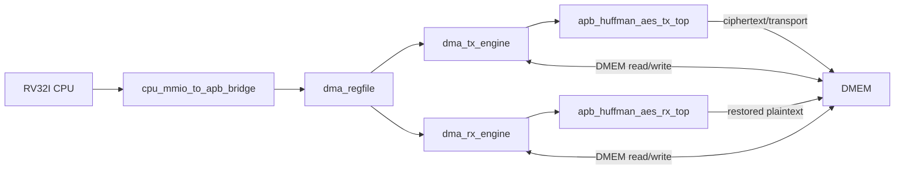

# AES Huffman All6

Design of a RISC-V RV32I System Integrating Huffman Compression and AES-128
for Secure Data Storage.

## About The Project

This project implements a small RV32I-controlled SoC for secure storage.
The CPU acts as a control plane, programming DMA and polling status through
MMIO/APB. The data plane is split into TX and RX engines that move data
between DMEM and Huffman/AES accelerators.

Current active flow:

```text
DMEM plaintext
-> TX DMA
-> dynamic whole-file Huffman compression
-> AES-128-CBC encrypt, or AES bypass for COMPRESS_ONLY
-> DMEM ciphertext / transport stream

DMEM ciphertext / transport stream
-> RX DMA
-> AES-128-CBC decrypt
-> Huffman decode
-> DMEM restored plaintext
```

## Architecture



## Main Results

- `34/34` testcase PASS baseline
- Raw DUT coverage: `93.52%`
- Closed DUT coverage: `95.90%`
- FPGA strategy: split TX-only and RX-only bitstreams
- MIT-BIH preprocessed comparison: `32.76%` average final storage ratio

## Core Docs

- [Current system spec](docs/00_current_system_spec.md)
- [Spec flow index](docs/spec_flow_index.md)
- [Coverage test plan](docs/coverage_test_plan_spec.md)
- [Coverage regression report](docs/coverage_regression_report.md)
- [Paper comparison](docs/paper_comparison_huffman_aes_cbc.md)
- [SoC usage guide](docs/soc_usage_and_fpga_guide.md)
