# 00. Current SoC System Specification

## 1. Purpose

Tai lieu nay la spec tong cua SoC hien tai trong repo. Day la file doc dau
tien can doc truoc khi di vao TX, RX, DMA, MMIO, UART loader hoac Vivado.

Muc tieu he thong:

```text
Plaintext in DMEM
-> TX DMA
-> dynamic Huffman compression
-> AES-128 CBC encrypt, or AES bypass for COMPRESS_ONLY
-> output back to DMEM

Ciphertext/transport stream in DMEM
-> RX DMA
-> AES-128 CBC decrypt
-> Huffman decode
-> plaintext back to DMEM
```

`RV32I` la control plane. CPU cau hinh DMA qua MMIO va polling status. CPU
khong phai khoi di chuyen du lieu toc do cao.

## 2. Top-Level System Diagram

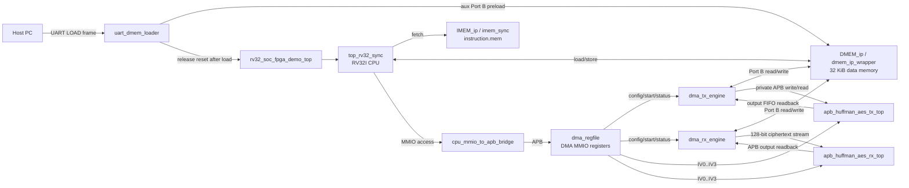

## 3. Active Module List

| Module | Role | Active use |
|---|---|---|
| `rv32_soc_top` | SoC integration top for simulation/core integration | Active |
| `rv32_soc_fpga_demo_top` | FPGA wrapper with UART loader and LEDs | Active FPGA demo top |
| `top_rv32_sync` | RV32I CPU core | Active |
| `IMEM_ip` / `imem_sync` | Instruction memory | Active |
| `DMEM_ip` / `dmem_ip_wrapper` | Data memory with CPU/DMA/aux access | Active |
| `cpu_mmio_to_apb_bridge` | CPU MMIO to APB master bridge | Active |
| `dma_regfile` | CPU-visible DMA control/status registers | Active |
| `dma_tx_engine` | `DMEM -> TX accelerator -> DMEM` data mover | Active |
| `dma_rx_engine` | `DMEM -> RX accelerator -> DMEM` data mover | Active |
| `apb_huffman_aes_tx_top` | TX Huffman compress + AES-CBC encrypt/bypass | Active |
| `apb_huffman_aes_rx_top` | RX AES-CBC decrypt + Huffman decode | Active |
| `uart_dmem_loader` | Runtime FPGA input loader into DMEM | Active in FPGA demo top |

## 4. Control Plane

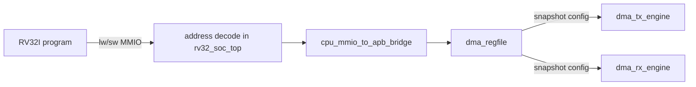

CPU-visible flow:

1. CPU reads input length from `DMEM[0x00000040]`.
2. CPU writes `SRC_ADDR`, `DST_ADDR`, `LEN_BYTES`, `MODE`, `BLOCK_CFG`.
3. CPU writes `IV0..IV3` before AES-CBC transfers.
4. CPU writes `CONTROL.start = 1`.
5. CPU polls `STATUS.done_sticky` or `STATUS.error_sticky`.
6. CPU reads `BYTES_DONE` and `CIPHERTEXT_BYTES_PRODUCED`.

DMA busy does not globally stall the CPU. CPU stalls only for normal memory
pipeline holds or when an MMIO APB access is in progress.

## 5. Data Memory Layout

Global memory map:

| Region | Address range | Meaning |
|---|---:|---|
| `DMEM` | `0x0000_0000..0x0000_7FFF` | 32 KiB data memory |
| `DMA MMIO` | `0x4000_0000..0x4000_00FF` | CPU-visible `dma_regfile` |

Current software/testbench regions:

| Address | Name | Meaning |
|---:|---|---|
| `0x0000_0040` | `INPUT_LEN_ADDR` | Input byte count written by testbench or UART loader |
| `0x0000_0400` | `SRC_BASE_ADDR` | Source plaintext/input region |
| `0x0000_2000` | `TX_DST_BASE_ADDR` | TX output ciphertext/transport region |
| `0x0000_4000` | `RX_DST_BASE_ADDR` | RX output plaintext region |

## 6. DMA Register Map

Base address:

```text
DMA_BASE = 0x4000_0000
```

| Offset | Name | Access | Meaning |
|---:|---|---|---|
| `0x00` | `CONTROL` | W | start, soft reset, clear sticky flags |
| `0x04` | `STATUS` | R | busy, done, error, cfg valid, mode mirrors |
| `0x08` | `SRC_ADDR` | R/W | DMEM source byte address |
| `0x0C` | `DST_ADDR` | R/W | DMEM destination byte address |
| `0x10` | `LEN_BYTES` | R/W | TX input bytes or RX ciphertext bytes |
| `0x14` | `MODE` | R/W | direction and TX policy |
| `0x18` | `BLOCK_CFG` | R/W | TX block size, current main value `32` |
| `0x1C` | `BYTES_DONE` | R | output bytes produced by active DMA |
| `0x20` | `DEBUG` | R | selected engine state and last error |
| `0x24` | `CIPHERTEXT_BYTES_PRODUCED` | R | TX output byte count for RX LEN_BYTES |
| `0x28` | `IV0` | R/W | CBC IV bits `[31:0]` |
| `0x2C` | `IV1` | R/W | CBC IV bits `[63:32]` |
| `0x30` | `IV2` | R/W | CBC IV bits `[95:64]` |
| `0x34` | `IV3` | R/W | CBC IV bits `[127:96]` |

### 6.1 DMA Register Function Summary

| Register | Main function | Who writes | Who reads | Side effect / software note |
|---|---|---|---|---|
| `CONTROL` | Start/reset/clear DMA transfer | CPU | none | `start`, `soft_reset`, `clear_done`, `clear_error` are write-one-pulse controls |
| `STATUS` | Poll DMA progress and sticky result | none | CPU | Software waits on `done_sticky` or `error_sticky`; `busy=1` means do not rewrite config/IV |
| `SRC_ADDR` | Source DMEM byte address | CPU | DMA engines | Must point to input plaintext for TX or ciphertext for RX |
| `DST_ADDR` | Destination DMEM byte address | CPU | DMA engines | Must point to TX output buffer or RX plaintext output buffer |
| `LEN_BYTES` | Transfer length | CPU | DMA engines | TX length is plaintext bytes; RX length is ciphertext/transport bytes |
| `MODE` | Select TX/RX and TX policy | CPU | DMA regfile/engines | Current main values: `0x9` TX whole-file AES, `0xD` TX whole-file compress-only, `0x2` RX |
| `BLOCK_CFG` | TX block byte size | CPU | `dma_tx_engine` | Main regression uses `32`; RX ignores this field |
| `BYTES_DONE` | Output byte count from active DMA | none | CPU/testbench | TX reports transport bytes written; RX reports plaintext bytes recovered |
| `DEBUG` | Engine state and last error | none | CPU/testbench | Debug only; not required for normal software flow |
| `CIPHERTEXT_BYTES_PRODUCED` | TX output length for following RX run | none | CPU | Software copies this value into RX `LEN_BYTES` |
| `IV0..IV3` | AES-CBC IV words | CPU | TX/RX CBC path | Must be written before `CONTROL.start` in AES modes and reused by RX |

`dma_regfile.iv_o = {IV3, IV2, IV1, IV0}`.

## 7. DMA Modes

`MODE` layout:

| Bits | Name | Meaning |
|---:|---|---|
| `[1:0]` | `direction` | `01 = TX`, `10 = RX` |
| `[2]` | `compress_only` | TX only: bypass AES |
| `[3]` | `whole_file` | TX only: whole-file dynamic Huffman |
| `[31:4]` | reserved | must be zero |

Common values:

| Value | Meaning | Current use |
|---:|---|---|
| `0x1` | TX `COMPRESS_AES` per-block | Supported |
| `0xD` | TX `COMPRESS_ONLY + whole_file` | TX-only saving benchmark |
| `0x9` | TX `COMPRESS_AES + whole_file` | Main TX/RX loopback |
| `0x2` | RX | Main TX/RX loopback |

## 8. TX Flow

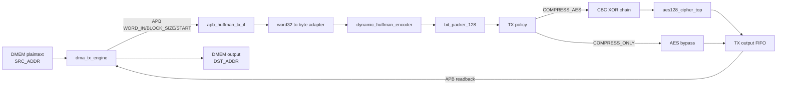

TX responsibilities:

- read plaintext from `DMEM`
- feed blocks to `apb_huffman_aes_tx_top`
- use dynamic Huffman compression
- pack bitstream into 128-bit transport words
- encrypt with AES-128 CBC for `COMPRESS_AES`
- bypass AES for `COMPRESS_ONLY`
- drain output FIFO and write result back to `DMEM`

Current main regression uses:

```text
MODE      = 0x9
BLOCK_CFG = 32
```

## 9. RX Flow

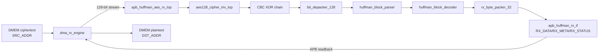

RX responsibilities:

- read ciphertext from `DMEM`
- feed 128-bit ciphertext words into RX top
- decrypt AES-128 CBC using the same IV as TX
- depack transport words into bit chunks
- parse Huffman block metadata/table/payload
- decode canonical Huffman stream
- pack plaintext bytes into 32-bit words
- write plaintext back to `DMEM`

RX requires:

```text
LEN_BYTES = CIPHERTEXT_BYTES_PRODUCED from TX
LEN_BYTES must be multiple of 16
IV0..IV3 must match the TX IV
```

## 10. Main Loopback Flow

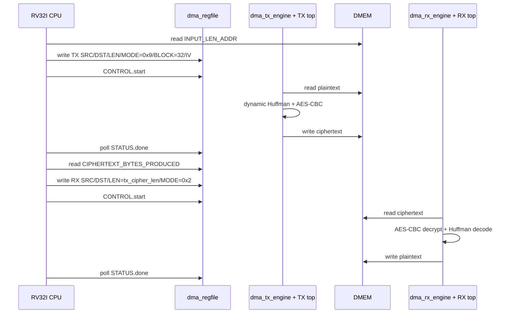

## 11. Software Flow Chart

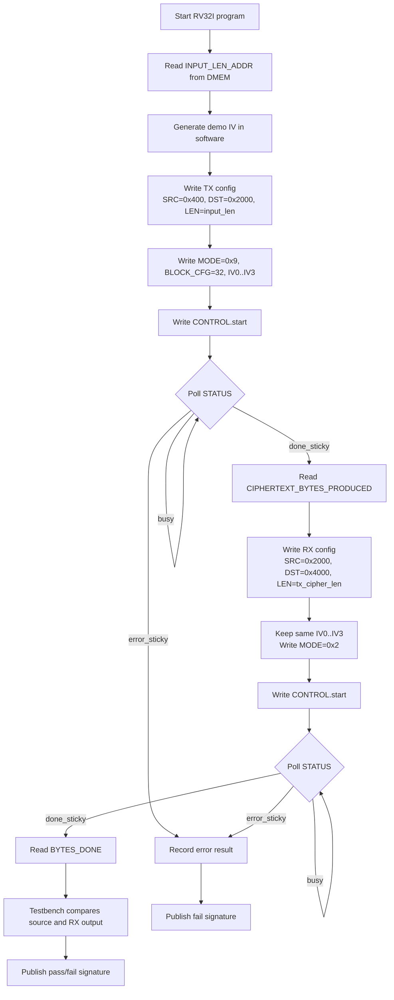

## 12. TX DMA Flow Chart

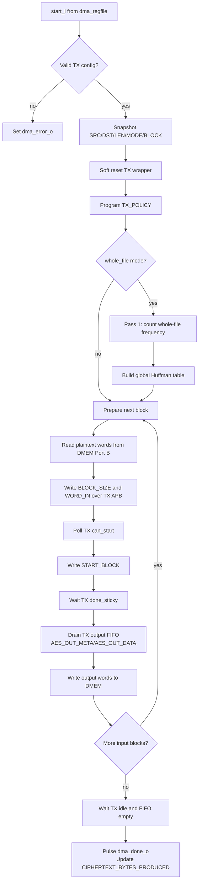

## 13. RX DMA Flow Chart

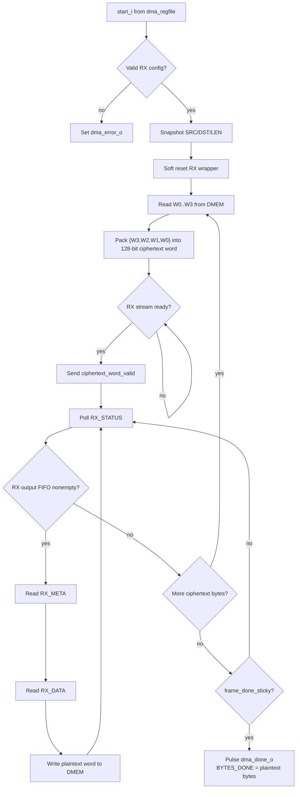

## 14. Simulation And FPGA Flow Chart

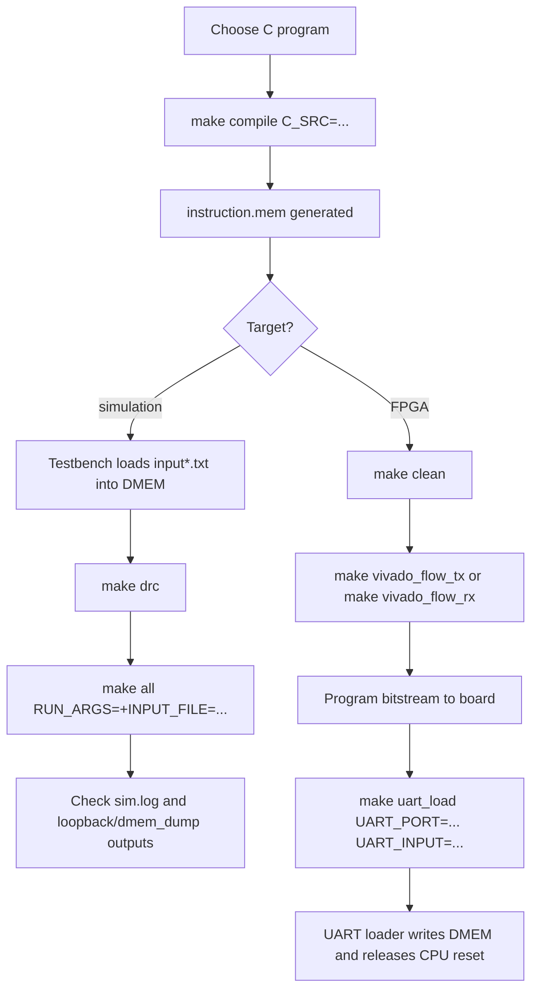

## 15. AES-CBC And IV Contract

TX:

```text
C0 = AES_encrypt(P0 XOR IV)
Cn = AES_encrypt(Pn XOR Cn-1)
```

RX:

```text
P0 = AES_decrypt(C0) XOR IV
Pn = AES_decrypt(Cn) XOR Cn-1
```

Current policy:

- IV is written by RV32I software to `IV0..IV3`.
- `test_mmio_dma.c` creates a deterministic demo IV using RV32I-friendly
  arithmetic, shift, rotate and XOR operations.
- The AES key is fixed in RTL for the current prototype.
- `AES_top.v` generic mode logic is not the active TX/RX datapath.

For a real secure board demo, IV must be unique per encrypted message and must
be stored or transmitted with the ciphertext so RX can reuse the same IV.

## 16. Simulation Input Loading

In simulation, `DMEM` is not initialized from `input.txt` by the BRAM IP itself.
The testbench does it:

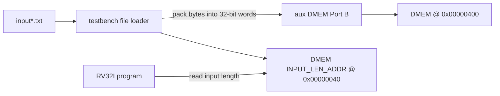

Implication:

- changing `input.txt` does not require editing input length manually
- testbench recomputes `input_len_bytes`
- `make compile` is only needed when the C program changes

## 17. FPGA Demo Loading

On FPGA, there is no testbench. Runtime input loading is handled by
`uart_dmem_loader` in `rv32_soc_fpga_demo_top`.

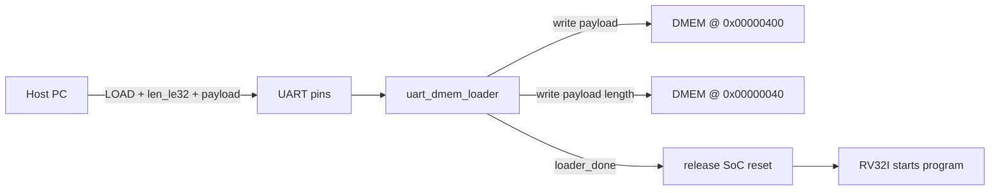

Current UART loader:

- protocol: `"LOAD" + payload_len_le32 + payload`
- baud: `115200`
- max payload follows the current source buffer limit
- LED status is exported by `rv32_soc_fpga_demo_top`

`make uart_load` is a host-side command used after programming the bitstream.
It is not a simulation command.

## 18. FPGA Build Status

Current practical FPGA direction is split bitstreams:

| Build | Purpose | Status |
|---|---|---|
| TX-only | compression/encryption demo | Practical FPGA demo path |
| RX-only | decryption/decompression demo | Practical FPGA demo path |
| Full TX+RX | integration reference | Too large/risky for current target |

Generated bitstreams are placed under:

```text
sim/vivado_bitstreams/rv32_soc_synth_tx.bit
sim/vivado_bitstreams/rv32_soc_synth_rx.bit
```

Use `make vivado_report VIVADO_PROJECT=...` to open the current report folder.

## 19. Main Commands

Simulation:

```bash
cd sim
make compile C_SRC=test_mmio_dma.c
make drc
make all RUN_ARGS="+INPUT_FILE=input1.txt"
```

TX-only simulation:

```bash
cd sim
make compile C_SRC=test_mmio_tx_only.c
make drc
make all TB_NAME=tb_rv32_soc_tx_only RUN_ARGS="+INPUT_FILE=input4.txt"
```

FPGA TX build and runtime load:

```bash
cd sim
make compile C_SRC=test_mmio_tx_only.c
make clean
make vivado_flow_tx
make uart_load UART_PORT=/dev/ttyUSB0 UART_INPUT=input1.txt
```

## 20. Current Limits

| Item | Current limit/status |
|---|---|
| DMEM size | 32 KiB |
| Main source buffer | `0x00000400..0x00001FFF`, 7168 bytes practical limit |
| TX output buffer | starts at `0x00002000` |
| RX output buffer | starts at `0x00004000` |
| TX block size | current main software uses `32` |
| RX input length | must be ciphertext length and 16-byte aligned |
| Huffman alphabet | newline + printable ASCII |
| AES key | fixed RTL key in prototype |
| IV source | RV32I software demo IV |
| FPGA runtime output readback | not complete yet |

## 21. Detailed Specs

Use this file as the summary. For module-level details, read:

| Area | Spec |
|---|---|
| Memory map/software contract | [memory_map_dma_software_contract.md](./memory_map_dma_software_contract.md) |
| BRAM/port ownership | [bram_port_usage_spec.md](./bram_port_usage_spec.md) |
| CPU stall policy | [cpu_dma_stall_policy_spec.md](./cpu_dma_stall_policy_spec.md) |
| MMIO bridge | [cpu_mmio_to_apb_bridge_spec.md](./cpu_mmio_to_apb_bridge_spec.md) |
| DMA register file | [dma_regfile_spec.md](./dma_regfile_spec.md) |
| IV/CBC | [iv_generation_and_cbc_contract_spec.md](./iv_generation_and_cbc_contract_spec.md) |
| TX end-to-end | [tx_path_end_to_end_spec.md](./tx_path_end_to_end_spec.md) |
| RX end-to-end | [rx_path_end_to_end_spec.md](./rx_path_end_to_end_spec.md) |
| FPGA usage | [soc_usage_and_fpga_guide.md](./soc_usage_and_fpga_guide.md) |
| UART loader | [fpga_uart_dmem_loader_spec.md](./fpga_uart_dmem_loader_spec.md) |
