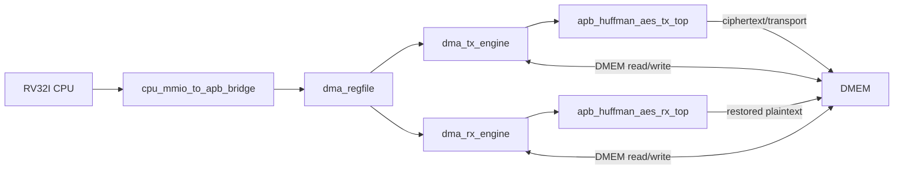

# AES Huffman All6

Design of a RISC-V RV32I System Integrating Huffman Compression and AES-128
for Secure Data Storage.

## About The Project

This project implements a small RV32I-controlled SoC for secure storage.
The CPU acts as a control plane, programming DMA and polling status through
MMIO/APB. The data plane is split into TX and RX engines that move data
between DMEM and Huffman/AES accelerators.

Current active flow:

```text
DMEM plaintext
-> TX DMA
-> dynamic whole-file Huffman compression
-> AES-128-CBC encrypt, or AES bypass for COMPRESS_ONLY
-> DMEM ciphertext / transport stream

DMEM ciphertext / transport stream
-> RX DMA
-> AES-128-CBC decrypt
-> Huffman decode
-> DMEM restored plaintext
```

## Architecture



## Main Results

- Latest secure-storage API focused test: `dma_storage_table_input1_then_input3`,
  `PASS=22`, `FAIL=0`
- Firmware API: `secure_write`, `secure_read`, `secure_delete` with DMEM
  metadata and IV restore
- Historical full-regression baseline: `34/34` testcase PASS
- Raw DUT coverage: `93.52%`
- Closed DUT coverage: `95.90%`
- FPGA closure: default ZCU102 full TX+RX implementation and bitstream pass;
  the wrapper divides USER_SI570 300 MHz to the existing 50 MHz SoC/UART clock
  and auto-starts RV32I after UART `LOAD`
- Full TX+RX ZCU102 post-impl: `36382` LUTs, `19382` registers, `7281` CLBs,
  `1628` control sets, `11` BRAM tiles, WNS `+9.093 ns`, WHS `+0.015 ns`
- Full TX+RX ZCU102 vectorless power estimate: `0.796 W` total, `0.146 W`
  dynamic, `0.649 W` static
- FPGA UART utility supports `LOAD` input frames and aligned DMEM `READ`
  readback frames for result/debug dumps
- TX-only post-impl: `11933` LUTs, `5469` registers, `3979` slices,
  `208` control sets, WNS `+1.277 ns`
- MIT-BIH preprocessed comparison: `32.76%` average final storage ratio

## Core Docs

- [Current system spec](docs/00_current_system_spec.md)
- [Spec flow index](docs/spec_flow_index.md)
- [Coverage test plan](docs/coverage_test_plan_spec.md)
- [Coverage regression report](docs/coverage_regression_report.md)
- [Paper comparison](docs/paper_comparison_huffman_aes_cbc.md)
- [SoC usage guide](docs/soc_usage_and_fpga_guide.md)
- [Report presentation guide](docs/report_presentation_guide.md)
