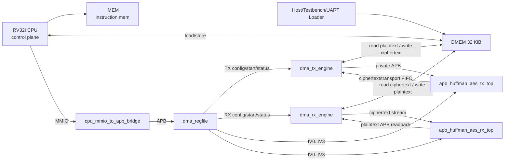
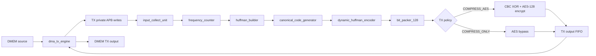
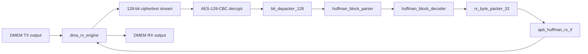

# 00. Current SoC Complete Specification

## 1. Scope

This document is the source of truth for the current project state.

Project title:

```text
Design of a RISC-V RV32I System Integrating Huffman Compression and AES-128
for Secure Data Storage
```

Current architecture:

```text
RV32I CPU control plane
-> CPU MMIO to APB bridge
-> DMA register file
-> TX/RX DMA engines
-> dynamic whole-file Huffman compressor/decompressor
-> AES-128-CBC encrypt/decrypt
-> DMEM secure-storage regions
```

Important policy:

- The active MIT-BIH comparison uses already-preprocessed `.bin` input files.
- The SoC does not implement ECG preprocessing in RTL.
- The SoC stores and restores the already-processed byte stream.

## 2. Current baseline

| Item | Current value |
|---|---|
| Simulation top | `test_bench` in `tb/tb_rv32_soc_mmio_dma.v` |
| Main SoC top | `rv32_soc_top` |
| FPGA demo top | `rv32_soc_fpga_demo_top` |
| Main C program | `testcase/test_mmio_dma.c` |
| Main secure-storage mode | `MODE=0x9`, TX whole-file Huffman + AES-128-CBC, then RX decrypt/decode |
| TX-only benchmark mode | `MODE=0xD`, TX whole-file Huffman with AES bypass |
| RX mode | `MODE=0x2`, AES-128-CBC decrypt + Huffman decode |
| Huffman alphabet | 256 byte symbols, `0x00..0xFF` |
| Main regression | `34/34` testcase PASS |
| Raw DUT coverage | `93.52%` full `bcesft` |
| Closed DUT coverage | `95.90%` |
| Bare `make all` default | `dma_compress_aes_input1` / `input1.txt` |
| Verilator DRC | `make drc` PASS |
| FPGA implementation | split TX-only and RX-only bitstreams at 50 MHz |
| TX-only timing | WNS `+0.217 ns`, power `0.239 W` |
| RX-only timing | WNS `+0.341 ns`, power `0.193 W` |
| Paper comparison result | MIT-BIH preprocessed input: `32.76%` final storage ratio |

## 3. Architecture top-level



Design split:

| Plane | Owner | Function |
|---|---|---|
| Control plane | RV32I CPU | Configure DMA registers, write IV, start TX/RX, poll status |
| Data plane | DMA + accelerators | Move data between DMEM and Huffman/AES engines |
| Storage plane | DMEM | Hold source input, TX output, RX restored output, software metadata |
| FPGA input plane | UART loader | Load runtime input into DMEM before releasing SoC reset |

## 4. Map of the module in use

| Module | Responsibility | Main spec |
|---|---|---|
| `rv32_soc_top` | Simulation/integration SoC top | this file |
| `rv32_soc_fpga_demo_top` | FPGA wrapper with UART loader and LEDs | `fpga_uart_dmem_loader_spec.md` |
| `uart_dmem_loader` | UART protocol loader that preloads DMEM source bytes before CPU release | `fpga_uart_dmem_loader_spec.md` |
| `top_rv32_sync` | RV32I CPU core | this file, `dma_riscv_instruction_programming_spec.md` |
| `imem_sync` / `IMEM_ip` | Instruction memory | `bram_port_usage_spec.md` |
| `dmem_ip_wrapper` / `DMEM_ip` | Shared data memory | `bram_port_usage_spec.md` |
| `cpu_mmio_to_apb_bridge` | Convert CPU MMIO load/store into APB | `cpu_mmio_to_apb_bridge_spec.md` |
| `dma_regfile` | CPU-visible DMA registers | `dma_regfile_spec.md` |
| `dma_tx_engine` | DMEM -> TX accelerator -> DMEM mover | `dma_tx_engine_spec.md` |
| `dma_rx_engine` | DMEM -> RX accelerator -> DMEM mover | `dma_rx_engine_spec.md` |
| `apb_huffman_aes_tx_top` | TX APB wrapper, Huffman encode, CBC encrypt/bypass | `apb_huffman_aes_tx_top_spec.md` |
| `dynamic_huffman_encoder` | Whole-file dynamic canonical Huffman encode | `dynamic_huffman_encoder_spec.md` |
| `bit_packer_128` | Pack Huffman transport into 128-bit words | `bit_packer_128_spec.md` |
| `apb_huffman_aes_rx_top` | RX wrapper, CBC decrypt, depack, parse, decode | `apb_huffman_aes_rx_top_spec.md` |
| `bit_depacker_128` | Depack 128-bit transport words | `bit_depacker_128_spec.md` |
| `huffman_block_parser` | Parse transport header/table/payload | `huffman_block_parser_spec.md` |
| `huffman_block_decoder` | Canonical Huffman decode with main table/fallback | `huffman_block_decoder_spec.md` |
| `rx_byte_packer_32` | Pack decoded bytes into 32-bit DMEM words | `rx_byte_packer_32_spec.md` |
| `apb_huffman_rx_if` | RX APB status/output readback | `apb_huffman_rx_if_spec.md` |

## 5. Memory map

Global map:

| Region | Address range | Owner / usage |
|---|---:|---|
| IMEM | implementation-specific | RV32I instruction fetch |
| DMEM | `0x0000_0000..0x0000_7FFF` | CPU data, DMA source/destination, testbench/UART preload |
| DMA MMIO | `0x4000_0000..0x4000_00FF` | CPU-visible DMA register file |

DMEM software layout:

| Address | Name | Meaning |
|---:|---|---|
| `0x0000_0040` | `INPUT_LEN_ADDR` | Input length written by testbench/UART loader |
| `0x0000_0044` | `INPUT2_LEN_ADDR` | Secondary input length for storage-table testcase |
| `0x0000_0100` | `STORAGE_TABLE_BASE` | RV32I-managed metadata table |
| `0x0000_2000` | `SRC_BASE_ADDR` | Source input byte stream |
| `0x0000_3000` | `SRC2_BASE_ADDR` | Secondary source input |
| `0x0000_4000` | `TX_DST_BASE_ADDR` | TX ciphertext/transport output |
| `0x0000_5000` | `TX2_DST_BASE_ADDR` | Secondary TX output |
| `0x0000_6000` | `RX_DST_BASE_ADDR` | RX restored plaintext/output |

## 6. Register map DMA

Base:

```text
DMA_BASE = 0x4000_0000
```

| Offset | Register | Access | Function |
|---:|---|---|---|
| `0x00` | `CONTROL` | W | start, soft reset, clear sticky flags |
| `0x04` | `STATUS` | R | busy/done/error/config/mode status |
| `0x08` | `SRC_ADDR` | R/W | DMEM source byte address |
| `0x0C` | `DST_ADDR` | R/W | DMEM destination byte address |
| `0x10` | `LEN_BYTES` | R/W | TX plaintext length or RX ciphertext length |
| `0x14` | `MODE` | R/W | DMA direction and TX policy |
| `0x18` | `BLOCK_CFG` | R/W | Compatibility block size, normally `32` |
| `0x1C` | `BYTES_DONE` | R | Output bytes produced by active engine |
| `0x20` | `DEBUG` | R | Engine state and last error |
| `0x24` | `CIPHERTEXT_BYTES_PRODUCED` | R | TX output byte count for RX `LEN_BYTES` |
| `0x28` | `IV0` | R/W | CBC IV bits `[31:0]` |
| `0x2C` | `IV1` | R/W | CBC IV bits `[63:32]` |
| `0x30` | `IV2` | R/W | CBC IV bits `[95:64]` |
| `0x34` | `IV3` | R/W | CBC IV bits `[127:96]` |

Contract mode:

| Mode | Meaning | Current usage |
|---:|---|---|
| `0x1` | TX `COMPRESS_AES`, legacy per-block Huffman | coverage/compatibility |
| `0x5` | TX `COMPRESS_ONLY`, legacy per-block Huffman | coverage/compatibility |
| `0x9` | TX `COMPRESS_AES`, whole-file Huffman | main secure-storage TX |
| `0xD` | TX `COMPRESS_ONLY`, whole-file Huffman | TX-only compression benchmark |
| `0x2` | RX AES-CBC decrypt + Huffman decode | main RX |

AES Policy:

- `COMPRESS_AES` means Huffman transport is encrypted by AES-128-CBC.
- `COMPRESS_ONLY` means AES is bypassed and output is compressed transport.
- RX main flow is for `COMPRESS_AES` ciphertext.
- CBC mode is fixed in RTL; `MODE` does not select ECB/CBC.

## 7. TX stream



TX software steps:

1. CPU reads `INPUT_LEN_ADDR`.
2. CPU writes `IV0..IV3` if AES is enabled.
3. CPU writes `SRC_ADDR = 0x2000`.
4. CPU writes `DST_ADDR = 0x4000`.
5. CPU writes `LEN_BYTES = input_len`.
6. CPU writes `BLOCK_CFG = 32`.
7. CPU writes `MODE = 0x9` for secure storage or `0xD` for TX-only benchmark.
8. CPU writes `CONTROL.start`.
9. CPU polls `STATUS.done_sticky` or `STATUS.error_sticky`.
10. CPU reads `CIPHERTEXT_BYTES_PRODUCED`.

TX output:

| Mode | Output in DMEM |
|---|---|
| `0x9` | AES-CBC ciphertext over Huffman transport |
| `0xD` | Plain compressed Huffman transport, no AES |

## 8. RX stream



RX software steps:

1. CPU keeps or rewrites the same `IV0..IV3` used for TX.
2. CPU writes `SRC_ADDR = 0x4000`.
3. CPU writes `DST_ADDR = 0x6000`.
4. CPU writes `LEN_BYTES = CIPHERTEXT_BYTES_PRODUCED`.
5. CPU writes `MODE = 0x2`.
6. CPU writes `CONTROL.start`.
7. CPU polls `STATUS.done_sticky` or `STATUS.error_sticky`.
8. CPU checks `BYTES_DONE == original_input_len`.

RX correctness criterion:

```text
DMEM[RX_DST_BASE_ADDR .. RX_DST_BASE_ADDR + input_len - 1]
==
DMEM[SRC_BASE_ADDR .. SRC_BASE_ADDR + input_len - 1]
```

For MIT-BIH preprocessed tests, this means RX restores the processed bytes
stream exactly. It does not reconstruct raw ECG samples inside the SoC.

## 9. IV And AES-CBC Contract

Current IV bridge:

- RV32I software computes demo IV words.
- CPU writes `IV0..IV3` into `dma_regfile`.
- TX and RX consume the same IV words.

Security note:

- Current IV generation is deterministic demo logic, not production entropy.
- A real FPGA deployment should use host nonce, TRNG, secure seed, or a
  board-level entropy source.
- AES key material is fixed in RTL in the current design.

CBC operation:

```text
TX block0: AES(transport0 XOR IV)
TX blockN: AES(transportN XOR ciphertextN-1)

RX block0: AES_INV(ciphertext0) XOR IV
RX blockN: AES_INV(ciphertextN) XOR ciphertextN-1
```

## 10. CPU/MMIO Stall Policy

CPU behavior:

- CPU does not stall for the full DMA operation.
- CPU stalls only while its own MMIO APB transaction is not complete.
- During DMA busy, CPU can execute polling loads from `STATUS`.
- Software must not rewrite config registers while `STATUS.busy = 1`.

Bridge behavior:

- `cpu_mmio_to_apb_bridge` is an APB master.
- It follows setup/access phases.
- It holds CPU memory-return path until APB read/write completes.
- It returns APB error status to the CPU-side memory path.

## 11. BRAM And Port Ownership

| Memory | Main role | Active access |
|---|---|---|
| IMEM | RV32I instruction storage | CPU fetch only in normal simulation |
| DMEM | source/TX/RX data storage | CPU data access, DMA data access, testbench/UART preload |

DMEM ownership rules:

- CPU uses DMEM for normal loads/stores.
- DMA engines use DMEM for TX/RX data movement.
- Testbench or UART loader preloads input before CPU starts.
- Do not allow the UART loader and DMA to own the same aux port at the same time.

## 12. Software Contract

Main C files:

| C file | Purpose |
|---|---|
| `test_mmio_dma.c` | Main TX->RX secure-storage loopback |
| `test_mmio_tx_only.c` | TX-only compression benchmark |
| `test_mmio_dma_storage_table.c` | RV32I software metadata table demo |
| `test_mmio_regfile_basic.c` | Register/MMIO sanity |
| `test_mmio_regfile_negative.c` | Illegal MMIO and error paths |
| `test_cpu_instruction_cov.c` | RV32I instruction coverage |

Main RV32I instruction categories:

| Instruction type | Use |
|---|---|
| `lw`, `sw` | DMEM/MMIO load-store |
| arithmetic/logical | address, IV, status, metadata calculations |
| branch/jump | polling loops and control flow |
| `lui`/immediates | build MMIO base addresses and constants |

No interrupt/trap flow is implemented in the active control software. Polling
is the current software synchronization mechanism.

## 13. Active Test And Coverage Flow

Simulation commands:

```bash
cd sim
make compile C_SRC=test_mmio_dma.c
make drc
make all
```

Specific testcase override:

```bash
cd sim
make all TESTNAME=dma_compress_aes_input3 RUN_ARGS="+CASE_NAME=dma_compress_aes_input3 +INPUT_FILE=input3.txt"
```

Coverage commands:

```bash
cd sim
./run.csh cov
./report.csh
```

Main 4.5 SoC end-to-end tests:

| Testcase | Input | Expected |
|---|---|---|
| `dma_compress_aes_input1` | `input1.txt` | PASS, RX output matches input |
| `dma_compress_aes_input3` | `input3.txt` | PASS, RX output matches input |
| `dma_compress_aes_alnum63_cov` | `input_cov_alnum63.txt` | PASS functional stress, saving can be negative |
| `dma_storage_table_input1_then_input3` | `input1.txt` + `input3.txt` | PASS, RV32I selects old register and decodes it |

MIT-BIH preprocessed comparison tests:

| Testcase | Input file | Expected |
|---|---|---|
| `dma_mitdb_100_delta2_var_e2e` | `mitdb_100_mlii_10s_delta2_var.bin` | PASS |
| `dma_mitdb_106_delta2_var_e2e` | `mitdb_106_mlii_10s_delta2_var.bin` | PASS |
| `dma_mitdb_112_delta2_var_e2e` | `mitdb_112_mlii_10s_delta2_var.bin` | PASS |
| `dma_mitdb_117_delta2_var_e2e` | `mitdb_117_mlii_10s_delta2_var.bin` | PASS |
| `dma_mitdb_213_delta2_var_e2e` | `mitdb_213_mlii_10s_delta2_var.bin` | PASS |

MIT-BIH command pattern:

```bash
cd sim
make compile C_SRC=test_mmio_dma.c
make all TESTNAME=dma_mitdb_100_delta2_var_e2e \
  RUN_ARGS="+CASE_NAME=dma_mitdb_100_delta2_var_e2e +INPUT_FILE=mitdb_100_mlii_10s_delta2_var.bin +INPUT_BINARY"
```

## 14. MIT-BIH Paper Comparison

Reference paper:

```text
A lossless compression and encryption mechanism for remote monitoring of ECG
data using Huffman coding and CBC-AES
```

Reported paper result:

| Metric | Paper |
|---|---:|
| Compression ratio | `35.015%` |
| Space saving | `64.985%` |

Current SoC comparison flow:

```text
MIT-BIH record
-> external preprocessing outside RTL
-> delta2+varuint `.bin` byte stream
-> SoC dynamic Huffman + AES-128-CBC
-> RX loopback verifies restored byte stream
```

Current results:

| Register | Raw bytes reference | SoC input bytes | TX bytes | Final ratio vs raw | Saving |
|---:|---:|---:|---:|---:|---:|
| 100 | 7200 | 3601 | 2304 | 32.00% | 68.00% |
| 106 | 7200 | 3614 | 2608 | 36.22% | 63.78% |
| 112 | 7200 | 3601 | 2112 | 29.33% | 70.67% |
| 117 | 7200 | 3602 | 2288 | 31.78% | 68.22% |
| 213 | 7200 | 3601 | 2480 | 34.44% | 65.56% |
| Average | 7200 | 3603.8 | 2358.4 | 32.76% | 67.24% |

Conclusion:

```text
With externally preprocessed MIT-BIH input, the SoC secure-storage path reaches
32.76% average final storage ratio, which is better than the paper's 35.015%.
The preprocessing is outside the current RTL scope.
```

## 15. FPGA Flow

Current FPGA strategy:

- Full TX+RX SoC is too large for the selected target when built monolithically.
- Practical demo flow uses split TX-only and RX-only bitstreams.
- Default demo target clock is 50 MHz.
- UART loader can preload DMEM before CPU starts.

Main commands:

```bash
cd sim
make vivado_impl_tx
make vivado_impl_rx
make vivado_bit_tx
make vivado_bit_rx
```

Report locations:

```text
sim/vivado_reports/rv32_soc_synth_tx/
sim/vivado_reports/rv32_soc_synth_rx/
```

Bitstream use:

- `.bit` configures the FPGA fabric.
- TX-only bitstream includes the TX demo path.
- RX-only bitstream includes the RX demo path.
- A `.bit` does not run software by itself; IMEM/DMEM initialization and board
  I/O path must also be prepared.

## 16. Usage Summary

Run normal SoC loopback:

```bash
cd sim
make compile C_SRC=test_mmio_dma.c
make drc
make all TESTNAME=dma_compress_aes_input1 RUN_ARGS="+CASE_NAME=dma_compress_aes_input1 +INPUT_FILE=input1.txt"
```

Run MIT-BIH preprocessed comparison:

```bash
cd sim
make compile C_SRC=test_mmio_dma.c
make all TESTNAME=dma_mitdb_112_delta2_var_e2e \
  RUN_ARGS="+CASE_NAME=dma_mitdb_112_delta2_var_e2e +INPUT_FILE=mitdb_112_mlii_10s_delta2_var.bin +INPUT_BINARY"
```

Open waveform after a run:

```bash
cd sim
make wave
```

Clean:

```bash
cd sim
make clean
make clean_vivado
```

## 17. Report Wording

Use this concise wording:

```text
The implemented design is an RV32I-controlled secure-storage SoC. The CPU
programs a DMA register file through MMIO/APB, starts TX and RX DMA transfers,
and polls status registers. The TX path reads input from DMEM, performs
dynamic whole-file Huffman compression, encrypts the transport stream using
AES-128-CBC, and writes the result back to DMEM. The RX path reads the stored
ciphertext, decrypts it, decodes the Huffman stream, and restores the original
byte stream to DMEM. End-to-end tests compare the RX output byte-by-byte with
the source input.

For comparison with the referenced ECG Huffman + CBC-AES paper, the SoC is
fed already-preprocessed MIT-BIH byte streams. Under this flow, the average
final storage ratio is 32.76%, compared with the paper's 35.015%. The
preprocessing is external to the current RTL; the RTL contribution is the
verified RV32I + DMA + Huffman + AES-CBC secure-storage architecture.
```

## 18. What Is Not In Scope

The current report flow does not claim:

- RTL implementation of ECG signal preprocessing.
- Interrupt/trap-driven DMA completion.
- Production-grade IV entropy.
- Full TX+RX monolithic bitstream closure on the selected small FPGA target.
- 100% raw DUT coverage.
