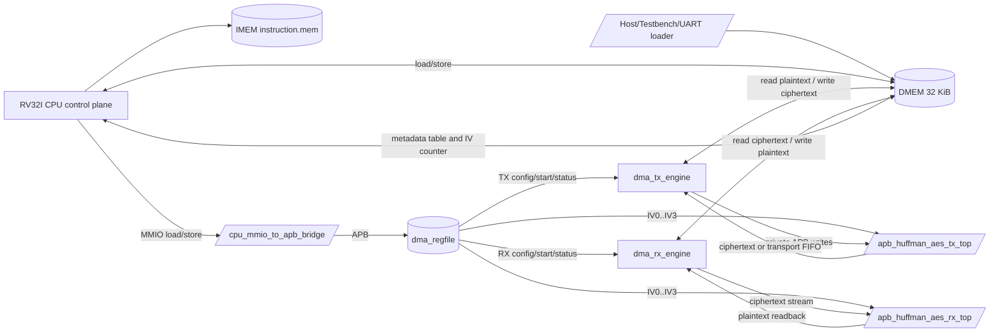
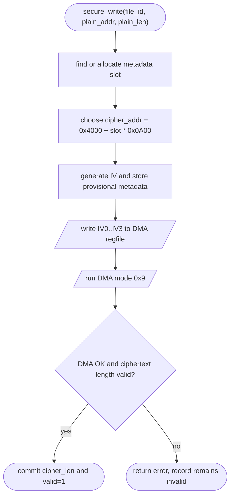
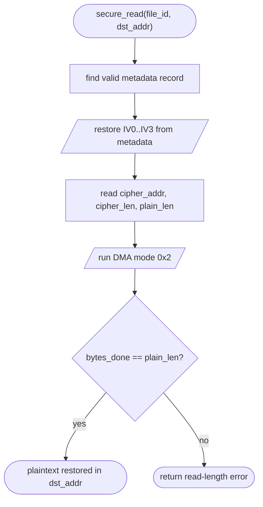
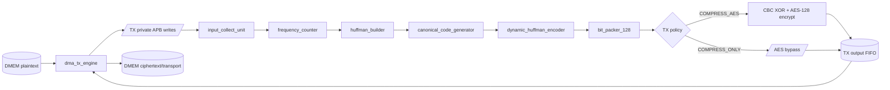
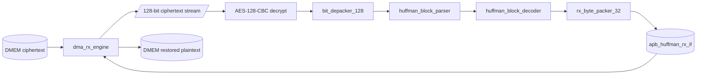

# 00. Current SoC Complete Specification

## 1. Scope

This document is the source of truth for the current RTL and firmware state.

Project title:

```text
Design of a RISC-V RV32I System Integrating Huffman Compression and AES-128
for Secure Data Storage
```

Current interpretation:

- The design is a secure-storage SoC prototype, not only a standalone
  Huffman/AES accelerator.
- RV32I is the control and storage-management processor.
- Huffman compression and AES-128-CBC are implemented in RTL accelerators.
- Secure-storage policy is implemented in RV32I firmware through MMIO and DMEM
  metadata.
- The current design does not implement a custom RISC-V instruction. CPU
  participation is via normal RV32I load/store/control instructions.

Important data policy:

- MIT-BIH comparison inputs are already-preprocessed `.bin` byte streams.
- ECG preprocessing is external to this RTL.
- The SoC stores and restores the processed byte stream exactly.

## 2. Current Baseline

| Item | Current value |
|---|---|
| Simulation top | `test_bench` in `tb/tb_rv32_soc_mmio_dma.v` |
| Main SoC top | `rv32_soc_top` |
| FPGA demo top | `rv32_soc_fpga_zcu102_top` by default; legacy ZedBoard top is `rv32_soc_fpga_demo_top` |
| RV32I core | `top_rv32_sync` |
| Secure-storage firmware API | `testcase/secure_storage_fw.h` |
| Active secure-storage testcase | `testcase/test_mmio_dma_storage_table.c` |
| Secure TX mode | `MODE=0x9`, whole-file Huffman + AES-128-CBC |
| Secure RX mode | `MODE=0x2`, AES-128-CBC decrypt + Huffman decode |
| TX-only benchmark mode | `MODE=0xD`, whole-file Huffman with AES bypass |
| Huffman alphabet | 256 byte symbols, `0x00..0xFF` |
| DMEM capacity used by SoC flow | 32 KiB, byte-addressed |
| DMA MMIO base | `0x4000_0000` |
| Latest focused secure-storage simulation | `dma_storage_table_input1_then_input3`, `PASS=22`, `FAIL=0` |
| Historical full regression baseline | `34/34` PASS before the secure-storage API refactor; rerun required for updated full-regression number |
| Historical raw DUT coverage | `93.52%` full `bcesft` |
| Historical closed DUT coverage | `95.90%` |
| FPGA implementation strategy | Default Vivado target is ZCU102 `xczu9eg-ffvb1156-2-e`; wrapper divides USER_SI570 300 MHz to 50 MHz SoC/UART clock and auto-starts RV32I after UART `LOAD` |
| Latest full ZCU102 FPGA build | `rv32_soc_synth_full_zcu102`, top `rv32_soc_fpga_zcu102_top`, implementation and bitstream pass |
| Latest full ZCU102 timing | WNS `+7.871 ns`, WHS `+0.015 ns`, all user timing constraints met |
| Latest full ZCU102 utilization | `37069` LUTs, `19794` registers, `7360` CLBs, `1794` control sets, `11` BRAM tiles, `0` DSP |
| Latest full ZCU102 power | vectorless estimate `0.793 W` total, `0.144 W` dynamic, `0.649 W` static |
| Historical TX-only implementation | `rv32_soc_synth_tx_opt4`, routed, WNS `+1.277 ns` |
| TX-only utilization | `11933` LUTs, `5469` registers, `3979` slices, `208` unique control sets, `10` BRAM tiles |
| Historical full FPGA demo implementation | `rv32_soc_synth_full_fpga`, top `rv32_soc_fpga_demo_top`, routed, WNS `+0.811 ns`, WHS `+0.024 ns` |
| Historical full FPGA demo SoC utilization | `28379` LUTs, `18898` registers, `10165` slices, `778` unique control sets, `11` BRAM tiles |
| Historical full FPGA demo SoC power | vectorless estimate `0.282 W` total, `0.176 W` dynamic, `0.106 W` static |
| Legacy RX-only implementation | routed, WNS `+0.341 ns`, power `0.193 W` |
| Legacy RX-only utilization | `22730` LUTs, `27658` registers, `917` unique control sets |
| Paper comparison result | MIT-BIH preprocessed input: `29.87%` average final storage ratio |

Default ZCU102 implementation reports are generated under:

```text
vivado/build/rv32_soc_synth_tx_zcu102/reports/
vivado/build/rv32_soc_synth_full_zcu102/reports/
vivado/build/rv32_soc_synth_rx_zcu102/reports/
```

Historical pre-ZCU102 retarget reports remain under:

```text
vivado/build/rv32_soc_synth_tx_opt4/reports/
vivado/build/rv32_soc_synth_full_fpga/reports/
vivado/build/rv32_soc_synth_rx/reports/
```

## 3. Top-Level Architecture



Design split:

| Plane | Owner | Function |
|---|---|---|
| Control plane | RV32I CPU | Configure DMA registers, write IV, start TX/RX, poll status |
| Data plane | DMA + accelerators | Move data between DMEM and Huffman/AES engines |
| Storage plane | DMEM + firmware metadata | Hold input, ciphertext slots, restored output, metadata records |
| Host I/O plane | Testbench or UART loader/readback | Preload input bytes, release SoC reset, and read aligned DMEM result/output data |

## 4. Active Module Map

| Module | Responsibility |
|---|---|
| `rv32_soc_top` | Simulation/integration SoC top |
| `rv32_soc_fpga_zcu102_top` | ZCU102 FPGA wrapper with USER_SI570 input, UART loader, and LEDs |
| `rv32_soc_fpga_demo_top` | Legacy ZedBoard FPGA wrapper with UART loader and LEDs |
| `uart_dmem_loader` | FPGA runtime input loader/readback, writes source bytes and input length before CPU release, then supports aligned DMEM READ frames |
| `top_rv32_sync` | RV32I control CPU |
| `imem_sync` / `IMEM_ip` | Instruction memory |
| `dmem_ip_wrapper` / `DMEM_ip` | Shared data memory |
| `cpu_mmio_to_apb_bridge` | CPU MMIO load/store to APB; setup phase on accept, `ACCESS` state holds CPU |
| `dma_regfile` | CPU-visible DMA registers, status, IV registers |
| `dma_tx_engine` | DMEM to TX accelerator to DMEM mover |
| `dma_rx_engine` | DMEM to RX accelerator to DMEM mover |
| `apb_huffman_aes_tx_top` | TX APB wrapper, Huffman encoder, AES-CBC or bypass |
| `apb_huffman_tx_if` | TX private APB register interface, input/output FIFOs, whole-file control pulses |
| `huffman_aes_tx_top` | TX adapter, whole-file frequency/build path, dynamic encoder and packer input |
| `dynamic_huffman_encoder` | Whole-file dynamic canonical Huffman encoder |
| `bit_packer_128` | Pack Huffman transport into 128-bit words |
| `apb_huffman_aes_rx_top` | RX wrapper, AES-CBC decrypt, depack, parse, decode |
| `bit_depacker_128` | Depack 128-bit transport words |
| `huffman_block_parser` | Parse transport header/table/payload |
| `huffman_block_decoder` | Canonical Huffman decode with table/fallback |
| `rx_byte_packer_32` | Pack decoded bytes into 32-bit DMEM words |
| `apb_huffman_rx_if` | RX APB status/output readback |

## 5. Memory Map

Global map:

| Region | Address range | Owner/use |
|---|---:|---|
| IMEM | implementation-specific | RV32I instruction fetch |
| DMEM | `0x0000_0000..0x0000_7FFF` | CPU data, DMA source/destination, metadata, testbench/UART preload |
| DMA MMIO | `0x4000_0000..0x4000_00FF` | CPU-visible DMA register file |

Current DMEM software layout:

| Address | Name | Meaning |
|---:|---|---|
| `0x0000_0000` | `RESULT_BASE_ADDR` | Firmware result/debug words for the testbench |
| `0x0000_0040` | `INPUT_LEN_ADDR` | Primary input length from TB/UART |
| `0x0000_0044` | `INPUT2_LEN_ADDR` | Secondary input length for storage-table testcase |
| `0x0000_0100` | `SECURE_META_BASE_ADDR` | Secure-storage metadata table |
| `0x0000_0140` | metadata slot 1 | Slot 1, because record stride is `0x40` bytes |
| `0x0000_0180` | metadata slot 2 | Slot 2, used by the three-record demo/bundle flow |
| `0x0000_01F0` | `SECURE_IV_COUNTER_ADDR` | Firmware IV/version counter |
| `0x0000_2000` | `INPUT1_SRC_ADDR` | Primary plaintext source |
| `0x0000_3000` | `INPUT2_SRC_ADDR` | Secondary plaintext source |
| `0x0000_4000` | ciphertext slot 0 | Firmware-selected ciphertext storage for slot 0 |
| `0x0000_4A00` | ciphertext slot 1 | Firmware-selected ciphertext storage for slot 1 |
| `0x0000_5400` | ciphertext slot 2 | Firmware-selected ciphertext storage for slot 2 |
| `0x0000_6000` | `INPUT1_RX_ADDR` | Restored plaintext output |

## 6. DMA Register Map

Base:

```text
DMA_BASE = 0x4000_0000
```

| Offset | Register | Access | Function |
|---:|---|---|---|
| `0x00` | `CONTROL` | W | start, soft reset, clear sticky flags |
| `0x04` | `STATUS` | R | busy, done, error, config-valid, mode mirror |
| `0x08` | `SRC_ADDR` | R/W | DMEM source byte address |
| `0x0C` | `DST_ADDR` | R/W | DMEM destination byte address |
| `0x10` | `LEN_BYTES` | R/W | TX plaintext length or RX ciphertext length |
| `0x14` | `MODE` | R/W | DMA direction and TX policy |
| `0x18` | `BLOCK_CFG` | R/W | Compatibility block size, normally `32` |
| `0x1C` | `BYTES_DONE` | R | Output bytes produced by active engine |
| `0x20` | `DEBUG` | R | Engine state and last error |
| `0x24` | `CIPHERTEXT_BYTES_PRODUCED` | R | TX output byte count for RX `LEN_BYTES` |
| `0x28` | `IV0` | R/W | CBC IV bits `[31:0]` |
| `0x2C` | `IV1` | R/W | CBC IV bits `[63:32]` |
| `0x30` | `IV2` | R/W | CBC IV bits `[95:64]` |
| `0x34` | `IV3` | R/W | CBC IV bits `[127:96]` |

Mode contract:

| Mode | Meaning | Current use |
|---:|---|---|
| `0x1` | TX `COMPRESS_AES`, legacy per-block Huffman | compatibility/coverage |
| `0x5` | TX `COMPRESS_ONLY`, legacy per-block Huffman | compatibility/coverage |
| `0x9` | TX `COMPRESS_AES`, whole-file Huffman | secure-storage write path |
| `0xD` | TX `COMPRESS_ONLY`, whole-file Huffman | TX-only compression benchmark |
| `0x2` | RX AES-CBC decrypt + Huffman decode | secure-storage read path |

`MODE` does not select ECB/CBC. AES mode is fixed to CBC for
`COMPRESS_AES`. `COMPRESS_ONLY` bypasses AES and does not consume IV.

## 7. Secure Storage Firmware API

The active secure-storage interface is implemented in:

```text
testcase/secure_storage_fw.h
```

API:

| Function | Purpose |
|---|---|
| `secure_storage_init()` | Clear metadata slots and seed the IV counter |
| `secure_write(file_id, plain_addr, plain_len, result)` | Compress + encrypt plaintext, allocate a ciphertext slot, commit metadata |
| `secure_read(file_id, dst_addr, result)` | Lookup metadata by `file_id`, restore IV, decrypt + decode into `dst_addr` |
| `secure_delete(file_id)` | Clear the metadata record for one file |
| `secure_find_record(file_id)` | Return metadata slot index or `0xffffffff` |
| `secure_record_count()` | Count committed metadata records |

Firmware owns the storage policy:

- The caller provides `file_id`, plaintext address, and plaintext length.
- Firmware chooses ciphertext destination from the metadata slot.
- Firmware creates and stores the IV.
- Firmware launches DMA TX/RX through normal MMIO registers.
- Firmware commits the metadata only after DMA TX succeeds.

### 7.1 Write Path



### 7.2 Read Path



### 7.3 Metadata Record Layout

Metadata base:

```text
SECURE_META_BASE_ADDR    = 0x0000_0100
SECURE_META_RECORD_COUNT = 3
SECURE_META_RECORD_SHIFT = 6
SECURE_META_RECORD_WORDS = 16
```

Record `slot` starts at:

```text
0x0000_0100 + slot * 0x40
```

| Word index | Field | Meaning |
|---:|---|---|
| `0` | `valid` | `1` only after TX success and metadata commit |
| `1` | `file_id` | Application-visible storage object ID |
| `2` | `plain_addr` | Source plaintext address used by `secure_write` |
| `3` | `cipher_addr` | Ciphertext slot address selected by firmware |
| `4` | `plain_len` | Expected restored plaintext length |
| `5` | `cipher_len` | TX output length, used as RX `LEN_BYTES` |
| `6` | `mode` | Current TX mode, normally `0x9` |
| `7` | `iv0` | Stored CBC IV word 0 |
| `8` | `iv1` | Stored CBC IV word 1 |
| `9` | `iv2` | Stored CBC IV word 2 |
| `10` | `iv3` | Stored CBC IV word 3 |
| `11` | `version` | Current implementation stores the IV counter value |
| `12` | `flags` | Reserved software flags, currently `0` |
| `13..15` | reserved | Cleared by init/delete |

The metadata table is not a separate RTL filesystem. It is a firmware-owned
DMEM data structure.

## 8. IV And CBC Contract

Current IV source:

- RV32I firmware creates a deterministic demo IV.
- Firmware writes `IV0..IV3` into `dma_regfile`.
- Firmware also stores the same IV words in metadata.
- TX consumes the IV for AES-CBC encryption.
- RX restores the IV from metadata before AES-CBC decryption.

Current constants:

```text
SECURE_IV_COUNTER_ADDR = 0x0000_01F0
SECURE_IV_SEED         = 0x31415926
```

Current generation in `secure_prepare_record()`:

```c
counter = SECURE_IV_COUNTER_WORD + 1;
if (counter == 0)
    counter = SECURE_IV_SEED + 1;
SECURE_IV_COUNTER_WORD = counter;

mix = plain_len ^ plain_addr ^ cipher_addr ^ file_id ^ counter ^ 0x43424331u;
mix = mix ^ (mix << 13);
mix = mix ^ (mix >> 17);
mix = mix ^ (mix << 5);

iv0 = 0x43424331u ^ file_id;
iv1 = mix ^ 0x3a5c742eu;
iv2 = rotl32(iv1 ^ 0x9e3779b9u, 7u);
iv3 = rotl32(iv2 + 0x3c6ef372u, 17u);
```

This IV is deterministic and repeatable for simulation. It is acceptable for
the current academic prototype but is not a production entropy source.

CBC word order:

```text
cbc_iv = {IV3, IV2, IV1, IV0}
```

## 9. TX Flow



Secure write uses:

```text
SRC_ADDR   = plain_addr
DST_ADDR   = cipher_addr selected by firmware
LEN_BYTES  = plain_len
BLOCK_CFG  = 32
MODE       = 0x9
CONTROL    = start
```

TX output in secure mode is AES-CBC ciphertext over the Huffman transport.

## 10. RX Flow



Secure read uses:

```text
SRC_ADDR   = metadata.cipher_addr
DST_ADDR   = caller dst_addr
LEN_BYTES  = metadata.cipher_len
BLOCK_CFG  = 32
MODE       = 0x2
CONTROL    = start
```

RX correctness criterion:

```text
DMEM[dst_addr .. dst_addr + plain_len - 1]
==
original plaintext byte stream
```

## 11. Current Software Polling Contract

`secure_run_dma()` is the current delay-safe MMIO helper. It does the following:

1. Write `CONTROL = 0xC` to clear done/error sticky flags.
2. Write `SRC_ADDR`, `DST_ADDR`, `LEN_BYTES`, `MODE`, and `BLOCK_CFG`.
3. Read `STATUS` and delay before using the loaded value.
4. Write `CONTROL = 0x1` to start.
5. Poll `STATUS` until done or error.
6. Read `BYTES_DONE`, `CIPHERTEXT_BYTES_PRODUCED`, and `DEBUG`.

The helper intentionally inserts two `nop` instructions after volatile reads
through `secure_load_delay()`. This matches the current RV32I/MMIO path, where
immediate use of a freshly loaded value can expose a load-use hazard in the
firmware flow.

## 12. Verification Status

Latest focused secure-storage command:

```bash
make -C sim compile C_SRC=test_mmio_dma_storage_table.c
make -C sim all TESTNAME=dma_storage_table_input1_then_input3 \
  TB_NAME=test_bench \
  RUN_ARGS="+CASE_NAME=dma_storage_table_input1_then_input3 +INPUT_FILE=input1.txt +INPUT_FILE2=input2.txt"
```

Observed result:

```text
SUMMARY: PASS=22 FAIL=0
[PASS] rv32_soc_unified_test
storage ratio: 34.50%
RX restored 2551 bytes
```

The historical full regression and coverage reports remain useful report
evidence, but the full regression should be rerun after the secure-storage API
update if a fresh final number is required.

## 13. FPGA Status

The default Vivado board target is now ZCU102:

```text
VIVADO_FPGA_TOP=rv32_soc_fpga_zcu102_top
VIVADO_BOARD_XDC=vivado/constraints/zcu102_demo.xdc
VIVADO_PART=xczu9eg-ffvb1156-2-e
VIVADO_BOARD_PART=xilinx.com:zcu102:part0:3.3
VIVADO_CLOCK_MHZ=300
VIVADO_CLOCK_PORT=clk_p_i
```

`rv32_soc_fpga_zcu102_top` divides the 300 MHz USER_SI570 differential clock by
6, so the SoC datapath and UART loader still run at 50 MHz.

This target requires a Vivado license that covers the UltraScale+ `xczu9eg`
device. If the license is missing or expired, project creation can still
complete but `synth_design` stops before implementation.

The area-optimized Vivado flow uses:

```text
VIVADO_SYNTH_DIRECTIVE=AreaOptimized_high
VIVADO_OPT_DIRECTIVE=Explore
VIVADO_PLACE_DIRECTIVE=Explore
VIVADO_PHYS_OPT_DIRECTIVE=AggressiveExplore
VIVADO_ROUTE_DIRECTIVE=Explore
VIVADO_POWER_OPT=1
VIVADO_POWER_OPT_POST_PLACE=1
VIVADO_LICENSE=H:\Academic\senior_project\DATN\work\kingofvivado.lic
```

Latest ZCU102 full TX+RX implementation and bitstream result:

| Build | Status | WNS | WHS | LUTs | Registers | CLBs | Control sets | BRAM | DSP | Power |
|---|---|---:|---:|---:|---:|---:|---:|---:|---:|---:|
| `rv32_soc_synth_full_zcu102` | routed + bitstream | `+7.871 ns` | `+0.015 ns` | `37069` | `19794` | `7360` | `1794` | `11` | `0` | `0.793 W` |

The route status has `0` failed nets, `0` unrouted nets, and `0` partially
routed nets. The generated bitstream is copied to:

```text
sim/vivado_bitstreams/rv32_soc_synth_full_zcu102.bit
sim/vivado_bitstreams/rv32_soc_synth_full_zcu102_rv32_soc_fpga_zcu102_top.bit
```

Latest bitstream SHA256:

```text
d9e6c267b90b958135588e45874a25fec70d627a0a79567dacdfadc212e7e11c
```

The power number is Vivado vectorless `report_power`; Vivado warns that
high-fanout reset activity can make the estimate inaccurate. Use SAIF/VCD
switching activity for a board-accurate power claim.

Historical implementation result before the ZCU102 board retarget:

| Build | Status | WNS | LUTs | Registers | Slices | Control sets | BRAM |
|---|---|---:|---:|---:|---:|---:|---:|
| `rv32_soc_synth_tx_opt4` | routed | `+1.277 ns` | `11933` | `5469` | `3979` | `208` | `10` |
| `rv32_soc_synth_full_fpga` | routed | `+0.811 ns` | `28379` | `18898` | `10165` | `778` | `11` |
| legacy `rv32_soc_synth_rx` | routed | `+0.341 ns` | `22730` | `27658` | not rechecked | `917` | `11` |

Route/timing status:

- Current ZCU102 full SoC: route completed, `0` failed nets, timing met,
  bitstream generated, vectorless power `0.793 W`.
- Historical TX-only and ZedBoard-oriented full SoC reports remain useful as
  pre-retarget comparison evidence.

The previous `[Place 30-487]` packing failure was caused by LUT/FF/control-set
pressure from large Huffman tables and reset-heavy arrays. The current RTL
reduces this by:

- inferring LUTRAM/distributed RAM for TX frequency, symbol, code-length,
  canonical-code, block-buffer, and FIFO tables
- removing reset/clear loops from large data memories in synthesis
- using valid bits or state sequencing instead of resetting every memory entry
- splitting Huffman tree writes in `code_length_builder` into one write-port
  per table
- moving RX fallback and output FIFO storage into distributed RAM while keeping
  the main decode table in BRAM

RX `symbol_local`, `len_local`, and `code_local` still use register/mux logic
because the current canonical sort swaps adjacent entries. This is acceptable
for the routed full build, but the next area step would be a one-write-port
sort/table-builder or a length-bucket canonical generator.

## 14. What RISC-V Contributes

In the current secure-storage design, RV32I contributes:

- Storage firmware API: `secure_write`, `secure_read`, `secure_delete`.
- Metadata management: file IDs, lengths, ciphertext addresses, IV words,
  version/counter, valid commit state.
- IV management: deterministic IV creation, MMIO IV programming, IV restore
  before read.
- DMA orchestration: source/destination/length/mode configuration and polling.
- Error handling: timeout, DMA error, invalid ciphertext length, not found,
  read length mismatch.

The accelerator datapath contributes high-throughput compression, encryption,
decryption, and decompression. The CPU contributes the secure-storage control
and object-management layer.

## 15. Known Limitations

- No production TRNG or hardware entropy source.
- AES key material is fixed in RTL; there is no runtime key register.
- No authentication tag or integrity/MAC check is implemented yet.
- Metadata is stored in DMEM for the prototype; it is not a persistent flash
  filesystem.
- Only three firmware metadata records are allocated in the current demo
  firmware.
- The current firmware API is polling-based; no interrupt/trap completion path
  is implemented.
- Custom RISC-V instructions are not implemented.
- RX local canonical sort tables are not fully memory-inferred yet; full FPGA
  demo SoC still routes successfully at 50 MHz after the current area
  optimization.

## 16. Report Wording

Recommended short description:

```text
The system is an RV32I secure-storage SoC. The CPU manages a firmware storage
API, metadata records, IV generation/restoration, and DMA control through MMIO.
The accelerator datapath performs whole-file dynamic Huffman compression and
AES-128-CBC encryption on write, and AES-CBC decryption plus Huffman decode on
read. The latest focused storage-table simulation stores two file records,
restores one selected record by file_id, and passes with PASS=22, FAIL=0.
```
