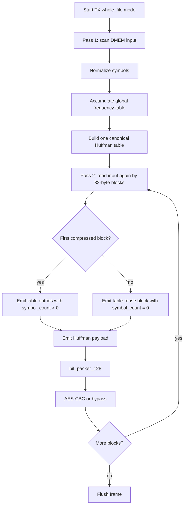

# 14. Dynamic Whole-File Huffman Spec

## 1. Muc tieu

Muc tieu cua huong nay la giu input file goc trong DMEM, khong preprocess bang
host/Python, nhung van tranh overhead lon cua dynamic Huffman theo tung block
32 byte.

Y tuong chinh:

1. TX quet toan bo file de dem frequency.
2. TX build mot Huffman table cho toan file.
3. TX encode payload theo tung block 32 byte de giu pipeline/AES/RX hien tai.
4. Huffman table chi duoc gui mot lan trong block compressed dau tien.
5. Cac compressed block sau dung lai table do.

Day la dynamic Huffman theo toan file, khong phai static codebook.

## 1.1 Whole-File Flow Chart



## 2. Ly do can doi format

Format cu:

```text
MODE_COMPRESSED:
  2 bit mode
  6 bit block_size
  6 bit symbol_count
  symbol_count * 13 bit table entry
  payload bits
```

Voi block 32 byte, moi block deu tra `14 + 13*K` bit header/table. Neu file co
nhieu block, overhead table bi lap lai qua nhieu lan va lam storage saving giam.

Format moi giu nguyen 2-bit mode cu de RX khong phai co mot frame parser hoan
toan moi.

## 3. Table-Reuse Extension

### 3.1 Normal compressed block

```text
mode         = 2'b10
block_size   = 1..32
symbol_count = 1..256
entries      = symbol_count * {symbol[7:0], code_len[4:0]}
payload      = Huffman coded bytes
```

Y nghia:

- Block nay cap nhat Huffman table.
- RX parse entries, build canonical decode table, roi decode payload.
- Day la hanh vi cu va van duoc ho tro.
- `symbol_count` la truong 9-bit trong transport hien tai; gia tri `256`
  duoc dung khi file co du 256 byte-symbol khac nhau.

### 3.2 Table-reuse compressed block

```text
mode         = 2'b10
block_size   = 1..32
symbol_count = 0
entries      = none
payload      = Huffman coded bytes using previous compressed table
```

Y nghia:

- `symbol_count=0` khong con la loi format.
- RX khong doc entry nao.
- RX dung lai canonical decode table gan nhat trong cung stream/frame.
- Neu chua co table hop le ma gap `symbol_count=0`, RX phai bao error.

Day la primitive can co de TX co the gui table mot lan cho toan file.

## 4. TX Whole-File Flow Implemented

### 4.1 Pass 1: count frequency

DMA TX doc source DMEM tu `SRC_ADDR` den `SRC_ADDR + LEN_BYTES - 1`.

TX chi dem frequency, khong emit output:

```text
for i in 0..LEN_BYTES-1:
    byte = DMEM[SRC_ADDR + i]
    norm = normalize_symbol(byte)
    freq[norm]++
```

### 4.2 Build global table

Sau pass 1:

```text
symbol_list = all symbols with freq > 0
code_len    = Huffman tree from global frequency
code_table  = canonical Huffman code table
```

### 4.3 Pass 2: emit encoded blocks

DMA TX doc source DMEM lan thu hai.

Block dau tien:

```text
mode         = COMPRESSED
block_size   = min(32, LEN_BYTES)
symbol_count = global_symbol_count
entries      = global table entries
payload      = encoded first block
```

Cac block tiep theo:

```text
mode         = COMPRESSED
block_size   = min(32, bytes_remaining)
symbol_count = 0
entries      = none
payload      = encoded block using global table
```

Trong implementation hien tai, khi software bat `MODE[3]=whole_file`, TX chay
COMPRESSED cho ca frame:

- pass 1 chi count, khong emit output
- global table duoc build mot lan
- pass 2 emit block dau co full table
- cac block sau emit `symbol_count=0` de reuse table

Fallback raw theo tung block khong duoc dung trong mode whole-file, de RX
contract don gian va de benchmark compression ratio ro rang.

## 5. RX Behavior

RX parser/decoder can ho tro 2 truong hop:

1. `symbol_count > 0`: load/rebuild table.
2. `symbol_count == 0`: reuse table cu.

Quy tac error:

- `block_size == 0`: error.
- `block_size > 32`: error.
- `symbol_count > 256`: error theo cau hinh hien tai.
- `symbol_count == 0` nhung chua co table hop le: error.

Table hop le bi clear khi frame ket thuc hoac khi reset/error.

## 6. RTL Status

Da lam:

- `huffman_block_parser` chap nhan `MODE_COMPRESSED` voi `symbol_count=0`.
- Parser chuyen thang sang payload neu compressed block khong co entries.
- `huffman_block_decoder` them `table_valid_r`.
- Decoder giu lai main table/fallback table khi gap reuse block.
- Decoder bao error neu reuse block xuat hien truoc khi co table hop le.
- `huffman_aes_tx_top` them global frequency counter va global Huffman builder.
- `dynamic_huffman_encoder` co external codebook interface cho whole-file.
- `apb_huffman_tx_if` co policy/control/status cho count/build/emit.
- `dma_tx_engine` co two-pass flow: count pass, build table, emit pass.
- `dma_regfile.MODE[3]` chon whole-file dynamic.
- `huffman_block_decoder` them `ST_COMP_LOOKUP_WAIT` de dam bao BRAM lookup
  dung latency sau khi parser consume bit window.
- `huffman_symbol_map.vh` expose full byte alphabet `0x00..0xFF`, index bang
  byte value.
- `code_length_builder` clear/build code-length table 256 entry.
- `canonical_code_generator` quet code-length table theo len/symbol de tao
  canonical code cho alphabet 256 ma khong can sort array lon.
- Area-optimized RTL maps TX Huffman working tables to distributed RAM:
  frequency table, symbol list, code-length table, tree parent/weight/order,
  canonical code table, block buffer, and APB FIFOs.
- Large memory reset loops are removed from synthesis. Valid bits and FSM clear
  phases replace resetting every table entry, reducing control sets and slice
  packing pressure.

Gioi han con lai:

- Global table ho tro toi da `256` byte-symbol.
- TX RTL hien dat `CODE_WIDTH=13` de giam LUT/timing cho FPGA demo; cac dataset
  regression hien tai co max code length nam trong gioi han nay. Neu can chay
  phan bo tan suat pathological co code length dai hon, can tang lai
  `CODE_WIDTH` hoac them fallback long-code.
- TX whole-file hien chon COMPRESSED cho ca frame, chua co raw fallback theo
  file neu ket qua nen xau.
- RX bypass AES cho `COMPRESS_ONLY` loopback chua duoc dung trong test chinh.
- RX local canonical sort tables are still register/mux based; full TX+RX
  implementation passes, but a future one-write-port sort or length-bucket
  builder would reduce RX area further.

## 7. RISC-V Software Contract

Phan mem van cau hinh qua DMA regfile:

```text
SRC_ADDR    = plaintext source
DST_ADDR    = ciphertext destination
LEN_BYTES   = plaintext length
MODE        = TX | whole_file | COMPRESS_AES = 0x9
BLOCK_CFG   = 32 for payload chunk size
CONTROL     = START
```

Khac biet nam o implementation cua TX: khi policy whole-file dynamic duoc bat,
DMA/TX se tu doc source 2 lan. CPU khong can preprocess va khong can tao table.

Status expected trong test MMIO whole-file:

- `TX STATUS idle = 0x98`
- `TX STATUS done = 0x9a`
- bit `STATUS[7]` mirror `MODE[3]=whole_file`

## 8. Simulation Result

Regression hien tai:

```text
make compile C_SRC=test_mmio_dma.c
make drc
make all
```

Ket qua loopback whole-file AES voi `sim/input1.txt`:

- input length: `2551` byte
- payload ratio: `37.50%`
- payload space saving: `62.50%`
- final storage ratio: `40.14%`
- final storage saving: `59.86%`
- RX mismatch: `0`

Ket qua TX-only whole-file `COMPRESS_ONLY` voi `sim/input4_cov.txt`:

- input length: `6000` byte
- payload ratio: `63.40%`
- payload space saving: `36.60%`
- final storage ratio: `67.73%`
- final storage saving: `32.27%`

Ket qua alnum63 stress voi `input_cov_alnum63.txt`:

- input length: `504` byte
- payload saving: `-1.86%`
- final storage saving: `-11.11%`
- day la expected voi input gan uniform va codebook/header overhead lon

Regression coverage hien tai:

- active testcase: `34`
- pass: `34`
- raw DUT full `bcesft`: `93.52%`
- raw DUT branch+statement: `95.27%`
- closed DUT coverage: `95.90%`

Vivado area-optimized result at 50 MHz:

| Build | LUT | FF | Slices | Control sets | BRAM | WNS |
|---|---:|---:|---:|---:|---:|---:|
| TX-only `rv32_soc_synth_tx_opt4` | 11933 | 5469 | 3979 | 208 | 10 | +1.277 ns |
| Full TX+RX `rv32_soc_synth_full_opt4` | 28067 | 18501 | 9955 | 757 | 11 | +0.334 ns |

The previous full-build place packing issue is resolved in this run. Sharing or
time-multiplexing AES cores is therefore not required for the current 50 MHz
full SoC closure.

## 9. Tradeoff

Uu diem:
- Giam lap table overhead.
- Phu hop file dai nhu log/text.
- Van giu input goc trong DMEM.

Nhuoc diem:
- TX latency tang vi can pass 1 truoc khi emit.
- DMEM read bandwidth tang gan 2 lan.
- RTL TX phuc tap hon.
- RX decode them 1 cycle/byte do BRAM lookup wait state.
- Huffman builder voi global frequency tang LUT/timing so voi per-block.
- Area toi uu bang distributed RAM lam synthesis lau hon voi
  `AreaOptimized_high`, nhung giam LUT/FF/control-set du de full SoC route.
