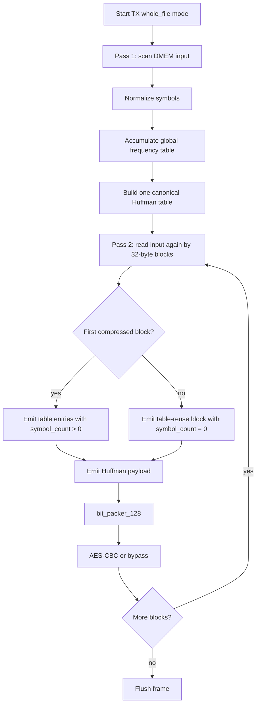

# 14. Dynamic Whole-File Huffman Spec

## 1. Goal

The goal of this approach is to keep the original input file in DMEM, without host/Python preprocessing, while avoiding the huge overhead of block-by-block dynamic Huffman
for every 32-byte block.

Main idea:

1. TX scans the entire file to count frequencies.
2. TX builds a Huffman table for the entire file.
3. TX encodes the payload in 32-byte blocks to keep the current pipeline/AES/RX.
4. The Huffman table is sent only once in the first compressed block.
5. Subsequent compressed blocks reuse that table.

This is dynamic Huffman across the entire file, not static codebook.

## 1.1 Whole-File Flow Chart



## 2. Reasons to change format

Old format:

```text
MODE_COMPRESSED:
  2 bit mode
  6 bit block_size
  6 bit symbol_count
  symbol_count * 13 bit table entry
  payload bits
```

With 32-byte blocks, each block pays the `14 + 13*K` header/table bits. For multi-block files, repeated table overhead reduces storage savings.

The new format keeps the old 2-bit mode so RX does not need a completely new frame parser.


## 3. Table-Reuse Extension

### 3.1 Normal compressed block

```text
mode         = 2'b10
block_size   = 1..32
symbol_count = 1..256
entries      = symbol_count * {symbol[7:0], code_len[4:0]}
payload      = Huffman coded bytes
```

Meaning:

- This block updates the Huffman table.
- RX parses entries, builds the canonical decode table, then decodes the payload.
- This is the old behavior and remains supported.
- `symbol_count` is a 9-bit field in the current transport; value `256` is used when the file has 256 different byte-symbols.

### 3.2 Table-reuse compressed block

```text
mode         = 2'b10
block_size   = 1..32
symbol_count = 0
entries      = none
payload      = Huffman coded bytes using previous compressed table
```

Meaning:

- `symbol_count=0` is no longer a format error.
- RX does not read any entries.
- RX reuses the most recent canonical decode table in the same stream/frame.
- If RX has no valid table and encounters `symbol_count=0`, RX must report an error.

This is the primitive needed so TX can send the table once for the entire file.

## 4. TX Whole-File Flow Implemented

### 4.1 Pass 1: count frequencies

DMA TX reads source DMEM from `SRC_ADDR` to `SRC_ADDR + LEN_BYTES - 1`.

TX only counts frequency, does not emit output:

```text
for i in 0..LEN_BYTES-1:
    byte = DMEM[SRC_ADDR + i]
    norm = normalize_symbol(byte)
    freq[norm]++
```

### 4.2 Build global table

After pass 1:

```text
symbol_list = all symbols with freq > 0
code_len    = Huffman tree from global frequency
code_table  = canonical Huffman code table
```

### 4.3 Pass 2: emit encoded blocks

DMA TX reads the DMEM source for the second time.

First block:

```text
mode         = COMPRESSED
block_size   = min(32, LEN_BYTES)
symbol_count = global_symbol_count
entries      = global table entries
payload      = encoded first block
```

Next blocks:

```text
mode         = COMPRESSED
block_size   = min(32, bytes_remaining)
symbol_count = 0
entries      = none
payload      = encoded block using global table
```

In the current implementation, when the software starts `MODE[3]=whole_file`, TX runs
COMPRESSED for frame:

- pass 1 only counts, does not emit output
- The global table is built once
- Pass 2 emit the first block with a full table
- The following blocks emit `symbol_count=0` to reuse the table

Fallback raw block by block is not used in whole-file mode, for RX
contract time and to benchmark compression ratio clearly.

## 5. RX Behavior

RX parser/decoder needs to support 2 cases:

1. `symbol_count > 0`: load/rebuild table.
2. `symbol_count == 0`: reuse old table.

Error rules:

- `block_size == 0`: error.
- `block_size > 32`: error.
- `symbol_count > 256`: error according to current configuration.
- `symbol_count == 0` but there is no valid table: error.

The valid table is cleared when the frame ends or on reset/error.

## 6. RTL Status

Did:

- `huffman_block_parser` accepts `MODE_COMPRESSED` with `symbol_count=0`.
- Parser goes straight to payload if compressed block has no entries.
- `huffman_block_decoder` adds `table_valid_r`.
- Decoder retains main table/fallback table when encountering reuse block.
- The decoder reports an error if the reuse block appears before there is a valid table.
- `huffman_aes_tx_top` adds global frequency counter and global Huffman builder.
- `dynamic_huffman_encoder` has an external codebook interface for whole-file.
- `apb_huffman_tx_if` has policy/control/status for count/build/emit.
- `dma_tx_engine` has two-pass flow: count pass, build table, emit pass.
- `dma_regfile.MODE[3]` select whole-file dynamic.
- `huffman_block_decoder` adds `ST_COMP_LOOKUP_WAIT` to ensure BRAM lookup
consume latency after parser consume bit window.
- `huffman_symbol_map.vh` exposes full byte alphabet `0x00..0xFF`, indexed with
  byte value.
- `code_length_builder` clear/build code-length table 256 entry.
- `canonical_code_generator` scans code-length table according to len/symbol to create
canonical code for alphabet 256 without needing a large sort array.

Remaining limits:

- Global table supports maximum `256` byte-symbol.
- TX RTL now sets `CODE_WIDTH=13` to reduce LUT/timing for demo FPGA; datasets
The current regression has a max code length within this limit. If you need to run
The pathological frequency distribution has a longer code length, which needs to be increased again
`CODE_WIDTH` or add fallback long-code.
- TX whole-file currently selects COMPRESSED for each frame, no raw fallback yet
file if the result is bad.
- The AES bypass RX for `COMPRESS_ONLY` loopback has not been used in the main test.

## 7. RV32I Software Contract

The software still configures via DMA regfile:

```text
SRC_ADDR    = plaintext source
DST_ADDR    = ciphertext destination
LEN_BYTES   = plaintext length
MODE        = TX | whole_file | COMPRESS_AES = 0x9
BLOCK_CFG   = 32 for payload chunk size
CONTROL     = START
```

The difference lies in the implementation of TX: when the whole-file dynamic policy is activated,
DMA/TX will automatically read the source twice. The CPU does not need to preprocess and does not need to create a table.

Expected state in MMIO whole-file test:

- `TX STATUS idle = 0x98`
- `TX STATUS done = 0x9a`
- bit `STATUS[7]` mirror `MODE[3]=whole_file`

## 8. Simulation Result

Current regression:

```text
make compile C_SRC=test_mmio_dma.c
make drc
make all
```

Whole-file AES loopback results with `sim/input1.txt`:

- input length: `2551` byte
- payload ratio: `37.50%`
- payload space saving: `62.50%`
- final storage ratio: `40.14%`
- final storage saving: `59.86%`
- RX mismatch: `0`

TX-only whole-file results `COMPRESS_ONLY` with `sim/input4_cov.txt`:

- input length: `6000` byte
- payload ratio: `63.40%`
- payload space saving: `36.60%`
- final storage ratio: `67.73%`
- final storage saving: `32.27%`

Results of alnum63 stress with `input_cov_alnum63.txt`:

- input length: `504` byte
- payload saving: `-1.86%`
- final storage saving: `-11.11%`
- This is expected with near uniform input and large codebook/header overhead

Current regression coverage:

- active testcase: `34`
- pass: `34`
- raw DUT full `bcesft`: `93.52%`
- raw DUT branch+statement: `95.27%`
- closed DUT coverage: `95.90%`

## 9. Tradeoff

Uu diem:
- Reduce duplicate table overhead.
- Additional files are as long as log/text.
- Still keeps the original input in DMEM.

Nhuoc diem:
- TX latency increased because pass 1 is needed before emitting.
- DMEM read bandwidth increased nearly 2 times.
- RTL TX is more convenient.
- RX decodes an additional 1 cycle/byte due to BRAM lookup wait state.
- Huffman builder with global frequency increases LUT/timing compared to per-block.
