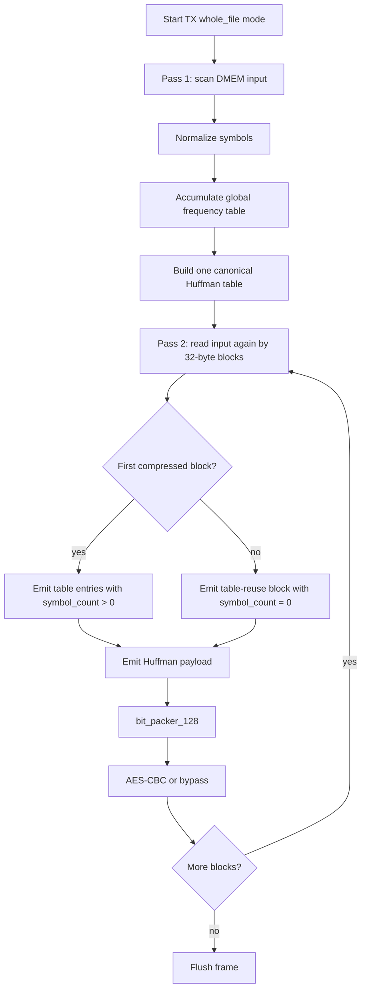

# 14. Dynamic Whole-File Huffman Spec

## 1. Mục tiêu

Mục tiêu của hướng này là giữ input file gốc trong DMEM, không preprocess bằng
host/Python, nhưng vẫn tránh overhead lớn của dynamic Huffman theo từng block
32 byte.

Ý tưởng chính:

1. TX quét toàn bộ file để đếm frequency.
2. TX build một Huffman table cho toàn file.
3. TX encode payload theo từng block 32 byte để giữ pipeline/AES/RX hiện tại.
4. Huffman table chỉ được gửi một lần trong block compressed đầu tiên.
5. Các compressed block sau dùng lại table do.

Đây là dynamic Huffman theo toàn file, không phải static codebook.

## 1.1 Whole-File Flow Chart



## 2. Lý do cần đổi format

Format cũ:

```text
MODE_COMPRESSED:
  2 bit mode
  6 bit block_size
  6 bit symbol_count
  symbol_count * 13 bit table entry
  payload bits
```

Với block 32 byte, mỗi block đều trả `14 + 13*K` bit header/table. Nếu file có
nhieu block, overhead table bị lặp lại qua nhieu lần và làm storage saving giảm.

Format mới giữ nguyên 2-bit mode cũ để RX không phải có một frame parser hoàn
toàn mới.

## 3. Table-Reuse Extension

### 3.1 Normal compressed block

```text
mode         = 2'b10
block_size   = 1..32
symbol_count = 1..256
entries      = symbol_count * {symbol[7:0], code_len[4:0]}
payload      = Huffman coded bytes
```

Ý nghĩa:

- Block này cập nhật Huffman table.
- RX parse entries, build canonical decode table, rồi decode payload.
- Đây là hành vi cũ và vẫn được hỗ trợ.
- `symbol_count` là trường 9-bit trong transport hiện tại; giá trị `256`
  được dùng khi file có đủ 256 byte-symbol khác nhau.

### 3.2 Table-reuse compressed block

```text
mode         = 2'b10
block_size   = 1..32
symbol_count = 0
entries      = none
payload      = Huffman coded bytes using previous compressed table
```

Ý nghĩa:

- `symbol_count=0` không còn là lỗi format.
- RX không đọc entry nào.
- RX dùng lại canonical decode table gần nhất trong cùng stream/frame.
- Nếu chưa có table hợp lệ ma gặp `symbol_count=0`, RX phải báo error.

Đây là primitive cần có để TX có thể gửi table một lần cho toàn file.

## 4. TX Whole-File Flow Implemented

### 4.1 Pass 1: count frequency

DMA TX đọc source DMEM tu `SRC_ADDR` đến `SRC_ADDR + LEN_BYTES - 1`.

TX chỉ đếm frequency, không emit output:

```text
for i in 0..LEN_BYTES-1:
    byte = DMEM[SRC_ADDR + i]
    norm = normalize_symbol(byte)
    freq[norm]++
```

### 4.2 Build global table

Sau pass 1:

```text
symbol_list = all symbols with freq > 0
code_len    = Huffman tree from global frequency
code_table  = canonical Huffman code table
```

### 4.3 Pass 2: emit encoded blocks

DMA TX đọc source DMEM lần thu hai.

Block đầu tiên:

```text
mode         = COMPRESSED
block_size   = min(32, LEN_BYTES)
symbol_count = global_symbol_count
entries      = global table entries
payload      = encoded first block
```

Các block tiếp theo:

```text
mode         = COMPRESSED
block_size   = min(32, bytes_remaining)
symbol_count = 0
entries      = none
payload      = encoded block using global table
```

Trong implementation hiện tại, khi software bat `MODE[3]=whole_file`, TX chạy
COMPRESSED cho ca frame:

- pass 1 chỉ count, không emit output
- global table được build một lần
- pass 2 emit block đầu có full table
- các block sau emit `symbol_count=0` để reuse table

Fallback raw theo từng block không được dùng trong mode whole-file, để RX
contract don gian và để benchmark compression ratio rõ ràng.

## 5. RX Behavior

RX parser/decoder cần hỗ trợ 2 trường hop:

1. `symbol_count > 0`: load/rebuild table.
2. `symbol_count == 0`: reuse table cũ.

Quy tac error:

- `block_size == 0`: error.
- `block_size > 32`: error.
- `symbol_count > 256`: error theo cấu hình hiện tại.
- `symbol_count == 0` nhưng chưa có table hợp lệ: error.

Table hợp lệ bị clear khi frame kết thúc hoặc khi reset/error.

## 6. RTL Trạng thái

Đã làm:

- `huffman_block_parser` chấp nhận `MODE_COMPRESSED` với `symbol_count=0`.
- Parser chuyển thẳng sang payload nếu compressed block không có entries.
- `huffman_block_decoder` thêm `table_valid_r`.
- Decoder giữ lại main table/fallback table khi gặp reuse block.
- Decoder báo error nếu reuse block xuất hien trước khi có table hợp lệ.
- `huffman_aes_tx_top` thêm global frequency counter và global Huffman builder.
- `dynamic_huffman_encoder` có external codebook interface cho whole-file.
- `apb_huffman_tx_if` có policy/control/status cho count/build/emit.
- `dma_tx_engine` có two-pass flow: count pass, build table, emit pass.
- `dma_regfile.MODE[3]` chọn whole-file dynamic.
- `huffman_block_decoder` thêm `ST_COMP_LOOKUP_WAIT` để đảm bảo BRAM lookup
  dung latency sau khi parser consume bit window.
- `huffman_symbol_map.vh` expose full byte alphabet `0x00..0xFF`, index bằng
  byte value.
- `code_length_builder` clear/build code-length table 256 entry.
- `canonical_code_generator` quét code-length table theo len/symbol để tạo
  canonical code cho alphabet 256 mà không cần sort array lớn.

Giới hạn còn lại:

- Global table hỗ trợ tối đa `256` byte-symbol.
- TX RTL hiện đặt `CODE_WIDTH=13` để giảm LUT/timing cho FPGA demo; các dataset
  regression hiện tại có max code length nằm trong giới hạn này. Nếu cần chạy
  phân bố tần suất pathological có code length dài hơn, cần tăng lại
  `CODE_WIDTH` hoặc thêm fallback long-code.
- TX whole-file hiện chọn COMPRESSED cho ca frame, chưa có raw fallback theo
  file nếu kết quả nen xấu.
- RX bypass AES cho `COMPRESS_ONLY` loopback chưa được dùng trong test chính.

## 7. RISC-V Software Contract

Phần mềm vẫn cấu hình qua DMA regfile:

```text
SRC_ADDR    = plaintext source
DST_ADDR    = ciphertext destination
LEN_BYTES   = plaintext length
MODE        = TX | whole_file | COMPRESS_AES = 0x9
BLOCK_CFG   = 32 for payload chunk size
CONTROL     = START
```

Khác biet nằm o implementation của TX: khi policy whole-file dynamic được bat,
DMA/TX sẽ tự đọc source 2 lần. CPU không cần preprocess và không cần tạo table.

Trạng thái expected trong test MMIO whole-file:

- `TX STATUS idle = 0x98`
- `TX STATUS done = 0x9a`
- bit `STATUS[7]` mirror `MODE[3]=whole_file`

## 8. Simulation Result

Regression hiện tại:

```text
make compile C_SRC=test_mmio_dma.c
make drc
make all
```

Kết quả loopback whole-file AES với `sim/input1.txt`:

- input length: `2551` byte
- payload ratio: `37.50%`
- payload space saving: `62.50%`
- final storage ratio: `40.14%`
- final storage saving: `59.86%`
- RX mismatch: `0`

Kết quả TX-only whole-file `COMPRESS_ONLY` với `sim/input4_cov.txt`:

- input length: `6000` byte
- payload ratio: `63.40%`
- payload space saving: `36.60%`
- final storage ratio: `67.73%`
- final storage saving: `32.27%`

Kết quả alnum63 stress với `input_cov_alnum63.txt`:

- input length: `504` byte
- payload saving: `-1.86%`
- final storage saving: `-11.11%`
- đây là expected với input gần uniform và codebook/header overhead lớn

Regression coverage hiện tại:

- active testcase: `34`
- pass: `34`
- raw DUT full `bcesft`: `93.52%`
- raw DUT branch+statement: `95.27%`
- closed DUT coverage: `95.90%`

## 9. Tradeoff

Uu diem:
- Giảm lặp table overhead.
- Phụ hop file dài như log/text.
- Vẫn giữ input gốc trong DMEM.

Nhuoc diem:
- TX latency tăng vi cần pass 1 trước khi emit.
- DMEM read bandwidth tăng gần 2 lần.
- RTL TX phuc tap hơn.
- RX decode thêm 1 cycle/byte do BRAM lookup wait state.
- Huffman builder với global frequency tăng LUT/timing so với per-block.
