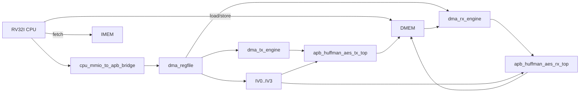
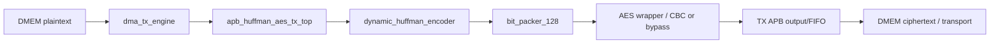
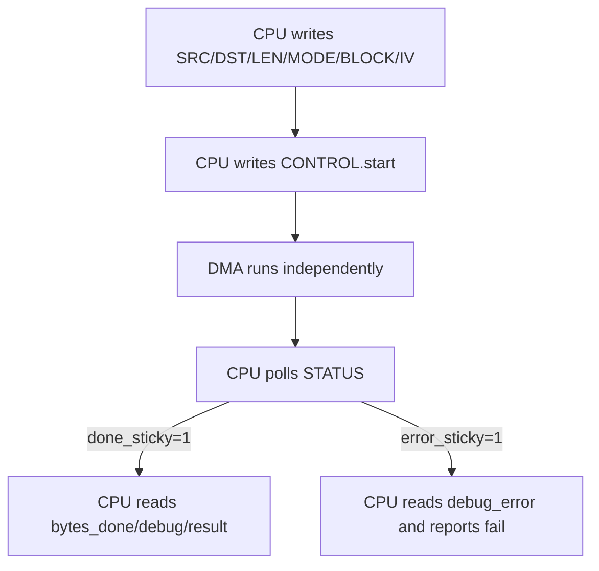
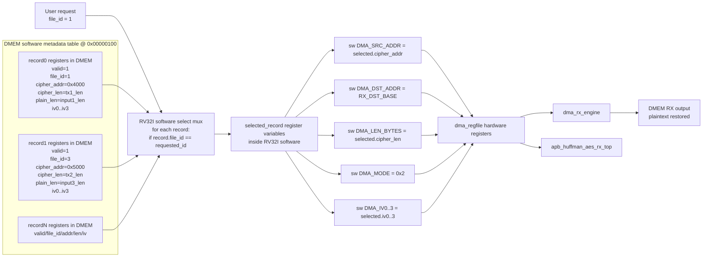
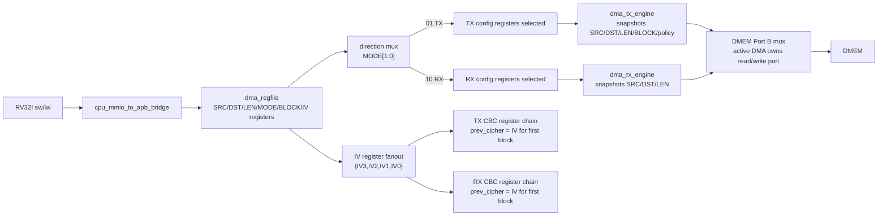

# 29. Defense Q&A And Code Focus Spec

## 1. Purpose

Tai lieu nay dung de on bao cao.

Muc tieu:

- chi ra nhung phan code can nam chac nhat;
- dua ra cau tra loi ngan gon cho nhung cau hoi de bi hoi;
- kem so do chi tiet de neu can thi mo code dung module ngay.

Tai lieu nay khong thay the `00_current_system_spec.md`.
No la ban "backup oral defense" de tra loi luc bi hoi code.

---

## 2. Code Areas To Know Best

Neu chi co thoi gian hoc 5 cum code, uu tien dung thu tu nay.

| Priority | Cum code | Vi sao phai nam |
|---:|---|---|
| 1 | `rv32_soc_top.v` | Day la so do tong cua ca he thong. Moi cau hoi kien truc deu quay ve top-level nay. |
| 2 | `cpu_mmio_to_apb_bridge.v` + `dma_regfile.v` | Day la control plane: CPU cau hinh DMA nhu the nao, MMIO decode o dau, status/doc ghi o dau. |
| 3 | `dma_tx_engine.v` + `dma_rx_engine.v` | Day la data mover thuc su: doc DMEM, day vao accelerator, lay output ve DMEM. |
| 4 | `apb_huffman_aes_tx_top.v` + `apb_huffman_aes_rx_top.v` | Day la cua vao/cua ra cua TX va RX accelerator tu goc nhin SoC. |
| 5 | `tb_rv32_soc_mmio_dma.v` | Day la bang chung chinh de bao cao: testcase end-to-end, throughput, saving, dump file, pass/fail. |

Neu bi hoi sau nua, tiep tuc xuong:

| Group | File |
|---|---|
| TX core | `dynamic_huffman_encoder.v`, `bit_packer_128.v`, `wrapper.v` |
| RX core | `huffman_block_parser.v`, `huffman_block_decoder.v`, `bit_depacker_128.v`, `wrapper_rx.v`, `rx_byte_packer_32.v` |
| Software | `secure_storage_fw.h`, `test_mmio_dma_storage_table.c`, legacy `test_mmio_dma.c`, va `c_files_explained.md` |

---

## 3. Detailed Architecture Diagram

### 3.1 SoC level

### 3.2 TX detailed flow

### 3.3 RX detailed flow

```mermaid
flowchart LR
    SRC["DMEM ciphertext / transport"] --> RXDMA["dma_rx_engine"]
    RXDMA --> RXAPB["apb_huffman_aes_rx_top"]
    RXAPB --> AESW["AES wrapper_rx / CBC decrypt"]
    AESW --> DEPACK["bit_depacker_128"]
    DEPACK --> PARSER["huffman_block_parser"]
    PARSER --> DEC["huffman_block_decoder"]
    DEC --> PACK32["rx_byte_packer_32"]
    PACK32 --> DST["DMEM restored plaintext"]
```

### 3.4 CPU software control flow

### 3.5 Multi-record storage register/mux detail

So do nay dung de tra loi cau hoi: "Neu da luu input1 dang compressed/encrypted,
sau do luu tiep input3, thi lam sao quay lai giai ma input1?"

Y chinh:

- RTL khong can biet "file name"; RV32I software quan ly bang metadata record.
- Moi record chua `file_id`, `cipher_addr`, `cipher_len`, `plain_len`, `mode`,
  `iv0..iv3`.
- Khi user chon `file_id`, software scan metadata table, mux ra record duoc
  chon, roi ghi lai cac field vao `dma_regfile`.
- `dma_regfile` la tap register phan cung; mux chon record nam trong software
  logic/chay bang instruction RV32I, khong phai mux RTL rieng.

### 3.6 Hardware register/mux view for one DMA launch

This is the low-level view of how software-written registers become the active
TX/RX datapath selection.

---

## 4. What To Say When Showing Code

### 4.1 `rv32_soc_top.v`

Phai noi duoc 4 y:

1. Day la noi ghep CPU, IMEM, DMEM, bridge MMIO, DMA regfile, TX engine, RX engine, TX accelerator, RX accelerator.
2. CPU dong vai tro control plane; accelerator + DMA dong vai tro data plane.
3. MMIO address decode toi thieu di vao `dma_regfile` va APB-related control/status.
4. Ket qua cuoi cung van quay lai DMEM de CPU va testbench co the doc/xac minh.

### 4.2 `cpu_mmio_to_apb_bridge.v`

Phai noi duoc 5 y:

1. Bridge bien mot MMIO access cua CPU thanh APB access cho peripheral.
2. APB transfer co 2 phase ben ngoai: setup va access; `complete` la su kien khi `PREADY=1`.
3. RTL bridge hien co 2 state (`IDLE`, `ACCESS`); setup la cycle accept request, khong phai state rieng.
4. Khi CPU dang thuc hien MMIO access ma APB chua xong, pipeline duoc hold kien truc trong `ACCESS`.
5. Du lieu readback cua MMIO duoc noi vao memory-return path de CPU `lw` doc thanh ghi nhu doc memory.

### 4.3 `dma_regfile.v`

Phai noi duoc 5 y:

1. Day la noi chua config va status cua DMA.
2. CPU ghi `SRC_ADDR`, `DST_ADDR`, `LEN_BYTES`, `MODE`, `BLOCK_CFG`, `IV0..IV3`.
3. CPU kick bang `CONTROL.start`.
4. DMA engine cap nhat `busy`, `done_sticky`, `error_sticky`, `bytes_done`.
5. TX expose `ciphertext_bytes_produced` de RX biet phai doc bao nhieu byte ciphertext.

### 4.4 `dma_tx_engine.v`

Phai noi duoc 4 y:

1. TX DMA doc plaintext tu DMEM.
2. Sau do no dua word du lieu vao TX APB interface.
3. No khong nen/ma hoa; no chi data-mover.
4. Khi TX accelerator tao ra transport/ciphertext, du lieu duoc ghi ve DMEM o vung dich.

### 4.5 `dma_rx_engine.v`

Phai noi duoc 4 y:

1. RX DMA doc ciphertext/transport tu DMEM.
2. No cap cho RX accelerator qua APB RX side.
3. Khi RX accelerator tra plaintext da phuc hoi, RX DMA ghi lai DMEM.
4. Testbench so sanh vung RX output voi source input de ket luan pass/fail.

### 4.6 `apb_huffman_aes_tx_top.v`

Phai noi duoc 4 y:

1. Day la top cua TX accelerator duoi goc nhin SoC.
2. Ben trong no noi chuoi: Huffman encode -> bit pack -> AES/bypass -> output APB/FIFO.
3. Co mode `COMPRESS_ONLY` va `COMPRESS_AES`.
4. Output la transport/ciphertext da align de DMA ghi ve DMEM.

### 4.7 `apb_huffman_aes_rx_top.v`

Phai noi duoc 4 y:

1. Day la top cua RX accelerator duoi goc nhin SoC.
2. Ben trong no noi chuoi: AES decrypt -> bit depack -> parser -> decoder -> byte pack.
3. No can cung IV va cung contract frame voi TX.
4. Output cuoi la plaintext 32-bit word stream cho RX DMA ghi DMEM.

### 4.8 `tb_rv32_soc_mmio_dma.v`

Phai noi duoc 5 y:

1. TB load `input.txt` vao DMEM.
2. TB chay chuong trinh RV32I de CPU tu cau hinh DMA bang MMIO that.
3. TB dump 3 vung: source DMEM, TX region, RX region.
4. TB tinh benchmark: cycles, throughput, compression ratio, storage ratio.
5. TB kiem tra end-to-end bang pass/fail lines va `rx_mismatch_count`.

---

## 5. Most Important Oral Questions And Short Answers

### Q1. He thong nay la gi?

**Tra loi ngan:**

Day la mot SoC RV32I ma CPU chi dung de cau hinh va giam sat. Du lieu duoc di chuyen bang DMA, con nen/giai nen va ma hoa/giai ma nam o accelerator TX va RX.

**Neu bi hoi tiep:**

- CPU = control plane
- DMA + accelerator = data plane
- DMEM = noi chua source, ciphertext, va output

### Q2. Tai sao phai dung DMA, sao khong de CPU copy bang load/store?

**Tra loi ngan:**

Neu de CPU copy tung byte thi CPU vua phai di chuyen du lieu, vua phai polling accelerator, rat ton chu ky. DMA tach phan di chuyen du lieu ra khoi CPU, de CPU chi can config va doi ket qua.

**Neu bi hoi tiep:**

- giam phan mem copy loop
- ro control/data plane
- de mo rong de len FPGA thuc dung hon

### Q3. CPU co bi stall trong luc DMA chay khong?

**Tra loi ngan:**

Khong stall toan cuc. CPU chi bi hold khi dang thuc hien MMIO/APB access can cho peripheral tra loi. Ban than DMA chay background.

**Module can mo neu bi hoi:**

- `cpu_mmio_to_apb_bridge.v`
- `cpu_dma_stall_policy_spec.md`

### Q4. APB bridge co dung 3 buoc setup/access/complete khong?

**Tra loi ngan:**

Neu noi theo luong thao tac thi co 3 buoc: setup, access, complete. Nhung theo APB protocol chi co 2 phase bus la `SETUP` va `ACCESS`; `complete` la su kien khi `PREADY=1`. Trong RTL, bridge chi co 2 state (`IDLE`, `ACCESS`): setup duoc drive ngay luc accept request, sau do bridge vao `ACCESS`, giu request va hold CPU cho den khi `PREADY` xac nhan giao dich xong.

### Q5. TX va RX du lieu di nhu the nao?

**Tra loi ngan:**

TX: DMEM -> TX DMA -> Huffman/AES TX -> DMEM.  
RX: DMEM -> RX DMA -> AES/Huffman RX -> DMEM.

**Neu bi hoi sau:**

- TX sinh ciphertext/transport stream
- RX dung ciphertext bytes do de doc lai va phuc hoi source

### Q6. Tai sao output TX quay lai DMEM?

**Tra loi ngan:**

Vi muc tieu cua de tai la secure storage. TX khong dua ra ngoai chip trong simulation; no ghi ciphertext ve DMEM de mo phong luu tru an toan. Sau do RX doc lai tu chinh DMEM de kiem tra loopback.

### Q7. Input1 compress duoc, input4 co luc am saving la tai sao?

**Tra loi ngan:**

Vi Huffman chi hieu qua khi phan bo ky tu lech ro. Neu input gan nhu "deu ky hieu" hoac co entropy cao, header + canh transport + AES padding/co dinh frame co the lam tong dung luong lon hon input goc.

**Phai phan biet 2 so:**

- `payload compression`: chi nhin phan payload nen
- `final storage ratio`: nhin tong sau khi cong header/frame/AES/transport

### Q8. Tai sao phai tach TX-only va RX-only bitstream?

**Tra loi ngan:**

Vi full TX+RX tren Zynq-7020 bi ap luc LUT/timing. Tach ra thi moi ben de timing pass va hop ly cho demo FPGA.

### Q9. Polling status la gi?

**Tra loi ngan:**

CPU lien tuc doc `STATUS` trong `dma_regfile` de xem `done_sticky` hoac `error_sticky` da duoc set chua. Day la co che dieu khien phan mem hien tai.

### Q10. Tai sao chua dung interrupt?

**Tra loi ngan:**

Ban hien tai uu tien don gian va ro luong control. Polling de debug de hon trong simulation. Interrupt/trap la huong nang cap, nhung khong bat buoc de chung minh kien truc SoC va luong DMA/accelerator.

### Q11. IV hien tai do ai cap?

**Tra loi ngan:**

IV do firmware RV32I cap. Trong flow secure-storage hien tai,
`secure_storage_fw.h` tao IV, ghi vao `IV0..IV3` cua `dma_regfile`, va luu lai
chinh 4 word IV do trong metadata record. Khi doc lai, firmware restore
`IV0..IV3` tu metadata truoc khi start RX.

### Q12. IV duoc tao nhu the nao?

**Tra loi ngan:**

Trong flow hien tai, CPU tinh IV bang phan mem RV32I trong
`secure_prepare_record()`. Counter dat tai `DMEM[0x000001F0]`, seed
`0x31415926`, moi lan `secure_write` counter tang len va duoc tron voi
`plain_len`, `plain_addr`, `cipher_addr`, `file_id`, va constant `0x43424331`.
Day la deterministic demo IV, khong phai TRNG phan cung.

### Q13. Tai sao raw DUT coverage chua 100%?

**Tra loi ngan:**

Vi mot so condition/expression va toggle noi bo chi xuat hien o tinh huong rat
hiem, dac biet parser/decode error path, fallback decode, bus AES/Huffman
rong va memory-array toggle cua builder. Tuy nhien nhung testcase chinh da pass,
raw DUT da tren 90%, branch/statement da cao, va closed coverage cao hon.

### Q14. Ket qua end-to-end chung minh cai gi?

**Tra loi ngan:**

No chung minh CPU RV32I da cau hinh DMA bang MMIO that, TX da tao ciphertext/transport that, RX da phuc hoi plaintext that, va du lieu RX cuoi cung giong input goc.

### Q15. Tai sao `loopback_rx_should_match_input_file` la check quan trong nhat?

**Tra loi ngan:**

Vi day la bang chung cuoi cung rang toan bo chuoi TX->luu tru->RX hoat dong dung ve chuc nang. Neu check nay fail thi kien truc secure storage end-to-end chua dung.

### Q16. Neu da luu input1 dang compressed/encrypted, sau do tiep tuc luu input3, sau nay co lay lai input1 duoc khong?

**Tra loi ngan:**

Duoc, neu phan mem RV32I giu metadata cho tung ban ghi. Metadata can co
`file_id`, dia chi ciphertext trong DMEM, ciphertext length, plaintext length,
mode va IV. Hien tai viec nay da duoc dong goi thanh `secure_write()` va
`secure_read()`: khi muon lay lai input1, firmware tim record `file_id=1`,
restore `IV0..IV3`, lay `cipher_addr/cipher_len/plain_len`, cau hinh RX
`MODE=0x2`, roi start DMA.

**Bang chung hien co:**

`dma_storage_table_input1_then_input3` da pass `PASS=22`, `FAIL=0`: TX input1,
TX input3, sau do chon lai record input1 bang `secure_read(file_id=1)` va RX ra
plaintext khop `input1.txt`.

---

## 6. How To Explain The Main PASS Lines

Day la ban ngan gon de noi tren slide backup hoac khi thuyet minh log.

| PASS line | Y nghia can noi |
|---|---|
| `mem_err_o_should_be_zero` | Khong co loi memory/bus trong testcase. |
| `cpu_should_publish_known_signature` | CPU chay xong chuong trinh test va ghi dau hieu ket qua vao DMEM. |
| `result_signature` | Xac nhan dung testcase end-to-end mong muon da chay xong. |
| `cpu_error_mask_should_be_zero` | Phan mem RV32I khong tu phat hien loi cau hinh hay polling. |
| `tx_status_before_start` | TX dang o trang thai idle hop le truoc khi kick. |
| `tx_status_after_done` | TX hoan tat va set done dung. |
| `tx_ciphertext_bytes_produced_should_match_tx_bytes_done` | So byte ciphertext ma TX bao phai khop so byte DMA da xu ly. |
| `rx_status_after_done` | RX hoan tat va khong bao loi. |
| `rx_bytes_done_should_match_input_len` | RX phuc hoi du so byte plaintext nhu input goc. |
| `source_dmem_should_match_input_file` | Input loader vao DMEM la dung. |
| `loopback_rx_should_match_input_file` | Plaintext sau loopback giong input goc. |
| `tx_ciphertext_region_should_not_be_all_zero` | TX that su da tao output, khong phai false pass. |
| `dma_start_pulse_count` | So lan kick DMA dung voi flow testcase. |

---

## 7. Code Reading Order Before Defense

Neu con it thoi gian, doc dung thu tu nay:

1. [00_current_system_spec.md](/mnt/h/Academic/senior_project/DATN/work/luc/AES_huffman_all6/docs/00_current_system_spec.md)
2. [soc_4_5_end_to_end_report.md](/mnt/h/Academic/senior_project/DATN/work/luc/AES_huffman_all6/docs/soc_4_5_end_to_end_report.md)
3. [report_presentation_guide.md](/mnt/h/Academic/senior_project/DATN/work/luc/AES_huffman_all6/docs/report_presentation_guide.md)
4. [rv32_soc_top.v](/mnt/h/Academic/senior_project/DATN/work/luc/AES_huffman_all6/rtl/rv32_soc_top.v)
5. [cpu_mmio_to_apb_bridge.v](/mnt/h/Academic/senior_project/DATN/work/luc/AES_huffman_all6/rtl/cpu_mmio_to_apb_bridge.v)
6. [dma_regfile.v](/mnt/h/Academic/senior_project/DATN/work/luc/AES_huffman_all6/rtl/dma_regfile.v)
7. [dma_tx_engine.v](/mnt/h/Academic/senior_project/DATN/work/luc/AES_huffman_all6/rtl/dma_tx_engine.v)
8. [dma_rx_engine.v](/mnt/h/Academic/senior_project/DATN/work/luc/AES_huffman_all6/rtl/dma_rx_engine.v)
9. [apb_huffman_aes_tx_top.v](/mnt/h/Academic/senior_project/DATN/work/luc/AES_huffman_all6/rtl/apb_huffman_aes_tx_top.v)
10. [apb_huffman_aes_rx_top.v](/mnt/h/Academic/senior_project/DATN/work/luc/AES_huffman_all6/rtl/apb_huffman_aes_rx_top.v)
11. [tb_rv32_soc_mmio_dma.v](/mnt/h/Academic/senior_project/DATN/work/luc/AES_huffman_all6/tb/tb_rv32_soc_mmio_dma.v)

---

## 8. Latest Numbers To Remember

Latest checked date: **May 10, 2026**.

De de nho khi bi hoi nhanh:

| Item | Value |
|---|---:|
| Main end-to-end evidence | `SUMMARY: PASS=18 FAIL=0` cho testcase SoC TX->RX chinh |
| Multi-record storage evidence | `SUMMARY: PASS=22 FAIL=0` cho `dma_storage_table_input1_then_input3` |
| Raw DUT full coverage | `93.52%` |
| Closed DUT coverage | `95.90%` sau coverage closure |
| Main weak raw areas | RX parser/decoder condition/expression, AES/Huffman wide-bus toggles, dynamic builder memory-array toggles |

Neu thay hoi "tai sao khong 100% coverage", dung noi:

> Functional end-to-end, MMIO, DMA, TX, RX, error path chinh da pass. Phan con thieu chu yeu la cac condition/expression va toggle noi bo hiem trong parser/decode table, AES/Huffman wide bus va memory-array activity, khong phai cac luong chinh cua secure-storage SoC.

---

## 9. Final Advice

Di bao cao, khong can thuoc tung dong RTL.
Can nam chac:

- du lieu di dau -> den dau;
- CPU lam gi, DMA lam gi, accelerator lam gi;
- test nao chung minh duoc gi;
- han che hien tai la gi va tai sao van chap nhan duoc cho muc tieu de tai.
