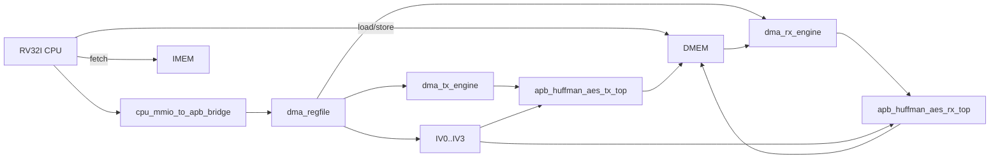
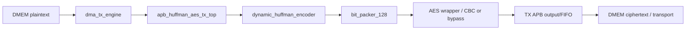
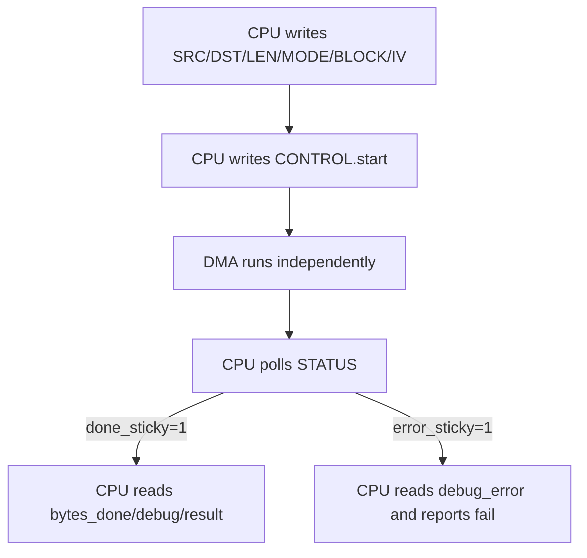
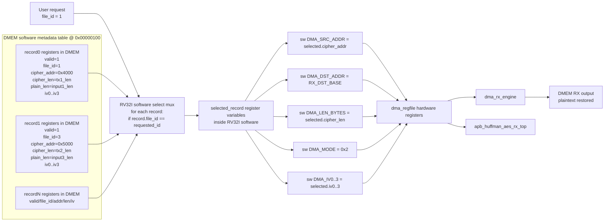
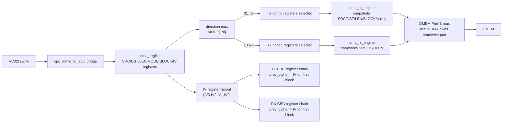

# 29. Defense Q&A And Code Focus Spec

## 1. Mục đích

Tài liệu này dung để on bao cao.

Mục tiêu:

- chỉ ra nhưng phan code cần nằm chac nhất;
- dua ra cau trả lỗi ngắn gon cho nhưng cau hoi để bị hoi;
- kem sơ đồ chỉ tiet để nếu cần thì mở code dung module ngay.

Tài liệu này không thay the `00_current_system_spec.md`.
No là ban "backup oral defense" để trả lỗi lúc bị hoi code.

---

## 2. Code Areas To Know Best

Nếu chỉ có thời gian hoc 5 cum code, ưu tiên dung thứ tự này.

| Priority | Cum code | Vi sao phải nằm |
|---:|---|---|
| 1 | `rv32_soc_top.v` | Đây là sơ đồ tong của ca hệ thống. Mới cau hoi kiến trúc đều quay ve top-level này. |
| 2 | `cpu_mmio_to_apb_bridge.v` + `dma_regfile.v` | Đây là control plane: CPU cấu hình DMA như the nào, MMIO decode o đầu, status/đọc ghi o đầu. |
| 3 | `dma_tx_engine.v` + `dma_rx_engine.v` | Đây là data mover thực sự: đọc DMEM, đây vao accelerator, lay output ve DMEM. |
| 4 | `apb_huffman_aes_tx_top.v` + `apb_huffman_aes_rx_top.v` | Đây là của vao/của ra của TX và RX accelerator tu góc nhìn SoC. |
| 5 | `tb_rv32_soc_mmio_dma.v` | Đây là bằng chứng chính để bao cao: testcase end-to-end, throughput, saving, dump file, pass/fail. |

Nếu bị hoi sau nữa, tiếp tục xuong:

| Group | File |
|---|---|
| TX core | `dynamic_huffman_encoder.v`, `bit_packer_128.v`, `wrapper.v` |
| RX core | `huffman_block_parser.v`, `huffman_block_decoder.v`, `bit_depacker_128.v`, `wrapper_rx.v`, `rx_byte_packer_32.v` |
| Software | `test_mmio_dma.c` và `c_files_explained.md` |

---

## 3. Detailed Architecture Diagram

### 3.1 SoC level

### 3.2 TX detailed flow

### 3.3 RX detailed flow

```mermaid
flowchart LR
    SRC["DMEM ciphertext / transport"] --> RXDMA["dma_rx_engine"]
    RXDMA --> RXAPB["apb_huffman_aes_rx_top"]
    RXAPB --> AESW["AES wrapper_rx / CBC decrypt"]
    AESW --> DEPACK["bit_depacker_128"]
    DEPACK --> PARSER["huffman_block_parser"]
    PARSER --> DEC["huffman_block_decoder"]
    DEC --> PACK32["rx_byte_packer_32"]
    PACK32 --> DST["DMEM restored plaintext"]
```

### 3.4 CPU software control flow

### 3.5 Multi-record storage register/mux detail

Sơ đồ này dung để trả lỗi cau hoi: "Nếu da lưu input1 dang compressed/encrypted,
sau đó lưu tiep input3, thì làm sao quay lại giải mã input1?"

Y chính:

- RTL không cần biet "file name"; RV32I software quan ly bằng metadata record.
- Mới record chưa `file_id`, `cipher_addr`, `cipher_len`, `plain_len`, `mode`,
  `iv0..iv3`.
- Khi user chọn `file_id`, software scan metadata table, mux ra record được
  chọn, rồi ghi lại các field vao `dma_regfile`.
- `dma_regfile` là tap register phần cứng; mux chọn record nằm trong software
  logic/chạy bằng instruction RV32I, không phải mux RTL riêng.

### 3.6 Hardware register/mux view for one DMA launch

This is the low-level view of how software-written registers become the active
TX/RX datapath selection.

---

## 4. What To Say When Showing Code

### 4.1 `rv32_soc_top.v`

Phải noi được 4 y:

1. Đây là noi ghep CPU, IMEM, DMEM, bridge MMIO, DMA regfile, TX engine, RX engine, TX accelerator, RX accelerator.
2. CPU dong vai tro control plane; accelerator + DMA dong vai tro data plane.
3. MMIO address decode toi thiếu di vao `dma_regfile` và APB-related control/status.
4. Kết quả cuối cùng vẫn quay lại DMEM để CPU và testbench có thể đọc/xác minh.

### 4.2 `cpu_mmio_to_apb_bridge.v`

Phải noi được 4 y:

1. Bridge bien một MMIO access của CPU thanh APB access cho peripheral.
2. APB master vẫn theo 3 pha có ban: setup, access, complete.
3. Khi CPU dang thực hiện MMIO access ma APB chưa xong, pipeline được hold kiến trúc.
4. Dữ liệu readback của MMIO được nối vao memory-return path để CPU `lw` đọc thanh ghi như đọc memory.

### 4.3 `dma_regfile.v`

Phải noi được 5 y:

1. Đây là noi chưa config và status của DMA.
2. CPU ghi `SRC_ADDR`, `DST_ADDR`, `LEN_BYTES`, `MODE`, `BLOCK_CFG`, `IV0..IV3`.
3. CPU kick bằng `CONTROL.start`.
4. DMA engine cập nhật `busy`, `done_sticky`, `error_sticky`, `bytes_done`.
5. TX expose `ciphertext_bytes_produced` để RX biet phải đọc bao nhieu byte ciphertext.

### 4.4 `dma_tx_engine.v`

Phải noi được 4 y:

1. TX DMA đọc plaintext tu DMEM.
2. Sau đó no dua word dữ liệu vao TX APB interface.
3. No không nên/mã hóa; no chỉ data-mover.
4. Khi TX accelerator tạo ra transport/ciphertext, dữ liệu được ghi ve DMEM o vung dich.

### 4.5 `dma_rx_engine.v`

Phải noi được 4 y:

1. RX DMA đọc ciphertext/transport tu DMEM.
2. No cap cho RX accelerator qua APB RX side.
3. Khi RX accelerator trả plaintext da phục hồi, RX DMA ghi lại DMEM.
4. Testbench so sánh vung RX output với source input để ket luan pass/fail.

### 4.6 `apb_huffman_aes_tx_top.v`

Phải noi được 4 y:

1. Đây là top của TX accelerator dưới góc nhìn SoC.
2. Ben trong no noi chuoi: Huffman encode -> bit pack -> AES/bypass -> output APB/FIFO.
3. Có mode `COMPRESS_ONLY` và `COMPRESS_AES`.
4. Output là transport/ciphertext da align để DMA ghi ve DMEM.

### 4.7 `apb_huffman_aes_rx_top.v`

Phải noi được 4 y:

1. Đây là top của RX accelerator dưới góc nhìn SoC.
2. Ben trong no noi chuoi: AES decrypt -> bit depack -> parser -> decoder -> byte pack.
3. No can cung IV và cung contract frame với TX.
4. Output cuối là plaintext 32-bit word stream cho RX DMA ghi DMEM.

### 4.8 `tb_rv32_soc_mmio_dma.v`

Phải noi được 5 y:

1. TB load `input.txt` vao DMEM.
2. TB chạy chương trình RV32I để CPU tu cấu hình DMA bằng MMIO that.
3. TB dump 3 vung: source DMEM, TX region, RX region.
4. TB tính benchmark: cycles, throughput, compression ratio, storage ratio.
5. TB kiểm trả end-to-end bằng pass/fail lines và `rx_mismatch_count`.

---

## 5. Most Important Oral Questions And Short Answers

### Q1. Hệ thống này là gi?

**Trả lỗi ngắn:**

Đây là một SoC RV32I mà CPU chỉ dung để cấu hình và giảm sat. Dữ liệu được di chuyển bằng DMA, còn nen/giai nen và mã hóa/giải mã nằm o accelerator TX và RX.

**Nếu bị hoi tiep:**

- CPU = control plane
- DMA + accelerator = data plane
- DMEM = noi chưa source, ciphertext, và output

### Q2. Tai sao phải dung DMA, sao không để CPU copy bằng load/store?

**Trả lỗi ngắn:**

Nếu để CPU copy từng byte thì CPU vừa phải di chuyển dữ liệu, vừa phải polling accelerator, rất tốn chu kỳ. DMA tách phan di chuyển dữ liệu ra khỏi CPU, để CPU chỉ can config và đợi kết quả.

**Nếu bị hoi tiep:**

- giảm phần mềm copy loop
- ro control/data plane
- để mở rộng để len FPGA thực dụng hơn

### Q3. CPU có bị stall trong lúc DMA chạy không?

**Trả lỗi ngắn:**

Không stall toàn cục. CPU chỉ bị hold khi dang thực hiện MMIO/APB access can cho peripheral trả lỗi. Ban than DMA chạy background.

**Module can mở nếu bị hoi:**

- `cpu_mmio_to_apb_bridge.v`
- `cpu_dma_stall_policy_spec.md`

### Q4. APB bridge có dung 3-phase không?

**Trả lỗi ngắn:**

Có. Ở mức thực hiện, bridge vẫn di theo setup -> access -> complete, và giữ request/hold CPU cho đến khi `pready` xác nhận giao dịch xong.

### Q5. TX và RX dữ liệu di như the nào?

**Trả lỗi ngắn:**

TX: DMEM -> TX DMA -> Huffman/AES TX -> DMEM.  
RX: DMEM -> RX DMA -> AES/Huffman RX -> DMEM.

**Nếu bị hoi sau:**

- TX sinh ciphertext/transport stream
- RX dung ciphertext bytes do để đọc lại và phục hồi source

### Q6. Tai sao output TX quay lại DMEM?

**Trả lỗi ngắn:**

Vi mục tiêu của để tai là secure storage. TX không dua ra ngoài chip trong simulation; no ghi ciphertext ve DMEM để mô phỏng lưu tru an toàn. Sau đó RX đọc lại tu chính DMEM để kiểm trả loopback.

### Q7. Input1 compress được, input4 có lúc am saving là tai sao?

**Trả lỗi ngắn:**

Vi Huffman chỉ hiệu quả khi phân bố ký tự lech ro. Nếu input gan như "đều ký hiệu" hoặc có entropy cao, header + căn transport + AES padding/cố định frame có thể làm tong dung lượng lớn hơn input gốc.

**Phải phan biet 2 so:**

- `payload compression`: chỉ nhin phan payload nen
- `final storage ratio`: nhin tong sau khi cổng header/frame/AES/transport

### Q8. Tai sao phải tách TX-only và RX-only bitstream?

**Trả lỗi ngắn:**

Vi full TX+RX trên Zynq-7020 bị ap lúc LUT/timing. Tách ra thì mới ben để timing pass và hop ly cho demo FPGA.

### Q9. Polling status là gi?

**Trả lỗi ngắn:**

CPU liên tục đọc `STATUS` trong `dma_regfile` để xem `done_sticky` hoặc `error_sticky` đã được set chưa. Đây là cơ chế điều khiển phần mềm hiện tại.

### Q10. Tai sao chưa dung interrupt?

**Trả lỗi ngắn:**

Ban hiện tại ưu tiên don gian và ro lượng control. Polling để debug để hơn trong simulation. Interrupt/trap là hướng nang cap, nhưng không bat buoc để chứng minh kiến trúc SoC và lượng DMA/accelerator.

### Q11. IV hiện tại do ai cap?

**Trả lỗi ngắn:**

IV được CPU RV32I ghi vao các thanh ghi `IV0..IV3` trong `dma_regfile`, sau đó TX và RX cung đọc lại tu regfile để dùng chung cho CBC.

### Q12. IV được tạo như the nào?

**Trả lỗi ngắn:**

Trong flow hiện tại, CPU tính IV bằng phần mềm RV32I rồi ghi vao MMIO. Nghĩa là IV hiện tại là software-provided IV, không phải TRNG phần cứng.

### Q13. Tai sao raw DUT coverage chưa 100%?

**Trả lỗi ngắn:**

Vi một so condition/expression và toggle nội bộ chỉ xuất hien o tính hướng rất
hiem, dac biet parser/decode error path, fallback decode, bus AES/Huffman
rộng và memory-array toggle của builder. Tuy nhien nhưng testcase chính da pass,
raw DUT da trên 90%, branch/statement da cao, và closed coverage cao hơn.

### Q14. Kết quả end-to-end chứng minh cai gi?

**Trả lỗi ngắn:**

No chứng minh CPU RV32I da cấu hình DMA bằng MMIO that, TX da tạo ciphertext/transport that, RX da phục hồi plaintext that, và dữ liệu RX cuối cùng giong input gốc.

### Q15. Tai sao `loopback_rx_should_match_input_file` là check quan trong nhất?

**Trả lỗi ngắn:**

Vi đây là bằng chứng cuối cùng rang toàn bộ chuoi TX->lưu tru->RX hoạt động dung ve chức năng. Nếu check này fail thì kiến trúc secure storage end-to-end chưa dung.

### Q16. Nếu da lưu input1 dang compressed/encrypted, sau đó tiếp tục lưu input3, sau này có lay lại input1 được không?

**Trả lỗi ngắn:**

Được, nếu phần mềm RV32I giữ metadata cho từng ban ghi. Metadata cần có
`file_id`, địa chỉ ciphertext trong DMEM, ciphertext length, plaintext length,
mode và IV. Khi muon lay lại input1, CPU tim record `file_id=1`, ghi lại
`SRC_ADDR`, `DST_ADDR`, `LEN_BYTES`, `MODE=0x2`, `IV0..IV3`, rồi start RX.

**Bằng chứng hiện có:**

`dma_storage_table_input1_then_input3` da pass: TX input1, TX input3, sau đó
chọn lại record input1 và RX ra plaintext khop `input1.txt`.

---

## 6. How To Explain The Main PASS Lines

Đây là ban ngắn gon để noi trên slide backup hoặc khi thuyet minh log.

| PASS line | Ý nghĩa cần nói |
|---|---|
| `mem_err_o_should_be_zero` | Không có lỗi memory/bus trong testcase. |
| `cpu_should_publish_known_signature` | CPU chạy xong chương trình test và ghi đầu hieu kết quả vao DMEM. |
| `result_signature` | Xác nhận dung testcase end-to-end mong muon da chạy xong. |
| `cpu_error_mask_should_be_zero` | Phần mềm RV32I không tu phat hien lỗi cấu hình hay polling. |
| `tx_status_before_start` | TX dang o trạng thái idle hợp lệ trước khi kick. |
| `tx_status_after_done` | TX hoàn tất và set done dung. |
| `tx_ciphertext_bytes_produced_should_match_tx_bytes_done` | Số byte ciphertext ma TX bao phải khop số byte DMA da xu ly. |
| `rx_status_after_done` | RX hoàn tất và không báo lỗi. |
| `rx_bytes_done_should_match_input_len` | RX phục hồi đủ số byte plaintext như input gốc. |
| `source_dmem_should_match_input_file` | Input loader vao DMEM là dung. |
| `loopback_rx_should_match_input_file` | Plaintext sau loopback giong input gốc. |
| `tx_ciphertext_region_should_not_be_all_zero` | TX thật sự da tạo output, không phải false pass. |
| `dma_start_pulse_count` | So lần kick DMA dung với flow testcase. |

---

## 7. Code Reading Order Before Defense

Nếu còn it thời gian, đọc dung thứ tự này:

1. [00_current_system_spec.md](/mnt/h/Academic/senior_project/DATN/work/lúc/AES_huffman_all6/docs/00_current_system_spec.md)
2. [soc_4_5_end_to_end_report.md](/mnt/h/Academic/senior_project/DATN/work/lúc/AES_huffman_all6/docs/soc_4_5_end_to_end_report.md)
3. [report_presentation_guide.md](/mnt/h/Academic/senior_project/DATN/work/lúc/AES_huffman_all6/docs/report_presentation_guide.md)
4. [rv32_soc_top.v](/mnt/h/Academic/senior_project/DATN/work/lúc/AES_huffman_all6/rtl/rv32_soc_top.v)
5. [cpu_mmio_to_apb_bridge.v](/mnt/h/Academic/senior_project/DATN/work/lúc/AES_huffman_all6/rtl/cpu_mmio_to_apb_bridge.v)
6. [dma_regfile.v](/mnt/h/Academic/senior_project/DATN/work/lúc/AES_huffman_all6/rtl/dma_regfile.v)
7. [dma_tx_engine.v](/mnt/h/Academic/senior_project/DATN/work/lúc/AES_huffman_all6/rtl/dma_tx_engine.v)
8. [dma_rx_engine.v](/mnt/h/Academic/senior_project/DATN/work/lúc/AES_huffman_all6/rtl/dma_rx_engine.v)
9. [apb_huffman_aes_tx_top.v](/mnt/h/Academic/senior_project/DATN/work/lúc/AES_huffman_all6/rtl/apb_huffman_aes_tx_top.v)
10. [apb_huffman_aes_rx_top.v](/mnt/h/Academic/senior_project/DATN/work/lúc/AES_huffman_all6/rtl/apb_huffman_aes_rx_top.v)
11. [tb_rv32_soc_mmio_dma.v](/mnt/h/Academic/senior_project/DATN/work/lúc/AES_huffman_all6/tb/tb_rv32_soc_mmio_dma.v)

---

## 8. Latest Numbers To Remember

Latest checked date: **May 10, 2026**.

Để để nhỏ khi bị hoi nhanh:

| Item | Value |
|---|---:|
| Main end-to-end evidence | `SUMMARY: PASS=18 FAIL=0` cho testcase SoC TX->RX chính |
| Multi-record storage evidence | `SUMMARY: PASS=22 FAIL=0` cho `dma_storage_table_input1_then_input3` |
| Raw DUT full coverage | `93.52%` |
| Closed DUT coverage | `95.90%` sau coverage closure |
| Main weak raw areas | RX parser/decoder condition/expression, AES/Huffman wide-bus toggles, dynamic builder memory-array toggles |

Nếu thay hoi "tai sao không 100% coverage", dung noi:

> Functional end-to-end, MMIO, DMA, TX, RX, error path chính da pass. Phan còn thiếu chủ yếu là các condition/expression và toggle nội bộ hiem trong parser/decode table, AES/Huffman wide bus và memory-array activity, không phải các lượng chính của secure-storage SoC.

---

## 9. Final Advice

Di bao cao, không cần thuoc từng dong RTL.
Cần nằm chac:

- dữ liệu di đầu -> đến đầu;
- CPU làm gi, DMA làm gi, accelerator làm gi;
- test nào chứng minh được gi;
- han che hiện tại là gi và tai sao vẫn chấp nhận được cho mục tiêu để tai.
