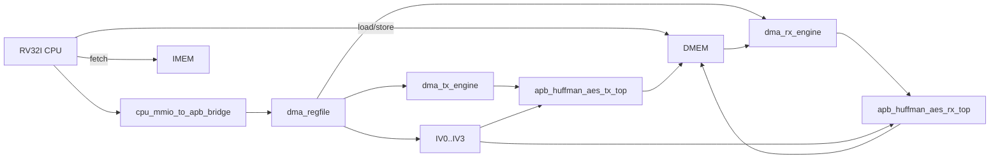
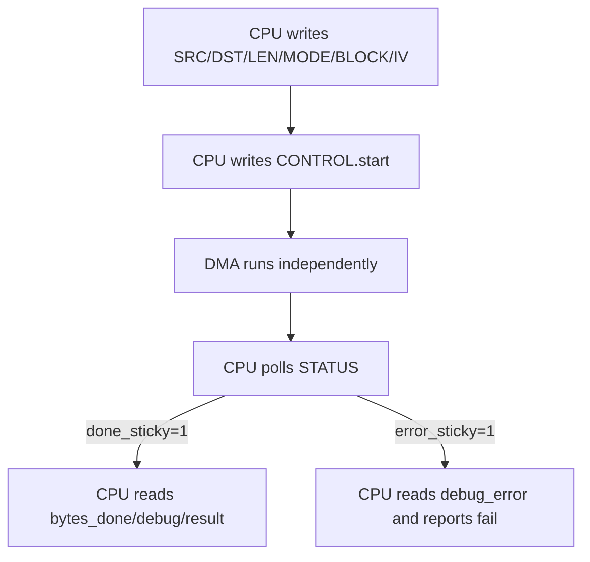
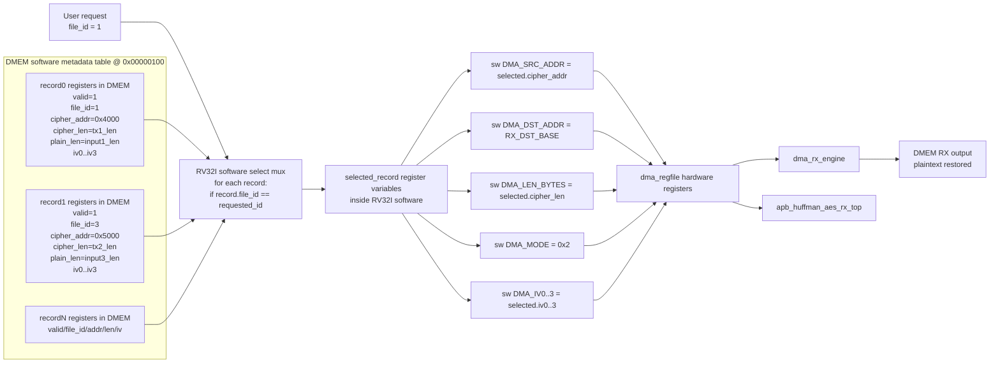
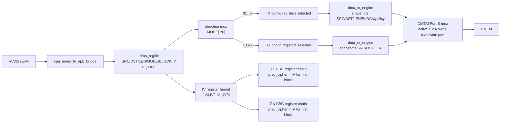

# 29. Defense Q&A And Code Focus Spec

## 1. Purpose

This document is used to print reports.

Goal:

- Point out which parts of the code need to be the most accurate;
- It's better to make a short answer, but ask to be questioned;
- Keep a detailed diagram so, if necessary, you can open the module code immediately.

This document does not replace the `00_current_system_spec.md`.
This is a "backup oral defense" board to respond to errors when the code is asked.

---

## 2. Code Areas To Know Best

If you only have time to learn 5 cum codes, prioritize using this order.

| Priority | Cum code | Why do I have to lie down? |
|---:|---|---|
| 1 | `rv32_soc_top.v` | This is the general diagram of the system. New architectural questions are all about this top-level. |
| 2 | `cpu_mmio_to_apb_bridge.v` + `dma_regfile.v` | This is the control plane: how does the CPU configure DMA, MMIO decode at the beginning, status/read and write at the beginning. |
| 3 | `dma_tx_engine.v` + `dma_rx_engine.v` | This is the real data mover: reads DMEM, goes to accelerator, lays output to DMEM. |
| 4 | `apb_huffman_aes_tx_top.v` + `apb_huffman_aes_rx_top.v` | This is the input/output of TX and RX accelerator from SoC perspective. |
| 5 | `tb_rv32_soc_mmio_dma.v` | This is the main evidence for reporting: end-to-end testcase, throughput, saving, dump file, pass/fail. |

If you get asked again, continue:

| Group | File |
|---|---|
| TX core | `dynamic_huffman_encoder.v`, `bit_packer_128.v`, `wrapper.v` |
| RX core | `huffman_block_parser.v`, `huffman_block_decoder.v`, `bit_depacker_128.v`, `wrapper_rx.v`, `rx_byte_packer_32.v` |
| Software | `test_mmio_dma.c` and `c_files_explained.md` |

---

## 3. Detailed Architecture Diagram

### 3.1 SoC level

### 3.2 TX detailed flow

### 3.3 RX detailed flow

```mermaid
flowchart LR
    SRC["DMEM ciphertext / transport"] --> RXDMA["dma_rx_engine"]
    RXDMA --> RXAPB["apb_huffman_aes_rx_top"]
    RXAPB --> AESW["AES wrapper_rx / CBC decrypt"]
    AESW --> DEPACK["bit_depacker_128"]
    DEPACK --> PARSER["huffman_block_parser"]
    PARSER --> DEC["huffman_block_decoder"]
    DEC --> PACK32["rx_byte_packer_32"]
    PACK32 --> DST["DMEM restored plaintext"]
```

### 3.4 CPU software control flow

### 3.5 Multi-register storage register/mux detail

This diagram is used to answer the question: "If you save input1 as compressed/encrypted,
Then save input3, then how to go back to decoding input1?

Main medical:

- RTL does not need to know "file name"; RV32I software manages metadata registers.
- Have you just registered `file_id`, `cipher_addr`, `cipher_len`, `plain_len`, `mode`,
  `iv0..iv3`.
- When the user selects `file_id`, the software scans the metadata table and mux to register
select, then register the fields into `dma_regfile`.
- `dma_regfile` is the hardware tap register; mux selects the register located in the software
logic/runs using RV32I instructions, not a separate RTL mux.

### 3.6 Hardware register/mux view for one DMA launch

This is the low-level view of how software-written registers become the active
TX/RX datapath selection.

---

## 4. What To Say When Showing Code

### 4.1 `rv32_soc_top.v`

Must be able to say 4 things:

1. This is where the CPU, IMEM, DMEM, MMIO bridge, DMA regfile, TX engine, RX engine, TX accelerator, RX accelerator are located.
2. CPU acts as control plane; accelerator + DMA act as data plane.
3. The MMIO address decode is missing entries to `dma_regfile` and APB-related control/status.
4. The final result still goes back to DMEM for the CPU and testbench to read/verify.

### 4.2 `cpu_mmio_to_apb_bridge.v`

Must be able to say 4 things:

1. The bridge represents an MMIO access of the CPU and an APB access for the peripheral.
2. APB master still follows 3 phases: setup, access, complete.
3. When the CPU is performing MMIO access and the APB is not finished, the pipeline is architecturally held.
4. MMIO readback data is connected to the memory-return path so CPU `lw` reads the register like normal memory.

### 4.3 `dma_regfile.v`

Must be able to say 5 y:

1. This is where the DMA configuration and status are located.
2. CPU registers `SRC_ADDR`, `DST_ADDR`, `LEN_BYTES`, `MODE`, `BLOCK_CFG`, `IV0..IV3`.
3. CPU kicked with `CONTROL.start`.
4. DMA engine updates `busy`, `done_sticky`, `error_sticky`, `bytes_done`.
5. TX exposes `ciphertext_bytes_produced` so RX knows how many ciphertext bytes to read.

### 4.4 `dma_tx_engine.v`

Must be able to say 4 things:

1. TX DMA reads plaintext from DMEM.
2. Then it transfers the data word into the TX APB interface.
3. It does not compress or encode; it is only a data mover.
4. When the TX accelerator generates transport/ciphertext, the data is written to DMEM in the port.

### 4.5 `dma_rx_engine.v`

Must be able to say 4 things:

1. RX DMA reads ciphertext/transport from DMEM.
2. It supplies RX accelerator via APB RX side.
3. When the RX accelerator returns the recovery plaintext, the RX DMA writes back DMEM.
4. Testbench compares RX output with source input to determine pass/fail.

### 4.6 `apb_huffman_aes_tx_top.v`

Must be able to say 4 things:

1. This is the top TX accelerator from a SoC perspective.
2. Inside it says: Huffman encode -> bit pack -> AES/bypass -> output APB/FIFO.
3. There are modes `COMPRESS_ONLY` and `COMPRESS_AES`.
4. Output is the transport/ciphertext that aligns for DMA to write to DMEM.

### 4.7 `apb_huffman_aes_rx_top.v`

Must be able to say 4 things:

1. This is the top of the RX accelerator from an SoC perspective.
2. Inside it says: AES decrypt -> bit depack -> parser -> decoder -> byte pack.
3. It can mirror IV and contract frame arc with TX.
4. The final output is a plaintext 32-bit word stream for RX DMA writes to DMEM.

### 4.8 `tb_rv32_soc_mmio_dma.v`

Must be able to say 5 y:

1. TB loads `input.txt` into DMEM.
2. The TB runs the RV32I program to let the CPU configure the DMA using MMIO that.
3. TB dump 3 vung: source DMEM, TX region, RX region.
4. TB calculates benchmarks: cycles, throughput, compression ratio, storage ratio.
5. TB checks end-to-end with pass/fail lines and `rx_mismatch_count`.

---

## 5. Most Important Oral Questions And Short Answers

### Q1. What is this system?

**Short error response:**

This is an RV32I SoC that the CPU only uses for configuration and sat reduction. Data is moved using DMA, while the encoding/decoding functions/phases are located in the TX and RX accelerators.

**If asked to continue:**

- CPU = control plane
- DMA + accelerator = data plane
- DMEM = contains source, ciphertext, and output

### Q2. Why use DMA, why not let the CPU copy by load/store?

**Short error response:**

If the CPU is allowed to copy each byte, the CPU must both move data and polling accelerator, which is very time consuming. DMA separates data movement from the CPU, so the CPU only configures the transfer and waits for results.

**If asked to continue:**

- Reduce software copy loop
- clear control/data plane
- to expand to make FPGA more practical

### Q3. Does the CPU stall while DMA is running?

**Short error response:**

No global stalls. The CPU is only held while performing MMIO/APB access can for the peripheral to return an error. The DMA engine runs in the background.

**Module can be opened if asked:**

- `cpu_mmio_to_apb_bridge.v`
- `cpu_dma_stall_policy_spec.md`

### Q4. Does APB bridge have 3-phase capacity?

**Short error response:**

Have. At the execution level, the bridge still follows setup -> access -> complete, and holds request/hold CPU until `pready` confirms the transaction is complete.

### Q5. How does TX and RX data travel?

**Short error response:**

TX: DMEM -> TX DMA -> Huffman/AES TX -> DMEM.  
RX: DMEM -> RX DMA -> AES/Huffman RX -> DMEM.

**If asked later:**

- TX sinh ciphertext/transport stream
- RX uses ciphertext bytes to read back and recover the source

### Q6. Why does the TX output go back to DMEM?

**Short error response:**

Because our goal is secure storage. TX does not travel outside the chip in simulation; It registers ciphertext to DMEM to simulate secure storage. The RX then reads the DMEM amendment again to verify the loopback.

### Q7. Input1 can be compressed, but input4 sometimes expands; is that expected?

**Short error response:**

Because Huffman is only effective when distributing skewed characters. If the input appears to be "all symbolic" or has high entropy, header + transport base + AES padding/fixed frame can add up to a larger capacity than the original input.

**Must know 2 numbers:**

- `payload compression`: only see the payload part
- `final storage ratio`: looks after header/frame/AES/transport port

### Q8. Why separate TX-only and RX-only bitstream?

**Short error response:**

Vi full TX+RX on Zynq-7020 is applied during LUT/timing. If you separate it, you'll need to use timing pass and isolation for FPGA demo.

### Q9. What is polling status?

**Short error response:**

The CPU continuously reads `STATUS` in `dma_regfile` to see if `done_sticky` or `error_sticky` has been set. This is the current software control mechanism.

### Q10. Why not use interrupt?

**Short error response:**

The current board prioritizes time and risk control. Polling to debug better in simulation. Interrupt/trap is recommended, but not required to demonstrate SoC architecture and DMA/accelerator capacity.

### Q11. Who is the current IV operator?

**Short error response:**

IV is written by CPU RV32I to registers `IV0..IV3` in `dma_regfile`, then TX and RX are also read back from the regfile for common use in CBC.

### Q12. How is IV created?

**Short error response:**

In the current flow, the CPU calculates IV using RV32I software and then writes it to MMIO. This means that the current IV is a software-provided IV, not a hardware TRNG.

### Q13. Why is raw DUT coverage not 100% yet?

**Short error response:**

Because of some condition/expression and internal toggle only shows very directional properties
rare, know parser/decode error path, fallback decode, AES/Huffman bus
builder's width and memory-array toggle. However, the main test case passed,
raw DUT coverage is over 90%, branch/statement coverage is high, and closed coverage is higher.

### Q14. What do end-to-end results prove?

**Short error response:**

It proves that CPU RV32I configures DMA with MMIO, TX creates ciphertext/transport, RX recovers plaintext, and the final RX data is the same as the original input.

### Q15. Why is `loopback_rx_should_match_input_file` the most important check?

**Short error response:**

Because this is the final proof that the entire TX->storage->RX chain works functionally. If this check fails, the end-to-end secure storage architecture is not in use.

### Q16. If you save input1 as compressed/encrypted, then continue to save input3, can you reset input1 later?

**Short error response:**

Yes, if the RV32I software keeps metadata for each registering board. Metadata required
`file_id`, ciphertext address in DMEM, ciphertext length, plaintext length,
mode and IV. When you want to reset input1, the CPU searches for register `file_id=1`, registers it
`SRC_ADDR`, `DST_ADDR`, `LEN_BYTES`, `MODE=0x2`, `IV0..IV3`, then start RX.

**Available evidence:**

`dma_storage_table_input1_then_input3` da pass: TX input1, TX input3, then
Select register input1 again and RX out plaintext file `input1.txt`.

---

## 6. How To Explain The Main PASS Lines

This is a good short phrase to say on a backup slide or when explaining logs.

| PASS line | Meaning needs to be said |
|---|---|
| `mem_err_o_should_be_zero` | There are no memory/bus errors in the test case. |
| `cpu_should_publish_known_signature` | The CPU finishes running the test program and writes the results to DMEM. |
| `result_signature` | Confirm the end-to-end testcase you want to run. |
| `cpu_error_mask_should_be_zero` | RV32I software does not detect configuration or polling errors. |
| `tx_status_before_start` | TX is in a valid idle state before kicking. |
| `tx_status_after_done` | TX completed and set done content. |
| `tx_ciphertext_bytes_produced_should_match_tx_bytes_done` | The number of ciphertext bytes contained in TX must be equal to the number of DMA bytes to be extracted. |
| `rx_status_after_done` | RX completed and no error reported. |
| `rx_bytes_done_should_match_input_len` | RX recovers the same number of plaintext bytes as the original input. |
| `source_dmem_should_match_input_file` | Input loader into DMEM is empty. |
| `loopback_rx_should_match_input_file` | The plaintext after the loopback is the same as the original input. |
| `tx_ciphertext_region_should_not_be_all_zero` | TX actually creates output, not a false pass. |
| `dma_start_pulse_count` | Compare the times kick DMA is used with flow testcases. |

---

## 7. Code Reading Order Before Defense

If you have little time left, read this in order:

1. [00_current_system_spec.md](/mnt/h/Academic/senior_project/DATN/work/luc/AES_huffman_all6/docs/00_current_system_spec.md)
2. [soc_4_5_end_to_end_report.md](/mnt/h/Academic/senior_project/DATN/work/luc/AES_huffman_all6/docs/soc_4_5_end_to_end_report.md)
3. [report_presentation_guide.md](/mnt/h/Academic/senior_project/DATN/work/luc/AES_huffman_all6/docs/report_presentation_guide.md)
4. [rv32_soc_top.v](/mnt/h/Academic/senior_project/DATN/work/luc/AES_huffman_all6/rtl/rv32_soc_top.v)
5. [cpu_mmio_to_apb_bridge.v](/mnt/h/Academic/senior_project/DATN/work/luc/AES_huffman_all6/rtl/cpu_mmio_to_apb_bridge.v)
6. [dma_regfile.v](/mnt/h/Academic/senior_project/DATN/work/luc/AES_huffman_all6/rtl/dma_regfile.v)
7. [dma_tx_engine.v](/mnt/h/Academic/senior_project/DATN/work/luc/AES_huffman_all6/rtl/dma_tx_engine.v)
8. [dma_rx_engine.v](/mnt/h/Academic/senior_project/DATN/work/luc/AES_huffman_all6/rtl/dma_rx_engine.v)
9. [apb_huffman_aes_tx_top.v](/mnt/h/Academic/senior_project/DATN/work/luc/AES_huffman_all6/rtl/apb_huffman_aes_tx_top.v)
10. [apb_huffman_aes_rx_top.v](/mnt/h/Academic/senior_project/DATN/work/luc/AES_huffman_all6/rtl/apb_huffman_aes_rx_top.v)
11. [tb_rv32_soc_mmio_dma.v](/mnt/h/Academic/senior_project/DATN/work/luc/AES_huffman_all6/tb/tb_rv32_soc_mmio_dma.v)

---

## 8. Latest Numbers To Remember

Latest checked date: **May 10, 2026**.

To keep small when it boils quickly:

| Item | Value |
|---|---:|
| Main end-to-end evidence | `SUMMARY: PASS=18 FAIL=0` for main SoC TX->RX testcase |
| Multi-register storage evidence | `SUMMARY: PASS=22 FAIL=0` for `dma_storage_table_input1_then_input3` |
| Raw DUT full coverage | `93.52%` |
| Closed DUT coverage | `95.90%` after coverage closure |
| Main weak raw areas | RX parser/decoder condition/expression, AES/Huffman wide-bus toggles, dynamic builder memory-array toggles |

If you ask "why not 100% coverage", say:

> Functional end-to-end, MMIO, DMA, TX, RX, error path main pass. What's missing are mainly the internal conditions/expressions and toggles in the parser/decode table, AES/Huffman wide bus and memory-array activity, not the core components of the secure-storage SoC.

---

## 9. Final Advice

High dosage, no need to take each dose of RTL.
Need to sleep:

- data moves to beginning -> to beginning;
- What does CPU do, what does DMA do, what does accelerator do;
- Which test can prove anything?
- What is the current shield and why is it still acceptable for the target audience?
