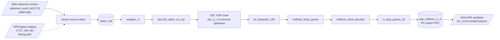

# APB Huffman AES RX Top Specification

## 1. Purpose

`apb_huffman_aes_rx_top` la top-level RX accelerator. Module nay nhan
ciphertext transport word 128-bit, giai ma AES-128 CBC, tach transport bitstream,
decode Huffman, pack lai plaintext thanh word 32-bit va dua ra APB readback FIFO.

Module nay khong tu doc/ghi `DMEM`. `dma_rx_engine` la khoi doc ciphertext tu
`DMEM`, feed RX top, sau do drain plaintext output ve `DMEM`.

Current verification status:

| Case | Coverage/use |
|---|---|
| `dma_compress_aes_input1/input3/alnum63` | Full AES-CBC decrypt + Huffman decode loopback |
| `rx_backpressure_cov` | Stream input/output FIFO backpressure |
| `rx_depacker_packer_direct_cov` | Malformed transport word / depacker edge cases |
| `rx_if_direct_cov` | RX APB output FIFO/status/control behavior |
| `rx_parser_decoder_cov` | Parser/decoder legal mode coverage |
| `rx_parser_decoder_error_direct_cov` | Parser/decoder malformed frame branches |

## 2. Position In RX Path

```text
dma_rx_engine
-> ciphertext 128-bit stream
-> apb_huffman_aes_rx_top
-> RX APB output FIFO
-> dma_rx_engine
```

## 3. Internal Block Diagram



## 4. Main Interfaces

| Interface | Direction | Role |
|---|---|---|
| `ciphertext_word_in[127:0]` | input stream | Ciphertext transport word from `dma_rx_engine` |
| `ciphertext_word_valid` / `ciphertext_word_ready` | handshake | Backpressure between RX DMA and RX top |
| `PSEL/PENABLE/PWRITE/PADDR/PWDATA/PRDATA/PREADY/PSLVERR` | APB | Output/status readback and legacy ciphertext staging |
| `cbc_iv_i[127:0]` | input | CBC IV from `dma_regfile.iv_o` |
| `rx_busy/rx_done/rx_error` | status | Top-level status to SoC |

### 4.1 Full top-level port groups

| Group | Port(s) | Dir | Width | Meaning |
|---|---|---|---:|---|
| Clock/reset | `PCLK` | in | 1 | RX pipeline/APB clock |
| Clock/reset | `PRESETn` | in | 1 | Active-low reset used by APB-style stages and AES wrapper |
| Clock/reset | `rst_i` | in | 1 | Active-high reset used by parser/decoder and local RX state |
| Ciphertext stream | `ciphertext_word_in` | in | 128 | Primary ciphertext transport word from `dma_rx_engine` |
| Ciphertext stream | `ciphertext_word_valid` | in | 1 | Valid qualifier for `ciphertext_word_in` |
| Ciphertext stream | `ciphertext_word_ready` | out | 1 | RX top can accept the current ciphertext word |
| APB slave | `PSEL`, `PENABLE`, `PWRITE` | in | 1 each | APB transaction controls |
| APB slave | `PADDR`, `PWDATA` | in | 32 each | APB local register address and write data |
| APB slave | `PRDATA` | out | 32 | APB read data for `RX_STATUS`, `RX_META`, `RX_DATA`, debug/staging registers |
| APB slave | `PREADY`, `PSLVERR` | out | 1 each | APB completion and error response |
| CBC IV | `cbc_iv_i` | in | 128 | IV for first CBC block, normally `dma_regfile.iv_o` |
| Top status | `rx_busy` | out | 1 | Any RX stage or input/output buffer is active |
| Top status | `rx_done` | out | 1 | Frame done from `rx_byte_packer_32` |
| Top status | `rx_error` | out | 1 | OR of AES path, depacker, parser, decoder, and packer errors |
| Top status | `aes_ready_out` | out | 1 | Raw AES inverse core ready indication |
| Depacker debug | `depacker_busy`, `depacker_done`, `depacker_error` | out | 1 each | `bit_depacker_128` status |
| Parser debug | `parser_busy`, `parser_block_done`, `parser_frame_done`, `parser_error` | out | 1 each | `huffman_block_parser` status |
| Decoder debug | `decoder_busy`, `decoder_block_done`, `decoder_frame_done`, `decoder_error` | out | 1 each | `huffman_block_decoder` status |
| Word-packer debug | `word_packer_busy`, `word_packer_block_done`, `word_packer_frame_done`, `word_packer_error` | out | 1 each | `rx_byte_packer_32` status |
| Transport debug | `transport_word_dbg`, `transport_word_valid_dbg` | out | 128, 1 | CBC plaintext transport buffer visibility |
| Output debug | `rx_word_dbg`, `rx_word_valid_bytes_dbg`, `rx_word_last_in_block_dbg`, `rx_word_last_in_frame_dbg`, `rx_word_valid_dbg` | out | 32, 3, 1, 1, 1 | Plaintext output word and metadata before APB FIFO |

### 4.2 Data/control/status split

| Plane | Signals | Primary owner |
|---|---|---|
| Data input | `ciphertext_word_in`, `ciphertext_word_valid`, `ciphertext_word_ready` | `dma_rx_engine` feeds RX top |
| Control/readback | APB slave signals | `dma_rx_engine` polls and drains RX; CPU/debug can also access through the APB fabric |
| Crypto context | `cbc_iv_i` | `dma_regfile` stores IV selected by firmware |
| Data output | `RX_STATUS`, `RX_META`, `RX_DATA` returned on `PRDATA` | `apb_huffman_rx_if` exposes packed plaintext words |
| Debug/status | `rx_*`, stage `*_busy/*_done/*_error`, debug words | Waveform, FPGA debug, and software-visible observability |

## 5. AES-CBC Behavior

RX decrypts each ciphertext transport word:

```text
P0 = AES_decrypt(C0) XOR IV
Pn = AES_decrypt(Cn) XOR Cn-1
```

State held by RX top:

- current ciphertext accepted by AES
- previous ciphertext for CBC chain
- `rx_cbc_active` to choose IV for the first block

The CBC chain resets on:

- reset
- frame done from `rx_byte_packer_32`

## 6. Output Path

Plaintext transport word after CBC is pushed into `bit_depacker_128`.
Decoded bytes then flow through:

```text
bit_depacker_128
-> huffman_block_parser
-> huffman_block_decoder
-> rx_byte_packer_32
-> apb_huffman_rx_if output FIFO
```

`dma_rx_engine` reads:

- `RX_STATUS`
- `RX_META`
- `RX_DATA`

### 6.1 RX Top Register Interface Summary

| Register / interface | Function | Owner | Note |
|---|---|---|---|
| Direct ciphertext stream | Feed 128-bit AES-CBC ciphertext blocks into RX | `dma_rx_engine` | Primary SoC path; bypasses legacy APB staging registers |
| `RX_STATUS` | Tell DMA whether plaintext FIFO has data/error | `apb_huffman_rx_if` | DMA polls before reading data |
| `RX_META` | Expose valid-byte count and last flags | `apb_huffman_rx_if` | DMA reads before `RX_DATA` |
| `RX_DATA` | Return 32-bit plaintext word | `apb_huffman_rx_if` | Read pops output FIFO head |
| `RX_CONTROL` | Local soft reset for RX APB interface | debug/reset software | Detailed bit field in `apb_huffman_rx_if_spec.md` |
| `CTXT_W0..W3/START/STATUS` | Legacy APB ciphertext staging | legacy/debug flow | Not the main DMA path |

## 7. Error Policy

`rx_error` is asserted if any stage reports error:

- AES path output overwrite
- depacker protocol error
- parser format error
- decoder canonical/Huffman error
- byte packer protocol error

Errors propagate through `apb_huffman_rx_if` status and then into
`dma_rx_engine`.

## 8. Related Specs

- [RX path end-to-end](./rx_path_end_to_end_spec.md)
- [DMA RX engine](./dma_rx_engine_spec.md)
- [Bit depacker 128](./bit_depacker_128_spec.md)
- [IV generation and CBC contract](./iv_generation_and_cbc_contract_spec.md)
