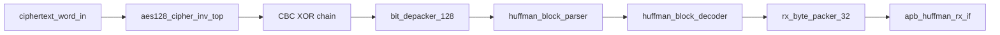

# APB Huffman AES RX Top Specification

## 1. Purpose

`apb_huffman_aes_rx_top` is the top-level RX accelerator. It receives 128-bit ciphertext transport words, performs AES-128 CBC decryption, depacks the transport bitstream, decodes Huffman payload, packs plaintext into 32-bit words, and exposes the result through the APB readback FIFO.

This module does not read or write `DMEM` directly. `dma_rx_engine` reads ciphertext from `DMEM`, feeds RX top, then drains plaintext output back to `DMEM`.

Current verification status:

| Case | Coverage/use |
|---|---|
| `dma_compress_aes_input1/input3/alnum63` | Full AES-CBC decrypt + Huffman decode loopback |
| `rx_backpressure_cov` | Stream input/output FIFO backpressure |
| `rx_depacker_packer_direct_cov` | Malformed transport word / depacker edge cases |
| `rx_if_direct_cov` | RX APB output FIFO/status/control behavior |
| `rx_parser_decoder_cov` | Parser/decoder legal mode coverage |
| `rx_parser_decoder_error_direct_cov` | Parser/decoder malformed frame branches |

## 2. Position In RX Path

```text
dma_rx_engine
-> ciphertext 128-bit stream
-> apb_huffman_aes_rx_top
-> RX APB output FIFO
-> dma_rx_engine
```

## 3. Internal Block Diagram



## 4. Main Interfaces

| Interface | Direction | Width | Data format | Role |
|---|---|---:|---|---|
| `ciphertext_word_in[127:0]` | input stream | 128 | 128-bit ciphertext transport word | Ciphertext transport word from `dma_rx_engine` |
| `ciphertext_word_valid` / `ciphertext_word_ready` | handshake | 1 / 1 | valid/ready | Backpressure between RX DMA and RX top |
| `PSEL/PENABLE/PWRITE/PADDR/PWDATA/PRDATA/PREADY/PSLVERR` | APB | 1 / 1 / 1 / 32 / 32 / 32 / 1 / 1 | APB control + little-endian word | Output/status readback and legacy ciphertext staging |
| `cbc_iv_i[127:0]` | input | 128 | 128-bit IV | CBC IV from `dma_regfile.iv_o` |
| `aes_ready_out` | status | 1 | ready flag | AES decrypt core ready |
| `rx_busy/rx_done/rx_error` | status | 1 / 1 / 1 | busy/done/error flags | Top-level status to SoC |

## 5. AES-CBC Behavior

RX decrypts each ciphertext transport word:

```text
P0 = AES_decrypt(C0) XOR IV
Pn = AES_decrypt(Cn) XOR Cn-1
```

State held by RX top:

- current ciphertext accepted by AES
- previous ciphertext for CBC chain
- `rx_cbc_active` to choose IV for the first block

The CBC chain resets on:

- reset
- frame done from `rx_byte_packer_32`

## 6. Output Path

Plaintext transport word after CBC is pushed into `bit_depacker_128`.
Decoded bytes then flow through:

```text
bit_depacker_128
-> huffman_block_parser
-> huffman_block_decoder
-> rx_byte_packer_32
-> apb_huffman_rx_if output FIFO
```

`dma_rx_engine` reads:

- `RX_STATUS`
- `RX_META`
- `RX_DATA`

### 6.1 RX Top Register Interface Summary

| Register / interface | Function | Owner | Data format / note |
|---|---|---|---|
| Direct ciphertext stream | Feed 128-bit AES-CBC ciphertext blocks into RX | `dma_rx_engine` | 128-bit transport word; primary SoC path, bypasses legacy APB staging registers |
| `RX_STATUS` | Tell DMA whether plaintext FIFO has data/error | `apb_huffman_rx_if` | Bitfield status, DMA polls before reading data |
| `RX_META` | Expose valid-byte count and last flags | `apb_huffman_rx_if` | Small bitfield; DMA reads before `RX_DATA` |
| `RX_DATA` | Return 32-bit plaintext word | `apb_huffman_rx_if` | 32-bit little-endian word; read pops output FIFO head |
| `RX_CONTROL` | Local soft reset for RX APB interface | debug/reset software | Control pulse bitfield; detailed map in `apb_huffman_rx_if_spec.md` |
| `CTXT_W0..W3/START/STATUS` | Legacy APB ciphertext staging | legacy/debug flow | 32-bit staging words plus control/status; not the main DMA path |

### 6.2 Internal RX state

| Register / buffer | Width | Data format | Meaning |
|---|---:|---|---|
| `cipher_buf_data_r` | 128 | 128-bit ciphertext block | Buffered ciphertext waiting for AES input |
| `cipher_buf_valid_r` | 1 | bool | Buffered ciphertext valid flag |
| `aes_ready_dly_r` | 1 | bool | Delayed AES ready tracking |
| `aes_inflight_r` | 1 | bool | AES block currently in flight |
| `aes_path_error_r` | 1 | sticky | AES path error sticky |
| `aes_current_cipher_r` | 128 | 128-bit ciphertext block | Ciphertext currently under AES processing |
| `rx_cbc_chain_r` | 128 | 128-bit CBC chain word | Previous ciphertext for CBC XOR |
| `rx_cbc_active_r` | 1 | bool | CBC chain has been initialized |
| `transport_buf_data_r` | 128 | 128-bit transport word | Buffered transport word after AES/CBC |
| `transport_buf_valid_r` | 1 | bool | Transport buffer valid flag |

### 6.3 Stage and debug outputs

| Port | Direction | Width | Data format | Meaning |
|---|---|---:|---|---|
| `depacker_busy` | out | 1 | busy flag | `bit_depacker_128` busy |
| `depacker_done` | out | 1 | pulse | `bit_depacker_128` done |
| `depacker_error` | out | 1 | error flag | `bit_depacker_128` error |
| `parser_busy` | out | 1 | busy flag | `huffman_block_parser` busy |
| `parser_block_done` | out | 1 | pulse | Parser block done |
| `parser_frame_done` | out | 1 | pulse | Parser frame done |
| `parser_error` | out | 1 | error flag | Parser error |
| `decoder_busy` | out | 1 | busy flag | `huffman_block_decoder` busy |
| `decoder_block_done` | out | 1 | pulse | Decoder block done |
| `decoder_frame_done` | out | 1 | pulse | Decoder frame done |
| `decoder_error` | out | 1 | error flag | Decoder error |
| `word_packer_busy` | out | 1 | busy flag | `rx_byte_packer_32` busy |
| `word_packer_block_done` | out | 1 | pulse | Word packer block done |
| `word_packer_frame_done` | out | 1 | pulse | Word packer frame done |
| `word_packer_error` | out | 1 | error flag | Word packer error |
| `transport_word_dbg` | out | 128 | 128-bit transport frame | Transport word after AES/CBC |
| `transport_word_valid_dbg` | out | 1 | valid flag | Transport debug word valid |
| `rx_word_dbg` | out | 32 | little-endian word | Packed plaintext word debug |
| `rx_word_valid_bytes_dbg` | out | 3 | unsigned byte count | Valid bytes in packed word |
| `rx_word_last_in_block_dbg` | out | 1 | bool | Debug last-in-block flag |
| `rx_word_last_in_frame_dbg` | out | 1 | bool | Debug last-in-frame flag |
| `rx_word_valid_dbg` | out | 1 | valid flag | Packed plaintext debug word valid |

## 7. Error Policy

`rx_error` is asserted if any stage reports error:

- AES path output overwrite
- depacker protocol error
- parser format error
- decoder canonical/Huffman error
- byte packer protocol error

Errors propagate through `apb_huffman_rx_if` status and then into
`dma_rx_engine`.

## 8. Related specs

- [RX path end-to-end](./rx_path_end_to_end_spec.md)
- [DMA RX engine](./dma_rx_engine_spec.md)
- [Bit depacker 128](./bit_depacker_128_spec.md)
- [IV generation and CBC contract](./iv_generation_and_cbc_contract_spec.md)
