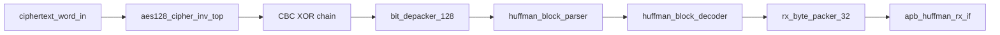

# APB Huffman AES RX Top Specification

## 1. Purpose

`apb_huffman_aes_rx_top` la top-level RX accelerator. Module nay nhan
ciphertext transport word 128-bit, giai ma AES-128 CBC, tach transport bitstream,
decode Huffman, pack lai plaintext thanh word 32-bit va dua ra APB readback FIFO.

Module nay khong tu doc/ghi `DMEM`. `dma_rx_engine` la khoi doc ciphertext tu
`DMEM`, feed RX top, sau do drain plaintext output ve `DMEM`.

## 2. Position In RX Path

```text
dma_rx_engine
-> ciphertext 128-bit stream
-> apb_huffman_aes_rx_top
-> RX APB output FIFO
-> dma_rx_engine
```

## 3. Internal Block Diagram



## 4. Main Interfaces

| Interface | Direction | Role |
|---|---|---|
| `ciphertext_word_in[127:0]` | input stream | Ciphertext transport word from `dma_rx_engine` |
| `ciphertext_word_valid` / `ciphertext_word_ready` | handshake | Backpressure between RX DMA and RX top |
| `PSEL/PENABLE/PWRITE/PADDR/PWDATA/PRDATA/PREADY/PSLVERR` | APB | Output/status readback and legacy ciphertext staging |
| `cbc_iv_i[127:0]` | input | CBC IV from `dma_regfile.iv_o` |
| `rx_busy/rx_done/rx_error` | status | Top-level status to SoC |

## 5. AES-CBC Behavior

RX decrypts each ciphertext transport word:

```text
P0 = AES_decrypt(C0) XOR IV
Pn = AES_decrypt(Cn) XOR Cn-1
```

State held by RX top:

- current ciphertext accepted by AES
- previous ciphertext for CBC chain
- `rx_cbc_active` to choose IV for the first block

The CBC chain resets on:

- reset
- frame done from `rx_byte_packer_32`

## 6. Output Path

Plaintext transport word after CBC is pushed into `bit_depacker_128`.
Decoded bytes then flow through:

```text
bit_depacker_128
-> huffman_block_parser
-> huffman_block_decoder
-> rx_byte_packer_32
-> apb_huffman_rx_if output FIFO
```

`dma_rx_engine` reads:

- `RX_STATUS`
- `RX_META`
- `RX_DATA`

### 6.1 RX Top Register Interface Summary

| Register / interface | Function | Owner | Note |
|---|---|---|---|
| Direct ciphertext stream | Feed 128-bit AES-CBC ciphertext blocks into RX | `dma_rx_engine` | Primary SoC path; bypasses legacy APB staging registers |
| `RX_STATUS` | Tell DMA whether plaintext FIFO has data/error | `apb_huffman_rx_if` | DMA polls before reading data |
| `RX_META` | Expose valid-byte count and last flags | `apb_huffman_rx_if` | DMA reads before `RX_DATA` |
| `RX_DATA` | Return 32-bit plaintext word | `apb_huffman_rx_if` | Read pops output FIFO head |
| `RX_CONTROL` | Local soft reset for RX APB interface | debug/reset software | Detailed bit field in `apb_huffman_rx_if_spec.md` |
| `CTXT_W0..W3/START/STATUS` | Legacy APB ciphertext staging | legacy/debug flow | Not the main DMA path |

## 7. Error Policy

`rx_error` is asserted if any stage reports error:

- AES path output overwrite
- depacker protocol error
- parser format error
- decoder canonical/Huffman error
- byte packer protocol error

Errors propagate through `apb_huffman_rx_if` status and then into
`dma_rx_engine`.

## 8. Related Specs

- [RX path end-to-end](./rx_path_end_to_end_spec.md)
- [DMA RX engine](./dma_rx_engine_spec.md)
- [Bit depacker 128](./bit_depacker_128_spec.md)
- [IV generation and CBC contract](./iv_generation_and_cbc_contract_spec.md)
