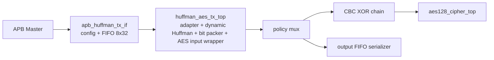
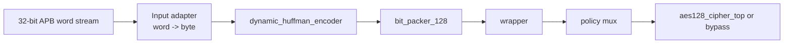

# 09. System Top Specification: `apb_huffman_aes_tx_top`

## 1. Mục đích

`apb_huffman_aes_tx_top` là top-level module ghep noi 3 khoi chính:

1. `apb_huffman_tx_if`: APB slave để cấu hình block, nạp dữ liệu 32-bit và phat lenh bắt đầu.
2. `huffman_aes_tx_top`: chuyen word stream thanh byte stream, mã hóa Huffman dong, đóng gói 128-bit và dua vao wrapper của AES.
3. TX output policy: chọn giua:
   - `COMPRESS_AES`: CBC XOR transport word rồi dua vao `aes128_cipher_top`
   - `COMPRESS_ONLY`: bypass AES và dua transport word thẳng ra output FIFO

Mục tiêu của top này là nhận từng block dữ liệu kích thước 1..32 byte qua giao tiếp APB, nen mỗi block bằng dynamic Huffman, nối tiếp các block do thanh bitstream frame nếu cần, đóng gói thanh transport word 128-bit, sau đó:

- hoặc dua vao CBC + AES core để mã hóa
- hoặc bypass AES để tăng space saving

Trạng thái kiểm chứng hiện tại:

| Case | Coverage/use |
|---|---|
| `tx_compress_only_input1` | TX-only compressed storage path, AES bypass |
| `tx_compress_only_input4_cov` | Whole-file dynamic Huffman with larger log-like input |
| `tx_compress_only_ascii_sweep_cov` | ASCII/symbol coverage and encoder mode diversity |
| `dma_compress_aes_input1/input3/alnum63` | Full `COMPRESS_AES` path through CBC/AES and RX loopback |
| `tx_if_direct_cov` | APB TX interface register/status/error coverage |
| `tx_encoder_direct_cov` | Encoder mode/error coverage without SoC overhead |
| `tx_builder_packer_direct_cov` | Builder/packer corner coverage |

## 2. Sơ đồ khoi



Chỉ tiet dữ liệu ben trong `huffman_aes_tx_top`:



## 3. Pham vi chức năng

Top này phụ trach:

- cung cấp APB slave interface để nạp block dữ liệu;
- giới hạn block tối đa 32 byte;
- chuyển đổi giao tiếp APB/FIFO thanh stream 32-bit rồi byte-stream cho encoder;
- truyền dữ liệu da nen sang AES hoặc bypass AES theo policy `compress_only`;
- xuất các tín hiệu trạng thái tong hop và debug.

Top này không tu giải mã dữ liệu. O cấu hình hiện tại:

- `COMPRESS_AES` dung AES-CBC encrypt-only
- `COMPRESS_ONLY` bo qua AES

## 4. Tham so cấu hình

| Tham so | Mặc định | Ý nghĩa |
|---|---:|---|
| `BLOCK_SIZE_WIDTH` | `6` | Số bit biểu diễn kích thước block. Mặc định hỗ trợ 0..63, thực tế top chấp nhận 1..32 byte. |
| `BUFFER_ADDR_WIDTH` | `5` | Địa chỉ cho bo đếm block 32 phan tu. |
| `SYMBOL_WIDTH` | `8` | Độ rộng ký tự đầu vao. |
| `SYMBOL_COUNT_WIDTH` | `9` | Độ rộng bo đếm số lượng symbol, đủ cho whole-file table 256 symbol. |
| `COUNT_WIDTH` | `6` | Độ rộng tần suất từng symbol. |
| `SYMBOL_INDEX_WIDTH` | `8` | Chỉ muc alphabet byte `0x00..0xFF`. |
| `CODE_LEN_WIDTH` | `5` | Độ rộng do dài mã Huffman. |
| `CODE_WIDTH` | `13` | Độ rộng tối đa của mã Huffman trong FPGA demo hiện tại. |
| `HEADER_BITS_WIDTH` | `12` | Độ rộng bo đếm bit của phan header Huffman. |
| `TOTAL_BITS_WIDTH` | `16` | Độ rộng bo đếm tong số bit dữ liệu sau khi danh gia mode. |
| `CHUNK_DATA_WIDTH` | `32` | Độ rộng chunk bit tu encoder sang packer. |
| `CHUNK_LEN_WIDTH` | `6` | Độ rộng số bit hợp lệ trong mới chunk. |
| `MAX_SYMBOLS_PER_BLOCK` | `32` | So ký tự tối đa trong 1 block. |
| `MAX_TREE_NODES` | `63` | So node tối đa của cay Huffman. |
| `ASCII_MIN` | `8'h20` | Can dưới alphabet mặc định của encoder. |
| `ASCII_MAX` | `8'h7E` | Can trên alphabet mặc định của encoder. |
| `TRANSPORT_WORD_WIDTH` | `128` | Độ rộng word đầu vao AES. |
| `VALID_BITS_WIDTH` | `7` | Số bit can để mã hóa số bit hợp lệ trong payload 120-bit. |
| `AES_KEY_FIXED` | `128'h00112233445566778899AABBCCDDEEFF` | Key AES cố định của wrapper mặc định. |

Ghi chú: per-block path vẫn dung `MAX_SYMBOLS_PER_BLOCK=32` và
`MAX_TREE_NODES=63`. Whole-file path trong `huffman_aes_tx_top` override builder
bằng `FILE_MAX_SYMBOLS=256` và `FILE_MAX_TREE_NODES=511`, vi vay codebook
whole-file hien hỗ trợ full byte alphabet.

## 5. Cổng top-level

### 5.1 Clock và reset

| Cổng | Hướng | Rộng | Định dạng dữ liệu | Mô tả |
|---|---|---:|---|---|
| `PCLK` | in | 1 | `clk` | Clock hệ thống cho APB, pipeline Huffman và AES. |
| `PRESETn` | in | 1 | `rst_n` | Reset active-low, dùng chung cho tat ca submodule trong top. |
| `cbc_iv_i` | in | 128 | 128-bit IV word | IV cho AES-CBC, lay tu `dma_regfile.iv_o`. |

### 5.2 APB slave interface

| Cổng | Hướng | Rộng | Định dạng dữ liệu | Mô tả |
|---|---|---:|---|---|
| `PSEL` | in | 1 | APB select | Chọn slave APB. |
| `PENABLE` | in | 1 | APB enable | Pha enable của APB transaction. |
| `PWRITE` | in | 1 | APB direction | `1`: write, `0`: read. |
| `PADDR` | in | 32 | byte address | Địa chỉ thanh ghi APB. |
| `PWDATA` | in | 32 | little-endian word | Dữ liệu ghi APB. |
| `PRDATA` | out | 32 | little-endian word | Dữ liệu đọc APB. |
| `PREADY` | out | 1 | handshake | Bao APB transfer có thể commit. Có thể bị keo `0` để stall. |
| `PSLVERR` | out | 1 | error flag | Báo lỗi truy cap APB hoặc cấu hình không hợp lệ. |

### 5.3 Đầu ra AES

| Cổng | Hướng | Rộng | Định dạng dữ liệu | Mô tả |
|---|---|---:|---|---|
| `aes_data_out` | out | 128 | 128-bit ciphertext block | Đầu ra ciphertext/kết quả của `aes128_cipher_top`. |
| `aes_ready_out` | out | 1 | ready flag | Tín hiệu `ready` xuất trực tiếp tu AES encrypt core. |

### 5.4 Trạng thái tong hop

| Cổng | Hướng | Rộng | Định dạng dữ liệu | Mô tả |
|---|---|---:|---|---|
| `tx_busy` | out | 1 | busy flag | Pipeline TX dang ban xu ly block hoặc dang cho nhận transport word. |
| `tx_done` | out | 1 | pulse / sticky event | Nếu block hiện tại kết thúc frame thì word cuối đã được wrapper chấp nhận; nếu frame còn tiep thì block hiện tại đã được encoder đây het vao packer. Không dong nghia AES da hoàn tất đầu ra. |
| `tx_error` | out | 1 | error flag | Có lỗi o adapter, encoder hoặc packer. |
| `encoder_busy` | out | 1 | busy flag | Trạng thái busy của `dynamic_huffman_encoder`. |
| `encoder_done` | out | 1 | done pulse | Trạng thái done của `dynamic_huffman_encoder`. |
| `encoder_error` | out | 1 | error flag | Lỗi của `dynamic_huffman_encoder`. |
| `selected_mode_out` | out | 2 | 2-bit mode code | Mode được encoder chọn cho block hiện tại. |
| `fsm_state` | out | 4 | 4-bit state code | State debug của `control_fsm` trong encoder. |
| `packer_busy` | out | 1 | busy flag | Trạng thái busy của `bit_packer_128`. |
| `packer_done` | out | 1 | done pulse | Trạng thái done của `bit_packer_128`. |
| `packer_error` | out | 1 | error flag | Lỗi của `bit_packer_128`. |

### 5.5 Cổng debug

| Cổng | Hướng | Rộng | Định dạng dữ liệu | Mô tả |
|---|---|---:|---|---|
| `transport_word_dbg` | out | 128 | 128-bit transport frame | Word 128-bit tu packer trước khi vao wrapper/AES. |
| `transport_word_valid_dbg` | out | 1 | valid flag | `valid` của transport word. |
| `adapter_error_dbg` | out | 1 | error flag | Lỗi giao thuc/input adapter ben trong `huffman_aes_tx_top`. |
| `apb_start_block_dbg` | out | 1 | pulse | Pulse `start_block` tu APB wrapper vao TX top. |
| `apb_block_size_dbg` | out | `BLOCK_SIZE_WIDTH` | unsigned byte count | Kích thước block dang cấu hình. |
| `apb_word_in_dbg` | out | 32 | little-endian word | Word hien dang xuất tu FIFO APB sang TX top. |
| `apb_word_valid_dbg` | out | 1 | valid flag | `valid` của word stream tu APB wrapper. |
| `apb_word_ready_dbg` | out | 1 | ready flag | `ready` của TX top đối với APB wrapper. |
| `cipher_en_dbg` | out | 1 | pulse | Pulse kich hoat mã hóa AES. |
| `decipher_en_dbg` | out | 1 | debug flag | Debug mode giải mã. Hiện tại luon bằng 0. |
| `chain_en_dbg` | out | 1 | debug flag | Debug mode chaining. Hiện tại luon bằng 0. |
| `data_in_dbg` | out | 128 | 128-bit CBC input block | Dữ liệu 128-bit sau CBC XOR dua vao AES. |
| `key_dbg` | out | 128 | 128-bit AES key | Khoa AES wrapper dua vao AES. |
| `mode_dbg` | out | 4 | legacy mode code | Tín hiệu debug legacy, không chọn mode AES active. |
| `init_vector_dbg` | out | 128 | 128-bit IV mirror | Mirror của `cbc_iv_i`. |
| `segment_len_dbg` | out | 16 | unsigned bit count | Segment length dua tu wrapper ra top. |

## 6. Kiến trúc nội bộ

### 6.1 `apb_huffman_tx_if`

Khoi này cung cấp memory map APB để:

- ghi `block_size`;
- ghi các word dữ liệu 32-bit vao FIFO;
- phat pulse `start_block_o` và thông tin `continue_frame_o`;
- xuất stream `word_in_o/word_valid_o`;
- nhận `word_ready_i`, `tx_busy_i`, `tx_done_i`, `tx_error_i` tu pipeline phia sau;
- giữ các sticky bit `done_sticky_r` và `error_sticky_r`.

FIFO ben trong có độ sâu 8 word, vừa đủ cho 32 byte tối đa.

### 6.2 `huffman_aes_tx_top`

Khoi này gom 4 lop chức năng:

1. Input adapter:
   chuyen `word_in[31:0]` thanh từng byte theo thứ tự `word_in[7:0]`, `word_in[15:8]`, `word_in[23:16]`, `word_in[31:24]`.
2. `dynamic_huffman_encoder`:
   nen block theo 4 pha `collect -> build -> mode decision -> emit`.
3. `bit_packer_128`:
   gộp stream bit thanh `transport_word`; nếu `continue_frame = 1` thì giữ lại bit đủ để noi sang block sau, chỉ flush o block cuối frame.
4. `wrapper`:
   chỉ đây word vao AES khi `aes_ready` = 1.

### 6.3 AES-CBC encrypt core hiện tại

RTL hiện tại không instantiate `AES_top.v` generic trong TX path. Để giảm logic và giữ timing, TX instantiate trực tiếp:

- `aes128_cipher_top`

Wrapper vẫn xuất các tín hiệu debug/legacy:

- `cipher_en`
- `decipher_en`
- `chain_en`
- `data_in`
- `key`
- `mode`
- `init_vector`
- `segment_len[3:0]`

Trong datapath active, CBC được thực hiện ngoài core AES:

```text
C0 = AES_encrypt(P0 XOR IV)
Cn = AES_encrypt(Pn XOR Cn-1)
```

`aes128_cipher_top` chỉ dung:

- `cipher_key`
- `plain_text` da XOR CBC
- `cipher_en`

Vi vay `mode`, `chain_en`, `segment_len` không điều khiển AES that trong SoC
hiện tại. `init_vector_dbg` chỉ dung để quan sat IV dang cap vao chain.

## 7. Hành vi AES/CBC hiện tại

O cấu hình RTL hiện tại, wrapper legacy vẫn được hard-wire như sau:

- `decipher_en = 0`
- `chain_en = 0` trong debug legacy
- `mode = 4'b0000` trong debug legacy
- `segment_len = 16'b0`
- `key = AES_KEY_FIXED`

Khi block input hợp lệ và `aes_ready`, wrapper:

- latched `block_in` vao `data_in`;
- tạo pulse `block_accept = 1`;
- tạo pulse `cipher_en = 1`.

Top-level TX sau đó tính:

```text
tx_aes_plain = transport_word XOR cbc_prev
cbc_prev     = IV cho block dau tien, sau do la ciphertext truoc
```

Chain reset khi reset, soft reset hoặc global clear. Khi AES output hợp lệ,
chain cập nhật bằng ciphertext vừa tạo.

Vi vay top hiện tại có 2 policy:

- `COMPRESS_AES`: Huffman transport word -> AES-128 CBC với key cố định
- `COMPRESS_ONLY`: vẫn nen + đóng gói 128-bit, nhưng bo qua AES

Nói cách khác, TX hiện tại da là CBC wrapper quanh `aes128_cipher_top`, không
còn là ECB-style independent block encryption.

## 8. Memory map APB

| Địa chỉ | Tên | Loại | Định dạng dữ liệu | Mô tả |
|---|---|---|---|---|
| `0x0000_0000` | `START_BLOCK` | W | control pulse | Ghi bit 0 = 1 để phat dong block da nạp xong. Bit 1 = 1 nghĩa là sau block này còn block tiếp theo trong cùng frame AES, nen packer chưa flush o cuối block này. |
| `0x0000_0004` | `BLOCK_SIZE` | R/W | unsigned byte count | Kích thước block tính theo byte, hợp lệ trong khoang 1..32. |
| `0x0000_0008` | `WORD_IN` | W | little-endian 32-bit word | Nạp dữ liệu 32-bit vao FIFO. |
| `0x0000_000C` | `STATUS` | R | bitfield | Trạng thái cấu hình, input và tiên trinh block. |
| `0x0000_0010` | `CONTROL` | R/W | pulse bits | Soft reset và xoa sticky flags. |
| `0x0000_0014` | `DEBUG` | R | counters + pointers | Thông tin FIFO và còn tro nội bộ. |
| `0x0000_0018` | `TX_POLICY` | R/W | policy bits | Bit0=`compress_only` |
| `0x0000_0020` | `AES_OUT_DATA` | R | little-endian 32-bit word | 32-bit word tu output FIFO |
| `0x0000_0024` | `AES_OUT_META` | R | bitfield | Bit0=`last_word`, bit1=`compress_only` |
| `0x0000_0028` | `AES_OUT_STATUS` | R | bitfield | Output FIFO status và `compress_only` mirror |
| `0x0000_002C` | `AES_OUT_DEBUG` | R | counters + pointers | Debug output FIFO |

### 8.1 TX APB Tóm tắt chức năng thanh ghi

| Thanh ghi | Chức năng | Người dùng chính | Định dạng dữ liệu / ghi chú |
|---|---|---|---|
| `START_BLOCK` | Launch one loaded TX block | `dma_tx_engine` | Bit0 starts; bit1 marks that more blocks follow in same AES frame |
| `BLOCK_SIZE` | Declare current plaintext block size | `dma_tx_engine` | Valid `1..32`; must be written before `WORD_IN`/`START_BLOCK` sequence |
| `WORD_IN` | Push 32-bit plaintext word into input FIFO | `dma_tx_engine` | APB can stall if FIFO cannot accept more data |
| `STATUS` | Poll input/output progress | `dma_tx_engine` | `can_start`, `done_sticky`, `error_sticky`, FIFO status live here |
| `CONTROL` | Soft reset or clear sticky flags | `dma_tx_engine`/debug software | Clears wrapper state without changing SoC-level DMA registers |
| `DEBUG` | Inspect input FIFO and wrapper pointers | Debug only | Not part of normal software contract |
| `TX_POLICY` | Select `COMPRESS_AES` or `COMPRESS_ONLY` | `dma_tx_engine` | Bit0 bypasses AES when set |
| `AES_OUT_DATA` | Read 32-bit TX output word | `dma_tx_engine` | Consumed together with output meta/status to write TX result into DMEM |
| `AES_OUT_META` | Read output word metadata | `dma_tx_engine` | Carries last-word and compress-only information for output draining |
| `AES_OUT_STATUS` | Poll TX output FIFO | `dma_tx_engine` | Indicates nonempty/error and mirrors active output policy |
| `AES_OUT_DEBUG` | Inspect output FIFO internals | Debug only | Used for waveform/log diagnosis |

### 8.2 `STATUS` register

| Bit | Tên | Định dạng dữ liệu | Ý nghĩa |
|---:|---|---|---|
| 0 | `cfg_valid` | 1-bit config flag | Da có cấu hình `block_size` hợp lệ. |
| 1 | `input_ready` | 1-bit live flag | Có thể nạp thêm `WORD_IN`. |
| 2 | `block_active` | 1-bit live flag | Block đã được start và dang in-flight trong APB wrapper. |
| 3 | `tx_busy` | 1-bit live flag | Pipeline TX dang ban. |
| 4 | `done_sticky` | 1-bit sticky | Block gần nhất da `tx_done`. |
| 5 | `error_sticky` | 1-bit sticky | Da có lỗi APB/TX. |
| 6 | `fifo_nonempty` | 1-bit live flag | FIFO dang có dữ liệu. |
| 7 | `can_start` | 1-bit live flag | Da nạp đủ word cần thiết, pipeline dang ranh và có thể ghi `START_BLOCK`. |

### 8.3 `TX_POLICY` register

| Bit | Tên | Định dạng dữ liệu | Ý nghĩa |
|---:|---|---|---|
| 0 | `compress_only` | 1-bit policy | `1`: bypass AES, `0`: di qua AES |
| 31:1 | reserved | reserved | Ghi `1` sẽ bao `PSLVERR` |

### 8.4 `CONTROL` register

| Bit | Tên | Định dạng dữ liệu | Ghi `1` để... |
|---:|---|---|---|
| 0 | `soft_reset` | pulse | Xoa FIFO, cấu hình, sticky flags và huy block dang pending trong APB wrapper. |
| 1 | `clear_done` | pulse | Xoa `done_sticky`. |
| 2 | `clear_error` | pulse | Xoa `error_sticky`. |

### 8.5 `DEBUG` register

| Bit | Tên | Định dạng dữ liệu | Ý nghĩa |
|---:|---|---|---|
| `[3:0]` | `fifo_count` | unsigned count | So word dang có trong FIFO. |
| `[7:4]` | `words_expected` | unsigned count | So word can nạp, bằng `ceil(block_size/4)`. |
| `[11:8]` | `words_loaded` | unsigned count | So word da nạp vao FIFO. |
| `[15]` | `stream_active` | bool | Dang stream word tu FIFO vao TX top. |
| `[16]` | `block_inflight` | bool | Block dang active trong APB wrapper. |
| `[19:17]` | `wr_ptr` | FIFO pointer | Còn tro ghi FIFO. |
| `[22:20]` | `rd_ptr` | FIFO pointer | Còn tro đọc FIFO. |
| `[23]` | `compress_only` | policy flag | Mirror của policy hiện tại. |

## 9. Giao thực sự dung APB

Trinh tu khuyến nghị để gửi 1 block:

1. Ghi `BLOCK_SIZE` với giá trị 1..32.
2. Nạp đủ `ceil(block_size / 4)` word vao `WORD_IN`.
3. Poll `STATUS[7] == 1` (`can_start`).
4. Ghi `START_BLOCK` với `PWDATA[0] = 1`.
   Nếu muon nối tiếp thêm block vao cung frame AES, ghi thêm `PWDATA[1] = 1`.
5. Poll `STATUS[4]` hoặc debug output `tx_done`.
6. Nếu cần, kiểm trả `STATUS[5]` hoặc `tx_error`.

Lưu y giao thuc:

- Ghi `BLOCK_SIZE = 0` hoặc `> 32` sẽ báo lỗi.
- Nếu chưa nạp đủ `words_expected`, `START_BLOCK` sẽ bị stall bằng `PREADY = 0`.
- Nếu FIFO đây khi ghi `WORD_IN`, giao dịch có thể bị stall bằng `PREADY = 0`.
- Nếu truy cap sai địa chỉ, `PSLVERR = 1`.

## 10. Thứ tự byte của dữ liệu vao

Mới lần ghi `WORD_IN`, bo chuyển đổi ben trong xem thứ tự byte như sau:

- `word_in[7:0]`   là byte thu 1;
- `word_in[15:8]`  là byte thu 2;
- `word_in[23:16]` là byte thu 3;
- `word_in[31:24]` là byte thu 4.

Nếu block có do dài không chia het cho 4, word cuối chỉ lay số byte thực sự cần thiết.

## 11. Ý nghĩa các tín hiệu trạng thái tong hop

### 11.1 `tx_busy`

`tx_busy` được OR tu các điều kiện:

- block input adapter dang active;
- adapter vẫn còn word dang đếm;
- pulse `start_pending`;
- encoder dang busy;
- packer dang busy;
- packer dang giữ một transport word chưa được wrapper chấp nhận.

No the hien pipeline TX nội bộ chưa thực sự rộng.

### 11.2 `tx_done`

No có nghia:

- nếu `continue_frame = 1` cho block hiện tại:
  - encoder da xuất xong stream cho block hiện tại và packer da nhận xong;
- nếu `continue_frame = 0`:
  - encoder da xuất xong stream cho block hiện tại;
  - packer da đóng gói xong frame hiện tại;
  - transport word cuối đã được wrapper chấp nhận.

No không có nghia:

- `aes_data_out` da chưa ciphertext cuối cùng;
- AES encrypt core da kết thúc xu ly nội bộ.

### 11.3 `tx_error`

`tx_error = adapter_error | encoder_error | packer_error`.

Top không thêm cơ chế retry hay recover tự động. Sau khi có lỗi, APB side can xoa state bằng `CONTROL`.

## 12. Mode nen do encoder chọn

`selected_mode_out` mảng 1 trong 4 giá trị:

| Giá trị | Tên | Mô tả |
|---|---|---|
| `2'b00` | `RAW_FULL` | Header 2 bit, payload raw 32 byte đây đủ. |
| `2'b01` | `RAW_PARTIAL` | Header có thêm thông tin do dài block, payload raw. |
| `2'b10` | `COMPRESSED` | Header chưa symbol list + code length, payload là Huffman bitstream. |
| `2'b11` | `ONE_SYMBOL_COMP` | Toi uu cho block chỉ có 1 symbol, không cần payload data thông thường. |

## 13. Reset behavior

Khi `PRESETn = 0`:

- APB wrapper xoa FIFO, còn tro, config, sticky flags và `start_block_o`;
- TX top xoa adapter state;
- wrapper xoa `block_accept`, `cipher_en`, `data_in`;
- `aes128_cipher_top` reset theo logic nội bộ của no.

Sau reset, top o trạng thái cho cấu hình block mới.

## 14. Giới hạn và ghi chú tích hợp

- Block size hợp lệ chỉ trong khoang 1..32 byte.
- APB wrapper được thiết kế cho tối đa 8 word 32-bit mỗi block.
- Wrapper hiện tại chỉ sử dụng AES encrypt; CBC chaining nằm trong top-level TX,
  không nằm trong `AES_top.v`.
- `segment_len_dbg` là tín hiệu debug/legacy, không anh hướng đến `aes128_cipher_top` active.
- `aes_ready_out` là `ready` của AES core, không phải `tx_done`.
- Các cổng debug là output thuong truc, phụ hop cho testbench và waveform quan sat.

### 14.1 Ghi chú CBC

CBC đã được thêm theo hướng wrapper nhỏ quanh `aes128_cipher_top`. Thiết kế
không quay lại instantiate `AES_top.v` generic để tránh tăng LUT và rui ro
timing.

## 15. Vi đủ dong dữ liệu end-to-end

Với một block 13 byte:

1. Phần mềm ghi `BLOCK_SIZE = 13`.
2. APB wrapper tính `words_expected = ceil(13/4) = 4`.
3. Phần mềm ghi 4 lần vao `WORD_IN`.
4. Khi `STATUS.can_start = 1`, phần mềm ghi `START_BLOCK`.
5. APB wrapper đây 4 word sang TX top theo `word_valid/word_ready`.
6. Adapter tách 13 byte hợp lệ tu 4 word, bo qua 3 byte đủ của word cuối.
7. Encoder quyet dinh mode, phat stream bit.
8. Packer đóng gói stream thanh 1 hoặc nhieu transport word 128-bit.
9. Nếu `COMPRESS_AES`, top XOR transport word với CBC chain rồi dua vao AES khi `aes_ready_out = 1`.
10. Nếu đây là block cuối frame, `tx_done` len khi transport word cuối đã được wrapper chấp nhận.
    Nếu còn block tiếp theo trong frame, `tx_done` len ngay sau khi encoder đây het block hiện tại vao packer.

## 16. Tài liệu lien quan

- RTL top: `rtl/apb_huffman_aes_tx_top.v`
- APB wrapper: `rtl/apb_huffman_tx_if.v`
- APB wrapper spec: `docs/apb_huffman_tx_if_spec.md`
- TX pipeline: `rtl/huffman_aes_tx_top.v`
- AES wrapper: `rtl/wrapper.v`
- AES core active: `rtl/aes128_cipher_top.v`
- AES generic multi-mode core, not active in TX path: `rtl/AES_top.v`
