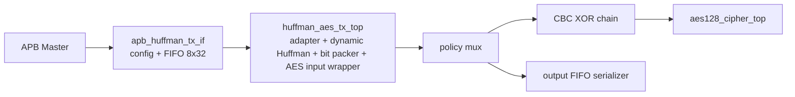
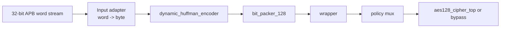

# 09. System Top Specification: `apb_huffman_aes_tx_top`

## 1. Purpose

`apb_huffman_aes_tx_top` is a top-level module that connects 3 main nodes:

1. `apb_huffman_tx_if`: APB slave to configure block, load 32-bit data and issue start command.
2. `huffman_aes_tx_top`: converts word stream to byte stream, synchronized Huffman encoding, 128-bit encapsulation and passes into AES wrapper.
3. TX output policy: choose between:
   - `COMPRESS_AES`: CBC XOR transport word then feed into `aes128_cipher_top`
   - `COMPRESS_ONLY`: bypass AES and send transport words straight to FIFO output

The goal of this top is to receive each 1..32 byte data block via APB interface, connect each block with dynamic Huffman, serialize the blocks by bitstream frame if necessary, encapsulate the 128-bit transport word, then:

- Or import CBC + AES core for encryption
- or bypass AES to increase space saving

Current verification status:

| Case | Coverage/use |
|---|---|
| `tx_compress_only_input1` | TX-only compressed storage path, AES bypass |
| `tx_compress_only_input4_cov` | Whole-file dynamic Huffman with larger log-like input |
| `tx_compress_only_ascii_sweep_cov` | ASCII/symbol coverage and encoder mode diversity |
| `dma_compress_aes_input1/input3/alnum63` | Full `COMPRESS_AES` path through CBC/AES and RX loopback |
| `tx_if_direct_cov` | APB TX interface register/status/error coverage |
| `tx_encoder_direct_cov` | Encoder mode/error coverage without SoC overhead |
| `tx_builder_packer_direct_cov` | Builder/packer corner coverage |

## 2. Khoi diagram



Only set the data in `huffman_aes_tx_top`:



## 3. Functional scope

This top supplement:

- Provide APB slave interface to load data block;
- maximum block limit of 32 bytes;
- convert APB/FIFO communication to 32-bit stream then byte-stream for encoder;
- transmit packed data to AES or bypass AES according to policy `compress_only`;
- Outputs hop and debug status signals.

This top does not decode data. O current configuration:

- `COMPRESS_AES` uses AES-CBC encrypt-only
- `COMPRESS_ONLY` bypasses AES

## 4. Configuration parameters

| Reference | Default | Meaning |
|---|---:|---|
| `BLOCK_SIZE_WIDTH` | `6` | The number of bits represents the block size. Default supports 0..63, in fact top accepts 1..32 bytes. |
| `BUFFER_ADDR_WIDTH` | `5` | Address for block counter 32 parts. |
| `SYMBOL_WIDTH` | `8` | Input character width. |
| `SYMBOL_COUNT_WIDTH` | `9` | Width board counts the number of symbols, enough for a whole-file table of 256 symbols. |
| `COUNT_WIDTH` | `6` | Width frequency of each symbol. |
| `SYMBOL_INDEX_WIDTH` | `8` | Points to the alphabet byte `0x00..0xFF`. |
| `CODE_LEN_WIDTH` | `5` | Width due to long Huffman code. |
| `CODE_WIDTH` | `13` | Maximum width of the Huffman code in the current demo FPGA. |
| `HEADER_BITS_WIDTH` | `12` | Width bit counter of the Huffman header. |
| `TOTAL_BITS_WIDTH` | `16` | Width measures the total number of data bits after entering the mode. |
| `CHUNK_DATA_WIDTH` | `32` | Width chunk bit from encoder to packer. |
| `CHUNK_LEN_WIDTH` | `6` | Width number of valid bits in new chunk. |
| `MAX_SYMBOLS_PER_BLOCK` | `32` | Compare maximum characters in 1 block. |
| `MAX_TREE_NODES` | `63` | So the maximum node of Huffman spicy. |
| `ASCII_MIN` | `8'h20` | Can be below the encoder's default alphabet. |
| `ASCII_MAX` | `8'h7E` | Can on the encoder's default alphabet. |
| `TRANSPORT_WORD_WIDTH` | `128` | AES input word width. |
| `VALID_BITS_WIDTH` | `7` | The number of bits required to encode a valid number of bits in a 120-bit payload. |
| `AES_KEY_FIXED` | `128'h00112233445566778899AABBCCDDEEFF` | Fixed AES key of default wrapper. |

Note: per-block path still uses `MAX_SYMBOLS_PER_BLOCK=32` and
`MAX_TREE_NODES=63`. Whole-file path in `huffman_aes_tx_top` override builder
with `FILE_MAX_SYMBOLS=256` and `FILE_MAX_TREE_NODES=511`, using the codebook
whole-file now supports full byte alphabet.

## 5. Port top-level

### 5.1 Clock and reset

| Port | Direction | Width | Data format | Description |
|---|---|---:|---|---|
| `PCLK` | in | 1 | `clk` | System clock for APB, Huffman pipeline and AES. |
| `PRESETn` | in | 1 | `rst_n` | Reset active-low, common to all submodules in the top. |
| `cbc_iv_i` | in | 128 | 128-bit IV word | IV for AES-CBC, set to `dma_regfile.iv_o`. |

### 5.2 APB slave interface

| Port | Direction | Width | Data format | Description |
|---|---|---:|---|---|
| `PSEL` | in | 1 | APB select | Select APB slave. |
| `PENABLE` | in | 1 | APB enable | The enable phase of the APB transaction. |
| `PWRITE` | in | 1 | APB direction | `1`: write, `0`: read. |
| `PADDR` | in | 32 | byte address | Address of APB register. |
| `PWDATA` | in | 32 | little-endian word | Write data APB. |
| `PRDATA` | out | 32 | little-endian word | Data reads APB. |
| `PREADY` | out | 1 | handshake | Includes APB transfers that can be committed. It can be driven low to stall. |
| `PSLVERR` | out | 1 | error flag | Report error accessing APB or invalid configuration. |

### 5.3 AES output

| Port | Direction | Width | Data format | Description |
|---|---|---:|---|---|
| `aes_data_out` | out | 128 | 128-bit ciphertext block | ciphertext/result output of `aes128_cipher_top`. |
| `aes_ready_out` | out | 1 | ready flag | Signal `ready` output directly from AES encrypt core. |

### 5.4 Synchronization status

| Port | Direction | Width | Data format | Description |
|---|---|---:|---|---|
| `tx_busy` | out | 1 | busy flag | Pipeline TX is issuing block processing or receiving transport words. |
| `tx_done` | out | 1 | pulse / sticky event | If the current block ends the frame, the last word has been accepted by the wrapper; If the frame is still alive, the current block has been encoded and put into the packer. Doesn't mean AES doesn't complete output. |
| `tx_error` | out | 1 | error flag | There is an error in the adapter, encoder or packer. |
| `encoder_busy` | out | 1 | busy flag | Busy status of `dynamic_huffman_encoder`. |
| `encoder_done` | out | 1 | done pulse | Done status of `dynamic_huffman_encoder`. |
| `encoder_error` | out | 1 | error flag | Error of `dynamic_huffman_encoder`. |
| `selected_mode_out` | out | 2 | 2-bit mode code | Mode selected by the encoder for the current block. |
| `fsm_state` | out | 4 | 4-bit state code | State debug of `control_fsm` in encoder. |
| `packer_busy` | out | 1 | busy flag | Busy status of `bit_packer_128`. |
| `packer_done` | out | 1 | done pulse | Done status of `bit_packer_128`. |
| `packer_error` | out | 1 | error flag | Error of `bit_packer_128`. |

### 5.5 Port debug

| Port | Direction | Width | Data format | Description |
|---|---|---:|---|---|
| `transport_word_dbg` | out | 128 | 128-bit transport frame | Word 128-bit from packer before entering wrapper/AES. |
| `transport_word_valid_dbg` | out | 1 | valid flag | `valid` of transport word. |
| `adapter_error_dbg` | out | 1 | error flag | Interface/input adapter error in `huffman_aes_tx_top`. |
| `apb_start_block_dbg` | out | 1 | pulse | Pulse `start_block` from APB wrapper to TX top. |
| `apb_block_size_dbg` | out | `BLOCK_SIZE_WIDTH` | unsigned byte count | Block size is configurable. |
| `apb_word_in_dbg` | out | 32 | little-endian word | Current word exported from APB FIFO to TX top. |
| `apb_word_valid_dbg` | out | 1 | valid flag | `valid` of word stream from APB wrapper. |
| `apb_word_ready_dbg` | out | 1 | ready flag | `ready` of TX top for APB wrapper. |
| `cipher_en_dbg` | out | 1 | pulse | Pulse enables AES encryption. |
| `decipher_en_dbg` | out | 1 | debug flag | Debug mode decoding. Currently it is always equal to 0. |
| `chain_en_dbg` | out | 1 | debug flag | Debug mode chaining. Currently it is always equal to 0. |
| `data_in_dbg` | out | 128 | 128-bit CBC input block | 128-bit data after CBC XOR passes into AES. |
| `key_dbg` | out | 128 | 128-bit AES key | The AES wrapper is imported into AES. |
| `mode_dbg` | out | 4 | legacy mode code | Signal debug legacy, do not select AES active mode. |
| `init_vector_dbg` | out | 128 | 128-bit IV mirror | Mirror of `cbc_iv_i`. |
| `segment_len_dbg` | out | 16 | unsigned bit count | Segment length from wrapper to top. |

## 6. Internal architecture

### 6.1 `apb_huffman_tx_if`

This repository provides APB memory maps to:

- write `block_size`;
- writes 32-bit data words into FIFO;
- pulse `start_block_o` and information `continue_frame_o`;
- output stream `word_in_o/word_valid_o`;
- receive `word_ready_i`, `tx_busy_i`, `tx_done_i`, `tx_error_i` from the following pipeline;
- holds the sticky bits `done_sticky_r` and `error_sticky_r`.

The internal FIFO is 8 words deep, just enough for the maximum 32 bytes.

### 6.2 `huffman_aes_tx_top`

This block collects 4 sets of functions:

1. Input adapter:
Convert `word_in[31:0]` byte by byte in the order `word_in[7:0]`, `word_in[15:8]`, `word_in[23:16]`, `word_in[31:24]`.
2. `dynamic_huffman_encoder`:
block in 4 phases `collect -> build -> mode decision -> emit`.
3. `bit_packer_128`:
aggregate stream bit into `transport_word`; If `continue_frame = 1`, keep enough bits to carry to the next block, only flush on the block at the end of the frame.
4. `wrapper`:
point this word into AES when `aes_ready` = 1.

### 6.3 AES-CBC encrypt core currently

RTL currently does not instantiate the generic `AES_top.v` in the TX path. To reduce logic and keep timing, TX instantiate directly:

- `aes128_cipher_top`

Wrapper still outputs debug/legacy signals:

- `cipher_en`
- `decipher_en`
- `chain_en`
- `data_in`
- `key`
- `mode`
- `init_vector`
- `segment_len[3:0]`

In the active datapath, CBC is performed outside the AES core:

```text
C0 = AES_encrypt(P0 XOR IV)
Cn = AES_encrypt(Pn XOR Cn-1)
```

`aes128_cipher_top` only uses:

- `cipher_key`
- `plain_text` da XOR CBC
- `cipher_en`

Because `mode`, `chain_en`, `segment_len` do not control AES that in the SoC
Present. `init_vector_dbg` is only used to monitor IVs being attached to the chain.

## 7. Current AES/CBC behavior

Owing to the current RTL configuration, the legacy wrapper is still hard-wired as follows:

- `decipher_en = 0`
- `chain_en = 0` in debug legacy
- `mode = 4'b0000` in debug legacy
- `segment_len = 16'b0`
- `key = AES_KEY_FIXED`

When the input block is valid and `aes_ready`, wrapper:

- latched `block_in` into `data_in`;
- create pulse `block_accept = 1`;
- create pulse `cipher_en = 1`.

Top-level TX then calculates:

```text
tx_aes_plain = transport_word XOR cbc_prev
cbc_prev     = IV for the first block, then previous ciphertext
```

Chain reset on reset, soft reset or global clear. When AES output is valid,
chain updated with the newly created ciphertext.

Therefore, the current TX top has two policies:

- `COMPRESS_AES`: Huffman transport word -> AES-128 CBC with fixed key
- `COMPRESS_ONLY`: still produces 128-bit transport packaging, but bypasses AES

In other words, the current TX path is a CBC wrapper around `aes128_cipher_top`, not ECB-style independent block encryption.

## 8. Memory map APB

| Address | Name | Type | Data format | Description |
|---|---|---|---|---|
| `0x0000_0000` | `START_BLOCK` | W | control pulse | Write bit 0 = 1 to generate the block once loaded. Bit 1 = 1 means that after this block there is the next block in the same AES frame, the packer has not yet flushed at the end of this block. |
| `0x0000_0004` | `BLOCK_SIZE` | R/W | unsigned byte count | Block size in bytes, valid in range 1..32. |
| `0x0000_0008` | `WORD_IN` | W | little-endian 32-bit word | Load 32-bit data into FIFO. |
| `0x0000_000C` | `STATUS` | R | bitfield | Configuration state, input and block progress. |
| `0x0000_0010` | `CONTROL` | R/W | pulse bits | Soft reset and remove sticky flags. |
| `0x0000_0014` | `DEBUG` | R | counters + pointers | FIFO occupancy and internal pointers. |
| `0x0000_0018` | `TX_POLICY` | R/W | policy bits | Bit0=`compress_only` |
| `0x0000_0020` | `AES_OUT_DATA` | R | little-endian 32-bit word | 32-bit word from output FIFO |
| `0x0000_0024` | `AES_OUT_META` | R | bitfield | Bit0=`last_word`, bit1=`compress_only` |
| `0x0000_0028` | `AES_OUT_STATUS` | R | bitfield | Output FIFO status and `compress_only` mirror |
| `0x0000_002C` | `AES_OUT_DEBUG` | R | counters + pointers | Debug output FIFO |

### 8.1 TX APB Register function summary

| Register | Function | Primary user | Data format / note |
|---|---|---|---|
| `START_BLOCK` | Launch one loaded TX block | `dma_tx_engine` | Bit0 starts; bit1 marks that more blocks follow in same AES frame |
| `BLOCK_SIZE` | Declare current plaintext block size | `dma_tx_engine` | Valid `1..32`; must be written before `WORD_IN`/`START_BLOCK` sequence |
| `WORD_IN` | Push 32-bit plaintext word into input FIFO | `dma_tx_engine` | APB can stall if FIFO cannot accept more data |
| `STATUS` | Poll input/output progress | `dma_tx_engine` | `can_start`, `done_sticky`, `error_sticky`, FIFO status live here |
| `CONTROL` | Soft reset or clear sticky flags | `dma_tx_engine`/debug software | Clears wrapper state without changing SoC-level DMA registers |
| `DEBUG` | Inspect input FIFO and wrapper pointers | Debug only | Not part of normal software contract |
| `TX_POLICY` | Select `COMPRESS_AES` or `COMPRESS_ONLY` | `dma_tx_engine` | Bit0 bypasses AES when set |
| `AES_OUT_DATA` | Read 32-bit TX output word | `dma_tx_engine` | Consumed together with output meta/status to write TX result into DMEM |
| `AES_OUT_META` | Read output word metadata | `dma_tx_engine` | Carries last-word and compress-only information for output draining |
| `AES_OUT_STATUS` | Poll TX output FIFO | `dma_tx_engine` | Indicates nonempty/error and mirrors active output policy |
| `AES_OUT_DEBUG` | Inspect output FIFO internals | Debug only | Used for waveform/log diagnosis |

### 8.2 `STATUS` register

| Bit | Name | Data format | Meaning |
|---:|---|---|---|
| 0 | `cfg_valid` | 1-bit config flag | The wrapper has a valid `block_size` configuration. |
| 1 | `input_ready` | 1-bit live flag | You can add `WORD_IN`. |
| 2 | `block_active` | 1-bit live flag | The block has been started and is in-flight in the APB wrapper. |
| 3 | `tx_busy` | 1-bit live flag | TX pipeline is busy. |
| 4 | `done_sticky` | 1-bit sticky | Current block has completed (`tx_done`). |
| 5 | `error_sticky` | 1-bit sticky | The wrapper has APB/TX errors. |
| 6 | `fifo_nonempty` | 1-bit live flag | FIFO currently has data. |
| 7 | `can_start` | 1-bit live flag | Loaded with all the necessary words, the pipeline is open and can register `START_BLOCK`. |

### 8.3 `TX_POLICY` register

| Bit | Name | Data format | Meaning |
|---:|---|---|---|
| 0 | `compress_only` | 1-bit policy | `1`: bypass AES, `0`: bypass AES |
| 31:1 | reserved | reserved | Writing `1` raises `PSLVERR` |

### 8.4 `CONTROL` register

| Bit | Name | Data format | Write `1` to... |
|---:|---|---|---|
| 0 | `soft_reset` | pulse | Clear FIFO, configuration, sticky flags and pending block command in APB wrapper. |
| 1 | `clear_done` | pulse | Delete `done_sticky`. |
| 2 | `clear_error` | pulse | Delete `error_sticky`. |

### 8.5 `DEBUG` register

| Bit | Name | Data format | Meaning |
|---:|---|---|---|
| `[3:0]` | `fifo_count` | unsigned count | So word currently exists in FIFO. |
| `[7:4]` | `words_expected` | unsigned count | So word can be loaded, equal to `ceil(block_size/4)`. |
| `[11:8]` | `words_loaded` | unsigned count | So the word is loaded into FIFO. |
| `[15]` | `stream_active` | bool | Input FIFO is streaming words to TX top. |
| `[16]` | `block_inflight` | bool | Block is active in APB wrapper. |
| `[19:17]` | `wr_ptr` | FIFO pointer | Input FIFO write pointer. |
| `[22:20]` | `rd_ptr` | FIFO pointer | Input FIFO read pointer. |
| `[23]` | `compress_only` | policy flag | Mirror of current policy. |

## 9. Actual delivery of APB

Trinh tu's recommendations for sending 1 block:

1. Register `BLOCK_SIZE` with value 1..32.
2. Load enough `ceil(block_size / 4)` words into `WORD_IN`.
3. Poll `STATUS[7] == 1` (`can_start`).
4. Register `START_BLOCK` with `PWDATA[0] = 1`.
If you want to serially add the block to the AES frame arc, add `PWDATA[1] = 1`.
5. Poll `STATUS[4]` or debug output `tx_done`.
6. If necessary, check `STATUS[5]` or `tx_error`.

Note:

- Writing `BLOCK_SIZE = 0` or `> 32` will give an error.
- If `words_expected` is not fully loaded, `START_BLOCK` will be stalled with `PREADY = 0`.
- If the FIFO is here when writing `WORD_IN`, the transaction can be stalled by `PREADY = 0`.
- If accessing the wrong address, `PSLVERR = 1`.

## 10. Byte order of input data

When writing `WORD_IN`, the internal conversion board sees the byte order as follows:

- `word_in[7:0]` is receiver byte 1;
- `word_in[15:8]` is receiver byte 2;
- `word_in[23:16]` is receiver byte 3;
- `word_in[31:24]` is receiver byte 4.

If the block has a length that is not divisible by 4, the last word only contains the number of bytes actually needed.

## 11. Meaning of tong hop status signals

### 11.1 `tx_busy`

`tx_busy` is ORd with the following conditions:

- block input adapter is active;
- The adapter still has words counting;
- pulse `start_pending`;
- encoder is busy;
- packer is busy;
- The packer is holding a transport word that has not been accepted by the wrapper.

The current internal TX pipeline is not really extensive.

### 11.2 `tx_done`

It means:

- if `continue_frame = 1` for current block:
  - The encoder has finished outputting the stream for the current block and the packer has finished receiving;
- if `continue_frame = 0`:
  - The encoder has finished outputting the stream for the current block;
  - the packer has finished packing the current frame;
  - The final transport word has been accepted by the wrapper.

It does not mean:

- `aes_data_out` is already the final ciphertext;
- AES encrypt core has completed internal processing.

### 11.3 `tx_error`

`tx_error = adapter_error | encoder_error | packer_error`.

Top does not add an automatic retry or recovery mechanism. After an error, the APB side can clear the state with `CONTROL`.

## 12. The mode is selected by the encoder

`selected_mode_out` array 1 of 4 values:

| Value | Name | Description |
|---|---|---|
| `2'b00` | `RAW_FULL` | 2 bit header, 32 byte raw payload is enough. |
| `2'b01` | `RAW_PARTIAL` | Header has additional information due to block length and raw payload. |
| `2'b10` | `COMPRESSED` | Header contains symbol list + code length, payload is Huffman bitstream. |
| `2'b11` | `ONE_SYMBOL_COMP` | I hope the block only has 1 symbol, no need for normal payload data. |

## 13. Reset behavior

When `PRESETn = 0`:

- APB wrapper clears FIFOs, pointers, config, sticky flags, and `start_block_o`;
- TX top delete adapter state;
- wrapper erase `block_accept`, `cipher_en`, `data_in`;
- `aes128_cipher_top` resets according to its internal logic.

After reset, the top returns to the state for new block configuration.

## 14. Integrated limits and notes

- Valid block size is only 1..32 bytes.
- The APB wrapper is designed for a maximum of eight 32-bit words per block.
- Wrapper currently only uses AES encryption; CBC chaining is in top-level TX,
is not in `AES_top.v`.
- `segment_len_dbg` is a debug/legacy signal, not an active `aes128_cipher_top` signal.
- `aes_ready_out` is AES core's `ready`, not `tx_done`.
- The debug ports are normal output, supporting the testbench and observation waveform.

### 14.1 CBC Notes

CBC has been added as a small wrapper around `aes128_cipher_top`. Design
Do not return to instantiate `AES_top.v` generic to avoid increasing LUTs and risks
timing.

## 15. Enough data flow end-to-end

With a block of 13 bytes:

1. Software writes `BLOCK_SIZE = 13`.
2. APB wrapper calculates `words_expected = ceil(13/4) = 4`.
3. The software writes 4 times to `WORD_IN`.
4. When `STATUS.can_start = 1`, the software registers `START_BLOCK`.
5. APB wrapper sends 4 words to TX top through `word_valid/word_ready`.
6. The adapter separates 13 valid bytes from 4 words, skipping the last 3 bytes of the last word.
7. The encoder determines the mode and bit stream playback.
8. Packer encapsulates the stream of one or more 128-bit transport words.
9. If `COMPRESS_AES`, top XOR transport word with CBC chain then load into AES when `aes_ready_out = 1`.
10. If this is the last block of the frame, `tx_done` arrives when the last transport word has been accepted by the wrapper.
If there is another block in the frame, `tx_done` inserts the entire block immediately after the encoder into the packer.

## 16. Related documents

- RTL top: `rtl/apb_huffman_aes_tx_top.v`
- APB wrapper: `rtl/apb_huffman_tx_if.v`
- APB wrapper spec: `docs/apb_huffman_tx_if_spec.md`
- TX pipeline: `rtl/huffman_aes_tx_top.v`
- AES wrapper: `rtl/wrapper.v`
- AES core active: `rtl/aes128_cipher_top.v`
- AES generic multi-mode core, not active in TX path: `rtl/AES_top.v`
