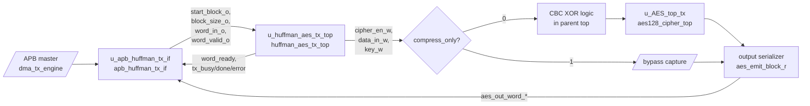
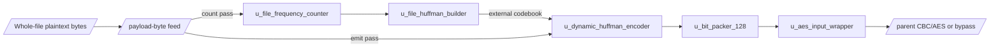

# 09. System Top Specification: `apb_huffman_aes_tx_top`

## 1. Muc dich

`apb_huffman_aes_tx_top` la top-level module ghep noi 3 khoi chinh:

1. `apb_huffman_tx_if`: APB slave de cau hinh block, nap du lieu 32-bit va phat lenh bat dau.
2. `huffman_aes_tx_top`: xu ly payload whole-file, thuc hien whole-file dynamic Huffman trong flow synthesis hien tai, dong goi 128-bit va dua vao wrapper cua AES.
3. TX output policy: chon giua:
   - `COMPRESS_AES`: CBC XOR transport word roi dua vao `aes128_cipher_top`
   - `COMPRESS_ONLY`: bypass AES va dua transport word thang ra output FIFO

Muc tieu cua top nay la nhan tung chunk du lieu kich thuoc 1..32 byte qua giao tiep APB. Trong mode whole-file, cac chunk nay duoc dung cho 2 pass:

- pass 1 dem tan suat toan file;
- pass 2 emit bitstream Huffman dung global codebook.

Sau khi dong goi thanh transport word 128-bit, top:

- hoac dua vao CBC + AES core de ma hoa
- hoac bypass AES de tang space saving

Current verification status:

| Case | Coverage/use |
|---|---|
| `tx_compress_only_input1` | TX-only compressed storage path, AES bypass |
| `tx_compress_only_input4_cov` | Whole-file dynamic Huffman with larger log-like input |
| `tx_compress_only_ascii_sweep_cov` | ASCII/symbol coverage and encoder mode diversity |
| `dma_compress_aes_input1/input3/alnum63` | Full `COMPRESS_AES` path through CBC/AES and RX loopback |
| `tx_if_direct_cov` | APB TX interface register/status/error coverage |
| `tx_encoder_direct_cov` | Encoder mode/error coverage without SoC overhead |
| `tx_builder_packer_direct_cov` | Builder/packer corner coverage |

## 2. So do khoi



Chi tiet du lieu ben trong `huffman_aes_tx_top`:



So do chi tiet hon nam trong
[TX end-to-end spec](./tx_path_end_to_end_spec.md#6-internal-tx-structure).

## 3. Pham vi chuc nang

Top nay phu trach:

- cung cap APB slave interface de nap block du lieu;
- gioi han block toi da 32 byte;
- cap payload bytes cho whole-file count path va emit path cua encoder;
- truyen du lieu da nen sang AES hoac bypass AES theo policy `compress_only`;
- xuat cac tin hieu trang thai tong hop va debug.

Top nay khong tu giai ma du lieu. O cau hinh hien tai:

- `COMPRESS_AES` dung AES-CBC encrypt-only
- `COMPRESS_ONLY` bo qua AES

## 4. Tham so cau hinh

| Tham so | Mac dinh | Y nghia |
|---|---:|---|
| `BLOCK_SIZE_WIDTH` | `6` | So bit bieu dien kich thuoc block. Mac dinh ho tro 0..63, thuc te top chap nhan 1..32 byte. |
| `BUFFER_ADDR_WIDTH` | `5` | Dia chi cho bo dem block 32 phan tu. |
| `SYMBOL_WIDTH` | `8` | Do rong ky tu dau vao. |
| `SYMBOL_COUNT_WIDTH` | `9` | Do rong bo dem so luong symbol, du cho whole-file table 256 symbol. |
| `COUNT_WIDTH` | `6` | Do rong tan suat tung symbol. |
| `SYMBOL_INDEX_WIDTH` | `8` | Chi muc alphabet byte `0x00..0xFF`. |
| `CODE_LEN_WIDTH` | `5` | Do rong do dai ma Huffman. |
| `CODE_WIDTH` | `13` | Do rong toi da cua ma Huffman trong FPGA demo hien tai. |
| `HEADER_BITS_WIDTH` | `12` | Do rong bo dem bit cua phan header Huffman. |
| `TOTAL_BITS_WIDTH` | `16` | Do rong bo dem tong so bit du lieu sau khi danh gia mode. |
| `CHUNK_DATA_WIDTH` | `32` | Do rong chunk bit tu encoder sang packer. |
| `CHUNK_LEN_WIDTH` | `6` | Do rong so bit hop le trong moi chunk. |
| `MAX_SYMBOLS_PER_BLOCK` | `32` | So ky tu toi da trong 1 block. |
| `MAX_TREE_NODES` | `63` | So node toi da cua cay Huffman. |
| `ASCII_MIN` | `8'h20` | Can duoi alphabet mac dinh cua encoder. |
| `ASCII_MAX` | `8'h7E` | Can tren alphabet mac dinh cua encoder. |
| `TRANSPORT_WORD_WIDTH` | `128` | Do rong word dau vao AES. |
| `VALID_BITS_WIDTH` | `7` | So bit can de ma hoa so bit hop le trong payload 120-bit. |
| `AES_KEY_FIXED` | `128'h00112233445566778899AABBCCDDEEFF` | Key AES co dinh cua wrapper mac dinh. |

Ghi chu: per-block path van dung `COUNT_WIDTH=6`, `MAX_SYMBOLS_PER_BLOCK=32`
va `MAX_TREE_NODES=63`. Whole-file path trong `huffman_aes_tx_top` override
builder bang `FILE_COUNT_WIDTH=16`, `FILE_MAX_SYMBOLS=256` va
`FILE_MAX_TREE_NODES=511`, vi vay codebook whole-file hien ho tro full byte
alphabet va dem tan suat tren ca file.

## 5. Cong top-level

### 5.1 Clock va reset

| Cong | Huong | Rong | Mo ta |
|---|---|---:|---|
| `PCLK` | in | 1 | Clock he thong cho APB, pipeline Huffman va AES. |
| `PRESETn` | in | 1 | Reset active-low, dung chung cho tat ca submodule trong top. |
| `cbc_iv_i` | in | 128 | IV cho AES-CBC, lay tu `dma_regfile.iv_o`. |

### 5.2 APB slave interface

| Cong | Huong | Rong | Mo ta |
|---|---|---:|---|
| `PSEL` | in | 1 | Chon slave APB. |
| `PENABLE` | in | 1 | Pha enable cua APB transaction. |
| `PWRITE` | in | 1 | `1`: write, `0`: read. |
| `PADDR` | in | 32 | Dia chi thanh ghi APB. |
| `PWDATA` | in | 32 | Du lieu ghi APB. |
| `PRDATA` | out | 32 | Du lieu doc APB. |
| `PREADY` | out | 1 | Bao APB transfer co the commit. Co the bi keo `0` de stall. |
| `PSLVERR` | out | 1 | Bao loi truy cap APB hoac cau hinh khong hop le. |

### 5.3 Dau ra AES

| Cong | Huong | Rong | Mo ta |
|---|---|---:|---|
| `aes_data_out` | out | 128 | Dau ra ciphertext/ket qua cua `aes128_cipher_top`. |
| `aes_ready_out` | out | 1 | Tin hieu `ready` xuat truc tiep tu AES encrypt core. |

### 5.4 Trang thai tong hop

| Cong | Huong | Rong | Mo ta |
|---|---|---:|---|
| `tx_busy` | out | 1 | Pipeline TX dang ban xu ly block hoac dang cho nhan transport word. |
| `tx_done` | out | 1 | Neu block hien tai ket thuc frame thi word cuoi da duoc wrapper chap nhan; neu frame con tiep thi block hien tai da duoc encoder day het vao packer. Khong dong nghia AES da hoan tat dau ra. |
| `tx_error` | out | 1 | Co loi o adapter, encoder hoac packer. |
| `encoder_busy` | out | 1 | Trang thai busy cua `dynamic_huffman_encoder`. |
| `encoder_done` | out | 1 | Trang thai done cua `dynamic_huffman_encoder`. |
| `encoder_error` | out | 1 | Loi cua `dynamic_huffman_encoder`. |
| `selected_mode_out` | out | 2 | Debug mirror cua encoder block mode; active TX hien luon `2'b10` (`COMPRESSED`). |
| `fsm_state` | out | 4 | State debug cua `control_fsm` trong encoder. |
| `packer_busy` | out | 1 | Trang thai busy cua `bit_packer_128`. |
| `packer_done` | out | 1 | Trang thai done cua `bit_packer_128`. |
| `packer_error` | out | 1 | Loi cua `bit_packer_128`. |

### 5.5 Cong debug

| Cong | Huong | Rong | Mo ta |
|---|---|---:|---|
| `transport_word_dbg` | out | 128 | Word 128-bit tu packer truoc khi vao wrapper/AES. |
| `transport_word_valid_dbg` | out | 1 | `valid` cua transport word. |
| `adapter_error_dbg` | out | 1 | Loi giao thuc/input adapter ben trong `huffman_aes_tx_top`. |
| `apb_start_block_dbg` | out | 1 | Pulse `start_block` tu APB wrapper vao TX top. |
| `apb_block_size_dbg` | out | `BLOCK_SIZE_WIDTH` | Kich thuoc block dang cau hinh. |
| `apb_word_in_dbg` | out | 32 | Word hien dang xuat tu FIFO APB sang TX top. |
| `apb_word_valid_dbg` | out | 1 | `valid` cua word stream tu APB wrapper. |
| `apb_word_ready_dbg` | out | 1 | `ready` cua TX top doi voi APB wrapper. |
| `cipher_en_dbg` | out | 1 | Pulse kich hoat ma hoa AES. |
| `decipher_en_dbg` | out | 1 | Debug mode giai ma. Hien tai luon bang 0. |
| `chain_en_dbg` | out | 1 | Debug mode chaining. Hien tai luon bang 0. |
| `data_in_dbg` | out | 128 | Du lieu 128-bit sau CBC XOR dua vao AES. |
| `key_dbg` | out | 128 | Khoa AES wrapper dua vao AES. |
| `mode_dbg` | out | 4 | Tin hieu debug legacy, khong chon mode AES active. |
| `init_vector_dbg` | out | 128 | Mirror cua `cbc_iv_i`. |
| `segment_len_dbg` | out | 16 | Segment length dua tu wrapper ra top. |

## 6. Kien truc noi bo

### 6.1 `apb_huffman_tx_if`

Khoi nay cung cap memory map APB de:

- ghi `block_size`;
- ghi cac word du lieu 32-bit vao FIFO;
- phat pulse `start_block_o` va thong tin `continue_frame_o`;
- chon `compress_only`, `whole_file_enable`, `whole_file_count_mode`;
- phat `global_clear_o` va `global_build_start_o` cho whole-file dynamic Huffman;
- xuat stream `word_in_o/word_valid_o`;
- nhan `word_ready_i`, `tx_busy_i`, `tx_done_i`, `tx_error_i` tu pipeline phia sau;
- giu cac sticky bit `done_sticky_r` va `error_sticky_r`.

FIFO ben trong co do sau 8 word, vua du cho 32 byte toi da.

### 6.2 `huffman_aes_tx_top`

Khoi nay gom cac lop chuc nang sau:

1. Input adapter:
   chuyen `word_in[31:0]` thanh tung byte theo thu tu `word_in[7:0]`, `word_in[15:8]`, `word_in[23:16]`, `word_in[31:24]`.
2. Whole-file table builder:
   `u_file_frequency_counter` dem tan suat toan file, sau do
   `u_file_huffman_builder` tao symbol list, code length va canonical code.
3. `dynamic_huffman_encoder`:
   nhan byte payload va doc codebook whole-file qua cac port `external_*`; khong
   con dung `mode_decision_logic.v` trong datapath active.
4. `bit_packer_128`:
   gop stream bit thanh `transport_word`; neu `continue_frame = 1` thi giu lai bit du de noi sang block sau, chi flush o block cuoi frame.
5. `wrapper`:
   chi day word vao AES khi `aes_ready` = 1.

### 6.3 AES-CBC encrypt core hien tai

RTL hien tai khong instantiate `AES_top.v` generic trong TX path. De giam logic va giu timing, TX instantiate truc tiep:

- `aes128_cipher_top`

Wrapper van xuat cac tin hieu debug/legacy:

- `cipher_en`
- `decipher_en`
- `chain_en`
- `data_in`
- `key`
- `mode`
- `init_vector`
- `segment_len[3:0]`

Trong datapath active, CBC duoc thuc hien ngoai core AES:

```text
C0 = AES_encrypt(P0 XOR IV)
Cn = AES_encrypt(Pn XOR Cn-1)
```

`aes128_cipher_top` chi dung:

- `cipher_key`
- `plain_text` da XOR CBC
- `cipher_en`

Vi vay `mode`, `chain_en`, `segment_len` khong dieu khien AES that trong SoC
hien tai. `init_vector_dbg` chi dung de quan sat IV dang cap vao chain.

## 7. Hanh vi AES/CBC hien tai

O cau hinh RTL hien tai, wrapper legacy van duoc hard-wire nhu sau:

- `decipher_en = 0`
- `chain_en = 0` trong debug legacy
- `mode = 4'b0000` trong debug legacy
- `segment_len = 16'b0`
- `key = AES_KEY_FIXED`

Khi `block_valid && aes_ready`, wrapper:

- latched `block_in` vao `data_in`;
- tao pulse `block_accept = 1`;
- tao pulse `cipher_en = 1`.

Top-level TX sau do tinh:

```text
tx_aes_plain = transport_word XOR cbc_prev
cbc_prev     = IV cho block dau tien, sau do la ciphertext truoc
```

Chain reset khi reset, soft reset hoac global clear. Khi AES output hop le,
chain cap nhat bang ciphertext vua tao.

Vi vay top hien tai co 2 policy:

- `COMPRESS_AES`: Huffman transport word -> AES-128 CBC voi key co dinh
- `COMPRESS_ONLY`: van nen + dong goi 128-bit, nhung bo qua AES

Noi cach khac, TX hien tai da la CBC wrapper quanh `aes128_cipher_top`, khong
con la ECB-style independent block encryption.

## 8. Memory map APB

| Dia chi | Ten | Loai | Mo ta |
|---|---|---|---|
| `0x0000_0000` | `START_BLOCK` | W | Ghi bit 0 = 1 de phat dong block da nap xong. Bit 1 = 1 nghia la sau block nay con block tiep theo trong cung frame AES, nen packer chua flush o cuoi block nay. |
| `0x0000_0004` | `BLOCK_SIZE` | R/W | Kich thuoc block tinh theo byte, hop le trong khoang 1..32. |
| `0x0000_0008` | `WORD_IN` | W | Nap du lieu 32-bit vao FIFO. |
| `0x0000_000C` | `STATUS` | R | Trang thai cau hinh, input va tien trinh block. |
| `0x0000_0010` | `CONTROL` | R/W | Soft reset, clear sticky flags, whole-file clear/build pulses. |
| `0x0000_0014` | `DEBUG` | R | Thong tin FIFO va con tro noi bo. |
| `0x0000_0018` | `TX_POLICY` | R/W | Bit0=`compress_only`, bit1=`whole_file_enable`, bit2=`whole_file_count_mode` |
| `0x0000_0020` | `AES_OUT_DATA` | R | 32-bit word tu output FIFO |
| `0x0000_0024` | `AES_OUT_META` | R | Bit0=`last_word`, bit1=`compress_only` |
| `0x0000_0028` | `AES_OUT_STATUS` | R | Output FIFO status, output error, policy mirrors |
| `0x0000_002C` | `AES_OUT_DEBUG` | R | Debug output FIFO |

### 8.1 TX APB Register Function Summary

| Register | Function | Primary user | Side effect / note |
|---|---|---|---|
| `START_BLOCK` | Launch one loaded TX block | `dma_tx_engine` | Bit0 starts; bit1 marks that more blocks follow in same AES frame |
| `BLOCK_SIZE` | Declare current plaintext block size | `dma_tx_engine` | Valid `1..32`; must be written before `WORD_IN`/`START_BLOCK` sequence |
| `WORD_IN` | Push 32-bit plaintext word into input FIFO | `dma_tx_engine` | APB can stall if FIFO cannot accept more data |
| `STATUS` | Poll input/output progress | `dma_tx_engine` | `can_start`, `done_sticky`, `error_sticky`, FIFO status live here |
| `CONTROL` | Soft reset, clear sticky flags, whole-file global clear/build | `dma_tx_engine`/debug software | Clears wrapper state or starts global table actions without changing SoC-level DMA registers |
| `DEBUG` | Inspect input FIFO and wrapper pointers | Debug only | Not part of normal software contract |
| `TX_POLICY` | Select `COMPRESS_AES`/`COMPRESS_ONLY` and whole-file count/emit phase | `dma_tx_engine` | Bit0 bypasses AES, bit1 enables whole-file table, bit2 selects count pass |
| `AES_OUT_DATA` | Read 32-bit TX output word | `dma_tx_engine` | Consumed together with output meta/status to write TX result into DMEM |
| `AES_OUT_META` | Read output word metadata | `dma_tx_engine` | Carries last-word and compress-only information for output draining |
| `AES_OUT_STATUS` | Poll TX output FIFO | `dma_tx_engine` | Indicates nonempty/error and mirrors active output policy |
| `AES_OUT_DEBUG` | Inspect output FIFO internals | Debug only | Used for waveform/log diagnosis |

### 8.2 `STATUS` register

| Bit | Ten | Y nghia |
|---:|---|---|
| 0 | `cfg_valid` | Da co cau hinh `block_size` hop le. |
| 1 | `input_ready` | Co the nap them `WORD_IN`. |
| 2 | `block_active` | Block da duoc start va dang in-flight trong APB wrapper. |
| 3 | `tx_busy` | Pipeline TX dang ban. |
| 4 | `done_sticky` | Block gan nhat da `tx_done`. |
| 5 | `error_sticky` | Da co loi APB/TX. |
| 6 | `fifo_nonempty` | FIFO dang co du lieu. |
| 7 | `can_start` | Da nap du word can thiet, pipeline dang ranh va co the ghi `START_BLOCK`. |
| 8 | `global_table_valid` | Whole-file global codebook da valid. |
| 9 | `global_build_busy` | Global Huffman builder dang chay. |
| 10 | `global_build_done` | Global Huffman builder da xong. |
| 11 | `global_build_error` | Loi khi build global Huffman table. |
| 12 | `whole_file_enable` | Mirror cua `TX_POLICY[1]`. |
| 13 | `whole_file_count_mode` | Mirror cua `TX_POLICY[2]`. |

### 8.3 `TX_POLICY` register

| Bit | Ten | Y nghia |
|---:|---|---|
| 0 | `compress_only` | `1`: bypass AES, `0`: di qua AES |
| 1 | `whole_file_enable` | `1`: dung global whole-file codebook path |
| 2 | `whole_file_count_mode` | `1`: pass dem tan suat, `0`: pass emit payload |
| 31:3 | reserved | Ghi `1` se bao `PSLVERR` |

### 8.4 `CONTROL` register

| Bit | Ten | Ghi `1` de... |
|---:|---|---|
| 0 | `soft_reset` | Xoa FIFO, cau hinh, sticky flags va huy block dang pending trong APB wrapper. |
| 1 | `clear_done` | Xoa `done_sticky`. |
| 2 | `clear_error` | Xoa `error_sticky`. |
| 3 | `global_clear` | Clear global whole-file frequency/codebook state. |
| 4 | `global_build_start` | Bat dau build global Huffman table tu frequency table da dem. |
| 31:5 | reserved | Ghi `1` se bao `PSLVERR`. |

### 8.5 `DEBUG` register

| Bit | Ten | Y nghia |
|---:|---|---|
| `[3:0]` | `fifo_count` | So word dang co trong FIFO. |
| `[7:4]` | `words_expected` | So word can nap, bang `ceil(block_size/4)`. |
| `[11:8]` | `words_loaded` | So word da nap vao FIFO. |
| `[15]` | `stream_active` | Dang stream word tu FIFO vao TX top. |
| `[16]` | `block_inflight` | Block dang active trong APB wrapper. |
| `[19:17]` | `wr_ptr` | Con tro ghi FIFO. |
| `[22:20]` | `rd_ptr` | Con tro doc FIFO. |
| `[23]` | `compress_only` | Mirror cua policy hien tai. |
| `[24]` | `whole_file_enable` | Mirror cua whole-file policy. |
| `[25]` | `whole_file_count_mode` | Mirror count/emit phase. |

### 8.6 `AES_OUT_STATUS` register

| Bit | Ten | Y nghia |
|---:|---|---|
| 0 | `out_fifo_nonempty` | Co output word de doc. |
| 1 | `out_fifo_full` | Output FIFO day. |
| 2 | `out_fifo_can_accept` | Output FIFO co the nhan word moi. |
| 7:3 | `out_fifo_count` | So word trong output FIFO. |
| 8 | `head_last_word` | Word dau FIFO la word cuoi frame neu FIFO nonempty. |
| 9 | `aes_out_error_sticky` | Loi output/AES sticky. |
| 10 | `compress_only` | Mirror cua policy hien tai. |
| 11 | `whole_file_enable` | Mirror cua policy whole-file. |

## 9. Giao thuc su dung APB

Trinh tu khuyen nghi de gui 1 block:

1. Ghi `BLOCK_SIZE` voi gia tri 1..32.
2. Nap du `ceil(block_size / 4)` word vao `WORD_IN`.
3. Poll `STATUS[7] == 1` (`can_start`).
4. Ghi `START_BLOCK` voi `PWDATA[0] = 1`.
   Neu muon noi tiep them block vao cung frame AES, ghi them `PWDATA[1] = 1`.
5. Poll `STATUS[4]` hoac debug output `tx_done`.
6. Neu can, kiem tra `STATUS[5]` hoac `tx_error`.

Luu y giao thuc:

- Ghi `BLOCK_SIZE = 0` hoac `> 32` se bao loi.
- Neu chua nap du `words_expected`, `START_BLOCK` se bi stall bang `PREADY = 0`.
- Neu FIFO day khi ghi `WORD_IN`, giao dich co the bi stall bang `PREADY = 0`.
- Neu truy cap sai dia chi, `PSLVERR = 1`.

Whole-file dynamic sequence do `dma_tx_engine` dung:

1. `CONTROL.soft_reset = 1`.
2. `CONTROL.global_clear = 1`.
3. `TX_POLICY = 0x6` de bat `whole_file_enable` va `whole_file_count_mode`.
4. Feed tat ca chunk 1..32 byte cua file bang `BLOCK_SIZE/WORD_IN/START_BLOCK`.
5. `CONTROL.global_build_start = 1`.
6. Poll `STATUS[8]` hoac `STATUS[10]`; neu `STATUS[11]` thi abort.
7. `TX_POLICY = 0x2 | compress_only` de chuyen sang emit pass.
8. Feed lai toan bo file va drain `AES_OUT_STATUS/META/DATA`.

## 10. Thu tu byte cua du lieu vao

Moi lan ghi `WORD_IN`, bo chuyen doi ben trong xem thu tu byte nhu sau:

- `word_in[7:0]`   la byte thu 1;
- `word_in[15:8]`  la byte thu 2;
- `word_in[23:16]` la byte thu 3;
- `word_in[31:24]` la byte thu 4.

Neu block co do dai khong chia het cho 4, word cuoi chi lay so byte thuc su can thiet.

## 11. Y nghia cac tin hieu trang thai tong hop

### 11.1 `tx_busy`

`tx_busy` duoc OR tu cac dieu kien:

- block input adapter dang active;
- adapter van con word dang dem;
- pulse `start_pending`;
- encoder dang busy;
- packer dang busy;
- packer dang giu mot transport word chua duoc wrapper chap nhan.

No the hien pipeline TX noi bo chua thuc su rong.

### 11.2 `tx_done`

No co nghia:

- neu `continue_frame = 1` cho block hien tai:
  - encoder da xuat xong stream cho block hien tai va packer da nhan xong;
- neu `continue_frame = 0`:
  - encoder da xuat xong stream cho block hien tai;
  - packer da dong goi xong frame hien tai;
  - transport word cuoi da duoc wrapper chap nhan.

No khong co nghia:

- `aes_data_out` da chua ciphertext cuoi cung;
- AES encrypt core da ket thuc xu ly noi bo.

### 11.3 `tx_error`

`tx_error = adapter_error | encoder_error | packer_error`.

Top khong them co che retry hay recover tu dong. Sau khi co loi, APB side can xoa state bang `CONTROL`.

## 12. Block Mode

`selected_mode_out` hien luon la `2'b10` trong TX active path. Cac gia tri
khac van duoc RX parser/decoder ho tro de giu compatibility va coverage format
cu, nhung TX khong con tu chon raw/one-symbol theo block.

| Gia tri | Ten | Mo ta |
|---|---|---|
| `2'b00` | `RAW_FULL` | Header 2 bit, payload raw 32 byte day du. |
| `2'b01` | `RAW_PARTIAL` | Header co them thong tin do dai block, payload raw. |
| `2'b10` | `COMPRESSED` | Active TX mode: header chua symbol list + code length, payload la Huffman bitstream. |
| `2'b11` | `ONE_SYMBOL_COMP` | Toi uu cho block chi co 1 symbol, khong can payload data thong thuong. |

## 13. Reset behavior

Khi `PRESETn = 0`:

- APB wrapper xoa FIFO, con tro, config, sticky flags va `start_block_o`;
- TX top xoa adapter state;
- wrapper xoa `block_accept`, `cipher_en`, `data_in`;
- `aes128_cipher_top` reset theo logic noi bo cua no.

Sau reset, top o trang thai cho cau hinh block moi.

## 14. Gioi han va ghi chu tich hop

- Block size hop le chi trong khoang 1..32 byte.
- APB wrapper duoc thiet ke cho toi da 8 word 32-bit moi block.
- Wrapper hien tai chi su dung AES encrypt; CBC chaining nam trong top-level TX,
  khong nam trong `AES_top.v`.
- `segment_len_dbg` la tin hieu debug/legacy, khong anh huong den `aes128_cipher_top` active.
- `aes_ready_out` la `ready` cua AES core, khong phai `tx_done`.
- Cac cong debug la output thuong truc, phu hop cho testbench va waveform quan sat.

### 14.1 Ghi chu CBC

CBC da duoc them theo huong wrapper nho quanh `aes128_cipher_top`. Thiet ke
khong quay lai instantiate `AES_top.v` generic de tranh tang LUT va rui ro
timing.

## 15. Vi du dong du lieu end-to-end

Voi mot block 13 byte:

1. Phan mem ghi `BLOCK_SIZE = 13`.
2. APB wrapper tinh `words_expected = ceil(13/4) = 4`.
3. Phan mem ghi 4 lan vao `WORD_IN`.
4. Khi `STATUS.can_start = 1`, phan mem ghi `START_BLOCK`.
5. APB wrapper day 4 word sang TX top theo `word_valid/word_ready`.
6. Adapter tach 13 byte hop le tu 4 word, bo qua 3 byte du cua word cuoi.
7. Encoder quyet dinh mode, phat stream bit.
8. Packer dong goi stream thanh 1 hoac nhieu transport word 128-bit.
9. Neu `COMPRESS_AES`, top XOR transport word voi CBC chain roi dua vao AES khi `aes_ready_out = 1`.
10. Neu day la block cuoi frame, `tx_done` len khi transport word cuoi da duoc wrapper chap nhan.
    Neu con block tiep theo trong frame, `tx_done` len ngay sau khi encoder day het block hien tai vao packer.

## 16. Tai lieu lien quan

- RTL top: `rtl/apb_huffman_aes_tx_top.v`
- APB wrapper: `rtl/apb_huffman_tx_if.v`
- TX pipeline: `rtl/huffman_aes_tx_top.v`
- AES wrapper: `rtl/wrapper.v`
- AES core active: `rtl/aes128_cipher_top.v`
- AES generic multi-mode core, not active in TX path: `rtl/AES_top.v`
