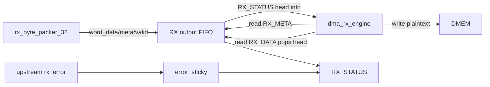

# APB Huffman RX Interface Specification

## 1. Mục đích

`apb_huffman_rx_if` là APB slave nằm trong RX top. No cung cấp:

- output FIFO để `dma_rx_engine` đọc plaintext 32-bit
- status/meta registers
- soft reset control
- legacy ciphertext staging APB registers

Main SoC flow hiện tại feed ciphertext bằng stream 128-bit trực tiếp, nen legacy
ciphertext staging APB không phải đường chính.

Trạng thái kiểm chứng hiện tại:

| Case | Coverage/use |
|---|---|
| `dma_compress_aes_input1/input3/alnum63` | Normal DMA polling of `RX_STATUS`, `RX_META`, `RX_DATA` |
| `rx_if_direct_cov` | FIFO full/empty, control, invalid APB access, legacy staging coverage |
| `rx_backpressure_cov` | FIFO backpressure and delayed APB drain |
| `rx_depacker_packer_direct_cov` | Upstream malformed transport/error sticky visible to DMA/software |

## 1.1 Interface Flow Chart

## 2. RX APB Bản đồ thanh ghi

| Offset | Name | Truy cập | Định dạng dữ liệu | Ý nghĩa |
|---:|---|---|---|---|
| `0x00` | `RX_DATA` | R | little-endian 32-bit word | 32-bit plaintext output word |
| `0x04` | `RX_META` | R | bitfield | valid bytes and last flags for output head |
| `0x08` | `RX_STATUS` | R | bitfield | FIFO/status/sticky flags |
| `0x0C` | `RX_CONTROL` | W | control pulse bitfield | bit0 soft reset, bit1 clear done, bit2 clear error |
| `0x10` | `RX_DEBUG` | R | counters + pointers | FIFO pointers and staging status |
| `0x20..0x2C` | `CTXT_W0..W3` | R/W | 32-bit staging words | legacy ciphertext staging words |
| `0x30` | `CTXT_START` | W | control pulse | legacy staging start |
| `0x34` | `CTXT_STATUS` | R | bitfield | legacy staging status |

### 2.1 RX APB Tóm tắt chức năng thanh ghi

| Thanh ghi | Chức năng | Người dùng chính | Định dạng dữ liệu / ghi chú |
|---|---|---|---|
| `RX_DATA` | Read 32-bit plaintext output word | `dma_rx_engine` | Little-endian 32-bit word; reading pops the output FIFO head |
| `RX_META` | Read valid-byte count and last flags for FIFO head | `dma_rx_engine` | Bitfield sampled before `RX_DATA` for the same head word |
| `RX_STATUS` | Poll output FIFO and sticky state | `dma_rx_engine`/debug software | Bitfield with nonempty/full/error and duplicated head metadata |
| `RX_CONTROL` | Soft reset / clear sticky RX APB state | Debug software or reset flow | Bit0 clears local FIFO/sticky state; bit1 clears done, bit2 clears error |
| `RX_DEBUG` | Inspect FIFO pointers and staging state | Debug only | Counters + pointers; not part of normal software contract |
| `CTXT_W0..W3` | Legacy APB ciphertext staging words | Legacy/debug flow | 32-bit staging words; main SoC flow does not feed ciphertext through these registers |
| `CTXT_START` | Legacy APB ciphertext staging start | Legacy/debug flow | Control pulse; not used by `dma_rx_engine` in current SoC flow |
| `CTXT_STATUS` | Legacy staging status | Legacy/debug flow | Bitfield kept for compatibility/debug |

## 3. Output FIFO Contract

`rx_byte_packer_32` pushes the following fields into the FIFO:

| Trường | Độ rộng | Định dạng dữ liệu | Ý nghĩa |
|---|---:|---|---|
| `rx_word_data_i` | 32 | little-endian 32-bit word | Plaintext output word |
| `rx_word_valid_bytes_i` | 3 | unsigned byte count | Number of valid bytes in the word, `1..4` |
| `rx_word_last_in_block_i` | 1 | bool | Last output word in current block |
| `rx_word_last_in_frame_i` | 1 | bool | Last output word in current frame |
| `rx_word_valid_i` | 1 | valid flag | Word is valid and can be queued |

`apb_huffman_rx_if` stores these fields in FIFO until `dma_rx_engine` reads
`RX_DATA`.

## 4. Thanh ghi Semantics

`RX_STATUS` exposes:

| Bit | Định dạng dữ liệu | Ý nghĩa |
|---:|---|---|
| `0` | 1-bit live flag | output FIFO nonempty |
| `1` | 1-bit live flag | output FIFO full |
| `2` | 1-bit live flag | output FIFO can accept |
| `3` | 1-bit sticky | block done sticky |
| `4` | 1-bit sticky | frame done sticky |
| `5` | 1-bit sticky | error sticky |
| `12:8` | unsigned count | FIFO count |
| `15:13` | unsigned byte count | head valid byte count |
| `16` | 1-bit meta flag | head last-in-block |
| `17` | 1-bit meta flag | head last-in-frame |
| `21:18` | 4-bit stage flags | ciphertext staging valid bits |
| `22` | 1-bit stage flag | ciphertext staging complete |
| `23` | 1-bit stage flag | cipher pending valid |
| `24` | 1-bit stage flag | cipher pending empty |

`RX_META` exposes:

| Bit | Định dạng dữ liệu | Ý nghĩa |
|---:|---|---|
| `2:0` | unsigned byte count | valid byte count |
| `3` | 1-bit meta flag | last-in-block |
| `4` | 1-bit meta flag | last-in-frame |

`RX_DEBUG` exposes:

| Bit | Định dạng dữ liệu | Ý nghĩa |
|---:|---|---|
| `4:0` | unsigned count | FIFO count |
| `8:5` | FIFO pointer | Write pointer |
| `12:9` | FIFO pointer | Read pointer |
| `13` | 1-bit live flag | FIFO nonempty |
| `14` | constant 1 | Debug signature bit |
| `18:15` | 4-bit stage flags | Cipher stage valid bits |
| `19` | 1-bit stage flag | Cipher stage complete |
| `20` | 1-bit stage flag | Cipher pending valid |
| `21` | 1-bit stage flag | Ciphertext word ready |

`CTXT_STATUS` exposes:

| Bit | Định dạng dữ liệu | Ý nghĩa |
|---:|---|---|
| `3:0` | 4-bit stage flags | Cipher stage valid bits |
| `4` | 1-bit stage flag | Cipher stage complete |
| `5` | 1-bit stage flag | Cipher pending valid |
| `6` | 1-bit stage flag | Cipher pending empty |
| `7` | 1-bit stage flag | Ciphertext word ready |

`RX_CONTROL` exposes:

| Bit | Định dạng dữ liệu | Ý nghĩa |
|---:|---|---|
| `0` | pulse | Soft reset local FIFO/sticky state |
| `1` | pulse | Clear done sticky |
| `2` | pulse | Clear error sticky |
| `31:3` | reserved | Reserved; writing 1 is invalid |

`CTXT_START` exposes:

| Bit | Định dạng dữ liệu | Ý nghĩa |
|---:|---|---|
| `0` | pulse | Legacy ciphertext staging start |
| `31:1` | reserved | Reserved; writing 1 is invalid |

## 5. Internal State / FIFO

| Thanh ghi / FIFO | Độ rộng | Định dạng dữ liệu | Ý nghĩa |
|---|---:|---|---|
| `fifo_data_mem` | 16 x 32 | little-endian words | FIFO storage for output data |
| `fifo_valid_bytes_mem` | 16 x 3 | unsigned byte count | Valid-byte metadata per FIFO entry |
| `fifo_last_block_mem` | 16 x 1 | bool | Last-in-block flag per FIFO entry |
| `fifo_last_frame_mem` | 16 x 1 | bool | Last-in-frame flag per FIFO entry |
| `wr_ptr_r` | 4 | FIFO pointer | Write pointer |
| `rd_ptr_r` | 4 | FIFO pointer | Read pointer |
| `fifo_count_r` | 5 | unsigned count | Number of FIFO entries queued |
| `block_done_sticky_r` | 1 | sticky | Block done sticky |
| `frame_done_sticky_r` | 1 | sticky | Frame done sticky |
| `error_sticky_r` | 1 | sticky | Error sticky |
| `cipher_stage_word0_r` | 32 | little-endian word | Ciphertext staging word 0 |
| `cipher_stage_word1_r` | 32 | little-endian word | Ciphertext staging word 1 |
| `cipher_stage_word2_r` | 32 | little-endian word | Ciphertext staging word 2 |
| `cipher_stage_word3_r` | 32 | little-endian word | Ciphertext staging word 3 |
| `cipher_stage_valid_r` | 4 | bitfield | Per-word ciphertext staging valid flags |
| `cipher_pending_word_r` | 128 | 128-bit transport frame | Pending ciphertext transport word |
| `cipher_pending_valid_r` | 1 | valid flag | Pending ciphertext word valid |

## 6. Main DMA Usage

`dma_rx_engine` uses:

1. read `RX_STATUS`
2. if nonempty, read `RX_META`
3. read `RX_DATA`
4. write data to `DMEM`

`RX_DATA` read pops the FIFO head.

## 7. Điều kiện lỗi

The interface raises sticky error on:

- invalid output valid byte count
- frame-last without block-last
- invalid APB writes
- upstream RX error

## 8. Spec liên quan

- [RX path end-to-end](./rx_path_end_to_end_spec.md)
- [APB Huffman AES RX top](./apb_huffman_aes_rx_top_spec.md)
- [RX byte packer 32](./rx_byte_packer_32_spec.md)
