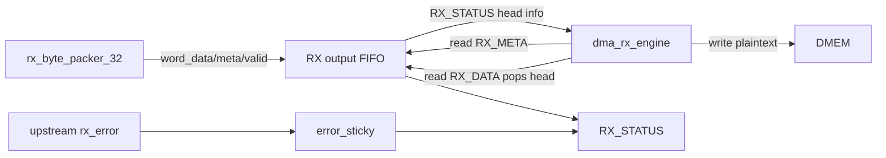

# APB Huffman RX Interface Specification

## 1. Purpose

`apb_huffman_rx_if` la APB slave nam trong RX top. No cung cap:

- output FIFO de `dma_rx_engine` doc plaintext 32-bit
- status/meta registers
- soft reset control
- legacy ciphertext staging APB registers

Main SoC flow hien tai feed ciphertext bang stream 128-bit truc tiep, nen legacy
ciphertext staging APB khong phai duong chinh.

Current verification status:

| Case | Coverage/use |
|---|---|
| `dma_compress_aes_input1/input3/alnum63` | Normal DMA polling of `RX_STATUS`, `RX_META`, `RX_DATA` |
| `rx_if_direct_cov` | FIFO full/empty, control, invalid APB access, legacy staging coverage |
| `rx_backpressure_cov` | FIFO backpressure and delayed APB drain |
| `rx_depacker_packer_direct_cov` | Upstream malformed transport/error sticky visible to DMA/software |

## 1.1 Interface Flow Chart

## 2. RX APB Register Map

| Offset | Name | Access | Meaning |
|---:|---|---|---|
| `0x00` | `RX_DATA` | R | 32-bit plaintext output word |
| `0x04` | `RX_META` | R | valid bytes and last flags for output head |
| `0x08` | `RX_STATUS` | R | FIFO/status/sticky flags |
| `0x0C` | `RX_CONTROL` | W | bit0 soft reset |
| `0x10` | `RX_DEBUG` | R | FIFO pointers and staging status |
| `0x20..0x2C` | `CTXT_W0..W3` | R/W | legacy ciphertext staging words |
| `0x30` | `CTXT_START` | W | legacy staging start |
| `0x34` | `CTXT_STATUS` | R | legacy staging status |

### 2.1 RX APB Register Function Summary

| Register | Function | Primary user | Side effect / note |
|---|---|---|---|
| `RX_DATA` | Read 32-bit plaintext output word | `dma_rx_engine` | Reading this register pops the output FIFO head |
| `RX_META` | Read valid-byte count and last flags for FIFO head | `dma_rx_engine` | Must be sampled before `RX_DATA` for the same head word |
| `RX_STATUS` | Poll output FIFO and sticky state | `dma_rx_engine`/debug software | Provides nonempty/full/error and duplicated head metadata |
| `RX_CONTROL` | Soft reset RX APB FIFO/sticky state | Debug software or reset flow | Bit0 clears local FIFO/sticky state |
| `RX_DEBUG` | Inspect FIFO pointers and staging state | Debug only | Not part of normal software contract |
| `CTXT_W0..W3` | Legacy APB ciphertext staging words | Legacy/debug flow | Main SoC flow does not feed ciphertext through these registers |
| `CTXT_START` | Legacy APB ciphertext staging start | Legacy/debug flow | Not used by `dma_rx_engine` in current SoC flow |
| `CTXT_STATUS` | Legacy staging status | Legacy/debug flow | Kept for compatibility/debug |

## 3. Output FIFO Contract

`rx_byte_packer_32` pushes:

- `rx_word_data_i`
- `rx_word_valid_bytes_i`
- `rx_word_last_in_block_i`
- `rx_word_last_in_frame_i`
- `rx_word_valid_i`

`apb_huffman_rx_if` stores these fields in FIFO until `dma_rx_engine` reads
`RX_DATA`.

## 4. Register Semantics

`RX_STATUS` exposes:

| Bit | Meaning |
|---:|---|
| `0` | output FIFO nonempty |
| `1` | output FIFO full |
| `2` | output FIFO can accept |
| `3` | block done sticky |
| `4` | frame done sticky |
| `5` | error sticky |
| `12:8` | FIFO count |
| `15:13` | head valid byte count |
| `16` | head last-in-block |
| `17` | head last-in-frame |

`RX_META` exposes:

| Bit | Meaning |
|---:|---|
| `2:0` | valid byte count |
| `3` | last-in-block |
| `4` | last-in-frame |

## 5. Main DMA Usage

`dma_rx_engine` uses:

1. read `RX_STATUS`
2. if nonempty, read `RX_META`
3. read `RX_DATA`
4. write data to `DMEM`

`RX_DATA` read pops the FIFO head.

## 6. Error Conditions

The interface raises sticky error on:

- invalid output valid byte count
- frame-last without block-last
- invalid APB writes
- upstream RX error

## 7. Related Specs

- [RX path end-to-end](./rx_path_end_to_end_spec.md)
- [APB Huffman AES RX top](./apb_huffman_aes_rx_top_spec.md)
- [RX byte packer 32](./rx_byte_packer_32_spec.md)
