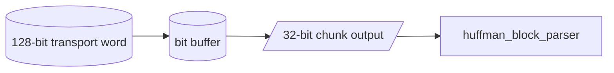

# Bit Depacker 128 Specification

## 1. Purpose

`bit_depacker_128` la khoi RX doi xung voi `bit_packer_128` ben TX. No nhan
transport word 128-bit sau AES-CBC decrypt va tach thanh stream bit chunk 32-bit
cho `huffman_block_parser`.

Current verification status:

| Case | Coverage/use |
|---|---|
| `dma_compress_aes_input1/input3/alnum63` | Normal depack path after AES-CBC decrypt |
| `rx_depacker_packer_direct_cov` | Invalid `valid_bits`, malformed transport frame, and direct pack/depack edge chunks |
| `rx_parser_decoder_error_direct_cov` | Error propagation into parser/decoder stack |

## 2. Transport Word Format

Transport word gom:

| Field | Width | Meaning |
|---|---:|---|
| `frame_last` | 1 | Word cuoi cua frame |
| `valid_bits` | 7 | So bit payload hop le trong word |
| `payload` | 120 | Bitstream payload |

`valid_bits` phai:

- khac zero
- bang `120` neu chua phai word cuoi
- nho hon hoac bang `120` neu la word cuoi

## 3. Data Flow

## 4. Input Contract

Input handshake:

- `transport_word_in`
- `transport_word_valid`
- `transport_word_ready`

RX top chi day word moi khi depacker co kha nang nhan va khong co error.

## 5. Output Contract

Output handshake:

- `stream_data[31:0]`
- `stream_len[5:0]`
- `stream_valid`
- `stream_last`
- `stream_ready`

`stream_data[0]` la bit som nhat cua chunk. Thu tu nay phai khop voi TX
packer va Huffman parser.

## 6. Frame Completion

Khi gap transport word co `frame_last = 1`:

- depacker emit toan bo bit con lai
- chunk cuoi co `stream_last = 1`
- sau khi downstream accept chunk cuoi, `done` pulse 1 cycle

## 7. Error Conditions

`error_flag` duoc set khi:

- `valid_bits = 0`
- non-final word co `valid_bits != 120`
- final word co `valid_bits > 120`
- append chunk lam tran buffer noi bo

## 8. Related Specs

- [APB Huffman AES RX top](./apb_huffman_aes_rx_top_spec.md)
- [RX path end-to-end](./rx_path_end_to_end_spec.md)
- [Huffman block parser](./huffman_block_parser_spec.md)
