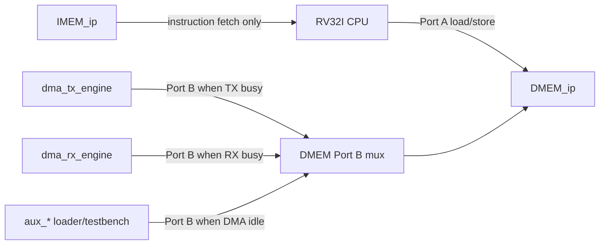

# 03. BRAM and Port Usage Specification

## 1. Purpose

This document is correct:

- What BRAM is the system using?
- What type of BRAM is configured?
- Which port goes to which point?
- Which port is being used in flows `RV32I sync` and `SoC sync`;
- Which port is legacy, not used for final SoC direction.

The goal is to avoid mistakes:

- old flow core sync;
- flow SoC sync using BRAM to FPGA;
- Current SoC direction has integrated DMA/TX/RX.

## 2. Scope

This spec applies to the following modules:

- `imem_sync`
- `dmem_sync_wrab`
- `dmem_ip_wrapper`
- `DMEM_ip`
- `rv32_soc_top`

This document does not describe the DMA/TX/RX APB protocol only. This indicates the small distribution and ownership of BRAM ports.

Current status:

| Item | Status |
|---|---|
| IMEM init | `sim/instruction.mem` created with `make compile C_SRC=...` |
| Simulation input load | `test_bench` loads `+INPUT_FILE` into DMEM Port B when DMA idle |
| FPGA input load | `uart_dmem_loader` loads the payload into DMEM Port B before releasing the CPU reset |
| DMA ownership | TX/RX DMA monitors DMEM Port B when engine is busy |
| Clean regression | included in `34/34` PASS baseline |

## 2.1 Port Ownership Flow Chart

## 3. Overview of memory stores

| Khoi | Module | Ash role | Status |
|---|---|---|---|
| IMEM sync model | `imem_sync` | Synchronous command memory for CPU | Using |
| DMEM sync legacy | `dmem_sync_wrab` + `dmem_sync` | Data storage space for old smoke test core | Legacy |
| DMEM SoC wrapper | `dmem_ip_wrapper` | Wrapper for dual-port BRAM | Direction used for SoC |
| DMEM SoC model | `DMEM_ip` | Behavioral model for Vivado BRAM IP | Direction used for SoC |

## 4. IMEM

### 4.1 Module in use

`imem_sync`

### 4.2 Role

- not yet program `RV32I`
- only serves instruction fetch
- CPU reads, no master receives two
- runtime write to unused IMEM; The program is loaded via `instruction.mem` / Vivado IMEM init

### 4.3 Configure the logic to be latched

| Medicinal properties | Value | Data format |
|---|---|---|
| Type | Single-port synchronous instruction memory | Word-addressed 32-bit instruction storage |
| Read width | 32 bit | One RV32I instruction word |
| Write width | Not used in current model | N/A in the active model |
| Current Depth | 2048 words | `2048 x 32-bit` words |
| Current capacity | 8 KB | `8192` bytes of instruction storage |
| Read latency | 1 cycle | Registered synchronous read |
| Init file | `instruction.mem` | Hex memory image |
| There is an output register | Understanding is equivalent to 1 output register | 32-bit registered instruction output |
| Byte write enable | Do not use | N/A |

### 4.4 Module ports

| Port | Direction | Width | Data format | Description |
|---|---|---:|---|---|
| `clk_i` | in | 1 | Free-running clock | Clock IMEM |
| `en_i` | in | 1 | Boolean enable | Enable reading |
| `instr_addr_i` | in | 11 | Word address | Address word |
| `instruction_o` | out | 32 | RV32I instruction word | Lenh reads out after 1 cycle |

### 4.5 Ports used in the system

In `rv32_soc_top`, the CPU connects to IMEM as follows:

| Signal CPU | Connect to IMEM | Data format | Note |
|---|---|---|---|
| `imem_en_o` | `en_i` | Boolean enable | CPU IF stage turns on reading |
| `imem_addr_o[12:2]` | `instr_addr_i` | Word address | Cat the 2 low bits to convert byte address to word index |
| `imem_instr_i` | `instruction_o` | RV32I instruction word | The CPU receives instructions after 1 cycle |

### 4.6 Port usage rules

- IMEM has only 1 port and is designated for CPU fetch
- Do not use this port for DMA
- Do not use IMEM to store runtime data
- If later replaced with Vivado BRAM IP, the sync read behavior must be kept for 1 cycle

### 4.7 Vivado configuration recommendations

| Medicinal properties | Recommended value |
|---|---|
| Interface | Native |
| Memory type | Single Port ROM or Single Port RAM |
| Read width | 32 |
| Depth | 2048 words or larger if needed |
| Enable pin | ON |
| Mode | `READ_FIRST` |
| Output register | OFF in the first round |
| Read latency | 1 |
| Byte write enable | OFF |
| Init file | ON |

### 4.8 Internal storage / helper state

| Storage / signal | Width | Data format | Meaning |
|---|---:|---|---|
| `instructions_r` | 2048 x 32 | Hex instruction memory image | Simulation-only instruction storage array |
| `instruction_r` | 32 | RV32I instruction word | Registered instruction output in non-Vivado simulation |
| `i` | integer | Loop index | Initialisation loop index for `$readmemh` setup |

## 5. DMEM legacy for core smoke test

### 5.1 Module

- `dmem_sync_wrab`
- `dmem_sync`

### 5.2 Role

This is the old DMEM line used for the core sync simple le testbench.

It has the following points:

- single-port
- Merge 4 8-bit banks into 32-bit bars
- byte write enable each byte
- There is no port B

### 5.3 Status

- Only used for old smoke test cores
- Not recommended for SoC orientation with DMA
- This should not be considered the final DMEM of the system

### 5.4 Reasons not to use for final SoC

- No dual-ports
- CPU and DMA cannot be separated
- This image does not show the full configuration of Vivado's BRAM IP

### 5.5 Module ports legacy

| Port | Direction | Width | Data format | Description |
|---|---|---:|---|---|
| `clka` | in | 1 | Free-running clock | Clock of legacy DMEM |
| `ena` | in | 1 | Boolean enable | Enable read/write |
| `wea` | in | 4 | Byte write mask | One bit for the new 8-bit bank |
| `addra` | in | 8 | Byte address | Address bytes in each bank |
| `dina` | in | 32 | Little-endian 32-bit word | Data registers 4 lanes |
| `douta` | out | 32 | Little-endian 32-bit word | Data reads 4 lanes |

### 5.6 Internal storage / helper state

| Storage / signal | Width | Data format | Meaning |
|---|---:|---|---|
| `dmem_uut0.mem` .. `dmem_uut3.mem` | 4 x `256 x 8` | Byte-addressed 8-bit memory arrays | Four legacy byte-wide banks that together form one 32-bit word |
| `dmem_uut0.douta` .. `dmem_uut3.douta` | 4 x 8 | Registered byte lane output | Byte lanes returned by each underlying `dmem_sync` instance |
| `i` | integer | Loop index | Initialisation index in each `dmem_sync` instance |

## 6. DMEM for SoCs

### 6.1 Module is running

- `dmem_ip_wrapper`
- `DMEM_ip`

### 6.2 Role

DMEM is the system's main data memory:

- CPU reads/writes data normally
- DMA reads the source buffer
- DMA writes destination buffer
- Later, you can let the UART loader or PS/Zynq use the secondary port

### 6.3 Configure the logic to be latched

| Medicinal properties | Value | Data format |
|---|---|---|
| Type | True dual-port RAM | Dual-port 32-bit byte-addressed memory |
| Port number | 2 | One CPU port, one auxiliary port |
| Clock | Common clock | Shared clock domain |
| Data width per port | 32 bit | 32-bit little-endian word |
| Byte write enable | 4 bits per port | One mask bit per byte lane |
| Address mode | `BYTE_ADDRESS` | Byte-oriented external address space |
| Read mode | `READ_FIRST` | Synchronous read returns old data on write collision |
| Read latency | 1 cycle | Registered synchronous read |
| Current Depth | 8192 words | `8192 x 32-bit` storage words |
| Current capacity | 32 KB | `32768` bytes of data memory |

### 6.4 Module ports wrapper

#### Port A: CPU

| Port | Direction | Width | Data format | Description |
|---|---|---:|---|---|
| `cpu_en_i` | in | 1 | Boolean enable | Enable of CPU |
| `cpu_we_i` | in | 4 | Byte write mask | Byte write enable |
| `cpu_addr_i` | in | 32 | Byte address | Byte address |
| `cpu_wdata_i` | in | 32 | Little-endian 32-bit word | Write data |
| `cpu_rdata_o` | out | 32 | Little-endian 32-bit word | Data is read after 1 cycle |

#### Port B: auxiliary master

| Port | Direction | Width | Data format | Description |
|---|---|---:|---|---|
| `aux_en_i` | in | 1 | Boolean enable | Enable secondary port |
| `aux_we_i` | in | 4 | Byte write mask | Byte write enable |
| `aux_addr_i` | in | 32 | Byte address | Byte address |
| `aux_wdata_i` | in | 32 | Little-endian 32-bit word | Write data |
| `aux_rdata_o` | out | 32 | Little-endian 32-bit word | Data is read after 1 cycle |

### 6.5 Ownership of each port

| Port | Owner in SoC direction | Purpose |
|---|---|---|
| Port A | CPU | load/store data normally |
| Port B | DMA | read/write buffer for TX/RX |

During the bring-up phase, Port B may be temporarily due to:

- testbench
- UART loader
- PS/Zynq

used, but can only have **one valid owner at a time**.

### 6.6 Mapping in `rv32_soc_top`

| Signal in `rv32_soc_top` | Connect to wrapper | Data format | Owner |
|---|---|---|---|
| `dmem_en_w` | `cpu_en_i` | Boolean enable | CPU |
| `dmem_we_w[3:0]` | `cpu_we_i` | Byte write mask | CPU |
| `dmem_addr_w[31:0]` | `cpu_addr_i` | Byte address | CPU |
| `dmem_wdata_w[31:0]` | `cpu_wdata_i` | Little-endian 32-bit word | CPU |
| `dmem_rdata_w[31:0]` | `cpu_rdata_o` | Little-endian 32-bit word | CPU |
| `aux_en_i` | `aux_en_i` | Boolean enable | DMA/loader |
| `aux_we_i[3:0]` | `aux_we_i` | Byte write mask | DMA/loader |
| `aux_addr_i[31:0]` | `aux_addr_i` | Byte address | DMA/loader |
| `aux_wdata_i[31:0]` | `aux_wdata_i` | Little-endian 32-bit word | DMA/loader |
| `aux_rdata_o[31:0]` | `aux_rdata_o` | Little-endian 32-bit word | DMA/loader |

### 6.7 Address rules

- DMEM receives **byte address** on both ports
- Internal word alignment is handled by flashing the lower 2 bits when accessing the byte array
- `wea/web[3:0]` decides which bytes are written

He passed:

- `sb`, `sh`, `sw` can be shared as one word
- DMA currently prioritizes 32-bit aligned transfers
- The CPU still retains byte/halfword access via `we[3:0]`

### 6.8 Simultaneous rules

DMEM is dual-port:

- CPU can use Port A while DMA can use Port B
- The CPU does not need to stall just because the DMA is busy

But the software still must ensure:

- The CPU does not read/write into the DMA buffer that is being processed
- Do not create a race on the data area

### 6.9 Vivado configuration recommendations

| Medicinal properties | Recommended value |
|---|---|
| Interface | Native |
| Memory type | True Dual Port RAM |
| Common clock | ON |
| Port A width | 32/32 |
| Port B width | 32/32 |
| Byte write enable | ON |
| Byte size | 8 |
| `wea/web` | 4 bit |
| Address mode | `BYTE_ADDRESS` |
| Mode A | `READ_FIRST` |
| Mode B | `READ_FIRST` |
| Enable pin | `ENA`, `ENB` |
| Output register | OFF in the first round |
| ECC | OFF |
| Depth | 8192 words |

### 6.10 Internal address translation / helper wires

| Signal | Width | Data format | Meaning |
|---|---:|---|---|
| `unused_addr_bits_w` | 1 | Boolean alignment check | Flags illegal high/low address bits before word-address conversion |
| `cpu_word_addr_w` | 13 | Word address | CPU byte address `[14:2]` converted for `DMEM_ip` |
| `aux_word_addr_w` | 13 | Word address | Auxiliary byte address `[14:2]` converted for `DMEM_ip` |

## 7. Rules for using ports in the system

### 7.1 Which port is for CPU?

- Single IMEM port
- DMEM Port A

CPU not used:

- DMEM Port B in normal SoC orientation
- output FIFO or internal BRAM of TX/RX as a regular RAM

### 7.2 Which port is suitable for DMA?

- DMEM Port B

DMA must not be used:

- IMEM port
- DMEM Port A

### 7.3 Which port is used for testbench / loader?

During bring-up or debug, `aux_*` can be caused by:

- testbench
- UART loader
- PS/Zynq

temporary stay. When DMA is integrated, the default owner of `aux_*` must be DMA.

## 8. Implementation rules need to be kept

1. Do not change IMEM to async read.
2. No change to single-port DMEM SoC.
3. Do not cover the write enable byte of DMEM.
4. Do not change DMEM to the word-addressed interface on the upper layer.
5. Do not add DMA and loader to `aux_*` if there is no arbiter.

## 9. Enter the direction for the files

| File | Ash role | Should you use it or not? |
|---|---|---|
| `rtl/imem_sync.v` | IMEM sync model | Have |
| `rtl/dmem_sync_wrab.v` | DMEM legacy for core smoke | Not for final SoC |
| `rtl/dmem_ip_wrapper.v` | Wrapper dual-port DMEM | Have |
| `rtl/DMEM_ip.v` | DMEM IP behavioral model | Available in SoC sim |
| `rtl/rv32_soc_top.v` | Top connects the CPU to IMEM/DMEM | Have |

## 10. Conclusion

The system needs to latch in the following direction:

- `IMEM`: single-port sync, only for CPU fetch
- `DMEM`: true dual-port sync, Port A for CPU, Port B for DMA
- `dmem_sync_wrab`: just the old flow for smoke testing, not the final DMEM

If this rule is kept, the next step is to add DMA to `aux_*` of `rv32_soc_top` without changing the memory architecture anymore.
