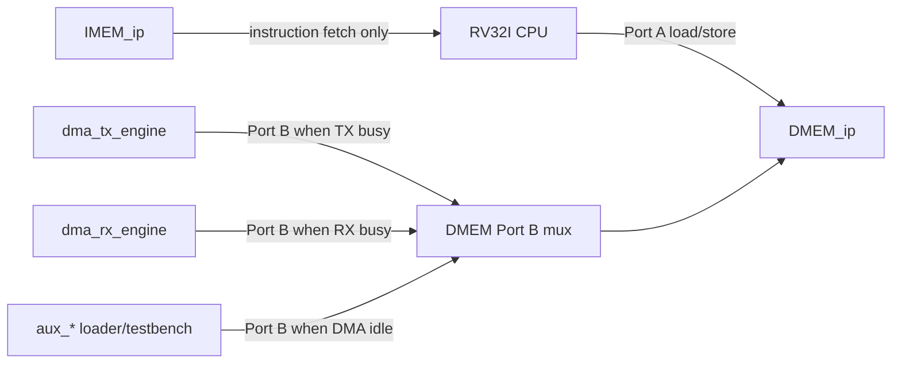

# 03. BRAM and Port Usage Specification

## 1. Muc dich

Tai lieu nay chot ro:

- he thong dang dung nhung khoi BRAM nao;
- moi BRAM duoc cau hinh theo kieu nao;
- port nao thuoc ve khoi nao;
- port nao dang dung trong flow `RV32I sync` va `SoC sync`;
- port nao la legacy, khong dung cho huong SoC cuoi.

Muc tieu la tranh nham lan giua:

- flow core sync cu;
- flow SoC sync dung BRAM gan voi FPGA;
- huong SoC hien tai da tich hop DMA/TX/RX.

## 2. Pham vi

Spec nay ap dung cho cac module sau:

- `imem_sync`
- `dmem_sync_wrab`
- `dmem_ip_wrapper`
- `DMEM_ip`
- `rv32_soc_top`
- `rv32_soc_fpga_demo_top`
- `uart_dmem_loader`

Tai lieu nay khong mo ta chi tiet protocol APB cua DMA/TX/RX. No chi chot phan bo nho va ownership cua cac port BRAM.

Trang thai hien tai:

| Item | Status |
|---|---|
| IMEM init | `sim/instruction.mem` tao bang `make compile C_SRC=...` |
| Simulation input load | `test_bench` nap `+INPUT_FILE` vao DMEM Port B khi DMA idle |
| FPGA input load | `uart_dmem_loader` nap payload vao DMEM Port B truoc khi release CPU reset |
| DMA ownership | TX/RX DMA chiem DMEM Port B khi engine busy |
| Historical clean regression | included in `34/34` PASS baseline before secure-storage API refactor |

## 2.1 Port Ownership Flow Chart

## 3. Tong quan cac khoi bo nho

| Khoi | Module | Vai tro | Trang thai |
|---|---|---|---|
| IMEM sync model | `imem_sync` | Bo nho lenh dong bo cho CPU | Dang dung |
| DMEM sync legacy | `dmem_sync_wrab` + `dmem_sync` | Bo nho data don gian cho smoke test core cu | Legacy |
| DMEM SoC wrapper | `dmem_ip_wrapper` | Wrapper cho dual-port BRAM | Huong dung cho SoC |
| DMEM SoC model | `DMEM_ip` | Model hanh vi cho Vivado BRAM IP | Huong dung cho SoC |

## 4. IMEM

### 4.1 Module dang dung

`imem_sync`

### 4.2 Vai tro

- chua chuong trinh `RV32I`
- chi phuc vu instruction fetch
- CPU doc, khong co master thu hai
- runtime write vao IMEM chua duoc dung; chuong trinh duoc nap qua `instruction.mem` / Vivado IMEM init

### 4.3 Cau hinh logic can chot

| Thuoc tinh | Gia tri |
|---|---|
| Kieu | Single-port synchronous instruction memory |
| Read width | 32 bit |
| Write width | khong dung trong model hien tai |
| Depth hien tai | 2048 words |
| Dung luong hien tai | 8 KB |
| Read latency | 1 cycle |
| Init file | `instruction.mem` |
| Co output register | Hieu ung tuong duong 1 thanh ghi output |
| Byte write enable | Khong dung |

### 4.4 Cong module

| Cong | Huong | Rong | Mo ta |
|---|---|---:|---|
| `clk_i` | in | 1 | Clock IMEM |
| `en_i` | in | 1 | Enable doc |
| `instr_addr_i` | in | 11 | Dia chi word |
| `instruction_o` | out | 32 | Lenh doc ra sau 1 cycle |

### 4.5 Cac port dung trong he thong

Trong `rv32_soc_top`, CPU noi vao IMEM nhu sau:

| Tin hieu CPU | Noi vao IMEM | Ghi chu |
|---|---|---|
| `imem_en_o` | `en_i` | CPU IF stage bat doc |
| `imem_addr_o[12:2]` | `instr_addr_i` | Cat bo 2 bit thap de doi byte address sang word index |
| `imem_instr_i` | `instruction_o` | CPU nhan instruction sau 1 cycle |

### 4.6 Quy tac dung port

- IMEM chi co 1 port va chi danh cho CPU fetch
- khong dung port nay cho DMA
- khong dung IMEM de luu data runtime
- neu sau nay thay bang Vivado BRAM IP, phai giu hanh vi sync read 1 cycle

### 4.7 Khuyen nghi cau hinh Vivado

| Thuoc tinh | Gia tri khuyen nghi |
|---|---|
| Interface | Native |
| Memory type | Single Port ROM hoac Single Port RAM |
| Read width | 32 |
| Depth | 2048 words hoac lon hon neu can |
| Enable pin | ON |
| Mode | `READ_FIRST` |
| Output register | OFF o vong dau |
| Read latency | 1 |
| Byte write enable | OFF |
| Init file | ON |

## 5. DMEM legacy cho core smoke test

### 5.1 Module

- `dmem_sync_wrab`
- `dmem_sync`

### 5.2 Vai tro

Day la duong DMEM cu dung cho testbench core sync don le.

No co cac dac diem:

- single-port
- ghep 4 bank 8-bit thanh 32-bit
- byte write enable tung byte
- khong co port B

### 5.3 Trang thai

- chi nen dung cho smoke test core cu
- khong nen dung cho huong SoC co DMA
- khong duoc coi day la DMEM cuoi cung cua he thong

### 5.4 Ly do khong dung cho SoC cuoi

- khong co dual-port
- khong phan tach duoc CPU va DMA
- khong phan anh day du cau hinh BRAM IP cua Vivado

## 6. DMEM cho SoC

### 6.1 Module dang chot

- `dmem_ip_wrapper`
- `DMEM_ip`

### 6.2 Vai tro

DMEM la bo nho data chinh cua he thong:

- CPU doc/ghi data binh thuong
- DMA doc source buffer
- DMA ghi destination buffer
- UART loader/testbench co the nap input qua port phu khi DMA idle hoac truoc khi CPU release reset

### 6.3 Cau hinh logic can chot

| Thuoc tinh | Gia tri |
|---|---|
| Kieu | True dual-port RAM |
| So port | 2 |
| Clock | Common clock |
| Data width moi port | 32 bit |
| Byte write enable | 4 bit moi port |
| Address mode | `BYTE_ADDRESS` |
| Read mode | `READ_FIRST` |
| Read latency | 1 cycle |
| Depth hien tai | 8192 words |
| Dung luong hien tai | 32 KB |

### 6.4 Cong module wrapper

#### Port A: CPU

| Cong | Huong | Rong | Mo ta |
|---|---|---:|---|
| `cpu_en_i` | in | 1 | Enable cua CPU |
| `cpu_we_i` | in | 4 | Byte write enable |
| `cpu_addr_i` | in | 32 | Byte address |
| `cpu_wdata_i` | in | 32 | Du lieu ghi |
| `cpu_rdata_o` | out | 32 | Du lieu doc sau 1 cycle |

#### Port B: auxiliary master

| Cong | Huong | Rong | Mo ta |
|---|---|---:|---|
| `aux_en_i` | in | 1 | Enable port phu |
| `aux_we_i` | in | 4 | Byte write enable |
| `aux_addr_i` | in | 32 | Byte address |
| `aux_wdata_i` | in | 32 | Du lieu ghi |
| `aux_rdata_o` | out | 32 | Du lieu doc sau 1 cycle |

### 6.5 Ownership cua tung port

| Port | Owner trong huong SoC | Muc dich |
|---|---|---|
| Port A | CPU | load/store data binh thuong |
| Port B | DMA | doc/ghi buffer cho TX/RX |

Trong giai doan bring-up, Port B co the tam thoi do:

- testbench
- UART loader
- PS/Zynq

su dung, nhung chi duoc co **mot owner hieu luc tai mot thoi diem**.

### 6.6 Mapping trong `rv32_soc_top`

| Tin hieu trong `rv32_soc_top` | Noi vao wrapper | Owner |
|---|---|---|
| `dmem_en_w` | `cpu_en_i` | CPU |
| `dmem_we_w[3:0]` | `cpu_we_i` | CPU |
| `dmem_addr_w[31:0]` | `cpu_addr_i` | CPU |
| `dmem_wdata_w[31:0]` | `cpu_wdata_i` | CPU |
| `dmem_rdata_w[31:0]` | `cpu_rdata_o` | CPU |
| `aux_en_i` | `aux_en_i` | DMA/loader |
| `aux_we_i[3:0]` | `aux_we_i` | DMA/loader |
| `aux_addr_i[31:0]` | `aux_addr_i` | DMA/loader |
| `aux_wdata_i[31:0]` | `aux_wdata_i` | DMA/loader |
| `aux_rdata_o[31:0]` | `aux_rdata_o` | DMA/loader |

### 6.7 Quy tac dia chi

- DMEM nhan **byte address** o ca 2 port
- canh word noi bo duoc xu ly bang cach bo 2 bit thap khi truy cap mang byte
- `wea/web[3:0]` quyet dinh byte nao duoc ghi

He qua:

- `sb`, `sh`, `sw` co the chia se cung mot word
- DMA hien tai uu tien transfer 32-bit aligned
- CPU van giu kha nang byte/halfword access qua `we[3:0]`

### 6.8 Quy tac dong thoi

DMEM la dual-port nen:

- CPU co the dung Port A trong luc DMA dung Port B
- CPU khong can stall chi vi DMA dang busy

Nhung phan mem van phai dam bao:

- CPU khong doc/ghi vao buffer ma DMA dang xu ly
- khong tao race tren cung vung data

### 6.9 Khuyen nghi cau hinh Vivado

| Thuoc tinh | Gia tri khuyen nghi |
|---|---|
| Interface | Native |
| Memory type | True Dual Port RAM |
| Common clock | ON |
| Port A width | 32/32 |
| Port B width | 32/32 |
| Byte write enable | ON |
| Byte size | 8 |
| `wea/web` | 4 bit |
| Address mode | `BYTE_ADDRESS` |
| Mode A | `READ_FIRST` |
| Mode B | `READ_FIRST` |
| Enable pin | `ENA`, `ENB` |
| Output register | OFF o vong dau |
| ECC | OFF |
| Depth | 8192 words |

## 7. Quy tac dung port trong he thong

### 7.1 Port nao danh cho CPU

- IMEM port duy nhat
- DMEM Port A

CPU khong duoc dung:

- DMEM Port B trong huong SoC binh thuong
- output FIFO hay BRAM noi bo cua TX/RX nhu mot RAM thong thuong

### 7.2 Port nao danh cho DMA

- DMEM Port B

DMA khong duoc dung:

- IMEM port
- DMEM Port A

### 7.3 Port nao danh cho testbench / loader

Trong bring-up hoac debug, `aux_*` co the do:

- testbench
- UART loader
- PS/Zynq

nam giu tam thoi. Trong RTL hien tai, `rv32_soc_top` mux Port B nhu sau:

- neu `tx_dma_busy_w=1`, TX DMA owns Port B;
- neu `rx_dma_busy_w=1`, RX DMA owns Port B;
- neu ca hai DMA idle, external `aux_*` owner nhu testbench/UART loader duoc dung Port B.

## 8. Quy tac implementation can giu

1. Khong bien IMEM thanh async read.
2. Khong doi DMEM SoC thanh single-port.
3. Khong bo byte write enable cua DMEM.
4. Khong doi DMEM sang word-addressed interface o tang tren.
5. Khong noi ca DMA va loader vao cung `aux_*` neu chua co arbiter.

## 9. Internal Huffman RAM Inference

Ngoai IMEM/DMEM, RTL hien tai co cac table Huffman/FIFO noi bo duoc map sang
BRAM hoac distributed RAM trong Vivado area-optimized run.

Full FPGA demo SoC `rv32_soc_synth_full_fpga` post-synthesis/post-route mapping:

| Storage | Vivado mapping | Purpose |
|---|---|---|
| `u_dmem/u_dmem_ip/mem_reg` | BRAM, `8K x 32`, true dual port | Main DMEM |
| `u_rx_top/u_huffman_block_decoder/u_main_decode_table` | BRAM, `2K x 15` | RX short-code decode lookup |
| TX global `freq_table` | distributed RAM, `256 x 16` | Whole-file frequency count |
| TX `node_parent/node_weight/node_order` | distributed RAM, `512 x 9/16/9` | Huffman tree build working table |
| TX `code_len_mem`, canonical `code_mem` | distributed RAM | Canonical code generation |
| TX/RX APB FIFOs | distributed RAM | DMA/APB buffering |
| RX fallback tables | distributed RAM, `256 x symbol/len/code` | Long-code decode fallback |

Implementation rules that made this infer correctly:

- do not reset large RAM arrays in synthesis
- use one write port per inferred RAM process
- split multi-entry updates into separate FSM states when needed
- clear logical validity with valid bits or explicit table clear states

`huffman_block_decoder` still keeps `symbol_local`, `len_local`, and
`code_local` in register/mux logic because the current canonical sort swaps
adjacent entries. This does not block 50 MHz full FPGA demo SoC closure, but it
is the next obvious RX area target.

## 10. Chot huong dung cho cac file

| File | Vai tro | Nen dung hay khong |
|---|---|---|
| `rtl/imem_sync.v` | IMEM sync model | Co |
| `rtl/dmem_sync_wrab.v` | DMEM legacy cho core smoke | Khong cho SoC cuoi |
| `rtl/dmem_ip_wrapper.v` | Wrapper dual-port DMEM | Co |
| `rtl/DMEM_ip.v` | Model hanh vi DMEM IP | Co trong sim SoC |
| `rtl/rv32_soc_top.v` | Top noi CPU vao IMEM/DMEM | Co |

## 11. Ket luan

He thong can chot theo huong sau:

- `IMEM`: single-port sync, chi cho CPU fetch
- `DMEM`: true dual-port sync, Port A cho CPU, Port B cho DMA
- `dmem_sync_wrab`: chi la flow cu de smoke test, khong phai DMEM cuoi

DMA da duoc noi vao Port B mux trong `rv32_soc_top`. Quy tac can giu tiep theo
la khong cho UART/testbench/host loader truy cap Port B dong thoi voi TX/RX DMA
neu chua them arbiter.
