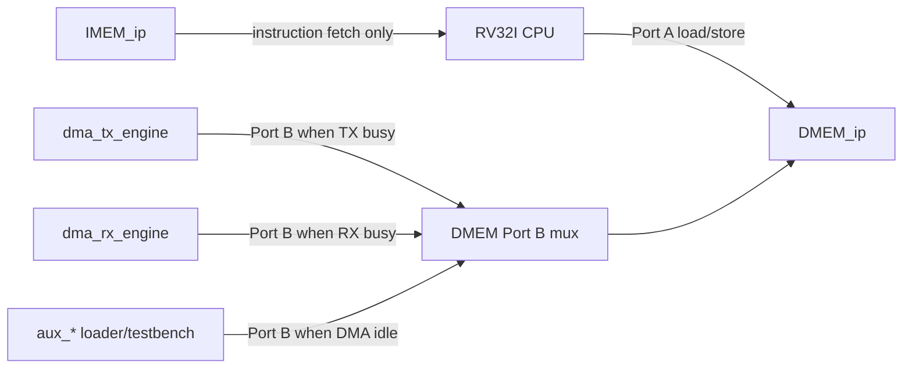

# 03. BRAM and Cổng Usage Specification

## 1. Mục đích

Tài liệu này chot ro:

- hệ thống đang dùng nhưng khoi BRAM nào;
- mới BRAM được cấu hình theo kiểu nào;
- port nào thuoc ve khoi nào;
- port nào dang dùng trong flow `RV32I sync` và `SoC sync`;
- port nào là legacy, không dùng cho hướng SoC cuối.

Mục tiêu là tránh nham lần giua:

- flow core sync cũ;
- flow SoC sync dung BRAM gan với FPGA;
- hướng SoC hiện tại da tích hợp DMA/TX/RX.

## 2. Pham vi

Spec này ap dùng cho các module sau:

- `imem_sync`
- `dmem_sync_wrab`
- `dmem_ip_wrapper`
- `DMEM_ip`
- `rv32_soc_top`

Tài liệu này không mô tả chỉ tiet protocol APB của DMA/TX/RX. No chỉ chot phân bố nhỏ và ownership của các port BRAM.

Trạng thái hiện tại:

| Item | Trạng thái |
|---|---|
| IMEM init | `sim/instruction.mem` tạo bằng `make compile C_SRC=...` |
| Simulation input load | `test_bench` nạp `+INPUT_FILE` vao DMEM Cổng B khi DMA idle |
| FPGA input load | `uart_dmem_loader` nạp payload vao DMEM Cổng B trước khi release CPU reset |
| DMA ownership | TX/RX DMA chiem DMEM Cổng B khi engine busy |
| Clean regression | included in `34/34` PASS baseline |

## 2.1 Cổng Ownership Flow Chart

## 3. Tong quan các khoi bộ nhớ

| Khoi | Module | Vai tro | Trạng thái |
|---|---|---|---|
| IMEM sync model | `imem_sync` | Bộ nhớ lenh đồng bộ cho CPU | Đang dùng |
| DMEM sync legacy | `dmem_sync_wrab` + `dmem_sync` | Bộ nhớ data don gian cho smoke test core cũ | Legacy |
| DMEM SoC wrapper | `dmem_ip_wrapper` | Wrapper cho dual-port BRAM | Hướng dùng cho SoC |
| DMEM SoC model | `DMEM_ip` | Model hành vi cho Vivado BRAM IP | Hướng dùng cho SoC |

## 4. IMEM

### 4.1 Module đang dùng

`imem_sync`

### 4.2 Vai tro

- chưa chương trình `RV32I`
- chỉ phuc vu instruction fetch
- CPU đọc, không có master thu hai
- runtime write vao IMEM chưa được dùng; chương trình được nạp qua `instruction.mem` / Vivado IMEM init

### 4.3 Cấu hình logic cần chốt

| Thuoc tính | Giá trị | Định dạng dữ liệu |
|---|---|---|
| Kiểu | Single-port synchronous instruction memory | Word-addressed 32-bit instruction storage |
| Read width | 32 bit | One RV32I instruction word |
| Write width | không dùng trong model hiện tại | N/A in the active model |
| Depth hiện tại | 2048 words | `2048 x 32-bit` words |
| Dung lượng hiện tại | 8 KB | `8192` bytes of instruction storage |
| Read latency | 1 cycle | Registered synchronous read |
| Init file | `instruction.mem` | Hex memory image |
| Có output register | Hieu ung tương đương 1 thanh ghi output | 32-bit registered instruction output |
| Byte write enable | Không dùng | N/A |

### 4.4 Cổng module

| Cổng | Hướng | Rộng | Định dạng dữ liệu | Mô tả |
|---|---|---:|---|---|
| `clk_i` | in | 1 | Free-running clock | Clock IMEM |
| `en_i` | in | 1 | Boolean enable | Enable đọc |
| `instr_addr_i` | in | 11 | Word address | Địa chỉ word |
| `instruction_o` | out | 32 | RV32I instruction word | Lenh đọc ra sau 1 cycle |

### 4.5 Các port dùng trong hệ thống

Trong `rv32_soc_top`, CPU nối vào IMEM như sau:

| Tín hiệu CPU | Nối vào IMEM | Định dạng dữ liệu | Ghi chú |
|---|---|---|---|
| `imem_en_o` | `en_i` | Boolean enable | CPU IF stage bật đọc |
| `imem_addr_o[12:2]` | `instr_addr_i` | Word address | Cat bo 2 bit thấp để đổi byte address sang word index |
| `imem_instr_i` | `instruction_o` | RV32I instruction word | CPU nhận instruction sau 1 cycle |

### 4.6 Quy tac dung port

- IMEM chỉ có 1 port và chỉ danh cho CPU fetch
- không dùng port này cho DMA
- không dùng IMEM để lưu data runtime
- nếu sau này thay bằng Vivado BRAM IP, phải giữ hành vi sync read 1 cycle

### 4.7 Khuyến nghị cấu hình Vivado

| Thuoc tính | Giá trị khuyến nghị |
|---|---|
| Interface | Native |
| Memory type | Single Cổng ROM hoặc Single Cổng RAM |
| Read width | 32 |
| Depth | 2048 words hoặc lớn hơn nếu cần |
| Enable pin | ON |
| Mode | `READ_FIRST` |
| Output register | OFF o vòng đầu |
| Read latency | 1 |
| Byte write enable | OFF |
| Init file | ON |

### 4.8 Internal storage / helper state

| Storage / signal | Độ rộng | Định dạng dữ liệu | Ý nghĩa |
|---|---:|---|---|
| `instructions_r` | 2048 x 32 | Hex instruction memory image | Simulation-only instruction storage array |
| `instruction_r` | 32 | RV32I instruction word | Registered instruction output in non-Vivado simulation |
| `i` | integer | Loop index | Initialisation loop index for `$readmemh` setup |

## 5. DMEM legacy cho core smoke test

### 5.1 Module

- `dmem_sync_wrab`
- `dmem_sync`

### 5.2 Vai tro

Đây là đường DMEM cũ dùng cho testbench core sync don le.

No có các dac diem:

- single-port
- ghep 4 bank 8-bit thanh 32-bit
- byte write enable từng byte
- không có port B

### 5.3 Trạng thái

- chỉ nen dùng cho smoke test core cũ
- không nên dùng cho hướng SoC có DMA
- không được coi đây là DMEM cuối cùng của hệ thống

### 5.4 Lý do không dùng cho SoC cuối

- không có dual-port
- không phan tách được CPU và DMA
- không phan anh đây đủ cấu hình BRAM IP của Vivado

### 5.5 Cổng module legacy

| Cổng | Hướng | Rộng | Định dạng dữ liệu | Mô tả |
|---|---|---:|---|---|
| `clka` | in | 1 | Free-running clock | Clock của legacy DMEM |
| `ena` | in | 1 | Boolean enable | Enable đọc/ghi |
| `wea` | in | 4 | Byte write mask | Một bit cho mới bank 8-bit |
| `addra` | in | 8 | Byte address | Địa chỉ byte trong từng bank |
| `dina` | in | 32 | Little-endian 32-bit word | Dữ liệu ghi 4 lane |
| `douta` | out | 32 | Little-endian 32-bit word | Dữ liệu đọc 4 lane |

### 5.6 Internal storage / helper state

| Storage / signal | Độ rộng | Định dạng dữ liệu | Ý nghĩa |
|---|---:|---|---|
| `dmem_uut0.mem` .. `dmem_uut3.mem` | 4 x `256 x 8` | Byte-addressed 8-bit memory arrays | Four legacy byte-wide banks that together form one 32-bit word |
| `dmem_uut0.douta` .. `dmem_uut3.douta` | 4 x 8 | Registered byte lane output | Byte lanes returned by each underlying `dmem_sync` instance |
| `i` | integer | Loop index | Initialisation index in each `dmem_sync` instance |

## 6. DMEM cho SoC

### 6.1 Module dang chot

- `dmem_ip_wrapper`
- `DMEM_ip`

### 6.2 Vai tro

DMEM là bộ nhớ data chính của hệ thống:

- CPU đọc/ghi data bình thường
- DMA đọc source buffer
- DMA ghi destination buffer
- về sau có thể cho UART loader hoặc PS/Zynq dung port phụ

### 6.3 Cấu hình logic cần chốt

| Thuoc tính | Giá trị | Định dạng dữ liệu |
|---|---|---|
| Kiểu | True dual-port RAM | Dual-port 32-bit byte-addressed memory |
| Số port | 2 | One CPU port, one auxiliary port |
| Clock | Common clock | Shared clock domain |
| Data width mỗi port | 32 bit | 32-bit little-endian word |
| Byte write enable | 4 bit mỗi port | One mask bit per byte lane |
| Address mode | `BYTE_ADDRESS` | Byte-oriented external address space |
| Read mode | `READ_FIRST` | Synchronous read returns old data on write collision |
| Read latency | 1 cycle | Registered synchronous read |
| Depth hiện tại | 8192 words | `8192 x 32-bit` storage words |
| Dung lượng hiện tại | 32 KB | `32768` bytes of data memory |

### 6.4 Cổng module wrapper

#### Cổng A: CPU

| Cổng | Hướng | Rộng | Định dạng dữ liệu | Mô tả |
|---|---|---:|---|---|
| `cpu_en_i` | in | 1 | Boolean enable | Enable của CPU |
| `cpu_we_i` | in | 4 | Byte write mask | Byte write enable |
| `cpu_addr_i` | in | 32 | Byte address | Byte address |
| `cpu_wdata_i` | in | 32 | Little-endian 32-bit word | Dữ liệu ghi |
| `cpu_rdata_o` | out | 32 | Little-endian 32-bit word | Dữ liệu đọc sau 1 cycle |

#### Cổng B: auxiliary master

| Cổng | Hướng | Rộng | Định dạng dữ liệu | Mô tả |
|---|---|---:|---|---|
| `aux_en_i` | in | 1 | Boolean enable | Enable port phụ |
| `aux_we_i` | in | 4 | Byte write mask | Byte write enable |
| `aux_addr_i` | in | 32 | Byte address | Byte address |
| `aux_wdata_i` | in | 32 | Little-endian 32-bit word | Dữ liệu ghi |
| `aux_rdata_o` | out | 32 | Little-endian 32-bit word | Dữ liệu đọc sau 1 cycle |

### 6.5 Ownership của từng port

| Cổng | Chủ sở hữu trong hướng SoC | Mục đích |
|---|---|---|
| Cổng A | CPU | load/store data bình thường |
| Cổng B | DMA | đọc/ghi buffer cho TX/RX |

Trong giai đoạn bring-up, Cổng B có thể tạm thời do:

- testbench
- UART loader
- PS/Zynq

sử dụng, nhưng chỉ được có **một owner hiệu lực tai một thời điểm**.

### 6.6 Mapping trong `rv32_soc_top`

| Tín hiệu trong `rv32_soc_top` | Nối vào wrapper | Định dạng dữ liệu | Chủ sở hữu |
|---|---|---|---|
| `dmem_en_w` | `cpu_en_i` | Boolean enable | CPU |
| `dmem_we_w[3:0]` | `cpu_we_i` | Byte write mask | CPU |
| `dmem_addr_w[31:0]` | `cpu_addr_i` | Byte address | CPU |
| `dmem_wdata_w[31:0]` | `cpu_wdata_i` | Little-endian 32-bit word | CPU |
| `dmem_rdata_w[31:0]` | `cpu_rdata_o` | Little-endian 32-bit word | CPU |
| `aux_en_i` | `aux_en_i` | Boolean enable | DMA/loader |
| `aux_we_i[3:0]` | `aux_we_i` | Byte write mask | DMA/loader |
| `aux_addr_i[31:0]` | `aux_addr_i` | Byte address | DMA/loader |
| `aux_wdata_i[31:0]` | `aux_wdata_i` | Little-endian 32-bit word | DMA/loader |
| `aux_rdata_o[31:0]` | `aux_rdata_o` | Little-endian 32-bit word | DMA/loader |

### 6.7 Quy tac địa chỉ

- DMEM nhận **byte address** ở cả 2 port
- căn word nội bộ được xử lý bằng cách bo 2 bit thấp khi truy cap mảng byte
- `wea/web[3:0]` quyet dinh byte nào được ghi

He qua:

- `sb`, `sh`, `sw` có thể chia sẽ cung một word
- DMA hiện tại ưu tiên transfer 32-bit aligned
- CPU vẫn giữ kha nang byte/halfword access qua `we[3:0]`

### 6.8 Quy tac đồng thời

DMEM là dual-port nen:

- CPU có thể dung Cổng A trong lúc DMA dung Cổng B
- CPU không cần stall chỉ vi DMA dang busy

Nhưng phần mềm vẫn phải đảm bảo:

- CPU không đọc/ghi vao buffer ma DMA dang xu ly
- không tạo race trên cung vung data

### 6.9 Khuyến nghị cấu hình Vivado

| Thuoc tính | Giá trị khuyến nghị |
|---|---|
| Interface | Native |
| Memory type | True Dual Cổng RAM |
| Common clock | ON |
| Cổng A width | 32/32 |
| Cổng B width | 32/32 |
| Byte write enable | ON |
| Byte size | 8 |
| `wea/web` | 4 bit |
| Address mode | `BYTE_ADDRESS` |
| Mode A | `READ_FIRST` |
| Mode B | `READ_FIRST` |
| Enable pin | `ENA`, `ENB` |
| Output register | OFF o vòng đầu |
| ECC | OFF |
| Depth | 8192 words |

### 6.10 Internal address translation / helper wires

| Tín hiệu | Độ rộng | Định dạng dữ liệu | Ý nghĩa |
|---|---:|---|---|
| `unused_addr_bits_w` | 1 | Boolean alignment check | Flags illegal high/low address bits before word-address conversion |
| `cpu_word_addr_w` | 13 | Word address | CPU byte address `[14:2]` converted for `DMEM_ip` |
| `aux_word_addr_w` | 13 | Word address | Auxiliary byte address `[14:2]` converted for `DMEM_ip` |

## 7. Quy tac dung port trong hệ thống

### 7.1 Cổng nào danh cho CPU

- IMEM port duy nhất
- DMEM Cổng A

CPU không được dung:

- DMEM Cổng B trong hướng SoC bình thường
- output FIFO hay BRAM nội bộ của TX/RX như một RAM thông thường

### 7.2 Cổng nào danh cho DMA

- DMEM Cổng B

DMA không được dung:

- IMEM port
- DMEM Cổng A

### 7.3 Cổng nào danh cho testbench / loader

Trong bring-up hoặc debug, `aux_*` có thể do:

- testbench
- UART loader
- PS/Zynq

nằm giữ tạm thời. Khi DMA được tích hợp that, owner mặc định của `aux_*` phải là DMA.

## 8. Quy tac implementation cần giữ

1. Không bien IMEM thanh async read.
2. Không đổi DMEM SoC thanh single-port.
3. Không bo byte write enable của DMEM.
4. Không đổi DMEM sang word-addressed interface ở tầng trên.
5. Không noi ca DMA và loader vao cung `aux_*` nếu chưa có arbiter.

## 9. Chot hướng dùng cho các file

| File | Vai tro | Nên dùng hay không |
|---|---|---|
| `rtl/imem_sync.v` | IMEM sync model | Có |
| `rtl/dmem_sync_wrab.v` | DMEM legacy cho core smoke | Không cho SoC cuối |
| `rtl/dmem_ip_wrapper.v` | Wrapper dual-port DMEM | Có |
| `rtl/DMEM_ip.v` | Model hành vi DMEM IP | Có trong sim SoC |
| `rtl/rv32_soc_top.v` | Top noi CPU vao IMEM/DMEM | Có |

## 10. Ket luan

Hệ thống cần chốt theo hướng sau:

- `IMEM`: single-port sync, chỉ cho CPU fetch
- `DMEM`: true dual-port sync, Cổng A cho CPU, Cổng B cho DMA
- `dmem_sync_wrab`: chỉ là flow cũ để smoke test, không phải DMEM cuối

Nếu giữ dung quy tac này, buoc tiếp theo là thêm DMA vao `aux_*` của `rv32_soc_top` mà không cần thay đổi kiến trúc bộ nhớ nữa.
