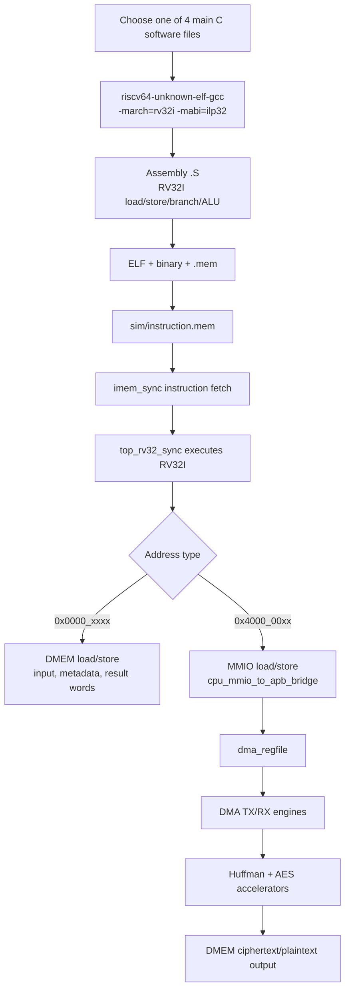
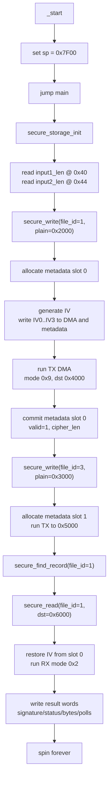
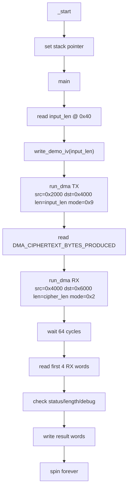
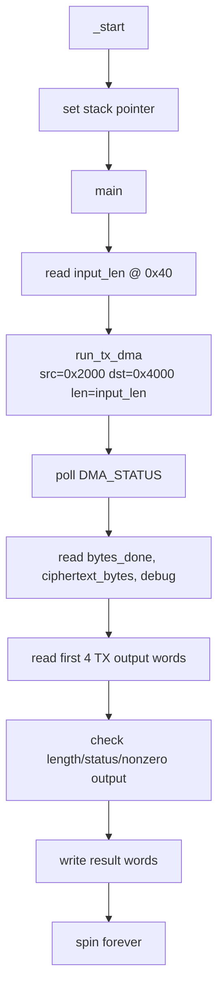
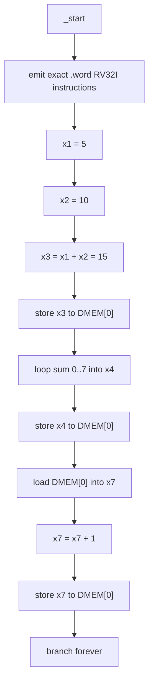

# 13. Main C Software And Assembly Explanation

## 1. Scope

This document now focuses on only four important RV32I software programs. The
other C files under `testcase/` are coverage, negative-test, or deprecated
debug programs and are not explained here in detail.

The four main software programs are:

| # | Software | Role | Why it matters |
|---:|---|---|---|
| 1 | `testcase/test_mmio_dma_storage_table.c` + `secure_storage_fw.h` | Secure-storage firmware demo | Main project software: metadata, IV, secure write/read API |
| 2 | `testcase/test_mmio_dma.c` | Direct TX/RX loopback | Shows the raw DMA/Huffman/AES data path without storage metadata |
| 3 | `testcase/test_mmio_tx_only.c` | TX-only benchmark | Measures Huffman/AES TX output and storage saving |
| 4 | `testcase/test.c` | RV32I smoke program | Smallest program proving instruction fetch/execute/load/store/branch |

All four programs are freestanding. There is no libc, heap, OS, interrupt
handler, or trap runtime. The C code is compiled into RV32I code, converted to
`.mem`, copied to `sim/instruction.mem`, and executed from IMEM by the SoC.

## 2. Overall C To Hardware Flow



Build command pattern:

```bash
cd sim
make compile C_SRC=<software>.c
make all TESTNAME=<testname> RUN_ARGS="<plusargs>"
```

The generated assembly can be inspected from:

```text
testcase/<software>.S
```

Important compiler profile from `sim/Makefile`:

```text
Assembly: -march=rv32i -mabi=ilp32 -Os -S
ELF link: -march=rv32i -mabi=ilp32 -O1 -nostdlib -ffreestanding -Ttext=0x0 -Wl,-e,_start
```

## 3. Shared Memory And MMIO Contract

### 3.1 DMEM layout used by main software

| Address | Meaning |
|---:|---|
| `0x0000_0000` | Result words for the testbench |
| `0x0000_0040` | Input1 length written by the testbench |
| `0x0000_0044` | Input2 length for secure-storage two-file demo |
| `0x0000_0100` | Secure-storage metadata table |
| `0x0000_01F0` | Secure-storage IV counter |
| `0x0000_2000` | Input1 plaintext |
| `0x0000_3000` | Input2 plaintext |
| `0x0000_4000` | TX output slot 0 |
| `0x0000_5000` | TX output slot 1 |
| `0x0000_6000` | RX restored plaintext |

### 3.2 DMA MMIO registers

The C macros use `volatile uint32_t *`, so each access becomes an RV32I
`lw` or `sw`. Base address is:

```text
DMA_BASE_ADDR = 0x4000_0000
```

| Offset | Register | C use | Assembly effect |
|---:|---|---|---|
| `0x00` | `DMA_CONTROL` | start, clear done/error | `sw value,0(base)` |
| `0x04` | `DMA_STATUS` | poll busy/done/error | `lw reg,4(base)` |
| `0x08` | `DMA_SRC_ADDR` | source DMEM address | `sw src,8(base)` |
| `0x0C` | `DMA_DST_ADDR` | destination DMEM address | `sw dst,12(base)` |
| `0x10` | `DMA_LEN_BYTES` | byte length | `sw len,16(base)` |
| `0x14` | `DMA_MODE` | TX/RX mode | `sw mode,20(base)` |
| `0x18` | `DMA_BLOCK_CFG` | block size, usually `0x20` | `sw 32,24(base)` |
| `0x1C` | `DMA_BYTES_DONE` | completed bytes | `lw reg,28(base)` |
| `0x20` | `DMA_DEBUG` | debug/error code | `lw reg,32(base)` |
| `0x24` | `DMA_CIPHERTEXT_BYTES_PRODUCED` | TX output length | `lw reg,36(base)` |
| `0x28..0x34` | `DMA_IV0..DMA_IV3` | AES-CBC IV | `sw iv,40/44/48/52(base)` |

Common modes:

| Mode | Meaning |
|---:|---|
| `0x9` | TX whole-file Huffman + AES-CBC |
| `0xD` | TX whole-file Huffman, AES bypass |
| `0x2` | RX AES-CBC decrypt + Huffman decode |

## 4. Software 1 - Secure Storage Demo

Files:

```text
testcase/test_mmio_dma_storage_table.c
testcase/secure_storage_fw.h
```

This is the main project software. It proves that RV32I is not only starting
the accelerator; it also manages secure-storage metadata and IV/nonce state.

### 4.1 C-level flow



Key C calls:

```c
secure_storage_init();
tx1_rc = secure_write(1u, INPUT1_SRC_ADDR, input1_len, &tx1_result);
tx2_rc = secure_write(3u, INPUT2_SRC_ADDR, input2_len, &tx2_result);
selected_slot = secure_find_record(1u);
rx1_rc = secure_read(1u, INPUT1_RX_ADDR, &rx1_result);
```

What each call does:

| C call | Responsibility |
|---|---|
| `secure_storage_init()` | Clears two metadata records and seeds the IV counter at `0x1F0`. |
| `secure_write()` | Validates input, chooses a slot, generates IV, runs TX DMA, stores ciphertext length, marks metadata valid. |
| `secure_find_record()` | Scans metadata table by `file_id`. This is the software-side file selector. |
| `secure_read()` | Finds metadata, restores IV, runs RX DMA, checks restored plaintext length. |

### 4.2 Metadata record written by C

Each record starts at:

```text
0x0000_0100 + slot * 0x40
```

| Word | Field | Meaning |
|---:|---|---|
| `0` | `valid` | Set to `1` only after TX completed and metadata is committed. |
| `1` | `file_id` | Software-visible file ID. |
| `2` | `plain_addr` | Original plaintext address. |
| `3` | `cipher_addr` | Ciphertext slot address. |
| `4` | `plain_len` | Original byte length. |
| `5` | `cipher_len` | TX-produced stream length. |
| `6` | `mode` | Current TX mode, `0x9`. |
| `7..10` | `iv0..iv3` | IV needed for AES-CBC RX restore. |
| `11` | `version` | IV counter value. |
| `12` | `flags` | Reserved. |

### 4.3 Assembly mapping

The assembly begins with a minimal startup sequence:

```asm
_start:
    li sp, 0x00007f00
    j main
```

Metadata clearing in C:

```c
for (slot = 0u; slot < SECURE_META_RECORD_COUNT; slot++)
    secure_metadata_clear_slot(slot);
```

becomes repeated `sw zero,...` loops in assembly:

```asm
    li   a5,256        # 0x100 metadata slot 0
    li   a4,320        # 0x140 end slot 0
.Lclear0:
    sw   zero,0(a5)
    addi a5,a5,4
    bne  a5,a4,.Lclear0
```

DMA configuration in C:

```c
DMA_SRC_ADDR  = src;
DMA_DST_ADDR  = dst;
DMA_LEN_BYTES = len;
DMA_MODE      = mode;
DMA_BLOCK_CFG = SECURE_BLOCK_SIZE;
DMA_CONTROL   = 0x1;
```

becomes `sw` to the MMIO window:

```asm
    li a5,1073741824   # 0x40000000
    sw src,8(a5)       # DMA_SRC_ADDR
    sw dst,12(a5)      # DMA_DST_ADDR
    sw len,16(a5)      # DMA_LEN_BYTES
    sw mode,20(a5)     # DMA_MODE
    sw block,24(a5)    # DMA_BLOCK_CFG
    sw one,0(a5)       # DMA_CONTROL start
```

The polling loop in `secure_run_dma()`:

```c
status_after = DMA_STATUS;
if (status_after & 4u) break;
if (status_after & 2u) break;
polls++;
```

is compiled into repeated `lw`, `andi`, and branch instructions:

```asm
.Lpoll:
    lw   a5,0(status_ptr) # load DMA_STATUS
    andi a6,a5,4          # error bit
    bne  a6,zero,.Ldone
    andi a5,a5,2          # done bit
    bne  a5,zero,.Ldone
    addi polls,polls,1
    bne  polls,max,.Lpoll
```

### 4.4 Result words

`test_mmio_dma_storage_table.c` writes:

| Word | Meaning |
|---:|---|
| `0` | Signature `0x53544F52` (`STOR`) |
| `1` | Error mask, expected `0` |
| `2..6` | TX1 status, bytes, ciphertext length, polls |
| `7..11` | RX1 status, bytes, debug, polls |
| `12` | TX2 ciphertext length |
| `13` | Input2 length echo |
| `14` | Selected file ID, expected `1` |
| `15` | Metadata record count, expected `2` |

Pass condition:

```text
result[1] == 0
selected_file_id == 1
total_records == 2
RX output at 0x6000 matches input1
DMA start pulse count == 3
```

## 5. Software 2 - Direct DMA TX/RX Loopback

File:

```text
testcase/test_mmio_dma.c
```

This software removes the storage table and directly runs TX then RX. It is the
best program for debugging the accelerator data path.

### 5.1 C-level flow



Main C operations:

```c
input_len_bytes = INPUT_LEN_ADDR;
write_demo_iv(input_len_bytes);
tx_polls = run_dma(SRC_BASE_ADDR, TX_DST_BASE_ADDR,
                   input_len_bytes, TEST_MODE_TX_COMPRESS_AES, ...);
tx_ciphertext_bytes = DMA_CIPHERTEXT_BYTES_PRODUCED;
rx_polls = run_dma(TX_DST_BASE_ADDR, RX_DST_BASE_ADDR,
                   tx_ciphertext_bytes, TEST_MODE_RX, ...);
```

### 5.2 Assembly mapping

The IV generation is visible as ALU shifts and XORs:

```asm
    lw   a2,64(zero)      # input_len from 0x40
    xor  a5,a2,a5         # mix input_len and counter
    slli a3,a5,13
    xor  a5,a5,a3
    srli a3,a5,17
    xor  a5,a5,a3
    slli a1,a5,5
    xor  a5,a5,a1
```

Writing IV words to DMA:

```asm
    li a3,1073741824      # 0x40000000
    sw a4,40(a3)          # DMA_IV0
    sw a5,44(a3)          # DMA_IV1
    sw a5,48(a4)          # DMA_IV2
    sw a5,52(a4)          # DMA_IV3
```

TX setup:

```asm
    li a5,1073741824
    li a4,8192            # 0x2000 source
    sw a4,8(a5)
    li a4,16384           # 0x4000 TX destination
    sw a4,12(a5)
    sw a2,16(a5)          # input length
    li a4,9               # mode 0x9
    sw a4,20(a5)
    li a4,32              # block config 0x20
    sw a4,24(a5)
    li a4,1
    sw a4,0(a5)           # start
```

RX setup is the same pattern, but uses:

```text
SRC_ADDR = 0x4000
DST_ADDR = 0x6000
LEN      = DMA_CIPHERTEXT_BYTES_PRODUCED
MODE     = 0x2
```

The poll loop is implemented with `lw DMA_STATUS`, `andi` on busy/done/error
bits, and branches back until done or timeout.

### 5.3 Result words

| Word | Meaning |
|---:|---|
| `0` | Signature `0x44525831` |
| `1` | Error mask, expected `0` |
| `2..6` | TX status, bytes, ciphertext length, polls |
| `7..11` | RX status, bytes, debug, polls |
| `12..15` | First four restored RX words |

Pass condition:

```text
TX done status == 0x9A
RX done status == 0x2A
TX ciphertext length is nonzero and 16-byte aligned
RX bytes_done == input_len
RX output matches original input
```

## 6. Software 3 - TX-only Benchmark

File:

```text
testcase/test_mmio_tx_only.c
```

This software runs only the TX direction. It is used for compression/storage
ratio experiments and for testing the TX accelerator without RX.

### 6.1 C-level flow



Default mode:

```text
TEST_MODE_TX = 0xD
```

That means whole-file Huffman with AES bypass. Wrapper files can override the
mode for coverage, but the main benchmark uses `0xD`.

### 6.2 Assembly mapping

The C code:

```c
tx_polls = run_tx_dma(SRC_BASE_ADDR, TX_DST_BASE_ADDR,
                      input_len_bytes, TEST_MODE_TX, ...);
```

compiles into one DMA configuration block:

```asm
    lw a4,64(zero)        # input_len
    li a5,1073741824      # DMA base
    li a3,8192            # source 0x2000
    sw a3,8(a5)
    li a3,16384           # destination 0x4000
    sw a3,12(a5)
    sw a4,16(a5)          # LEN_BYTES
    li a4,13              # MODE 0xD
    sw a4,20(a5)
    li a4,32
    sw a4,24(a5)
    li a4,1
    sw a4,0(a5)           # CONTROL.start
```

The polling loop checks:

```text
STATUS[0] busy
STATUS[1] done
STATUS[2] error
DMA_CIPHERTEXT_BYTES_PRODUCED for progress
```

Assembly uses this pattern:

```asm
.Lpoll:
    lw   a4,0(status_addr)
    andi a0,a4,1          # busy
    andi a0,a4,4          # error
    andi a4,a4,3          # busy/done pair
    bne  a4,done_code,.Lcontinue
```

### 6.3 Result words

| Word | Meaning |
|---:|---|
| `0` | Signature `0x44545843` |
| `1` | Error mask, expected `0` |
| `2` | TX status before start |
| `3` | TX status after done |
| `4` | DMA bytes done |
| `5` | Ciphertext/transport bytes produced |
| `6` | Poll count |
| `7` | TX debug |
| `8` | TX mode echo |
| `9` | Input length echo |
| `10..13` | First four TX output words |

Pass condition:

```text
status_after == expected done status
bytes_done != 0
bytes_done is 16-byte aligned
ciphertext_bytes == bytes_done
first TX words are not all zero
```

## 7. Software 4 - RV32I Smoke Program

File:

```text
testcase/test.c
```

This is the smallest software program. It does not use DMA. It directly emits
fixed machine words so the testbench knows exactly which instructions should
execute.

### 7.1 C-level flow



### 7.2 Exact assembly/instruction sequence

Unlike the other files, this program is intentionally written as inline
machine words:

```c
__asm__ volatile(
    ".word 0x00500093\n" // addi x1, x0, 5
    ".word 0x00a00113\n" // addi x2, x0, 10
    ".word 0x002081b3\n" // add  x3, x1, x2
    ".word 0x00302023\n" // sw   x3, 0(x0)
    ...
);
```

Decoded instruction list:

| # | Hex | Assembly | Meaning |
|---:|---:|---|---|
| 0 | `00500093` | `addi x1,x0,5` | `x1 = 5` |
| 1 | `00a00113` | `addi x2,x0,10` | `x2 = 10` |
| 2 | `002081b3` | `add x3,x1,x2` | `x3 = 15` |
| 3 | `00302023` | `sw x3,0(x0)` | Store `15` to DMEM word 0 |
| 4 | `00000213` | `addi x4,x0,0` | Clear accumulator |
| 5 | `00000293` | `addi x5,x0,0` | Clear loop index |
| 6 | `00800313` | `addi x6,x0,8` | Loop limit |
| 7 | `00520233` | `add x4,x4,x5` | Accumulate |
| 8 | `00128293` | `addi x5,x5,1` | Increment |
| 9 | `fe62cce3` | `blt x5,x6,loop` | Repeat until `x5 == 8` |
| 10 | `00402023` | `sw x4,0(x0)` | Store sum `28` |
| 11 | `00002383` | `lw x7,0(x0)` | Read back sum |
| 12 | `00138393` | `addi x7,x7,1` | Add one |
| 13 | `00702023` | `sw x7,0(x0)` | Store final `29` |
| 14 | `fe000ae3` | `beq x0,x0,spin` | Infinite loop |

### 7.3 Expected result

| Register / memory | Expected value |
|---|---:|
| `x1` | `5` |
| `x2` | `10` |
| `x3` | `15` |
| `x4` | `28` |
| `DMEM[0]` | `29` |

## 8. How To Explain C Versus Assembly In The Report

Use this mapping:

| C concept | RV32I assembly pattern | Hardware meaning |
|---|---|---|
| `volatile uint32_t *addr = ...; *addr = value;` | `li/lui` address, then `sw` | CPU writes DMEM or MMIO. |
| `value = *addr;` | `lw` | CPU reads DMEM or MMIO. |
| `if (status & bit)` | `andi`, `beq`/`bne` | Polling status bits. |
| `while (...)` | label + conditional branch | Software polling loop, not interrupt. |
| `x << n`, `x >> n`, `x ^ y` | `slli`, `srli`, `xor` | IV mixing and simple checks. |
| `RESULT_WORD(i) = value` | `sw value,offset(zero/base)` | Testbench-visible result block in DMEM. |

Short explanation to use in slides:

```text
The C files do not call a software DMA library. They are compiled into normal
RV32I load/store/branch instructions. A store to 0x4000_0000 + offset becomes
an MMIO write into dma_regfile. A load from the same range reads DMA status.
Therefore, the RISC-V CPU controls secure storage through standard RV32I
instructions, while Huffman and AES remain hardware accelerators.
```

## 9. Recommended Commands

Secure-storage main demo:

```bash
cd sim
make compile C_SRC=test_mmio_dma_storage_table.c
make all TESTNAME=dma_storage_table_input1_then_input3 RUN_ARGS="+CASE_NAME=dma_storage_table_input1_then_input3 +INPUT_FILE=input1.txt +INPUT_FILE2=input2.txt"
```

Direct TX/RX loopback:

```bash
cd sim
make compile C_SRC=test_mmio_dma.c
make all TESTNAME=dma_compress_aes_input1 RUN_ARGS="+CASE_NAME=dma_compress_aes_input1 +INPUT_FILE=input1.txt"
```

TX-only benchmark:

```bash
cd sim
make compile C_SRC=test_mmio_tx_only.c
make all TESTNAME=tx_compress_only_input1 RUN_ARGS="+CASE_NAME=tx_compress_only_input1 +INPUT_FILE=input1.txt"
```

RV32I smoke program:

```bash
cd sim
make compile C_SRC=test.c
```

## 10. Files Not Explained In Detail Here

The following files are still useful, but they are not the four main software
flows:

| Group | Examples | Purpose |
|---|---|---|
| Register coverage | `test_mmio_regfile_basic.c`, `test_mmio_mode_matrix.c` | Exercise legal/illegal MMIO register behavior. |
| Error-path coverage | `test_mmio_tx_apb_error.c`, `test_mmio_rx_bad_length.c` | Prove sticky error/debug handling. |
| CPU coverage | `test_cpu_instruction_cov.c`, `test_cpu_mem_forward_cov.c` | Hit RV32I instruction, forwarding, and memory corner cases. |
| Deprecated preprocessing | `test_log_preprocess.c`, `test_sensor_phi_preprocess_rv32.c` | Historical experiments, not the current secure-storage demo. |

Do not present these as the main project software unless the discussion is
specifically about coverage closure.
