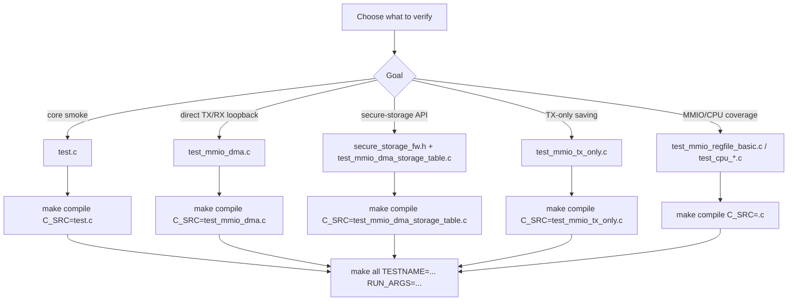

# 13. C Program Test Spec

## 1. Scope

Repo hien tai co nhom chuong trinh C phuc vu RV32I simulation/coverage:

| C file | Main role | Active baseline |
|---|---|---|
| `testcase/test.c` | smoke program cu cho core sync | reference only |
| `testcase/secure_storage_fw.h` | active secure-storage firmware API: metadata, IV, DMA write/read/delete helpers | yes |
| `testcase/test_mmio_dma_storage_table.c` | current secure-storage API demo: `secure_write` input1, `secure_write` input3, then `secure_read` selected input1 by metadata | yes |
| `testcase/test_mmio_dma.c` | legacy direct DMA loopback: TX `COMPRESS_AES + whole_file` roi RX decode ve DMEM | yes/legacy |
| `testcase/test_mmio_tx_only.c` | TX-only `COMPRESS_ONLY + whole_file` de do saving truc tiep | yes |
| `testcase/test_mmio_tx_only_aes_block.c` | TX-only `COMPRESS_AES` per-block 32B | coverage |
| `testcase/test_mmio_tx_only_compress_block.c` | TX-only `COMPRESS_ONLY` per-block 32B | coverage |
| `testcase/test_mmio_tx_encoder_error.c` | legacy TX error-path program kept for debug, not used by current 256-symbol clean baseline | coverage/debug |
| `testcase/test_mmio_regfile_basic.c` | legal MMIO register read/write, IV, reset/clear pulse | coverage |
| `testcase/test_mmio_regfile_negative.c` | invalid MMIO/config/error propagation | coverage |
| `testcase/test_mmio_mode_matrix.c` | mode decode/status matrix | coverage |
| `testcase/test_mmio_rx_bad_length.c` | expected RX bad ciphertext length error | coverage |
| `testcase/test_cpu_instruction_cov.c` | RV32I instruction coverage | coverage |
| `testcase/test_cpu_mem_forward_cov.c` | CPU memory-stage/forwarding corner coverage | coverage |

Nhanh cu `RV32I` tu preprocess/parser text va host-preprocess benchmark khong con
la flow chinh. Neu thay cac artifact ten `*_preprocess*`, xem chung la
deprecated/debug history, khong dung lam demo mac dinh.

Tai lieu nay giai thich ro:

1. Moi file test cai gi.
2. Dung instruction nao.
3. Tieu chi pass/fail va expected state.

## 1.1 C Test Selection Flow Chart



## 2. Build Profile (dang duoc dung)

Compile trong `sim/Makefile`:

- ASM: `-march=rv32i -mabi=ilp32 -Os -S`
- ELF: `-march=rv32i -mabi=ilp32 -O1 -nostdlib -ffreestanding -Ttext=0x0 -Wl,-e,_start`
- Objcopy: binary
- Output `.S/.elf/.bin/.mem` duoc tao trong `testcase/`.
- File `.mem` sinh ra duoc copy sang `sim/instruction.mem` de `imem_sync` dung cho simulation.

Luu y:
- Current secure-storage API code lives in `secure_storage_fw.h`; the testcase
  `test_mmio_dma_storage_table.c` includes it and compiles it into the RV32I
  image.
- Instruction sequence cua `test_mmio_dma.c` duoi day la theo disassembly hien
  tai cua `testcase/test_mmio_dma.elf`.
- Neu doi compiler/version/optimization, dia chi PC va instruction co the thay
  doi.

---

## 3. `testcase/test.c` (RV32I Smoke Program)

### 3.1 Muc tieu test

- Xac nhan duong arith + load/store co ban.
- Xac nhan vong lap branch va ghi DMEM word0.
- Dung cho testbench sync core (`tb_risc_v_sync_mem.v`).

### 3.2 Instruction sequence (co dinh bang `.word`)

| Idx | Hex       | Mnemonic           | Y nghia |
|-----|-----------|--------------------|--------|
| 0   | 00500093  | `addi x1, x0, 5`   | x1 = 5 |
| 1   | 00a00113  | `addi x2, x0, 10`  | x2 = 10 |
| 2   | 002081b3  | `add x3, x1, x2`   | x3 = 15 |
| 3   | 00302023  | `sw x3, 0(x0)`     | DMEM[0] = 15 |
| 4   | 00000213  | `addi x4, x0, 0`   | x4 = 0 |
| 5   | 00000293  | `addi x5, x0, 0`   | x5 = 0 |
| 6   | 00800313  | `addi x6, x0, 8`   | x6 = 8 |
| 7   | 00520233  | `add x4, x4, x5`   | x4 += x5 |
| 8   | 00128293  | `addi x5, x5, 1`   | x5++ |
| 9   | fe62cce3  | `blt x5, x6, loop` | lap den khi x5 == 8 |
| 10  | 00402023  | `sw x4, 0(x0)`     | DMEM[0] = tong |
| 11  | 00002383  | `lw x7, 0(x0)`     | x7 = DMEM[0] |
| 12  | 00138393  | `addi x7, x7, 1`   | x7++ |
| 13  | 00702023  | `sw x7, 0(x0)`     | DMEM[0] = x7 |
| 14  | fe000ae3  | `beq x0, x0, spin` | dung tai vong lap vo han |

### 3.3 Expected state

- `x1 = 5`
- `x2 = 10`
- `x3 = 15`
- `x4 = 0x1c` (tong 0..7 = 28)
- `DMEM[0] >= 0x1c` (thuc te thuong la `0x1d` sau buoc increment x7 + store)

---

## 4. `testcase/test_mmio_dma.c` (DMA TX/RX Loopback Test)

### 4.1 Muc tieu test

Test duong data-plane loopback hien tai:

- testbench load file input text vao `DMEM[0x00002000 ..]`;
- CPU cau hinh DMA TX whole-file Huffman + AES (`MODE = 0x9`);
- DMA TX doc plaintext 2 pass: pass 1 count/build global table, pass 2 emit compressed AES stream vao `DMEM[0x00004000 ..]`;
- CPU doc `DMA_CIPHERTEXT_BYTES_PRODUCED`;
- CPU cau hinh DMA RX (`MODE = 0x2`) de doc ciphertext vua tao va ghi plaintext ve `DMEM[0x00006000 ..]`;
- CPU ghi `signature + error_mask + status + length/result head` ve `DMEM word 0..15`;
- testbench dump source/TX/RX va compare RX output voi input goc.

### 4.2 DMA MMIO map su dung trong test

Base: `0x4000_0000`

- `+0x00` `DMA_CONTROL`
- `+0x04` `DMA_STATUS`
- `+0x08` `DMA_SRC_ADDR`
- `+0x0C` `DMA_DST_ADDR`
- `+0x10` `DMA_LEN_BYTES`
- `+0x14` `DMA_MODE`
- `+0x18` `DMA_BLOCK_CFG`
- `+0x1C` `DMA_BYTES_DONE`
- `+0x20` `DMA_DEBUG`
- `+0x24` `DMA_CIPHERTEXT_BYTES_PRODUCED`

Gia tri config duoc ghi:

- TX: `SRC_ADDR = 0x00002000`
- TX: `DST_ADDR = 0x00004000`
- TX: `LEN_BYTES = INPUT_LEN_ADDR`
- TX: `MODE = 0x00000009`
- RX: `SRC_ADDR = 0x00004000`
- RX: `DST_ADDR = 0x00006000`
- RX: `LEN_BYTES = DMA_CIPHERTEXT_BYTES_PRODUCED`
- RX: `MODE = 0x00000002`
- `BLOCK_CFG = 0x20`
- `CONTROL = 0x1` (start)

### 4.3 Result layout trong DMEM (word offset)

- `word0`  = signature `0x44525831`
- `word1`  = `error_mask`
- `word2`  = `tx_status_before_start`
- `word3`  = `tx_status_after_done`
- `word4`  = `tx_bytes_done`
- `word5`  = `tx_ciphertext_bytes`
- `word6`  = `tx_poll_count`
- `word7`  = `rx_status_before_start`
- `word8`  = `rx_status_after_done`
- `word9`  = `rx_bytes_done`
- `word10` = `rx_debug`
- `word11` = `rx_poll_count`
- `word12..15` = 4 word dau cua RX output

Pass condition:

- `word1 == 0`
- `word2 == 0x98`
- `word3 == 0x9a`
- `word4 != 0` va align `16 byte`
- `word5 == word4`
- `word8 == 0x2a`
- `word9 == input_len`
- RX output trong dump phai match input goc.

---

## 5. `testcase/secure_storage_fw.h` and `testcase/test_mmio_dma_storage_table.c`

### 5.1 Muc tieu test

Test nay chung minh phan mem RV32I co the cung cap secure-storage firmware API,
khong chi la loopback DMA truc tiep:

- testbench load `input1.txt` vao `DMEM[0x00002000 ..]`;
- CPU goi `secure_write(1, 0x00002000, input1_len, ...)`;
- firmware chon ciphertext slot 0 tai `DMEM[0x00004000 ..]`;
- firmware tao IV, ghi DMA IV registers, chay TX `MODE=0x9`, va commit metadata record 0;
- testbench load `input3.txt` vao `DMEM[0x00003000 ..]`;
- CPU goi `secure_write(3, 0x00003000, input2_len, ...)`;
- firmware chon ciphertext slot 1 tai `DMEM[0x00005000 ..]`;
- CPU goi `secure_read(1, 0x00006000, ...)`;
- firmware tim metadata `file_id=1`, restore IV, chay RX `MODE=0x2`;
- testbench compare RX output voi `input1.txt`.

### 5.2 DMEM metadata layout

Base:

```text
SECURE_META_BASE_ADDR    = 0x00000100
SECURE_META_RECORD_COUNT = 2
SECURE_META_RECORD_SHIFT = 6
SECURE_IV_COUNTER_ADDR   = 0x000001F0
SECURE_IV_SEED           = 0x31415926
```

Moi record la software-owned structure trong DMEM:

| Field | Meaning |
|---|---|
| `valid` | Record hop le; set `1` only after TX commit |
| `file_id` | ID phan mem dung de chon lai du lieu |
| `plain_addr` | Dia chi plaintext source ban dau |
| `cipher_addr` | Dia chi ciphertext/transport trong DMEM |
| `plain_len` | So byte plaintext ban dau |
| `cipher_len` | So byte ciphertext/transport do TX tao |
| `mode` | TX mode da dung, hien la `0x9` |
| `iv0..iv3` | IV phai dung lai khi RX |
| `version` | Counter value used when creating IV |
| `flags` | Reserved, currently `0` |

Ciphertext slots:

| Slot | Address |
|---:|---:|
| `0` | `0x00004000` |
| `1` | `0x00005000` |

Current IV formula is documented in
`docs/iv_generation_and_cbc_contract_spec.md`. It uses `plain_len`,
`plain_addr`, `cipher_addr`, `file_id`, and the counter at `0x000001F0`.

### 5.3 Result layout

- `word0` = signature `0x53544f52`
- `word1` = error mask
- `word2..6` = TX1 status/bytes/polls
- `word7..11` = RX1 status/bytes/debug/polls
- `word12` = TX2 ciphertext length
- `word13` = input2 length echo
- `word14` = selected file id, expected `1`
- `word15` = total records, expected `2`

Pass condition:

- `SUMMARY: PASS=22 FAIL=0`
- `storage_selected_file_id == 1`
- `storage_total_records == 2`
- `storage_dma_start_pulse_count == 3`
- RX output khop `input1.txt`

Run command:

```bash
cd sim
make compile C_SRC=test_mmio_dma_storage_table.c
make all TESTNAME=dma_storage_table_input1_then_input3 RUN_ARGS="+CASE_NAME=dma_storage_table_input1_then_input3 +INPUT_FILE=input1.txt +INPUT_FILE2=input3.txt"
```

---

## 6. `testcase/test_mmio_tx_only.c` (COMPRESS_ONLY TX-Only Benchmark)

### 6.1 Muc tieu test

Test rieng nhanh `COMPRESS_ONLY` de do saving truc tiep o phia TX:

- testbench load file text vao `DMEM[SRC_BASE_ADDR ..]`;
- CPU ghi `dma_regfile` qua MMIO/APB;
- `DMA_MODE = 0xD` (`direction=TX`, `compress_only=1`, `whole_file=1`);
- DMA doc plaintext tu `DMEM`, day qua Huffman TX, bypass AES, roi ghi ket qua ve `DMEM[TX_DST_BASE_ADDR ..]`;
- CPU poll `DMA_STATUS`, doc `DMA_BYTES_DONE`, `DMA_CIPHERTEXT_BYTES_PRODUCED`, `DMA_DEBUG`, va 4 word dau cua output;
- CPU ghi `signature + error_mask + status + output head` ve `DMEM word 0..13`;
- testbench chi check TX output va benchmark saving, khong chay RX.
- flow dung cho nhom input "chi can nen", mac dinh la `input1.txt`.

### 6.2 DMA MMIO map su dung trong test

Base: `0x4000_0000`

- `+0x00` `DMA_CONTROL`
- `+0x04` `DMA_STATUS`
- `+0x08` `DMA_SRC_ADDR`
- `+0x0C` `DMA_DST_ADDR`
- `+0x10` `DMA_LEN_BYTES`
- `+0x14` `DMA_MODE`
- `+0x18` `DMA_BLOCK_CFG`
- `+0x1C` `DMA_BYTES_DONE`
- `+0x20` `DMA_DEBUG`
- `+0x24` `DMA_CIPHERTEXT_BYTES_PRODUCED`

Gia tri config duoc ghi:

- `SRC_ADDR = 0x00002000`
- `DST_ADDR = 0x00004000`
- `LEN_BYTES = INPUT_LEN_ADDR`
- `MODE = 0x0000000D`
- `BLOCK_CFG = 0x00000020`
- `CONTROL = 0x1` (start)

### 6.3 Result layout trong DMEM (word offset)

- `word0`  = signature `0x44545843`
- `word1`  = `error_mask`
- `word2`  = `tx_status_before_start`
- `word3`  = `tx_status_after_done`
- `word4`  = `tx_bytes_done`
- `word5`  = `tx_ciphertext_bytes`
- `word6`  = `tx_poll_count`
- `word7`  = `tx_debug`
- `word8`  = `mode_echo`
- `word9`  = `input_len_echo`
- `word10` = TX output word 0
- `word11` = TX output word 1
- `word12` = TX output word 2
- `word13` = TX output word 3

### 6.4 Expected state

- `word0 = 0x44545843`
- `word1 = 0`
- `word2 = 0x000000d8`
- `word3 = 0x000000da`
- `word4 != 0` va align `16 byte`
- `word5 = word4`
- `word6 != 0`
- `word7 = 0`
- `word8 = 0x0000000D`
- vung `TX_DST_BASE_ADDR` khong duoc all-zero

### 6.5 Input policy

- `input1.txt` va cac file text thuong: chay `test_mmio_tx_only.c` + `test_bench`
- mode DMA: `COMPRESS_ONLY`
- du lieu di theo duong `DMEM -> Huffman TX -> DMEM`

## 7. `testcase/test_cpu_instruction_cov.c` (RV32I Instruction Coverage)

### 7.1 Muc tieu test

Test nay khong cau hinh DMA. Muc tieu la ep CPU RV32I chay that cac nhom
instruction khong xuat hien day du trong software DMA binh thuong:

- R-type ALU: `add`, `sub`, `sll`, `slt`, `sltu`, `xor`, `srl`, `sra`, `or`, `and`
- I-type ALU: `addi`, `slti`, `sltiu`, `xori`, `ori`, `andi`, `slli`, `srli`, `srai`
- Memory: `sw`, `sh`, `sb`, `lbu`, `lb`, `lhu`, `lh`
- Branch/jump: `beq`, `bne`, `blt`, `bge`, `bltu`, `bgeu`, `jalr`
- Upper immediate: `lui`

### 7.2 Result layout

`test_cpu_instruction_cov.c` ghi ket qua vao DMEM word 0..5:

| Word | Field | Expected | Meaning |
|---:|---|---:|---|
| 0 | signature | `0x43505543` | ASCII-like tag `CPUC` |
| 1 | error_mask | `0x00000000` | bitwise fail mask |
| 2 | r_type_mix | `0xcd79bdff` | XOR/mix result of R-type ALU group |
| 3 | mem_mix | `0x0000e595` | load/store byte/half/word check result |
| 4 | branch_score | `0x0000003f` | all 6 branch types observed as expected |
| 5 | i_type_mix | `0x00000874` | XOR/mix result of I-type ALU group |

`error_mask` bit map:

| Bit | Meaning |
|---:|---|
| 0 | R-type mix mismatch |
| 1 | I-type mix invalid |
| 2 | branch score mismatch |
| 3 | load/store result mismatch |
| 4 | `lui` result mismatch |
| 5 | `jalr` control-flow mismatch |

`branch_score` bit map:

| Bit | Branch |
|---:|---|
| 0 | `beq` |
| 1 | `bne` |
| 2 | `blt` |
| 3 | `bge` |
| 4 | `bltu` |
| 5 | `bgeu` |

### 7.3 Log block de bao cao

Sau khi cap nhat TB, `cpu_instruction_cov` in rieng block:

```text
# ===== CPU INSTRUCTION COVERAGE REPORT =====
# covered_groups: R-type ALU, I-type ALU, load/store byte-half-word, signed/unsigned load, branch, LUI, JALR
#   word0 signature      actual=0x43505543 expected=0x43505543 meaning='CPUC'
#   word1 error_mask     actual=0x00000000 expected=0x00000000
#   word2 r_type_mix     actual=0xcd79bdff expected=0xcd79bdff
#   word3 mem_mix        actual=0x0000e595 expected=0x0000e595
#   word4 branch_score   actual=0x0000003f expected=0x0000003f
#   word5 i_type_mix     actual=0x00000874 expected=0x00000874
# SUMMARY: PASS=8 FAIL=0
```

Run dung:

```bash
cd sim
make compile C_SRC=test_cpu_instruction_cov.c
make all TESTNAME=cpu_instruction_cov RUN_ARGS="+CASE_NAME=cpu_instruction_cov +INPUT_FILE=input1.txt"
```

## 8. Disassembly Notes for `testcase/test_mmio_dma.c`

### 8.1 Boot

| PC    | Hex      | Mnemonic |
|-------|----------|----------|
| 0x000 | 00008137 | `lui sp,0x8` |
| 0x004 | f0010113 | `addi sp,sp,-256` |
| 0x008 | 0040006f | `j 0x00c` |

### 8.2 Write DMA config

Generated assembly co the thay doi theo option compile, nhung instruction
class chinh van la RV32I co ban:

- `lui` de tao base MMIO `0x40000000`
- `lw` de doc `INPUT_LEN_ADDR`, `DMA_STATUS`, `DMA_BYTES_DONE`,
  `DMA_CIPHERTEXT_BYTES_PRODUCED`
- `sw` de ghi `SRC_ADDR`, `DST_ADDR`, `LEN_BYTES`, `MODE`, `BLOCK_CFG`,
  `CONTROL.start`
- `andi`, `beq`, `bne`, `bltu` de poll status va check timeout

### 8.3 Poll / collect result

Sau khi ghi `CONTROL.start`, chuong trinh:

1. loop doc `DMA_STATUS` cho den khi:
   - `error_sticky = 1`, hoac
   - da thay busy roi sau do `busy = 0` va `done_sticky = 1`, hoac
   - qua `MAX_POLLS`.
2. TX: doc `DMA_BYTES_DONE` va `DMA_CIPHERTEXT_BYTES_PRODUCED`
3. RX: doc `DMA_BYTES_DONE`
4. doc `DMA_DEBUG`
5. doc 4 word dau cua vung RX output
6. lap `error_mask`

`error_mask` hien tai dung cac bit:

- bit0: `tx_status_before_start != 0x98`
- bit1: `tx_status_after_done != 0x9a`
- bit2: TX length invalid hoac ciphertext length khong align 16 byte
- bit3: TX debug khac 0
- bit4: TX timeout
- bit5: ciphertext head all-zero
- bit6: RX status_before khong phai idle/done hop le
- bit7: `rx_status_after_done != 0x2a`
- bit8: `rx_bytes_done != input_len`
- bit9: RX debug khac 0
- bit10: RX timeout
- bit11: `CIPHERTEXT_BYTES_PRODUCED != TX_BYTES_DONE`
- bit12: input length bang 0

### 8.4 Write result words to DMEM[0..15]

| PC    | Hex      | Mnemonic |
|-------|----------|----------|
Chuong trinh ghi:

- signature
- error_mask
- status_before
- status_after
- bytes_done
- debug
- poll_count
- 4 word RX output head

roi nhay vao vong lap vo han de giu trang thai.

---

## 9. Checklist khi doi bai test

De tranh chay nham chuong trinh:

1. Compile dung file C:
   - `make compile C_SRC=<file>.c`
2. Dam bao `instruction.mem` dang la output ban muon.
3. Dam bao `rtl.f/tb.f` dang dung unified SoC mode, `tb.f` chi compile `test_bench`.
4. Chay:
   - `make drc`
   - `make all TESTNAME=<name> RUN_ARGS="+CASE_NAME=<name> +INPUT_FILE=<input>.txt"`
5. Kiem tra 4 instruction dau trong log:
   - MMIO test: bat dau bang `00008137`
   - Smoke sync: bat dau bang `00500093`

## 10. Flow khuyen nghi theo loai input

- Current secure-storage API:
  - compile: `make compile C_SRC=test_mmio_dma_storage_table.c`
  - run: `make all TESTNAME=dma_storage_table_input1_then_input3 RUN_ARGS="+CASE_NAME=dma_storage_table_input1_then_input3 +INPUT_FILE=input1.txt +INPUT_FILE2=input3.txt"`
  - policy: `secure_write`, `secure_write`, `secure_read` with metadata and IV restore.

- `input1.txt` full loopback:
  - compile: `make compile C_SRC=test_mmio_dma.c`
  - run: `make all`
  - policy: TX `COMPRESS_AES + whole_file`, RX decrypt/decode.

- `input1.txt` TX-only saving:
  - compile: `make compile C_SRC=test_mmio_tx_only.c`
  - run: `make all TESTNAME=tx_compress_only_input1 RUN_ARGS="+CASE_NAME=tx_compress_only_input1 +INPUT_FILE=input1.txt"`
  - policy: TX `COMPRESS_ONLY + whole_file`.

- `input4_cov.txt` TX-only log-like saving:
  - compile: `make compile C_SRC=test_mmio_tx_only.c`
  - run: `make all TESTNAME=tx_compress_only_input4_cov RUN_ARGS="+CASE_NAME=tx_compress_only_input4_cov +INPUT_FILE=input4_cov.txt"`
  - policy: TX `COMPRESS_ONLY + whole_file`.

- Full coverage:
  - command: `cd sim && ./run.csh cov && ./report.csh`
  - historical result: `34/34` PASS, closed DUT `95.90%`.
