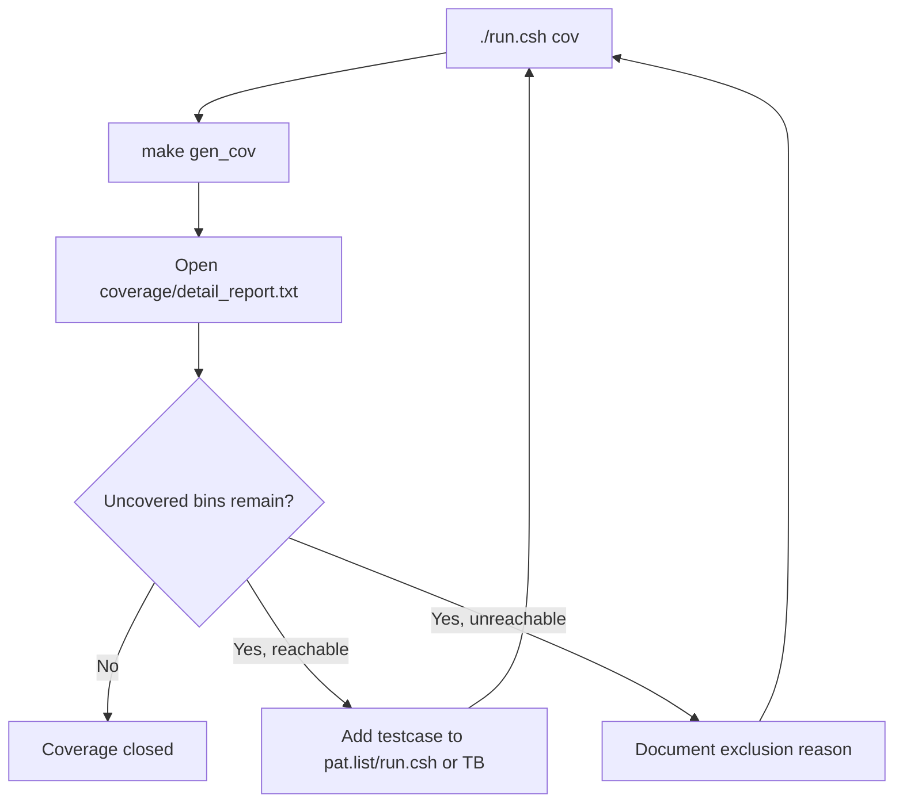

# Coverage Test Plan Specification

## 1. Purpose

Tai lieu nay dinh nghia regression coverage cho SoC RV32I + Huffman + AES-128.
Flow duoc lam theo cung y tuong voi `timer_standard_hv`:

1. chay tung testcase rieng
2. moi testcase sinh mot file `.ucdb`
3. merge tat ca `.ucdb` thanh `IP.ucdb`
4. doc text/HTML report
5. lap them testcase hoac exclusion hop le cho den khi coverage closure dat muc tieu

SoC coverage flow da duoc canh lai theo form `timer_standard_hv`:

- testbench chinh setup DUT, clock/reset, loader, checker, task dung chung
- testbench include `` `include "run_test.v" ``
- testcase nam trong `testcase/<TESTNAME>.v`
- `make build`/`make build_cov` copy testcase thanh `sim/run_test.v`
- `run_test.v` goi task chung `run_selected_test()`

Moi testcase cua SoC van can them mapping trong `run.csh` de chon:

- `TB_NAME`: top module testbench
- `C_SRC`: chuong trinh RV32I nap vao `instruction.mem`
- `RUN_ARGS`: `+CASE_NAME=... +INPUT_FILE=...`

## 2. Commands

Prerequisite:

```sh
sudo apt-get install -y csh
```

Chay coverage regression:

```sh
cd sim
./run.csh cov
```

Chay regression khong coverage:

```sh
cd sim
./run.csh
```

Tong hop pass/fail sau khi chay:

```sh
cd sim
./report.csh
```

Sinh them HTML coverage sau khi `./run.csh cov`:

```sh
cd sim
make gen_html
```

Mo coverage GUI:

```sh
cd sim
make view_cov
```

Output chinh:

| Path | Meaning |
|---|---|
| `sim/ucdb/*.ucdb` | Coverage database cua tung testcase |
| `sim/IP.ucdb` | Coverage database da merge |
| `sim/coverage/summary_report.txt` | Bao cao tong hop |
| `sim/coverage/detail_report.txt` | Bao cao chi tiet bins/line/branch/toggle |
| `sim/covhtmlreport/` | HTML coverage report neu chay `gen_html` |

## 3. Active Coverage Regression List

Danh sach testcase nam trong:

```text
sim/pat.list
```

Moi dong la mot ten testcase:

```text
dma_compress_aes_input1
```

`run.csh` map ten testcase sang:

| Field | Meaning |
|---|---|
| `TB_NAME` | top module testbench |
| `C_SRC` | C program de compile thanh `instruction.mem` |
| `RUN_ARGS` | plusargs cho simulation, vi du `+CASE_NAME=... +INPUT_FILE=input1.txt` |

Voi moi testcase, `run.csh` se chay:

```sh
make compile C_SRC=<file.c>
make all_cov TESTNAME=<pat> TB_NAME=<top> RUN_ARGS="+CASE_NAME=<pat> +INPUT_FILE=<input>"
```

sau do merge:

```sh
vcover merge IP.ucdb ucdb/*.ucdb
```

## 4. Testcase Table

| Testcase | TB | C program | Input | Main purpose | Coverage target |
|---|---|---|---|---|---|
| `dma_compress_aes_input1` | `test_bench` | `test_mmio_dma.c` | `input1.txt` | End-to-end `COMPRESS_AES`: TX compress + AES-CBC, DMEM ciphertext, RX AES-CBC decrypt + Huffman decode | CPU MMIO, APB bridge, DMA regfile, TX, RX, DMEM |
| `dma_compress_aes_input3` | `test_bench` | `test_mmio_dma.c` | `input3.txt` | End-to-end `COMPRESS_AES` voi input ngan/co lap lai cao | Multi-block/small-frame DMA/TX/RX behavior |
| `tx_compress_only_input1` | `tb_rv32_soc_tx_only` | `test_mmio_tx_only.c` | `input1.txt` | `COMPRESS_ONLY` TX-only benchmark voi text binh thuong | TX bypass AES path, compressed payload accounting |
| `tx_compress_only_input4_cov` | `tb_rv32_soc_tx_only` | `test_mmio_tx_only.c` | `input4_cov.txt` | `COMPRESS_ONLY` voi log-like input da cat nho | Compression ratio and TX output FIFO coverage |
| `tx_compress_aes_block_input3` | `tb_rv32_soc_tx_only` | `test_mmio_tx_only_aes_block.c` | `input3.txt` | TX-only `COMPRESS_AES` per-block mode `0x1` | TX mode decode, AES path, per-block status `0x18/0x1a` |
| `tx_compress_only_block_input3` | `tb_rv32_soc_tx_only` | `test_mmio_tx_only_compress_block.c` | `input3.txt` | TX-only `COMPRESS_ONLY` per-block mode `0x5` | TX bypass AES path, per-block status `0x58/0x5a` |
| `mmio_regfile_basic` | `tb_rv32_soc_mmio_regfile` | `test_mmio_regfile_basic.c` | none | CPU MMIO read/write legal path: config regs, IV regs, clear pulses, soft reset | DMA regfile legal read/write, APB bridge read/write, clear/soft-reset pulses |
| `mmio_mode_matrix` | `tb_rv32_soc_mmio_regfile` | `test_mmio_mode_matrix.c` | none | Write/read all supported mode encodings plus invalid/reserved mode values | Mode status bits for `0x1`, `0x5`, `0x9`, `0xd`, RX `0x2`, invalid `0x0/0x3`, reserved error |
| `mmio_regfile_negative` | `tb_rv32_soc_mmio_regfile` | `test_mmio_regfile_negative.c` | none | CPU MMIO illegal path: invalid start, readonly write, invalid address, reserved mode, bad block, partial byte-store | `PSLVERR`, bridge reject/error, sticky error, no DMA start on bad config |

Disabled candidates in `pat.list`:

| Testcase | Reason |
|---|---|
| `dma_compress_aes_input2_debug` | Current TX reports error on `input2.txt`; keep as debug target before adding back to clean regression |
| `dma_compress_aes_input4_cov_debug` | Current TX reports error `0x05` on log-like `input4_cov.txt`; TX-only still passes |
| `host_preprocess_input4_cov_debug` | Host parser rejects the current header line format in `input4_cov.txt` |

## 5. Current Baseline Result

Baseline moi nhat da chay ngay 2026-04-29 bang:

```sh
cd sim
./run.csh cov
./report.csh
make drc
```

Ket qua pass/fail va coverage moi nhat:

| Metric | Value |
|---|---:|
| Active testcase count | 9 |
| Passed testcase count | 9 |
| Failed testcase count | 0 |
| Merged UCDB count | 9 |
| Total Coverage By Instance | 46.16% |
| `vcover merge` | PASS, 0 warnings |
| `make drc` | PASS |

Merged UCDB files:

| UCDB |
|---|
| `dma_compress_aes_input1.ucdb` |
| `dma_compress_aes_input3.ucdb` |
| `mmio_mode_matrix.ucdb` |
| `mmio_regfile_basic.ucdb` |
| `mmio_regfile_negative.ucdb` |
| `tx_compress_aes_block_input3.ucdb` |
| `tx_compress_only_block_input3.ucdb` |
| `tx_compress_only_input1.ucdb` |
| `tx_compress_only_input4_cov.ucdb` |

Compression result captured from logs:

| Testcase | Input | Mode | Payload ratio | Payload saving | Storage ratio | Storage saving |
|---|---|---|---:|---:|---:|---:|
| `dma_compress_aes_input1` | `input1.txt` | `COMPRESS_AES` | 36.32% | 63.68% | 38.89% | 61.11% |
| `dma_compress_aes_input3` | `input3.txt` | `COMPRESS_AES` | 40.81% | 59.19% | 46.28% | 53.72% |
| `tx_compress_only_input1` | `input1.txt` | `COMPRESS_ONLY + whole_file` | 36.32% | 63.68% | 38.89% | 61.11% |
| `tx_compress_only_input4_cov` | `input4_cov.txt` | `COMPRESS_ONLY + whole_file` | 62.23% | 37.77% | 66.40% | 33.60% |
| `tx_compress_aes_block_input3` | `input3.txt` | `COMPRESS_AES + block_32B` | 28.56% | 71.44% | 33.06% | 66.94% |
| `tx_compress_only_block_input3` | `input3.txt` | `COMPRESS_ONLY + block_32B` | 28.56% | 71.44% | 33.06% | 66.94% |

Mode coverage status:

| Mode | Meaning | Covered by |
|---|---|---|
| `0x1` | TX `COMPRESS_AES`, per-block Huffman | `tx_compress_aes_block_input3`, `mmio_mode_matrix` |
| `0x5` | TX `COMPRESS_ONLY`, per-block Huffman | `tx_compress_only_block_input3`, `mmio_mode_matrix` |
| `0x9` | TX `COMPRESS_AES`, whole-file Huffman | `dma_compress_aes_input1`, `dma_compress_aes_input3`, `mmio_mode_matrix` |
| `0xd` | TX `COMPRESS_ONLY`, whole-file Huffman | `tx_compress_only_input1`, `tx_compress_only_input4_cov`, `mmio_mode_matrix` |
| `0x2` | RX decrypt + decode direction | RX phase of `dma_compress_aes_input1`, RX phase of `dma_compress_aes_input3`, `mmio_mode_matrix` |
| `0x0` | Invalid/idle direction | `mmio_mode_matrix` |
| `0x3` | Invalid combined TX/RX direction | `mmio_mode_matrix` |
| reserved bits | Illegal mode write path | `mmio_mode_matrix`, `mmio_regfile_negative` |

Baseline nay la regression sach de tiep tuc coverage closure. No chua phai
100% coverage. `Total Coverage By Instance` dang tinh theo instance/top-level,
bao gom ca cac instance khong active trong tung TB. Gia tri co y nghia hon luc
nay la: 9/9 testcase pass, `vcover merge` sach 0 warning, va mode-matrix path da
cover toan bo mode encoding hien tai.

Phan con thieu tap trung vao RX-only/error path, APB wait-state co `PREADY=0`,
malformed Huffman transport, AES IV variation, UART loader, va cac nhanh
backpressure.

## 6. Coverage Closure Targets

### 6.1 RTL functional areas that must be covered

| Area | Must cover |
|---|---|
| RV32I CPU | instruction fetch, execute, load/store, branch loop, MMIO store/load, memory return path hold |
| CPU MMIO bridge | setup/access phase, APB read, APB write, wait/hold, `PREADY`, `PSLVERR` propagation |
| DMA regfile | valid writes, status polling, start pulse, done/error clear, IV registers, invalid/reserved accesses |
| DMA TX engine | DMEM reads, partial final word, block loop, TX APB writes, output FIFO drain, bytes counters |
| DMA RX engine | ciphertext reads, 128-bit feed, RX APB polling, `RX_META`, `RX_DATA`, plaintext writes |
| TX Huffman | raw block, compressed block, one-symbol block, multi-symbol codebook, whole-file codebook |
| TX AES-CBC | CBC IV load, first block XOR IV, next block XOR previous ciphertext, output FIFO |
| RX AES-CBC | decrypt block, CBC inverse chain, IV reuse, plaintext transport stream |
| RX Huffman | header parse, raw block, compressed block, one-symbol block, end-of-frame handling |
| BRAM/DMEM | CPU port, DMA port, aux loader/testbench port, input length location, dump regions |

### 6.2 Extra tests needed to close toward 100%

| Missing test class | Why needed |
|---|---|
| DMA invalid config test | Partially covered by `mmio_regfile_negative`; con can zero-length/start edge neu muon closure sau hon |
| APB bridge wait-state test | Cover APB hold when `PREADY=0` and first MMIO write corner cases |
| RX malformed transport test | Cover parser/depacker/decoder error states |
| TX FIFO full/backpressure test | Cover stall branches in `WORD_IN` and output drain |
| RX FIFO empty/full/backpressure test | Cover `RX_STATUS` empty/full and local reset branches |
| AES IV variation test | Cover non-zero IV words and different CBC chaining transitions |
| CPU standalone instruction test | Cover RV32I instructions not naturally used by DMA software |
| UART loader FPGA wrapper simulation | Cover `uart_dmem_loader` state machine before FPGA demo |

## 7. Definition Of 100% Coverage

`100% coverage` phai duoc hieu la **coverage closure co ky luat**, khong phai
ep raw RTL report dat 100% bang cach bo qua loi.

Dieu kien chap nhan:

1. tat ca testcase trong `sim/pat.list` pass
2. `vcover merge` sinh duoc `IP.ucdb`
3. `coverage/summary_report.txt` va `coverage/detail_report.txt` duoc review
4. moi uncovered bin phai co mot trong hai ket qua:
   - them testcase de cover
   - ghi ro la unreachable/deprecated/FPGA-only/debug-only va exclude co ly do

Neu `rtl.f` van include module debug/deprecated/unused, raw coverage rat kho dat
100%. Khi closure that su, can tach coverage target thanh:

- `coverage_soc_main`: chi include active SoC RTL
- `coverage_tx_unit`: chi include active TX module tree
- `coverage_rx_unit`: chi include active RX module tree
- `coverage_fpga_wrapper`: UART/FPGA wrapper rieng

## 8. Current Makefile Flow

Current coverage targets:

| Target | Function |
|---|---|
| `make build_cov` | Compile RTL/TB voi `+cover=bcesft` |
| `make run_cov` | Run one testcase voi `-coverage`, save `<TESTNAME>.ucdb` |
| `make gen_cov` | Merge `ucdb/*.ucdb` va tao text reports |
| `make gen_html` | Tao HTML report tu merged `IP.ucdb` |
| `./run.csh` | Run all patterns in `pat.list` without coverage |
| `./run.csh cov` | Run all patterns in `pat.list` with coverage, then `gen_cov` |
| `./report.csh` | Summarize pass/fail from `log/<pat>.log` |

## 9. Practical Closure Flow



## 10. Important Notes

- `sim/pat.list` la source of truth cho regression coverage hien tai.
- Moi testcase phai co `TESTNAME` rieng de khong ghi de `.ucdb`.
- Khi doi input text hoac C program cho mot testcase, sua mapping trong
  `sim/run.csh`.
- Testbench phai in `[PASS]`/`[FAIL]` ro rang; coverage cao nhung testcase fail
  khong duoc tinh la closure.
