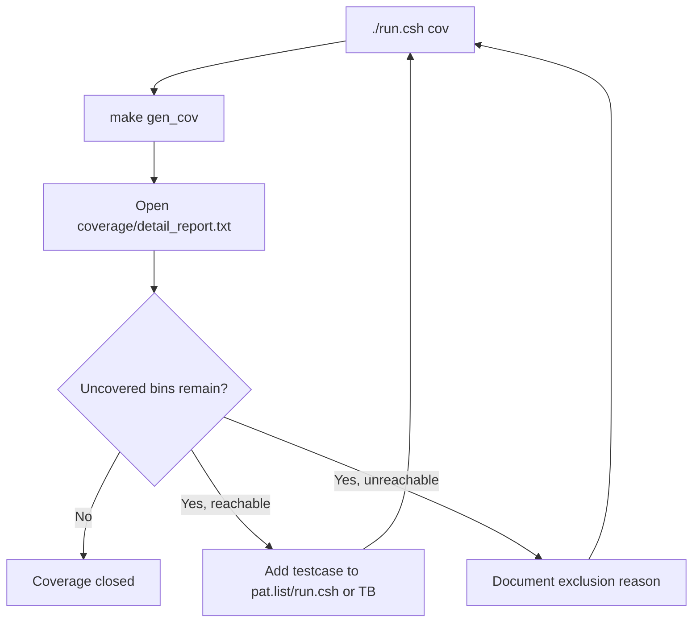

# Coverage Test Plan Specification

## 1. Purpose

This document defines regression coverage for SoC RV32I + Huffman + AES-128.
Flow is made according to the concept with `timer_standard_hv`:

1. Run each test case separately
2. The new testcase generates a file `.ucdb`
3. merge all `.ucdb` into `IP.ucdb`
4. read text/HTML report
5. Iterate more valid testcases or exclusions until coverage closure reaches the target

SoC coverage flow has been re-aligned to the form `timer_standard_hv`, but only
content **a main testbench**:

- `tb/tb_rv32_soc_mmio_dma.v` is the only main testbench, top module `test_bench`
- Main testbench setup DUT, clock/reset, loader, checker, shared tasks
- testbench include `` `include "run_test.v" ``
- testcase is in `testcase/<TESTNAME>.v`
- `make build`/`make build_cov` copy the testcase into `sim/run_test.v`
- `run_test.v` calls general task `run_selected_test()`
- The old testbench has been moved to `tb/archive/deprecated_20260429/`

The new SoC testcase still requires additional mapping in `run.csh` to select:

- `TB_NAME`: is always `test_bench` in the current clean regression
- `C_SRC`: RV32I program loaded into `instruction.mem`
- `RUN_ARGS`: `+CASE_NAME=... +INPUT_FILE=...`

## 2. Commands

Prerequisite:

```sh
sudo apt-get install -y csh
```

Run coverage regression:

```sh
cd sim
./run.csh cov
```

Run regression without coverage:

```sh
cd sim
./run.csh
```

Pass/fail summary after running:

```sh
cd sim
./report.csh
```

Generate additional HTML coverage after `./run.csh cov`:

```sh
cd sim
make gen_html
```

Mo coverage GUI:

```sh
cd sim
make view_cov
```

Main output:

| Path | Meaning |
|---|---|
| `sim/ucdb/*.ucdb` | Coverage database of each test case |
| `sim/IP.ucdb` | Coverage database da merge |
| `sim/coverage/summary_report.txt` | Bao tong hop |
| `sim/coverage/detail_report.txt` | How to set bins/line/branch/toggle only |
| `sim/covhtmlreport/` | HTML coverage report if running `gen_html` |

## 3. Active Coverage Regression List

The list of test cases is in:

```text
sim/pat.list
```

New dong is a testcase name:

```text
dma_compress_aes_input1
```

`run.csh` maps testcase name to:

| Field | Meaning |
|---|---|
| `TB_NAME` | top module testbench; clean regression currently always uses `test_bench` |
| `C_SRC` | C program to compile into `instruction.mem` |
| `RUN_ARGS` | plusargs for simulation, complete with `+CASE_NAME=... +INPUT_FILE=input1.txt` |

With the new testcase, `run.csh` will run:

```sh
make compile C_SRC=<file.c>
make all_cov TESTNAME=<pat> TB_NAME=<top> RUN_ARGS="+CASE_NAME=<pat> +INPUT_FILE=<input>"
```

then merge:

```sh
vcover merge IP.ucdb ucdb/*.ucdb
```

## 4. Testcase Table

Test cases are divided by module/function to identify new risks and test cases are being tested
What part of DUT does it cover?

### 4.1 CPU / SoC Control

| ID | Function | Testname | Description | Expectation | Testcase | Status | Comment |
|---|---|---|---|---|---|---|---|
| CPU-01 | CPU MMIO load/store | `mmio_regfile_basic` | CPU runs `test_mmio_regfile_basic.c`, writes `DMA_SRC`, `DMA_DST`, `DMA_LEN`, `DMA_MODE`, `DMA_BLOCK`, writes/reads 4 IV registers, reads back status/mode/block, then writes clear done/error and soft reset. Test does not start DMA, target is ep CPU -> memory stage -> MMIO bridge -> APB regfile -> CPU readback path. | CPU publish signature `REG1`, error mask is 0, no DMA start, soft reset pulse appears | `test_mmio_regfile_basic.c` + `mmio_regfile_basic.v` | PASS | Cover CPU memory-return path, APB bridge read/write is available |
| CPU-02 | CPU MMIO illegal access | `mmio_regfile_negative` | The CPU has the ability to write in the wrong order and to the wrong address: start without valid configuration, write to readonly/status register, access APB address incorrectly, write reserved mode, write invalid block size, and use byte/half store into MMIO. Checker counts bridge/APB errors and ensures errors are returned to the CPU without causing DMA to start that. | Sticky errors are set, bridge/APB errors are counted, no DMA false starts | `test_mmio_regfile_negative.c` + `mmio_regfile_negative.v` | PASS | Cover error propagation from APB to CPU |
| CPU-03 | CPU sideband/top hold | `soc_sideband_cov` | Before testing, run the base MMIO program `mmio_regfile_basic`. After the CPU publishes the signature, the TB starts plusarg `+SIDEBAND_COV` and directly pulses the top-level signals `cpu_stall_i`, `cpu_if_flush_i`, aux loader/address/data high-bit to hit hold/flush/toggle bins that normal software does not use. | Signature `REG1` still passes, top-level hold/flush/aux toggle bins are hit | `test_mmio_regfile_basic.c` + `soc_sideband_cov.v` | PASS | Testbench-only coverage hook, does not change the software contract |
| CPU-04 | RV32I instruction coverage | `cpu_instruction_cov` | The CPU runs the RV32I stress program, using C/inline asm to create data dependency chains and hazards: R-type ALU, I-type ALU, load/store byte/half/word, signed/unsigned load, branch taken/not-taken, `lui`, `jalr`. The results of each group of instructions are collected in a signature word in DMEM for the TB to read and compare. | Signature `CPUC`, error mask 0, R-type/I-type/memory/branch signatures used | `test_cpu_instruction_cov.c` + `cpu_instruction_cov.v` | PASS | Increased coverage of `id_stage`, `ex_stage`, forwarding and memory path |
| CPU-05 | CPU memory stage corner coverage | `cpu_mem_forward_cov` | The CPU runs its own program to execute `mem_stage`: store/load bytes at offset 0/1/2/3, store/load halfwords at offset 0/2, signed/unsigned load, word load/store, and misaligned accesses that are scheduled to hit error branches. Then write signature `CPUH` and checksum into DMEM. | Signature `CPUH`, error mask 0, mem error output to 0 after test, checksum non-zero | `test_cpu_mem_forward_cov.c` + `cpu_mem_forward_cov.v` | PASS | Increased branch/condition/statement coverage of `u_cpu/u_mem_stage` |
| CPU-06 | CPU forwarding direct mux coverage | `cpu_forward_direct_cov` | After the base MMIO pass, TB plays `+CPU_FORWARD_DIRECT_COV` and directly forces the input signals of `u_cpu/u_forwarding`: EX/MEM match rs1/rs2, MEM/WB match rs1/rs2, byte/half/word select, x0 no-match, and priority EX/MEM over MEM/WB. | Base MMIO pass, forwarding mux mix non-zero | `test_mmio_regfile_basic.c` + `cpu_forward_direct_cov.v` | PASS | Dua `u_cpu/u_forwarding` len gan/full code coverage |

### 4.2 DMA Regfile / MMIO Contract

| ID | Function | Testname | Description | Expectation | Testcase | Status | Comment |
|---|---|---|---|---|---|---|---|
| DMA-01 | Mode decode matrix | `mmio_mode_matrix` | The CPU repeatedly writes `DMA_MODE` with `0x1`, `0x5`, `0x9`, `0xd`, `0x2`, `0x0`, `0x3` and the value has reserved bits; Read the `DMA_STATUS`/mode field again to confirm decode direction, AES enabled, compress-only, whole-file/per-block. The test only checks the register contract, does not allow DMA to run the data path. | State bits used for each mode, invalid/reserved path set error, do not start DMA | `test_mmio_mode_matrix.c` + `mmio_mode_matrix.v` | PASS | Is the main test case for the software contract of `DMA_MODE` |
| DMA-02 | RX bad length config | `mmio_rx_bad_length` | CPU configures direction RX (`DMA_MODE=0x2`), `SRC=TX_REGION`, `DST=RX_REGION`, but `DMA_LEN=4` does not align 16 bytes. After writing `DMA_CTRL.start`, the RX DMA must enter the expected-error path before feeding the AES/RX transport. | RX engine reports error, bytes_done is 0, `DMA_DEBUG` last error = `0x02` | `test_mmio_rx_bad_length.c` + `mmio_rx_bad_length.v` | PASS | Cover RX DMA expected-error path and `dma_engine_error_w` |
| DMA-03 | TX APB wait-state | `tx_apb_wait_cov` | Run TX-only software normally with `input1.txt`, and at the same time start `+TX_APB_WAIT_COV` to force `tx_pready_w=0` a few cycles in the APB ACCESS phase of the DMA TX engine. The goal is to see that DMA keeps address/data/control on and only resumes when `PREADY` comes back. | TX-only flow still passes, DMA TX keeps ACCESS state until `PREADY=1` | `test_mmio_tx_only.c` + `tx_apb_wait_cov.v` | PASS | Coverage hook for APB wait-state internal TX engine |
| DMA-04 | TX APB slave error | `tx_apb_error_cov` | CPU start TX with valid configuration, TB bat `+TX_APB_ERROR_COV` to force `tx_pslverr_w=1` in an APB ACCESS to TX IP. DMA TX must use clean, register error sticky/last-error, do not consider output as valid compressed result. | TX engine reports error, sticky error set, `DMA_DEBUG` last error = `0x03` | `test_mmio_tx_apb_error.c` + `tx_apb_error_cov.v` | PASS | Cover `tx_dma_error_w` and TX APB error branch |
| DMA-05 | RX APB wait/backpressure | `rx_backpressure_cov` | Run full TX->RX loopback `input1.txt`; In the RX phase, the TB turns on `+RX_APB_WAIT_COV` to insert `PREADY=0` on the RX APB read and turns on `+RX_STREAM_BACKPRESSURE_COV` to make the ciphertext valid but RX ready low. Checker compares the final plaintext with the source to ensure no words are lost. | Loopback still passes, RX engine does not lose ciphertext word | `test_mmio_dma.c` + `rx_backpressure_cov.v` | PASS | Cover RX APB wait-state and stream backpressure are available |
| DMA-06 | DMA bridge/regfile direct defensive coverage | `dma_bridge_direct_cov` | After base MMIO pass, TB starts `+DMA_BRIDGE_DIRECT_COV` and directly forces bridge, `dma_regfile`, DMA TX/RX into wait/error/invalid rare phases: APB wait, PSLVERR, busy-write, invalid state, bad block size, misaligned config. | Base MMIO pass, branch/statement of bridge/regfile/DMA engine increased, software contract unchanged | `test_mmio_regfile_basic.c` + `dma_bridge_direct_cov.v` | PASS | White-box coverage hook for defensive branches of the repository created by CPU program |

### 4.3 TX Encode / Compress / AES

| ID | Function | Testname | Description | Expectation | Testcase | Status | Comment |
|---|---|---|---|---|---|---|---|
| TX-01 | TX whole-file `COMPRESS_ONLY` | `tx_compress_only_input1` | TB loads `input1.txt` into DMEM source, CPU configures TX-only `DMA_MODE=0xd` whole-file Huffman bypass AES, `SRC=0x2000`, `DST=TX_REGION`, `LEN=input_len`, `BLOCK=32`, then polling `DMA_STATUS.done`. After done, TB dump source/TX region, calculate payload ratio/storage ratio and check TX region is not all-zero. | TX done, bytes_done align 16 bytes, TX output not all-zero, saving paths | `test_mmio_tx_only.c` + `tx_compress_only_input1.v` | PASS | Because saving directly does not go through RX |
| TX-02 | TX whole-file `COMPRESS_ONLY` log-like | `tx_compress_only_input4_cov` | Same as TX-01 but input is `input4_cov.txt` longer log-like. The goal is ep dynamic Huffman reads the entire file frequency, creates the entire file codebook, dumps output transport and registers savings to compare with other input text. | TX done, output valid, storage saving line with small data log input | `test_mmio_tx_only.c` + `tx_compress_only_input4_cov.v` | PASS | Used to monitor the ability to log-like input |
| TX-03 | TX block `COMPRESS_AES` | `tx_compress_aes_block_input3` | CPU configured TX-only mode `0x1`, meaning Huffman in 32-byte blocks and AES-CBC enabled. CPU writes IV to `DMA_IV0..3`, starts DMA, TX reads DMEM source, adds each block, pack transport, AES encryption, writes ciphertext to the TX region; TB only checks TX side, not RX. | Before/after status uses `0x18/0x1a`, ciphertext bytes align 16 bytes | `test_mmio_tx_only_aes_block.c` + `tx_compress_aes_block_input3.v` | PASS | Cover compatibility mode block-32B has AES |
| TX-04 | TX block `COMPRESS_ONLY` | `tx_compress_only_block_input3` | CPU configured TX-only mode `0x5`, data supply `input3.txt`, Huffman in 32 byte blocks but AES bypass. TB checks output transport raw/compressed of block mode, status bits compress-only, and counter `ciphertext_bytes_produced` align according to storage interface. | Status before/after using `0x58/0x5a`, transport output is valid | `test_mmio_tx_only_compress_block.c` + `tx_compress_only_block_input3.v` | PASS | Cover compatibility mode block-32B bypass AES |
| TX-05 | TX one-symbol whole-file | `tx_compress_only_one_symbol_cov` | TB loads file repeatedly as a symbol (`input_cov_one_symbol.txt`), CPU runs TX-only whole-file bypass AES. In this case the global frequency counter, symbol list, code-length builder, header formatter and decoder-compatible transport handle extreme/one-symbol character distribution. | TX done, output align 16 bytes, saving lines | `test_mmio_tx_only.c` + `tx_compress_only_one_symbol_cov.v` | PASS | Cover symbol distribution extreme |
| TX-06 | TX 256-symbol sweep stress | `tx_compress_only_ascii_sweep_cov` | TB load `input_cov_ascii_sweep.txt` has many different byte-symbols, CPU runs TX-only whole-file bypass AES with alphabet 256 symbols. This case stresses frequency table, code-length table, canonical generator, header formatter and payload path with nearly uniform input. | TX done, output align 16 bytes, source match; storage expansion is expected with input near uniform | `test_mmio_tx_only.c` + `tx_compress_only_ascii_sweep_cov.v` | PASS | After codebook len 256, this case is no longer expected overflow error |
| TX-07 | TX alnum63 stress | `tx_compress_only_alnum63_cov` | TB loads `input_cov_alnum63.txt`, which contains 62 alphanumeric characters plus newline, for 63 valid symbols. The CPU runs TX-only whole-file bypass AES so the global frequency counter, symbol list, code-length builder, and canonical generator traverse multiple symbols in the 256-entry alphabet. | TX done, output align 16 byte, debug 0, source match | `test_mmio_tx_only.c` + `tx_compress_only_alnum63_cov.v` | PASS | Stress Huffman valid builder; saving is possible due to large header/codebook |
| TX-08 | TX short input | `tx_compress_only_short_raw_cov` | TB load input is very short (`input_cov_short_raw.txt`, 7 bytes), CPU runs TX-only whole-file bypass AES. This case involves ep final partial word, padding/alignment, header overhead larger than payload, and fast raw/compressed decisions when input is smaller than nominal block. | TX done, output is valid | `test_mmio_tx_only.c` + `tx_compress_only_short_raw_cov.v` | PASS | Cover short-input path |
| TX-09 | TX APB IF direct coverage | `tx_if_direct_cov` | After base MMIO test pass, TB starts `+TX_IF_DIRECT_COV` and forces APB directly into `apb_huffman_tx_if`: read status/debug when FIFO is empty, write invalid block/policy/control, start when config is missing, soft reset, load 8 word input FIFO, force core not-ready, fill FIFO output with forced AES words, read meta/data, and create simultaneous push/pop/full/error. | Base MMIO test pass, `apb_huffman_tx_if` hits additional branch/expression/status/error bins | `test_mmio_regfile_basic.c` + `tx_if_direct_cov.v` | PASS | Coverage hooks focus on the TX APB wrapper, not the new software contract |
| TX-10 | TX encoder direct coverage | `tx_encoder_direct_cov` | After the base MMIO pass, TB enters `+TX_ENCODER_DIRECT_COV` and forces the stage encoder/mode-decision/header/payload to cover raw/compressed decision, one-symbol, table entry, start/done/error and defensive branch rare. | Base MMIO pass, TX encoder branch/statement/toggle bins increased | `test_mmio_regfile_basic.c` + `tx_encoder_direct_cov.v` | PASS | White-box coverage hook for `dynamic_huffman_encoder` and remaining modules |
| TX-11 | TX builder/packer direct coverage | `tx_builder_packer_direct_cov` | After base MMIO pass, TB bat `+TX_BUILDER_PACKER_DIRECT_COV` and force Huffman builder, code-length/canonical generator, bit-packer via one-symbol, multi-symbol, overflow, final partial word and flush paths. | Base MMIO pass, Huffman builder/packer bins increased | `test_mmio_regfile_basic.c` + `tx_builder_packer_direct_cov.v` | PASS | White-box coverage hook for codebook builder and transport packer |

### 4.4 RX Decode / Decrypt

| ID | Function | Testname | Description | Expectation | Testcase | Status | Comment |
|---|---|---|---|---|---|---|---|
| RX-01 | RX decrypt + Huffman decode normal | `dma_compress_aes_input1` | Full two-phase loopback: CPU starts TX `COMPRESS_AES` whole-file to write ciphertext into the TX region, then CPU configures RX `DMA_MODE=0x2`, `SRC=TX_REGION`, `DST=RX_REGION`, `LEN=tx_bytes_done`. RX DMA reads 128-bit ciphertext, feeds AES inverse CBC, depacks transport, parses Huffman header/codebook, decodes plaintext and writes DMEM RX region. | RX done, `rx_bytes_done == input_len`, RX output match source | `test_mmio_dma.c` + `dma_compress_aes_input1.v` | PASS | Cover RX normal path with long input |
| RX-02 | RX decrypt + Huffman decode small/repeated | `dma_compress_aes_input3` | Same as RX-01 but with short and highly repetitive `input3.txt`. This case causes the RX parser/decoder to encounter small frames, low symbol count, short payload, faster final-frame, but still go through AES-CBC decrypt and DMEM writeback as the main path. | RX done, output matches source, parser/decoder produces small frame | `test_mmio_dma.c` + `dma_compress_aes_input3.v` | PASS | Cover small-frame behavior |
| RX-06 | RX one-symbol loopback | `dma_compress_aes_one_symbol_cov` | TX creates ciphertext from input one-symbol, then RX decrypt/decode again. The RX must read the unique header/codebook of a symbol distribution, generate repeated plaintext, and bytes_done must be equal to the input length after writing to DMEM. | RX output match source | `test_mmio_dma.c` + `dma_compress_aes_one_symbol_cov.v` | PASS | Cover one-symbol/short-frame behavior |
| RX-09 | RX alnum63 loopback | `dma_compress_aes_alnum63_cov` | TX creates ciphertext from `input_cov_alnum63.txt` gathering 63 valid symbols, then RX decrypts/decodes again. In this case, the RX parser/decoder detects a larger codebook than normal inputs and confirms that the AES-CBC + Huffman loopback path is still used. | RX done, `rx_bytes_done == 504`, RX output match source, parser/decoder report `symbol_count=63` | `test_mmio_dma.c` + `dma_compress_aes_alnum63_cov.v` | PASS | Functional coverage case for alnum63 E2E; saving can be due to header/codebook overhead |
| RX-03 | RX malformed length | `mmio_rx_bad_length` | CPU start RX with `DMA_LEN` does not divide all by 16 bytes, while RX AES input requires 128-bit ciphertext block. Test to confirm that the error is in the RX DMA/config layer, not feeding incorrect data into AES inverse/parser. | RX expected error, plaintext not registered | `test_mmio_rx_bad_length.c` + `mmio_rx_bad_length.v` | PASS | Current error path of RX DMA |
| RX-04 | RX stream backpressure | `rx_backpressure_cov` | Run loopback `input1.txt`; In RX phase TB creates backpressure on the RX ciphertext/transport path by keeping ready low when valid is high and inserting APB read wait-state. Then the checker still compares the RX DMEM with the source to prove that the handshake does not drop/duplicate words. | RX does not lose data, loopback still matches input | `test_mmio_dma.c` + `rx_backpressure_cov.v` | PASS | Backpressure has a ban, but hasn't covered full FIFO yet |
| RX-05 | RX APB IF direct coverage | `rx_if_direct_cov` | After base MMIO pass, TB launches direct hook into `apb_huffman_rx_if`: reads data when FIFO is empty, writes invalid address/control, force ciphertext pending, force FIFO full, creates simultaneous push/pop, invalid `valid_bytes`, invalid metadata and parser error. Goal is a defensive hit branch that normal software cannot create. | Base MMIO test pass, `apb_huffman_rx_if` hit empty/full/error/wait branches | `test_mmio_regfile_basic.c` + `rx_if_direct_cov.v` | PASS | Coverage hook focuses on `apb_huffman_rx_if`, not the new software contract |
| RX-07 | RX parser/decoder direct coverage | `rx_parser_decoder_cov` | After the base MMIO pass, TB enters `+RX_PARSE_DECODE_COV` to drive the transport stream directly into the RX parser/decoder: raw-full 32-byte multi-chunk frame, raw partial frame, one-symbol frame, compressed 1-symbol frame, compressed 2-symbol multi-entry frame, malformed header/payload/code and zero-length chunk. Test does not depend on CPU software; The goal is to cover the state/error bins of the parser and decoder. | Base MMIO test pass, parser/decoder state/error bins increased | `test_mmio_regfile_basic.c` + `rx_parser_decoder_cov.v` | PASS | Coverage hook, does not change the software contract |
| RX-08 | RX decoder fallback/error direct coverage | `rx_decoder_direct_cov` | After the base MMIO pass, TB enters `+RX_DECODER_DIRECT_COV` and forces the wire parser->decoder directly. Test creates long-code len=12 to ep main-table long entry and fallback decode, reuse table with `symbol_count=0`, then ep duplicate entry, missing/early `entry_last`, raw/one-symbol/compressed metadata error. | Base MMIO test pass, decoder fallback/error bins increased | `test_mmio_regfile_basic.c` + `rx_decoder_direct_cov.v` | PASS | Coverage hook specifically for `huffman_block_decoder` |
| RX-10 | RX depacker/packer direct coverage | `rx_depacker_packer_direct_cov` | After base MMIO pass, TB enters `+RX_DEPACKER_PACKER_DIRECT_COV` to drive malformed transport, invalid valid-bytes, final partial word, FIFO full/empty, byte-packer backpressure and error branches. | Base MMIO pass, depacker/packer bins increased | `test_mmio_regfile_basic.c` + `rx_depacker_packer_direct_cov.v` | PASS | White-box coverage hook for RX data formatting |
| RX-11 | RX parser/decoder error direct coverage | `rx_parser_decoder_error_direct_cov` | After base MMIO pass, TB enters `+RX_PARSE_DECODE_ERROR_DIRECT_COV` to create invalid header, invalid code length, missing/early entry_last, zero-length and append-dummy paths. | Base MMIO pass, parser/decoder defensive error bins increased | `test_mmio_regfile_basic.c` + `rx_parser_decoder_error_direct_cov.v` | PASS | Additional malformed paths should not be created using normal DMA |

### 4.5 SoC End-To-End

| ID | Function | Testname | Description | Expectation | Testcase | Status | Comment |
|---|---|---|---|---|---|---|---|
| SOC-01 | Full TX->RX secure storage | `dma_compress_aes_input1` | TB loads `input1.txt` into DMEM source, CPU creates IV, configures TX whole-file `COMPRESS_AES`, polling done, saves `tx_bytes_done`, then configures RX to read ciphertext just written and decode to the RX region. TB dump 3 areas of DMEM source/TX/RX, calculate throughput/saving, compare source with RX output byte by byte. | Source DMEM match input file, RX DMEM match source, TX region not all-zero, 2 DMA starts | `test_mmio_dma.c` + `dma_compress_aes_input1.v` | PASS | Main system regression |
| SOC-02 | Full TX->RX small input | `dma_compress_aes_input3` | Similar to SOC-01 but the input is short and has many repeated characters. This case is used to test end-to-end when Huffman whole-file creates a small codebook, the ciphertext is less blocky, the RX parser finishes the frame more quickly, and the benchmark still calculates saving/throughput. | Loopback pass, saving path, small-frame path pass | `test_mmio_dma.c` + `dma_compress_aes_input3.v` | PASS | Added variation for Huffman dynamic whole-file |
| SOC-03 | Full TX->RX alnum63 stress | `dma_compress_aes_alnum63_cov` | Similar to SOC-01 but the input is `input_cov_alnum63.txt`, collecting 63 valid symbols in alphabet 256. The goal is a full TX/RX stress path with a larger codebook and higher data entropy, not for me to save. | Loopback pass, RX output match source, TX ciphertext non-zero, 2 DMA starts | `test_mmio_dma.c` + `dma_compress_aes_alnum63_cov.v` | PASS | Functional stress case; payload/storage saving am is expected with input near uniform |
| SOC-04 | Software-managed storage table | `dma_storage_table_input1_then_input3` | TB loads `input1.txt` into source1 and `input3.txt` into source2. CPU TX input1, write metadata register 0, TX input3, write metadata register 1, then select `file_id=1` and RX input1 again from metadata. | `storage_selected_file_id=1`, `storage_total_registers=2`, `storage_dma_start_pulse_count=3`, RX output match input1 | `test_mmio_dma_storage_table.c` + `dma_storage_table_input1_then_input3.v` | PASS | Demo storage-management software; case is in clean baseline 34/34 |
| SOC-05 | Raw DUT stress closure | `raw_dut_stress_cov` | After the base MMIO pass, the TB starts many coverage hooks including: sideband, TX/RX direct hooks, CPU forwarding, DMA bridge and raw DUT stress sweep. This hook uses FSM reset transition, debug reduction OR terms, memory-array toggle and defensive state/toggle bins created with regular software. | Base MMIO pass, raw DUT `bcesft` increased length over 90%, no change in functional contract | `test_mmio_regfile_basic.c` + `raw_dut_stress_cov.v` | PASS | Testbench-only coverage closure hook; Do not use as a functional demo |

Disabled candidates in `pat.list`:

| Testcase | Reason |
|---|---|
| `dma_compress_aes_input2_debug` | Current TX reports error on `input2.txt`; keep as debug target before adding back to clean regression |
| `dma_compress_aes_input4_cov_debug` | Current TX reports error `0x05` on log-like `input4_cov.txt`; TX-only still passes |

## 5. Current Baseline Result

Latest Baseline will run immediately 2026-05-10 with:

```sh
cd sim
./run.csh cov
./report.csh
make drc
```

Latest pass/fail and coverage results:

| Metric | Value |
|---|---:|
| Active testcase count | 34 |
| Passed testcase count | 34 |
| Failed testcase count | 0 |
| Merged UCDB count | 34 |
| Raw overall summary coverage | 92.51% |
| Raw DUT total with toggle (`bcesft`) | 93.52% |
| Raw DUT total without toggle (`bcesf`) | 94.44% |
| Raw DUT statement coverage | 96.33% |
| Raw DUT branch coverage | 94.22% |
| Raw DUT branch+statement (`bs`) | 95.27% |
| Closed DUT Total Coverage By Instance | 95.90% |
| `vcover merge` | PASS, 0 warnings |
| `make drc` | PASS |

Merged UCDB files:

| UCDB |
|---|
| `cpu_forward_direct_cov.ucdb` |
| `cpu_instruction_cov.ucdb` |
| `cpu_mem_forward_cov.ucdb` |
| `dma_bridge_direct_cov.ucdb` |
| `dma_compress_aes_alnum63_cov.ucdb` |
| `dma_compress_aes_input1.ucdb` |
| `dma_compress_aes_input3.ucdb` |
| `dma_compress_aes_one_symbol_cov.ucdb` |
| `dma_storage_table_input1_then_input3.ucdb` |
| `mmio_mode_matrix.ucdb` |
| `mmio_regfile_basic.ucdb` |
| `mmio_regfile_negative.ucdb` |
| `mmio_rx_bad_length.ucdb` |
| `raw_dut_stress_cov.ucdb` |
| `rx_backpressure_cov.ucdb` |
| `rx_decoder_direct_cov.ucdb` |
| `rx_depacker_packer_direct_cov.ucdb` |
| `rx_if_direct_cov.ucdb` |
| `rx_parser_decoder_cov.ucdb` |
| `rx_parser_decoder_error_direct_cov.ucdb` |
| `soc_sideband_cov.ucdb` |
| `tx_apb_error_cov.ucdb` |
| `tx_apb_wait_cov.ucdb` |
| `tx_builder_packer_direct_cov.ucdb` |
| `tx_compress_aes_block_input3.ucdb` |
| `tx_compress_only_ascii_sweep_cov.ucdb` |
| `tx_compress_only_alnum63_cov.ucdb` |
| `tx_compress_only_block_input3.ucdb` |
| `tx_compress_only_input1.ucdb` |
| `tx_compress_only_input4_cov.ucdb` |
| `tx_compress_only_one_symbol_cov.ucdb` |
| `tx_compress_only_short_raw_cov.ucdb` |
| `tx_encoder_direct_cov.ucdb` |
| `tx_if_direct_cov.ucdb` |

Compression result captured from logs:

| Testcase | Input | Mode | Payload ratio | Payload saving | Storage ratio | Storage saving |
|---|---|---|---:|---:|---:|---:|
| `dma_compress_aes_input1` | `input1.txt` | `COMPRESS_AES` | 37.50% | 62.50% | 40.14% | 59.86% |
| `dma_compress_aes_input3` | `input3.txt` | `COMPRESS_AES` | 42.05% | 57.95% | 46.28% | 53.72% |
| `dma_compress_aes_alnum63_cov` | `input_cov_alnum63.txt` | `COMPRESS_AES` | 101.86% | -1.86% | 111.11% | -11.11% |
| `tx_compress_only_input1` | `input1.txt` | `COMPRESS_ONLY + whole_file` | 37.50% | 62.50% | 40.14% | 59.86% |
| `tx_compress_only_input4_cov` | `input4_cov.txt` | `COMPRESS_ONLY + whole_file` | 63.40% | 36.60% | 67.73% | 32.27% |
| `tx_compress_only_alnum63_cov` | `input_cov_alnum63.txt` | `COMPRESS_ONLY + whole_file` | 101.86% | -1.86% | 111.11% | -11.11% |
| `tx_compress_aes_block_input3` | `input3.txt` | `COMPRESS_AES + block_32B` | 29.65% | 70.35% | 33.06% | 66.94% |
| `tx_compress_only_block_input3` | `input3.txt` | `COMPRESS_ONLY + block_32B` | 29.65% | 70.35% | 33.06% | 66.94% |

Mode coverage status:

| Mode | Meaning | Covered by |
|---|---|---|
| `0x1` | TX `COMPRESS_AES`, per-block Huffman | `tx_compress_aes_block_input3`, `mmio_mode_matrix` |
| `0x5` | TX `COMPRESS_ONLY`, per-block Huffman | `tx_compress_only_block_input3`, `mmio_mode_matrix` |
| `0x9` | TX `COMPRESS_AES`, whole-file Huffman | `dma_compress_aes_input1`, `dma_compress_aes_input3`, `dma_compress_aes_alnum63_cov`, `mmio_mode_matrix` |
| `0xd` | TX `COMPRESS_ONLY`, whole-file Huffman | `tx_compress_only_input1`, `tx_compress_only_input4_cov`, `mmio_mode_matrix` |
| `0x2` | RX decrypt + decode direction | RX phase of `dma_compress_aes_input1`, RX phase of `dma_compress_aes_input3`, RX phase of `dma_compress_aes_alnum63_cov`, `mmio_mode_matrix` |
| `0x0` | Invalid/idle direction | `mmio_mode_matrix` |
| `0x3` | Invalid combined TX/RX direction | `mmio_mode_matrix` |
| reserved bits | Illegal mode write path | `mmio_mode_matrix`, `mmio_regfile_negative` |

Module target after this baseline:

| Module / Instance | Branch | Condition | Expression | Statement | Comment |
|---|---:|---:|---:|---:|---|
| `u_cpu/u_mem_stage` | 91.22% | 92.85% | 100.00% | 96.40% | Skin added `cpu_mem_forward_cov` |
| `u_cpu/u_forwarding` | 100.00% | 100.00% | 100.00% | 100.00% | Skin added `cpu_forward_direct_cov` |
| `u_rx_top/u_huffman_block_parser` | 94.11% | 76.59% | 88.88% | 98.54% | Skin adds raw-full/multi-entry/malformed direct frame; The remaining bottleneck is condition/toggle |
| `u_rx_top/u_huffman_block_decoder` | 97.64% | 85.41% | 78.94% | 99.44% | Skin increased by decoder fallback/error direct coverage; The remaining bottleneck is expression/toggle |

This baseline is a regression book to continue coverage closure. If you run report
live on `/test_bench/dut -recursive`, current raw total DUT coverage
is 93.52% when calculating toggle and 94.44% when excluding toggle. Private statement is
96.33%, separate branch is 94.22%, branch+statement is 95.27%, but these comparisons
Not raw full DUT coverage. Closed coverage is 95.90% in
`sim/coverage/dut_closed_report.txt`, created from `sim/IP_closed.ucdb` after
Apply `sim/coverage_close.do`.

Closed report exclude toggle coverage, condition/expression/FSM-transition bins
and a number defensive/rare branch/statement scope of Huffman/RX parser/decoder.
This is coverage-closure report, not raw DUT total coverage 93.52%.

The missing part in the raw report now focuses on toggle and number
condition/expression of Huffman parser/decoder, AES wrapper and wide bus of
TX/RX. FSM state/transition on raw DUT is 100% after `raw_dut_stress_cov`.
CPU `mem_stage`, `forwarding`, MMIO bridge, DMA regfile and large partition
branch/statement of TX/RX provides good closure.

## 6. Coverage Closure Targets

### 6.1 RTL functional areas that must be covered

| Area | Must cover |
|---|---|
| RV32I CPU | instruction fetch, execute, load/store, branch loop, MMIO store/load, memory return path hold |
| CPU MMIO bridge | setup/access phase, APB read, APB write, wait/hold, `PREADY`, `PSLVERR` propagation |
| DMA regfile | valid writes, status polling, start pulse, done/error clear, IV registers, invalid/reserved accesses |
| DMA TX engine | DMEM reads, partial final word, block loop, TX APB writes, output FIFO drain, bytes counters |
| DMA RX engine | ciphertext reads, 128-bit feed, RX APB polling, `RX_META`, `RX_DATA`, plaintext writes |
| TX Huffman | raw block, compressed block, one-symbol block, multi-symbol codebook, whole-file codebook |
| TX AES-CBC | CBC IV load, first block XOR IV, next block XOR previous ciphertext, output FIFO |
| RX AES-CBC | decrypt block, CBC inverse chain, IV reuse, plaintext transport stream |
| RX Huffman | header parse, raw block, compressed block, one-symbol block, end-of-frame handling |
| BRAM/DMEM | CPU port, DMA port, aux loader/testbench port, input length location, dump regions |

### 6.2 Extra tests needed to close toward 100%

| Missing test class | Why needed |
|---|---|
| Extra DMA invalid config edges | `mmio_regfile_negative`, `mmio_rx_bad_length`, `dma_bridge_direct_cov` large size cover; Only zero-length/start edge is required if raw closure is desired later |
| CPU bridge-level APB wait-state | TX/RX private APB wait-state coverage; If you add a new APB slave, you need to test the wait-state directly on `cpu_mmio_to_apb_bridge` |
| RX malformed transport/extreme parser cases | Parser/depacker/decoder errors are covered a lot with direct hooks; The rest are mainly extreme conditions/expressions |
| TX/RX wide-bus toggle | Raw bcesft is also hampered by wide AES/Huffman/DMA buses and memory-array toggle |
| UART loader FPGA wrapper simulation | Not yet main SoC coverage denominator; Need to test separately if using UART wrapper to target FPGA coverage |

## 7. Definition Of 100% Coverage

`100% coverage` should be understood as **legal coverage closure**, it is not
ep raw RTL report data 100% by ignoring errors.

Conditions of acceptance:

1. All test cases in `sim/pat.list` pass
2. `vcover merge` generates `IP.ucdb`
3. `coverage/summary_report.txt` and `coverage/detail_report.txt` are reviewed
4. New uncovered bin must have one of two results:
   - add testcases to cover
   - Mark as unreachable/deprecated/FPGA-only/debug-only and exclude for a reason

If `rtl.f` still includes the debug/deprecated/unused module, raw coverage is very poor.
100%. When actually closing, it is necessary to separate the target coverage into:

- `coverage_soc_main`: only includes active SoC RTL
- `coverage_tx_unit`: only includes active TX module tree
- `coverage_rx_unit`: only includes active RX module tree
- `coverage_fpga_wrapper`: separate UART/FPGA wrapper

## 8. Current Makefile Flow

Current coverage targets:

| Target | Function |
|---|---|
| `make build_cov` | Compile RTL/TB with `+cover=bcesft` |
| `make run_cov` | Run one testcase with `-coverage`, save `<TESTNAME>.ucdb` |
| `make gen_cov` | Merge `ucdb/*.ucdb` and create text reports |
| `make gen_html` | Create HTML report from merged `IP.ucdb` |
| `./run.csh` | Run all patterns in `pat.list` without coverage |
| `./run.csh cov` | Run all patterns in `pat.list` with coverage, then `gen_cov` |
| `./report.csh` | Summarize pass/fail from `log/<pat>.log` |

## 9. Practical Closure Flow



## 10. Important Notes

- `sim/pat.list` is the source of truth for current regression coverage.
- New testcases must have a separate `TESTNAME` number they cannot be written to `.ucdb`.
- When changing input text or C program for a test case, edit the internal mapping
  `sim/run.csh`.
- Testbench should print `[PASS]`/`[FAIL]` clearly; High coverage but test case fails
does not count as closure.
