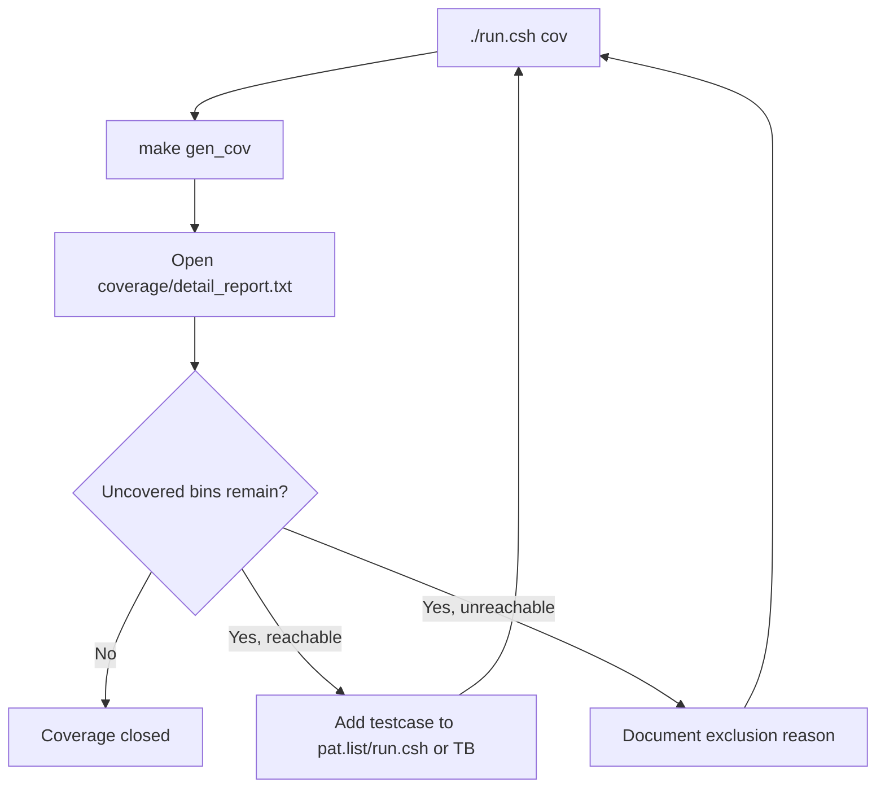

# Coverage Test Plan Specification

## 1. Purpose

Tai lieu nay dinh nghia regression coverage cho SoC RV32I + Huffman + AES-128.
Flow duoc lam theo cung y tuong voi `timer_standard_hv`:

1. chay tung testcase rieng
2. moi testcase sinh mot file `.ucdb`
3. merge tat ca `.ucdb` thanh `IP.ucdb`
4. doc text/HTML report
5. lap them testcase hoac exclusion hop le cho den khi coverage closure dat muc tieu

SoC coverage flow da duoc canh lai theo form `timer_standard_hv`, nhung chi
dung **mot testbench chinh**:

- `tb/tb_rv32_soc_mmio_dma.v` la testbench chinh duy nhat, top module `test_bench`
- testbench chinh setup DUT, clock/reset, loader, checker, task dung chung
- testbench include `` `include "run_test.v" ``
- testcase nam trong `testcase/<TESTNAME>.v`
- `make build`/`make build_cov` copy testcase thanh `sim/run_test.v`
- `run_test.v` goi task chung `run_selected_test()`
- cac testbench cu da duoc chuyen vao `tb/archive/deprecated_20260429/`

Moi testcase cua SoC van can them mapping trong `run.csh` de chon:

- `TB_NAME`: luon la `test_bench` trong clean regression hien tai
- `C_SRC`: chuong trinh RV32I nap vao `instruction.mem`
- `RUN_ARGS`: `+CASE_NAME=... +INPUT_FILE=...`

## 2. Commands

Prerequisite:

```sh
sudo apt-get install -y csh
```

Chay coverage regression:

```sh
cd sim
./run.csh cov
```

Chay regression khong coverage:

```sh
cd sim
./run.csh
```

Tong hop pass/fail sau khi chay:

```sh
cd sim
./report.csh
```

Sinh them HTML coverage sau khi `./run.csh cov`:

```sh
cd sim
make gen_html
```

Mo coverage GUI:

```sh
cd sim
make view_cov
```

Output chinh:

| Path | Meaning |
|---|---|
| `sim/ucdb/*.ucdb` | Coverage database cua tung testcase |
| `sim/IP.ucdb` | Coverage database da merge |
| `sim/coverage/summary_report.txt` | Bao cao tong hop |
| `sim/coverage/detail_report.txt` | Bao cao chi tiet bins/line/branch/toggle |
| `sim/covhtmlreport/` | HTML coverage report neu chay `gen_html` |

## 3. Active Coverage Regression List

Danh sach testcase nam trong:

```text
sim/pat.list
```

Moi dong la mot ten testcase:

```text
dma_compress_aes_input1
```

`run.csh` map ten testcase sang:

| Field | Meaning |
|---|---|
| `TB_NAME` | top module testbench; clean regression hien tai luon dung `test_bench` |
| `C_SRC` | C program de compile thanh `instruction.mem` |
| `RUN_ARGS` | plusargs cho simulation, vi du `+CASE_NAME=... +INPUT_FILE=input1.txt` |

Voi moi testcase, `run.csh` se chay:

```sh
make compile C_SRC=<file.c>
make all_cov TESTNAME=<pat> TB_NAME=<top> RUN_ARGS="+CASE_NAME=<pat> +INPUT_FILE=<input>"
```

sau do merge:

```sh
vcover merge IP.ucdb ucdb/*.ucdb
```

## 4. Testcase Table

Bang testcase duoc chia theo module/chuc nang de biet ro moi testcase dang phuc
vu cover phan nao cua DUT.

### 4.1 CPU / SoC Control

| ID | Function | Testname | Description | Expectation | Testcase | Status | Comment |
|---|---|---|---|---|---|---|---|
| CPU-01 | CPU MMIO load/store | `mmio_regfile_basic` | RV32I ghi/doc cac thanh ghi DMA hop le, IV regs, clear pulse va soft reset | CPU publish signature `REG1`, error mask bang 0, no DMA start, soft reset pulse xuat hien | `test_mmio_regfile_basic.c` + `mmio_regfile_basic.v` | PASS | Cover CPU memory-return path, APB bridge read/write co ban |
| CPU-02 | CPU MMIO illegal access | `mmio_regfile_negative` | RV32I tao cac access sai: invalid start, readonly write, invalid address, reserved mode, bad block, byte-store reject | Sticky error duoc set, bridge/APB error duoc dem, khong co DMA start sai | `test_mmio_regfile_negative.c` + `mmio_regfile_negative.v` | PASS | Cover error propagation tu APB ve CPU |
| CPU-03 | CPU sideband/top hold | `soc_sideband_cov` | Testbench pulse `cpu_stall_i`, `cpu_if_flush_i` va aux high-bit activity sau khi CPU test ket thuc | Signature `REG1` van pass, top-level hold/flush/aux toggle bins duoc hit | `test_mmio_regfile_basic.c` + `soc_sideband_cov.v` | PASS | Testbench-only coverage hook, khong thay doi software contract |
| CPU-04 | RV32I instruction coverage | `cpu_instruction_cov` | Chuong trinh C/inline asm ep R-type, I-type, load/store byte/half/word, branch, `lui`, `jalr` | Signature `CPUC`, error mask 0, ALU/memory/branch signatures dung | `test_cpu_instruction_cov.c` + `cpu_instruction_cov.v` | PASS | Tang coverage `id_stage`, `ex_stage`, forwarding va memory path |

### 4.2 DMA Regfile / MMIO Contract

| ID | Function | Testname | Description | Expectation | Testcase | Status | Comment |
|---|---|---|---|---|---|---|---|
| DMA-01 | Mode decode matrix | `mmio_mode_matrix` | Ghi/doc tat ca mode hien tai: `0x1`, `0x5`, `0x9`, `0xd`, RX `0x2`, invalid `0x0/0x3`, reserved bits | Status bits dung voi tung mode, invalid/reserved path set error, khong start DMA | `test_mmio_mode_matrix.c` + `mmio_mode_matrix.v` | PASS | La testcase chinh cho software contract cua `DMA_MODE` |
| DMA-02 | RX bad length config | `mmio_rx_bad_length` | Start RX voi ciphertext length khong align 16 byte | RX engine bao error, bytes_done bang 0, `DMA_DEBUG` last error = `0x02` | `test_mmio_rx_bad_length.c` + `mmio_rx_bad_length.v` | PASS | Cover RX DMA expected-error path va `dma_engine_error_w` |
| DMA-03 | TX APB wait-state | `tx_apb_wait_cov` | Inject `tx_pready_w=0` trong TX DMA APB ACCESS | TX-only flow van pass, DMA TX giu state ACCESS den khi `PREADY=1` | `test_mmio_tx_only.c` + `tx_apb_wait_cov.v` | PASS | Coverage hook cho APB wait-state noi bo TX engine |
| DMA-04 | TX APB slave error | `tx_apb_error_cov` | Inject `tx_pslverr_w=1` trong TX DMA APB ACCESS | TX engine bao error, sticky error set, `DMA_DEBUG` last error = `0x03` | `test_mmio_tx_apb_error.c` + `tx_apb_error_cov.v` | PASS | Cover `tx_dma_error_w` va TX APB error branch |
| DMA-05 | RX APB wait/backpressure | `rx_backpressure_cov` | Inject RX APB `PREADY=0` va ciphertext valid trong khi ready low | Loopback van pass, RX engine khong mat ciphertext word | `test_mmio_dma.c` + `rx_backpressure_cov.v` | PASS | Cover RX APB wait-state va stream backpressure co ban |

### 4.3 TX Encode / Compress / AES

| ID | Function | Testname | Description | Expectation | Testcase | Status | Comment |
|---|---|---|---|---|---|---|---|
| TX-01 | TX whole-file `COMPRESS_ONLY` | `tx_compress_only_input1` | TX-only dynamic Huffman whole-file voi `input1.txt` | TX done, bytes_done align 16 byte, TX output khong all-zero, saving duong | `test_mmio_tx_only.c` + `tx_compress_only_input1.v` | PASS | Do saving truc tiep khong qua RX |
| TX-02 | TX whole-file `COMPRESS_ONLY` log-like | `tx_compress_only_input4_cov` | TX-only dynamic Huffman whole-file voi `input4_cov.txt` | TX done, output hop le, storage saving duong voi input log da cat nho | `test_mmio_tx_only.c` + `tx_compress_only_input4_cov.v` | PASS | Dung de theo doi kha nang nen log-like input |
| TX-03 | TX block `COMPRESS_AES` | `tx_compress_aes_block_input3` | TX-only mode `0x1`, Huffman theo block 32B va AES-CBC | Status truoc/sau dung `0x18/0x1a`, ciphertext bytes align 16 byte | `test_mmio_tx_only_aes_block.c` + `tx_compress_aes_block_input3.v` | PASS | Cover compatibility mode block-32B co AES |
| TX-04 | TX block `COMPRESS_ONLY` | `tx_compress_only_block_input3` | TX-only mode `0x5`, Huffman theo block 32B, bypass AES | Status truoc/sau dung `0x58/0x5a`, transport output hop le | `test_mmio_tx_only_compress_block.c` + `tx_compress_only_block_input3.v` | PASS | Cover compatibility mode block-32B bypass AES |
| TX-05 | TX one-symbol whole-file | `tx_compress_only_one_symbol_cov` | TX-only voi file lap lai mot ky tu | TX done, output align 16 byte, saving duong | `test_mmio_tx_only.c` + `tx_compress_only_one_symbol_cov.v` | PASS | Cover symbol distribution cuc doan |
| TX-06 | TX symbol-overflow error | `tx_compress_only_ascii_sweep_cov` | File co hon `MAX_SYMBOLS=63` ky tu khac nhau | TX expected error, debug code `0x06` | `test_mmio_tx_encoder_error.c` + `tx_compress_only_ascii_sweep_cov.v` | PASS | Cover encoder error path |
| TX-07 | TX short input | `tx_compress_only_short_raw_cov` | File rat ngan de hit header/payload corner | TX done, output hop le | `test_mmio_tx_only.c` + `tx_compress_only_short_raw_cov.v` | PASS | Cover short-input path |

### 4.4 RX Decode / Decrypt

| ID | Function | Testname | Description | Expectation | Testcase | Status | Comment |
|---|---|---|---|---|---|---|---|
| RX-01 | RX decrypt + Huffman decode normal | `dma_compress_aes_input1` | RX phase cua loopback input1: doc ciphertext tu DMEM, AES-CBC decrypt, Huffman decode, ghi plaintext ve DMEM | RX done, `rx_bytes_done == input_len`, RX output match source | `test_mmio_dma.c` + `dma_compress_aes_input1.v` | PASS | Cover RX normal path voi input dai |
| RX-02 | RX decrypt + Huffman decode small/repeated | `dma_compress_aes_input3` | RX phase cua loopback input3: input ngan, lap lai cao | RX done, output match source, parser/decoder xu ly frame nho | `test_mmio_dma.c` + `dma_compress_aes_input3.v` | PASS | Cover small-frame behavior |
| RX-06 | RX one-symbol loopback | `dma_compress_aes_one_symbol_cov` | TX tao ciphertext cho file mot ky tu, RX decrypt/decode lai | RX output match source | `test_mmio_dma.c` + `dma_compress_aes_one_symbol_cov.v` | PASS | Cover one-symbol/short-frame behavior |
| RX-03 | RX malformed length | `mmio_rx_bad_length` | RX start voi ciphertext length khong align 16B | RX expected error, khong ghi plaintext | `test_mmio_rx_bad_length.c` + `mmio_rx_bad_length.v` | PASS | Error path hien tai cua RX DMA |
| RX-04 | RX stream backpressure | `rx_backpressure_cov` | Giu ciphertext ready low trong luc valid high | RX khong mat data, loopback van match input | `test_mmio_dma.c` + `rx_backpressure_cov.v` | PASS | Backpressure co ban, chua cover FIFO full sau |
| RX-05 | RX APB IF direct coverage | `rx_if_direct_cov` | Testbench ep RX APB IF doc empty, ghi invalid, CTXT pending, FIFO full, simultaneous push/pop, invalid valid_bytes/meta | Base MMIO test pass, `apb_huffman_rx_if` hit empty/full/error/wait branches | `test_mmio_regfile_basic.c` + `rx_if_direct_cov.v` | PASS | Coverage hook tap trung vao `apb_huffman_rx_if`, khong phai software contract moi |
| RX-07 | RX parser/decoder direct coverage | `rx_parser_decoder_cov` | Ep parser nhan raw partial, one-symbol, compressed va malformed frame | Base MMIO test pass, parser/decoder state/error bins tang | `test_mmio_regfile_basic.c` + `rx_parser_decoder_cov.v` | PASS | Coverage hook, khong thay doi software contract |

### 4.5 SoC End-To-End

| ID | Function | Testname | Description | Expectation | Testcase | Status | Comment |
|---|---|---|---|---|---|---|---|
| SOC-01 | Full TX->RX secure storage | `dma_compress_aes_input1` | CPU cau hinh TX `COMPRESS_AES`, DMEM ciphertext, sau do RX decrypt/decode ve DMEM | Source DMEM match input file, RX DMEM match source, TX region khong all-zero, 2 DMA starts | `test_mmio_dma.c` + `dma_compress_aes_input1.v` | PASS | Main system regression |
| SOC-02 | Full TX->RX small input | `dma_compress_aes_input3` | E2E voi input ngan/co lap lai cao | Loopback pass, saving duong, small-frame path pass | `test_mmio_dma.c` + `dma_compress_aes_input3.v` | PASS | Bo sung variation cho Huffman dynamic whole-file |

Disabled candidates in `pat.list`:

| Testcase | Reason |
|---|---|
| `dma_compress_aes_input2_debug` | Current TX reports error on `input2.txt`; keep as debug target before adding back to clean regression |
| `dma_compress_aes_input4_cov_debug` | Current TX reports error `0x05` on log-like `input4_cov.txt`; TX-only still passes |
| `host_preprocess_input4_cov_debug` | Host parser rejects the current header line format in `input4_cov.txt` |

## 5. Current Baseline Result

Baseline moi nhat da chay ngay 2026-04-29 bang:

```sh
cd sim
./run.csh cov
./report.csh
make drc
```

Ket qua pass/fail va coverage moi nhat:

| Metric | Value |
|---|---:|
| Active testcase count | 21 |
| Passed testcase count | 21 |
| Failed testcase count | 0 |
| Merged UCDB count | 21 |
| Raw Total Coverage By Instance | 76.30% |
| Closed DUT Total Coverage By Instance | 90.03% |
| `vcover merge` | PASS, 0 warnings |
| `make drc` | PASS |

Merged UCDB files:

| UCDB |
|---|
| `dma_compress_aes_input1.ucdb` |
| `dma_compress_aes_input3.ucdb` |
| `dma_compress_aes_one_symbol_cov.ucdb` |
| `mmio_mode_matrix.ucdb` |
| `mmio_regfile_basic.ucdb` |
| `mmio_regfile_negative.ucdb` |
| `mmio_rx_bad_length.ucdb` |
| `rx_backpressure_cov.ucdb` |
| `rx_if_direct_cov.ucdb` |
| `rx_parser_decoder_cov.ucdb` |
| `soc_sideband_cov.ucdb` |
| `cpu_instruction_cov.ucdb` |
| `tx_apb_error_cov.ucdb` |
| `tx_apb_wait_cov.ucdb` |
| `tx_compress_aes_block_input3.ucdb` |
| `tx_compress_only_ascii_sweep_cov.ucdb` |
| `tx_compress_only_block_input3.ucdb` |
| `tx_compress_only_input1.ucdb` |
| `tx_compress_only_input4_cov.ucdb` |
| `tx_compress_only_one_symbol_cov.ucdb` |
| `tx_compress_only_short_raw_cov.ucdb` |

Compression result captured from logs:

| Testcase | Input | Mode | Payload ratio | Payload saving | Storage ratio | Storage saving |
|---|---|---|---:|---:|---:|---:|
| `dma_compress_aes_input1` | `input1.txt` | `COMPRESS_AES` | 36.32% | 63.68% | 38.89% | 61.11% |
| `dma_compress_aes_input3` | `input3.txt` | `COMPRESS_AES` | 40.81% | 59.19% | 46.28% | 53.72% |
| `tx_compress_only_input1` | `input1.txt` | `COMPRESS_ONLY + whole_file` | 36.32% | 63.68% | 38.89% | 61.11% |
| `tx_compress_only_input4_cov` | `input4_cov.txt` | `COMPRESS_ONLY + whole_file` | 62.23% | 37.77% | 66.40% | 33.60% |
| `tx_compress_aes_block_input3` | `input3.txt` | `COMPRESS_AES + block_32B` | 28.56% | 71.44% | 33.06% | 66.94% |
| `tx_compress_only_block_input3` | `input3.txt` | `COMPRESS_ONLY + block_32B` | 28.56% | 71.44% | 33.06% | 66.94% |

Mode coverage status:

| Mode | Meaning | Covered by |
|---|---|---|
| `0x1` | TX `COMPRESS_AES`, per-block Huffman | `tx_compress_aes_block_input3`, `mmio_mode_matrix` |
| `0x5` | TX `COMPRESS_ONLY`, per-block Huffman | `tx_compress_only_block_input3`, `mmio_mode_matrix` |
| `0x9` | TX `COMPRESS_AES`, whole-file Huffman | `dma_compress_aes_input1`, `dma_compress_aes_input3`, `mmio_mode_matrix` |
| `0xd` | TX `COMPRESS_ONLY`, whole-file Huffman | `tx_compress_only_input1`, `tx_compress_only_input4_cov`, `mmio_mode_matrix` |
| `0x2` | RX decrypt + decode direction | RX phase of `dma_compress_aes_input1`, RX phase of `dma_compress_aes_input3`, `mmio_mode_matrix` |
| `0x0` | Invalid/idle direction | `mmio_mode_matrix` |
| `0x3` | Invalid combined TX/RX direction | `mmio_mode_matrix` |
| reserved bits | Illegal mode write path | `mmio_mode_matrix`, `mmio_regfile_negative` |

Baseline nay la regression sach de tiep tuc coverage closure. Raw coverage la
76.30% trong `sim/coverage/summary_report.txt`. Closed coverage la 90.03% trong
`sim/coverage/dut_closed_report.txt`, duoc tao tu `sim/IP_closed.ucdb` sau khi
ap dung `sim/coverage_close.do`.

Closed report exclude toggle coverage, condition/expression/FSM-transition bins
va mot so defensive/rare branch/statement scope cua Huffman/RX parser/decoder.
Day la coverage-closure report, khong phai raw functional coverage.

Phan con thieu tap trung vao RX-only/error path sau hon, malformed Huffman
transport, AES IV variation, UART loader, va cac nhanh FIFO full/empty sau hon.

## 6. Coverage Closure Targets

### 6.1 RTL functional areas that must be covered

| Area | Must cover |
|---|---|
| RV32I CPU | instruction fetch, execute, load/store, branch loop, MMIO store/load, memory return path hold |
| CPU MMIO bridge | setup/access phase, APB read, APB write, wait/hold, `PREADY`, `PSLVERR` propagation |
| DMA regfile | valid writes, status polling, start pulse, done/error clear, IV registers, invalid/reserved accesses |
| DMA TX engine | DMEM reads, partial final word, block loop, TX APB writes, output FIFO drain, bytes counters |
| DMA RX engine | ciphertext reads, 128-bit feed, RX APB polling, `RX_META`, `RX_DATA`, plaintext writes |
| TX Huffman | raw block, compressed block, one-symbol block, multi-symbol codebook, whole-file codebook |
| TX AES-CBC | CBC IV load, first block XOR IV, next block XOR previous ciphertext, output FIFO |
| RX AES-CBC | decrypt block, CBC inverse chain, IV reuse, plaintext transport stream |
| RX Huffman | header parse, raw block, compressed block, one-symbol block, end-of-frame handling |
| BRAM/DMEM | CPU port, DMA port, aux loader/testbench port, input length location, dump regions |

### 6.2 Extra tests needed to close toward 100%

| Missing test class | Why needed |
|---|---|
| DMA invalid config test | Partially covered by `mmio_regfile_negative` and `mmio_rx_bad_length`; con can zero-length/start edge neu muon closure sau hon |
| APB bridge wait-state test | Partially covered in TX/RX engine APB wait-state; still need CPU bridge-level external APB wait-state if adding slaves |
| RX malformed transport test | Cover parser/depacker/decoder error states |
| TX FIFO full/backpressure test | Cover stall branches in `WORD_IN` and output drain |
| RX FIFO empty/full/backpressure test | Stream-ready backpressure partially covered; still need FIFO full/empty/local reset branches |
| AES IV variation test | Cover non-zero IV words and different CBC chaining transitions |
| CPU standalone instruction test | Cover RV32I instructions not naturally used by DMA software |
| UART loader FPGA wrapper simulation | Cover `uart_dmem_loader` state machine before FPGA demo |

## 7. Definition Of 100% Coverage

`100% coverage` phai duoc hieu la **coverage closure co ky luat**, khong phai
ep raw RTL report dat 100% bang cach bo qua loi.

Dieu kien chap nhan:

1. tat ca testcase trong `sim/pat.list` pass
2. `vcover merge` sinh duoc `IP.ucdb`
3. `coverage/summary_report.txt` va `coverage/detail_report.txt` duoc review
4. moi uncovered bin phai co mot trong hai ket qua:
   - them testcase de cover
   - ghi ro la unreachable/deprecated/FPGA-only/debug-only va exclude co ly do

Neu `rtl.f` van include module debug/deprecated/unused, raw coverage rat kho dat
100%. Khi closure that su, can tach coverage target thanh:

- `coverage_soc_main`: chi include active SoC RTL
- `coverage_tx_unit`: chi include active TX module tree
- `coverage_rx_unit`: chi include active RX module tree
- `coverage_fpga_wrapper`: UART/FPGA wrapper rieng

## 8. Current Makefile Flow

Current coverage targets:

| Target | Function |
|---|---|
| `make build_cov` | Compile RTL/TB voi `+cover=bcesft` |
| `make run_cov` | Run one testcase voi `-coverage`, save `<TESTNAME>.ucdb` |
| `make gen_cov` | Merge `ucdb/*.ucdb` va tao text reports |
| `make gen_html` | Tao HTML report tu merged `IP.ucdb` |
| `./run.csh` | Run all patterns in `pat.list` without coverage |
| `./run.csh cov` | Run all patterns in `pat.list` with coverage, then `gen_cov` |
| `./report.csh` | Summarize pass/fail from `log/<pat>.log` |

## 9. Practical Closure Flow



## 10. Important Notes

- `sim/pat.list` la source of truth cho regression coverage hien tai.
- Moi testcase phai co `TESTNAME` rieng de khong ghi de `.ucdb`.
- Khi doi input text hoac C program cho mot testcase, sua mapping trong
  `sim/run.csh`.
- Testbench phai in `[PASS]`/`[FAIL]` ro rang; coverage cao nhung testcase fail
  khong duoc tinh la closure.
