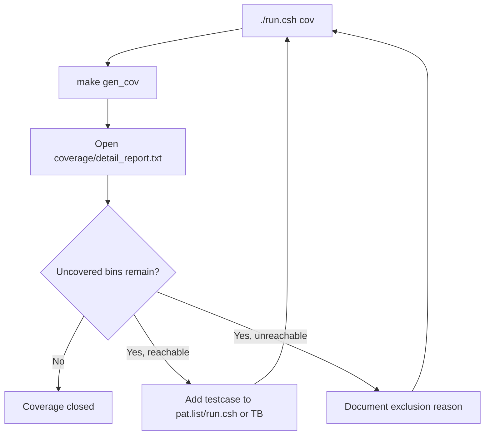

# Coverage Test Plan Specification

## 1. Mục đích

Tài liệu này dinh nghia regression coverage cho SoC RV32I + Huffman + AES-128.
Flow được làm theo cung ý tưởng với `timer_standard_hv`:

1. chạy từng testcase riêng
2. mới testcase sinh một file `.ucdb`
3. merge tat ca `.ucdb` thanh `IP.ucdb`
4. đọc text/HTML report
5. lặp thêm testcase hoặc exclusion hợp lệ cho đến khi coverage closure dat mục tiêu

SoC coverage flow đã được canh lại theo form `timer_standard_hv`, nhưng chỉ
dung **một testbench chính**:

- `tb/tb_rv32_soc_mmio_dma.v` là testbench chính duy nhất, top module `test_bench`
- testbench chính setup DUT, clock/reset, loader, checker, task dùng chung
- testbench include `` `include "run_test.v" ``
- testcase nằm trong `testcase/<TESTNAME>.v`
- `make build`/`make build_cov` copy testcase thanh `sim/run_test.v`
- `run_test.v` goi task chung `run_selected_test()`
- các testbench cũ đã được chuyen vao `tb/archive/deprecated_20260429/`

Mới testcase của SoC vẫn can thêm mapping trong `run.csh` để chọn:

- `TB_NAME`: luon là `test_bench` trong clean regression hiện tại
- `C_SRC`: chương trình RV32I nạp vao `instruction.mem`
- `RUN_ARGS`: `+CASE_NAME=... +INPUT_FILE=...`

## 2. Commands

Prerequisite:

```sh
sudo apt-get install -y csh
```

Chạy coverage regression:

```sh
cd sim
./run.csh cov
```

Chạy regression không coverage:

```sh
cd sim
./run.csh
```

Tong hop pass/fail sau khi chạy:

```sh
cd sim
./report.csh
```

Sinh thêm HTML coverage sau khi `./run.csh cov`:

```sh
cd sim
make gen_html
```

Mo coverage GUI:

```sh
cd sim
make view_cov
```

Output chính:

| Path | Ý nghĩa |
|---|---|
| `sim/ucdb/*.ucdb` | Coverage database của từng testcase |
| `sim/IP.ucdb` | Coverage database da merge |
| `sim/coverage/summary_report.txt` | Bao cao tong hop |
| `sim/coverage/detail_report.txt` | Bao cao chỉ tiet bins/line/branch/toggle |
| `sim/covhtmlreport/` | HTML coverage report nếu chạy `gen_html` |

## 3. Active Coverage Regression List

Danh sach testcase nằm trong:

```text
sim/pat.list
```

Mới dong là một tên testcase:

```text
dma_compress_aes_input1
```

`run.csh` map tên testcase sang:

| Trường | Ý nghĩa |
|---|---|
| `TB_NAME` | top module testbench; clean regression hiện tại luon dung `test_bench` |
| `C_SRC` | C program để compile thanh `instruction.mem` |
| `RUN_ARGS` | plusargs cho simulation, vi đủ `+CASE_NAME=... +INPUT_FILE=input1.txt` |

Với mới testcase, `run.csh` sẽ chạy:

```sh
make compile C_SRC=<file.c>
make all_cov TESTNAME=<pat> TB_NAME=<top> RUN_ARGS="+CASE_NAME=<pat> +INPUT_FILE=<input>"
```

sau đó merge:

```sh
vcover merge IP.ucdb ucdb/*.ucdb
```

## 4. Testcase Table

Bằng testcase được chia theo module/chức năng để biet ro mới testcase dang phuc
vu cover phan nào của DUT.

### 4.1 CPU / SoC Control

| ID | Chức năng | Testname | Description | Expectation | Testcase | Trạng thái | Comment |
|---|---|---|---|---|---|---|---|
| CPU-01 | CPU MMIO load/store | `mmio_regfile_basic` | CPU chạy `test_mmio_regfile_basic.c`, ghi `DMA_SRC`, `DMA_DST`, `DMA_LEN`, `DMA_MODE`, `DMA_BLOCK`, ghi/đọc 4 thanh ghi IV, đọc lại status/mode/block, sau đó ghi clear done/error và soft reset. Test không start DMA, mục tiêu là ep CPU -> memory stage -> MMIO bridge -> APB regfile -> CPU readback path. | CPU publish signature `REG1`, error mask bằng 0, no DMA start, soft reset pulse xuất hien | `test_mmio_regfile_basic.c` + `mmio_regfile_basic.v` | PASS | Cover CPU memory-return path, APB bridge read/write có ban |
| CPU-02 | CPU MMIO illegal access | `mmio_regfile_negative` | CPU có tính ghi sai thứ tự và sai địa chỉ: start khi chưa config hợp lệ, ghi vao thanh ghi readonly/status, access địa chỉ APB không ton tai, ghi mode reserved, ghi block size không hợp lệ, và dung byte/half store vao MMIO. Checker đếm bridge/APB error và đảm bảo lỗi được trả ve CPU mà không làm DMA start that. | Sticky error được set, bridge/APB error được đếm, không có DMA start sai | `test_mmio_regfile_negative.c` + `mmio_regfile_negative.v` | PASS | Cover error propagation tu APB ve CPU |
| CPU-03 | CPU sideband/top hold | `soc_sideband_cov` | Test trước het chạy base MMIO program `mmio_regfile_basic`, sau khi CPU publish signature thì TB bat plusarg `+SIDEBAND_COV` và pulse trực tiếp các tín hiệu top-level `cpu_stall_i`, `cpu_if_flush_i`, aux loader/address/data high-bit để hit hold/flush/toggle bins mà software bình thường không dùng. | Signature `REG1` vẫn pass, top-level hold/flush/aux toggle bins được hit | `test_mmio_regfile_basic.c` + `soc_sideband_cov.v` | PASS | Testbench-only coverage hook, không thay đổi software contract |
| CPU-04 | RV32I instruction coverage | `cpu_instruction_cov` | CPU chạy chương trình stress RV32I, dung C/inline asm để tạo chuoi phụ thuộc dữ liệu và hazard: R-type ALU, I-type ALU, load/store byte/half/word, signed/unsigned load, branch taken/not-taken, `lui`, `jalr`. Kết quả từng nhom instruction được gom thanh signature trong DMEM để TB đọc và so sánh. | Signature `CPUC`, error mask 0, R-type/I-type/memory/branch signatures dung | `test_cpu_instruction_cov.c` + `cpu_instruction_cov.v` | PASS | Tăng coverage `id_stage`, `ex_stage`, forwarding và memory path |
| CPU-05 | CPU memory stage corner coverage | `cpu_mem_forward_cov` | CPU chạy chương trình riêng để ep `mem_stage`: store/load byte tai offset 0/1/2/3, store/load halfword tai offset 0/2, signed/unsigned load, word load/store, và các misaligned access có chu dich để hit error branches. Sau đó ghi signature `CPUH` và checksum vao DMEM. | Signature `CPUH`, error mask 0, mem error output ve 0 sau test, checksum non-zero | `test_cpu_mem_forward_cov.c` + `cpu_mem_forward_cov.v` | PASS | Tăng branch/condition/statement coverage của `u_cpu/u_mem_stage` |
| CPU-06 | CPU forwarding direct mux coverage | `cpu_forward_direct_cov` | Sau base MMIO pass, TB bat `+CPU_FORWARD_DIRECT_COV` và force trực tiếp các tín hiệu input của `u_cpu/u_forwarding`: EX/MEM match rs1/rs2, MEM/WB match rs1/rs2, byte/half/word select, x0 no-match, và priority EX/MEM over MEM/WB. | Base MMIO pass, forwarding mux mix non-zero | `test_mmio_regfile_basic.c` + `cpu_forward_direct_cov.v` | PASS | Dua `u_cpu/u_forwarding` len gan/full code coverage |

### 4.2 DMA Regfile / MMIO Contract

| ID | Chức năng | Testname | Description | Expectation | Testcase | Trạng thái | Comment |
|---|---|---|---|---|---|---|---|
| DMA-01 | Mode decode matrix | `mmio_mode_matrix` | CPU lần luot ghi `DMA_MODE` với `0x1`, `0x5`, `0x9`, `0xd`, `0x2`, `0x0`, `0x3` và giá trị có reserved bits; mới lần đọc lại `DMA_STATUS`/mode field để xác nhận decode direction, AES enable, compress-only, whole-file/per-block. Test chỉ kiểm trả contract thanh ghi, không cho DMA chạy data path. | Trạng thái bits dung với từng mode, invalid/reserved path set error, không start DMA | `test_mmio_mode_matrix.c` + `mmio_mode_matrix.v` | PASS | Là testcase chính cho software contract của `DMA_MODE` |
| DMA-02 | RX bad length config | `mmio_rx_bad_length` | CPU cấu hình direction RX (`DMA_MODE=0x2`), `SRC=TX_REGION`, `DST=RX_REGION`, nhưng `DMA_LEN=4` không align 16 byte. Sau khi ghi `DMA_CTRL.start`, RX DMA phải di vao expected-error path trước khi feed AES/RX transport. | RX engine báo error, bytes_done bằng 0, `DMA_DEBUG` last error = `0x02` | `test_mmio_rx_bad_length.c` + `mmio_rx_bad_length.v` | PASS | Cover RX DMA expected-error path và `dma_engine_error_w` |
| DMA-03 | TX APB wait-state | `tx_apb_wait_cov` | Chạy TX-only software bình thường với `input1.txt`, đồng thời TB bat `+TX_APB_WAIT_COV` để force `tx_pready_w=0` một so chu kỳ trong pha APB ACCESS của DMA TX engine. Mục tiêu là xem DMA giữ address/data/control on dinh và chỉ tiếp tục khi `PREADY` len lại. | TX-only flow vẫn pass, DMA TX giữ state ACCESS đến khi `PREADY=1` | `test_mmio_tx_only.c` + `tx_apb_wait_cov.v` | PASS | Coverage hook cho APB wait-state nội bộ TX engine |
| DMA-04 | TX APB slave error | `tx_apb_error_cov` | CPU start TX với config hợp lệ, TB bat `+TX_APB_ERROR_COV` để force `tx_pslverr_w=1` trong một APB ACCESS đến TX IP. DMA TX phải dung clean, ghi error sticky/last-error, không xem output là valid compressed result. | TX engine báo error, sticky error set, `DMA_DEBUG` last error = `0x03` | `test_mmio_tx_apb_error.c` + `tx_apb_error_cov.v` | PASS | Cover `tx_dma_error_w` và TX APB error branch |
| DMA-05 | RX APB wait/backpressure | `rx_backpressure_cov` | Chạy full TX->RX loopback `input1.txt`; trong RX phase, TB bat `+RX_APB_WAIT_COV` để chen `PREADY=0` trên RX APB read và bat `+RX_STREAM_BACKPRESSURE_COV` để tạo thời điểm ciphertext valid nhưng RX ready low. Checker so sánh plaintext cuối cùng với source để bao dam không mất word. | Loopback vẫn pass, RX engine không mất ciphertext word | `test_mmio_dma.c` + `rx_backpressure_cov.v` | PASS | Cover RX APB wait-state và stream backpressure có ban |
| DMA-06 | DMA bridge/regfile direct defensive coverage | `dma_bridge_direct_cov` | Sau base MMIO pass, TB bat `+DMA_BRIDGE_DIRECT_COV` và force trực tiếp bridge, `dma_regfile`, DMA TX/RX vao các pha wait/error/invalid hiem: APB wait, PSLVERR, busy-write, invalid state, bad block size, misaligned config. | Base MMIO pass, branch/statement của bridge/regfile/DMA engine tăng, không đổi software contract | `test_mmio_regfile_basic.c` + `dma_bridge_direct_cov.v` | PASS | White-box coverage hook cho defensive branches kho tạo bằng CPU program |

### 4.3 TX Encode / Compress / AES

| ID | Chức năng | Testname | Description | Expectation | Testcase | Trạng thái | Comment |
|---|---|---|---|---|---|---|---|
| TX-01 | TX whole-file `COMPRESS_ONLY` | `tx_compress_only_input1` | TB load `input1.txt` vao DMEM source, CPU cấu hình TX-only `DMA_MODE=0xd` whole-file Huffman bypass AES, `SRC=0x2000`, `DST=TX_REGION`, `LEN=input_len`, `BLOCK=32`, rồi polling `DMA_STATUS.done`. Sau khi done, TB dump source/TX region, tính payload ratio/storage ratio và check TX region không all-zero. | TX done, bytes_done align 16 byte, TX output không all-zero, saving đường | `test_mmio_tx_only.c` + `tx_compress_only_input1.v` | PASS | Do saving trực tiếp không qua RX |
| TX-02 | TX whole-file `COMPRESS_ONLY` log-like | `tx_compress_only_input4_cov` | Giong TX-01 nhưng input là `input4_cov.txt` log-like dài hơn. Mục tiêu là ep dynamic Huffman đọc tần suất toàn file, tạo codebook toàn file, dump output transport và ghi lại saving để so với các input text khác. | TX done, output hợp lệ, storage saving đường với input log da cat nhỏ | `test_mmio_tx_only.c` + `tx_compress_only_input4_cov.v` | PASS | Dung để theo dõi khả năng nen log-like input |
| TX-03 | TX block `COMPRESS_AES` | `tx_compress_aes_block_input3` | CPU cấu hình TX-only mode `0x1`, nghĩa là Huffman theo block 32 byte và AES-CBC enable. CPU ghi IV vao `DMA_IV0..3`, start DMA, TX đọc DMEM source, nen từng block, pack transport, AES mã hóa, ghi ciphertext vao TX region; TB chỉ check TX side, không chạy RX. | Trạng thái trước/sau dung `0x18/0x1a`, ciphertext bytes align 16 byte | `test_mmio_tx_only_aes_block.c` + `tx_compress_aes_block_input3.v` | PASS | Cover compatibility mode block-32B có AES |
| TX-04 | TX block `COMPRESS_ONLY` | `tx_compress_only_block_input3` | CPU cấu hình TX-only mode `0x5`, cung dữ liệu `input3.txt`, Huffman theo block 32 byte nhưng AES bypass. TB check output transport raw/compressed của block mode, status bits compress-only, và counter `ciphertext_bytes_produced` align theo storage interface. | Trạng thái trước/sau dung `0x58/0x5a`, transport output hợp lệ | `test_mmio_tx_only_compress_block.c` + `tx_compress_only_block_input3.v` | PASS | Cover compatibility mode block-32B bypass AES |
| TX-05 | TX one-symbol whole-file | `tx_compress_only_one_symbol_cov` | TB load file lặp lại gan như một symbol (`input_cov_one_symbol.txt`), CPU chạy TX-only whole-file bypass AES. Case này ep frequency counter, symbol list, code-length builder, header formatter và decoder-compatible transport xu ly phân bố ký tự cực đoan/one-symbol. | TX done, output align 16 byte, saving đường | `test_mmio_tx_only.c` + `tx_compress_only_one_symbol_cov.v` | PASS | Cover symbol distribution cực đoan |
| TX-06 | TX 256-symbol sweep stress | `tx_compress_only_ascii_sweep_cov` | TB load `input_cov_ascii_sweep.txt` có nhieu byte-symbol khác nhau, CPU chạy TX-only whole-file bypass AES với alphabet 256 symbol. Case này stress frequency table, code-length table, canonical generator, header formatter và payload path với input gần uniform. | TX done, output align 16 byte, source match; storage expansion là expected với input gần uniform | `test_mmio_tx_only.c` + `tx_compress_only_ascii_sweep_cov.v` | PASS | Sau nang codebook len 256, case này không còn là expected overflow error |
| TX-07 | TX alnum63 stress | `tx_compress_only_alnum63_cov` | TB load `input_cov_alnum63.txt` gom 62 ký tự alphanumeric cổng newline = 63 symbol hợp lệ. CPU chạy TX-only whole-file bypass AES để ep frequency counter, symbol list, code-length builder và canonical generator di qua đường nhieu symbol trong alphabet 256. | TX done, output align 16 byte, debug 0, source match | `test_mmio_tx_only.c` + `tx_compress_only_alnum63_cov.v` | PASS | Stress Huffman builder hợp lệ; saving có thể am vi header/codebook lớn |
| TX-08 | TX short input | `tx_compress_only_short_raw_cov` | TB load input rất ngắn (`input_cov_short_raw.txt`, 7 byte), CPU chạy TX-only whole-file bypass AES. Case này ep final partial word, padding/alignment, header overhead lớn hơn payload, và các nhanh raw/compressed decision khi input nhỏ hơn block danh nghia. | TX done, output hợp lệ | `test_mmio_tx_only.c` + `tx_compress_only_short_raw_cov.v` | PASS | Cover short-input path |
| TX-09 | TX APB IF direct coverage | `tx_if_direct_cov` | Sau khi base MMIO test pass, TB bat `+TX_IF_DIRECT_COV` và force trực tiếp APB vao `apb_huffman_tx_if`: đọc status/debug khi FIFO empty, ghi invalid block/policy/control, start khi config thiếu, soft reset, load 8 word input FIFO, force core not-ready, fill output FIFO bằng forced AES words, đọc meta/data, và tạo simultaneous push/pop/full/error. | Base MMIO test pass, `apb_huffman_tx_if` hit thêm branch/expression/status/error bins | `test_mmio_regfile_basic.c` + `tx_if_direct_cov.v` | PASS | Coverage hook tập trung vao TX APB wrapper, không phải software contract mới |
| TX-10 | TX encoder direct coverage | `tx_encoder_direct_cov` | Sau base MMIO pass, TB bat `+TX_ENCODER_DIRECT_COV` và force các stage encoder/mode-decision/header/payload để cover raw/compressed decision, one-symbol, table entry, start/done/error và defensive branch hiem. | Base MMIO pass, TX encoder branch/statement/toggle bins tăng | `test_mmio_regfile_basic.c` + `tx_encoder_direct_cov.v` | PASS | White-box coverage hook cho `dynamic_huffman_encoder` và các module còn |
| TX-11 | TX builder/packer direct coverage | `tx_builder_packer_direct_cov` | Sau base MMIO pass, TB bat `+TX_BUILDER_PACKER_DIRECT_COV` và force Huffman builder, code-length/canonical generator, bit-packer qua one-symbol, multi-symbol, overflow, final partial word và flush paths. | Base MMIO pass, Huffman builder/packer bins tăng | `test_mmio_regfile_basic.c` + `tx_builder_packer_direct_cov.v` | PASS | White-box coverage hook cho codebook builder và transport packer |

### 4.4 RX Decode / Decrypt

| ID | Chức năng | Testname | Description | Expectation | Testcase | Trạng thái | Comment |
|---|---|---|---|---|---|---|---|
| RX-01 | RX decrypt + Huffman decode normal | `dma_compress_aes_input1` | Full loopback hai pha: CPU start TX `COMPRESS_AES` whole-file để ghi ciphertext vao TX region, sau đó CPU cấu hình RX `DMA_MODE=0x2`, `SRC=TX_REGION`, `DST=RX_REGION`, `LEN=tx_bytes_done`. RX DMA đọc 128-bit ciphertext, feed AES inverse CBC, depack transport, parse Huffman header/codebook, decode plaintext và ghi DMEM RX region. | RX done, `rx_bytes_done == input_len`, RX output match source | `test_mmio_dma.c` + `dma_compress_aes_input1.v` | PASS | Cover RX normal path với input dài |
| RX-02 | RX decrypt + Huffman decode small/repeated | `dma_compress_aes_input3` | Giong RX-01 nhưng với `input3.txt` ngắn và lặp lại cao. Case này làm RX parser/decoder gặp frame nhỏ, symbol count it, payload ngắn, final-frame nhanh hơn, nhưng vẫn di qua AES-CBC decrypt và DMEM writeback như path chính. | RX done, output match source, parser/decoder xu ly frame nhỏ | `test_mmio_dma.c` + `dma_compress_aes_input3.v` | PASS | Cover small-frame behavior |
| RX-06 | RX one-symbol loopback | `dma_compress_aes_one_symbol_cov` | TX tạo ciphertext tu input one-symbol, sau đó RX decrypt/decode lại. RX phải đọc header/codebook dac biet của phân bố một symbol, generate plaintext lặp lại, và bytes_done phải bằng input length sau khi ghi DMEM. | RX output match source | `test_mmio_dma.c` + `dma_compress_aes_one_symbol_cov.v` | PASS | Cover one-symbol/short-frame behavior |
| RX-09 | RX alnum63 loopback | `dma_compress_aes_alnum63_cov` | TX tạo ciphertext tu `input_cov_alnum63.txt` gom 63 symbol hợp lệ, sau đó RX decrypt/decode lại. Case này ep RX parser/decoder xu ly codebook lớn hơn các input bình thường và xác nhận path AES-CBC + Huffman vẫn loopback dung. | RX done, `rx_bytes_done == 504`, RX output match source, parser/decoder report `symbol_count=63` | `test_mmio_dma.c` + `dma_compress_aes_alnum63_cov.v` | PASS | Functional coverage case cho alnum63 E2E; saving có thể am do header/codebook overhead |
| RX-03 | RX malformed length | `mmio_rx_bad_length` | CPU start RX với `DMA_LEN` không chia het cho 16 byte, trong khi RX AES input yeu cau ciphertext block 128-bit. Test xác nhận lỗi bị chan o RX DMA/config layer, không feed dữ liệu sai vao AES inverse/parser. | RX expected error, không ghi plaintext | `test_mmio_rx_bad_length.c` + `mmio_rx_bad_length.v` | PASS | Error path hiện tại của RX DMA |
| RX-04 | RX stream backpressure | `rx_backpressure_cov` | Chạy loopback `input1.txt`; trong RX phase TB tạo backpressure trên RX ciphertext/transport path bằng cách giữ ready low khi valid high và chen APB read wait-state. Sau đó checker vẫn compare RX DMEM với source để chứng minh handshake không drop/duplicate word. | RX không mất data, loopback vẫn match input | `test_mmio_dma.c` + `rx_backpressure_cov.v` | PASS | Backpressure có ban, chưa cover FIFO full sau |
| RX-05 | RX APB IF direct coverage | `rx_if_direct_cov` | Sau base MMIO pass, TB bat direct hook vao `apb_huffman_rx_if`: đọc data khi FIFO empty, ghi invalid address/control, force ciphertext pending, force FIFO full, tạo simultaneous push/pop, invalid `valid_bytes`, invalid metadata và parser error. Mục tiêu là hit defensive branches mà software normal không tạo được. | Base MMIO test pass, `apb_huffman_rx_if` hit empty/full/error/wait branches | `test_mmio_regfile_basic.c` + `rx_if_direct_cov.v` | PASS | Coverage hook tập trung vao `apb_huffman_rx_if`, không phải software contract mới |
| RX-07 | RX parser/decoder direct coverage | `rx_parser_decoder_cov` | Sau base MMIO pass, TB bat `+RX_PARSE_DECODE_COV` để drive trực tiếp transport stream vao RX parser/decoder: raw-full 32-byte multi-chunk frame, raw partial frame, one-symbol frame, compressed 1-symbol frame, compressed 2-symbol multi-entry frame, malformed header/payload/code và zero-length chunk. Test không phụ thuộc CPU software; mục tiêu là cover state/error bins của parser và decoder. | Base MMIO test pass, parser/decoder state/error bins tăng | `test_mmio_regfile_basic.c` + `rx_parser_decoder_cov.v` | PASS | Coverage hook, không thay đổi software contract |
| RX-08 | RX decoder fallback/error direct coverage | `rx_decoder_direct_cov` | Sau base MMIO pass, TB bat `+RX_DECODER_DIRECT_COV` và force trực tiếp các wire parser->decoder. Test tạo long-code len=12 để ep main-table long entry và fallback decode, reuse table với `symbol_count=0`, sau đó ep duplicate entry, missing/early `entry_last`, raw/one-symbol/compressed metadata lỗi. | Base MMIO test pass, decoder fallback/error bins tăng | `test_mmio_regfile_basic.c` + `rx_decoder_direct_cov.v` | PASS | Coverage hook riêng cho `huffman_block_decoder` |
| RX-10 | RX depacker/packer direct coverage | `rx_depacker_packer_direct_cov` | Sau base MMIO pass, TB bat `+RX_DEPACKER_PACKER_DIRECT_COV` để drive malformed transport, invalid valid-bytes, final partial word, FIFO full/empty, byte-packer backpressure và error branches. | Base MMIO pass, depacker/packer bins tăng | `test_mmio_regfile_basic.c` + `rx_depacker_packer_direct_cov.v` | PASS | White-box coverage hook cho RX data formatting |
| RX-11 | RX parser/decoder error direct coverage | `rx_parser_decoder_error_direct_cov` | Sau base MMIO pass, TB bat `+RX_PARSE_DECODE_ERROR_DIRECT_COV` để tạo invalid header, invalid code length, missing/early entry_last, zero-length và append-dummy paths. | Base MMIO pass, parser/decoder defensive error bins tăng | `test_mmio_regfile_basic.c` + `rx_parser_decoder_error_direct_cov.v` | PASS | Bo sung malformed paths không nên tạo bằng normal DMA |

### 4.5 SoC End-To-End

| ID | Chức năng | Testname | Description | Expectation | Testcase | Trạng thái | Comment |
|---|---|---|---|---|---|---|---|
| SOC-01 | Full TX->RX secure storage | `dma_compress_aes_input1` | TB load `input1.txt` vao DMEM source, CPU tạo IV, cấu hình TX whole-file `COMPRESS_AES`, polling done, lưu `tx_bytes_done`, sau đó cấu hình RX đọc ciphertext vừa ghi và decode ve RX region. TB dump 3 vung DMEM source/TX/RX, tính throughput/saving, compare source với RX output từng byte. | Source DMEM match input file, RX DMEM match source, TX region không all-zero, 2 DMA starts | `test_mmio_dma.c` + `dma_compress_aes_input1.v` | PASS | Main system regression |
| SOC-02 | Full TX->RX small input | `dma_compress_aes_input3` | Giong SOC-01 nhưng input ngắn và có nhieu ký tự lặp lại. Case này dung để kiểm trả end-to-end khi Huffman whole-file tạo codebook nhỏ, ciphertext it block hơn, RX parser kết thúc frame som hơn, và benchmark vẫn tính dung saving/throughput. | Loopback pass, saving đường, small-frame path pass | `test_mmio_dma.c` + `dma_compress_aes_input3.v` | PASS | Bo sung variation cho Huffman dynamic whole-file |
| SOC-03 | Full TX->RX alnum63 stress | `dma_compress_aes_alnum63_cov` | Giong SOC-01 nhưng input là `input_cov_alnum63.txt`, gom 63 symbol hợp lệ trong alphabet 256. Mục tiêu là stress path full TX/RX với codebook lớn hơn và data entropy cao hơn, không phải để toi uu saving. | Loopback pass, RX output match source, TX ciphertext non-zero, 2 DMA starts | `test_mmio_dma.c` + `dma_compress_aes_alnum63_cov.v` | PASS | Functional stress case; payload/storage saving am là expected với input gần uniform |
| SOC-04 | Software-managed storage table | `dma_storage_table_input1_then_input3` | TB load `input1.txt` vao source1 và `input3.txt` vao source2. CPU TX input1, ghi metadata record 0, TX input3, ghi metadata record 1, sau đó select `file_id=1` và RX lại input1 tu metadata. | `storage_selected_file_id=1`, `storage_total_records=2`, `storage_dma_start_pulse_count=3`, RX output match input1 | `test_mmio_dma_storage_table.c` + `dma_storage_table_input1_then_input3.v` | PASS | Demo storage-management software; da nằm trong clean baseline 34/34 |
| SOC-05 | Raw DUT stress closure | `raw_dut_stress_cov` | Sau base MMIO pass, TB bat nhieu coverage hook cung lúc: sideband, TX/RX direct hooks, CPU forwarding, DMA bridge và raw DUT stress sweep. Hook này ep các FSM reset transition, debug reduction OR terms, memory-array toggle và defensive state/toggle bins kho tạo bằng software thuong. | Base MMIO pass, raw DUT `bcesft` tăng len trên 90%, không thay đổi functional contract | `test_mmio_regfile_basic.c` + `raw_dut_stress_cov.v` | PASS | Testbench-only coverage closure hook; không dùng làm demo chức năng |

Disabled candidates in `pat.list`:

| Testcase | Reason |
|---|---|
| `dma_compress_aes_input2_debug` | Current TX reports error on `input2.txt`; keep as debug target before adding back to clean regression |
| `dma_compress_aes_input4_cov_debug` | Current TX reports error `0x05` on log-like `input4_cov.txt`; TX-only still passes |

## 5. Baseline hiện tại Result

Baseline mới nhất da chạy ngay 2026-05-10 bằng:

```sh
cd sim
./run.csh cov
./report.csh
make drc
```

Kết quả pass/fail và coverage mới nhất:

| Metric | Value |
|---|---:|
| Active testcase count | 34 |
| Passed testcase count | 34 |
| Failed testcase count | 0 |
| Merged UCDB count | 34 |
| Raw overall summary coverage | 92.51% |
| Raw DUT total with toggle (`bcesft`) | 93.52% |
| Raw DUT total without toggle (`bcesf`) | 94.44% |
| Raw DUT statement coverage | 96.33% |
| Raw DUT branch coverage | 94.22% |
| Raw DUT branch+statement (`bs`) | 95.27% |
| Closed DUT Total Coverage By Instance | 95.90% |
| `vcover merge` | PASS, 0 warnings |
| `make drc` | PASS |

Merged UCDB files:

| UCDB |
|---|
| `cpu_forward_direct_cov.ucdb` |
| `cpu_instruction_cov.ucdb` |
| `cpu_mem_forward_cov.ucdb` |
| `dma_bridge_direct_cov.ucdb` |
| `dma_compress_aes_alnum63_cov.ucdb` |
| `dma_compress_aes_input1.ucdb` |
| `dma_compress_aes_input3.ucdb` |
| `dma_compress_aes_one_symbol_cov.ucdb` |
| `dma_storage_table_input1_then_input3.ucdb` |
| `mmio_mode_matrix.ucdb` |
| `mmio_regfile_basic.ucdb` |
| `mmio_regfile_negative.ucdb` |
| `mmio_rx_bad_length.ucdb` |
| `raw_dut_stress_cov.ucdb` |
| `rx_backpressure_cov.ucdb` |
| `rx_decoder_direct_cov.ucdb` |
| `rx_depacker_packer_direct_cov.ucdb` |
| `rx_if_direct_cov.ucdb` |
| `rx_parser_decoder_cov.ucdb` |
| `rx_parser_decoder_error_direct_cov.ucdb` |
| `soc_sideband_cov.ucdb` |
| `tx_apb_error_cov.ucdb` |
| `tx_apb_wait_cov.ucdb` |
| `tx_builder_packer_direct_cov.ucdb` |
| `tx_compress_aes_block_input3.ucdb` |
| `tx_compress_only_ascii_sweep_cov.ucdb` |
| `tx_compress_only_alnum63_cov.ucdb` |
| `tx_compress_only_block_input3.ucdb` |
| `tx_compress_only_input1.ucdb` |
| `tx_compress_only_input4_cov.ucdb` |
| `tx_compress_only_one_symbol_cov.ucdb` |
| `tx_compress_only_short_raw_cov.ucdb` |
| `tx_encoder_direct_cov.ucdb` |
| `tx_if_direct_cov.ucdb` |

Compression result captured from logs:

| Testcase | Input | Mode | Payload ratio | Payload saving | Storage ratio | Storage saving |
|---|---|---|---:|---:|---:|---:|
| `dma_compress_aes_input1` | `input1.txt` | `COMPRESS_AES` | 37.50% | 62.50% | 40.14% | 59.86% |
| `dma_compress_aes_input3` | `input3.txt` | `COMPRESS_AES` | 42.05% | 57.95% | 46.28% | 53.72% |
| `dma_compress_aes_alnum63_cov` | `input_cov_alnum63.txt` | `COMPRESS_AES` | 101.86% | -1.86% | 111.11% | -11.11% |
| `tx_compress_only_input1` | `input1.txt` | `COMPRESS_ONLY + whole_file` | 37.50% | 62.50% | 40.14% | 59.86% |
| `tx_compress_only_input4_cov` | `input4_cov.txt` | `COMPRESS_ONLY + whole_file` | 63.40% | 36.60% | 67.73% | 32.27% |
| `tx_compress_only_alnum63_cov` | `input_cov_alnum63.txt` | `COMPRESS_ONLY + whole_file` | 101.86% | -1.86% | 111.11% | -11.11% |
| `tx_compress_aes_block_input3` | `input3.txt` | `COMPRESS_AES + block_32B` | 29.65% | 70.35% | 33.06% | 66.94% |
| `tx_compress_only_block_input3` | `input3.txt` | `COMPRESS_ONLY + block_32B` | 29.65% | 70.35% | 33.06% | 66.94% |

Mode coverage status:

| Mode | Ý nghĩa | Covered by |
|---|---|---|
| `0x1` | TX `COMPRESS_AES`, per-block Huffman | `tx_compress_aes_block_input3`, `mmio_mode_matrix` |
| `0x5` | TX `COMPRESS_ONLY`, per-block Huffman | `tx_compress_only_block_input3`, `mmio_mode_matrix` |
| `0x9` | TX `COMPRESS_AES`, whole-file Huffman | `dma_compress_aes_input1`, `dma_compress_aes_input3`, `dma_compress_aes_alnum63_cov`, `mmio_mode_matrix` |
| `0xd` | TX `COMPRESS_ONLY`, whole-file Huffman | `tx_compress_only_input1`, `tx_compress_only_input4_cov`, `mmio_mode_matrix` |
| `0x2` | RX decrypt + decode direction | RX phase of `dma_compress_aes_input1`, RX phase of `dma_compress_aes_input3`, RX phase of `dma_compress_aes_alnum63_cov`, `mmio_mode_matrix` |
| `0x0` | Invalid/idle direction | `mmio_mode_matrix` |
| `0x3` | Invalid combined TX/RX direction | `mmio_mode_matrix` |
| reserved bits | Illegal mode write path | `mmio_mode_matrix`, `mmio_regfile_negative` |

Module target sau baseline này:

| Module / Instance | Branch | Condition | Expression | Statement | Comment |
|---|---:|---:|---:|---:|---|
| `u_cpu/u_mem_stage` | 91.22% | 92.85% | 100.00% | 96.40% | Da thêm `cpu_mem_forward_cov` |
| `u_cpu/u_forwarding` | 100.00% | 100.00% | 100.00% | 100.00% | Da thêm `cpu_forward_direct_cov` |
| `u_rx_top/u_huffman_block_parser` | 94.11% | 76.59% | 88.88% | 98.54% | Da thêm raw-full/multi-entry/malformed direct frame; bottleneck còn lại là condition/toggle |
| `u_rx_top/u_huffman_block_decoder` | 97.64% | 85.41% | 78.94% | 99.44% | Da tăng bằng decoder fallback/error direct coverage; bottleneck còn lại là expression/toggle |

Baseline này là regression sach để tiếp tục coverage closure. Nếu chạy report
trực tiếp trên `/test_bench/dut -recursive`, raw total DUT coverage hiện tại
là 93.52% khi tính ca toggle và 94.44% khi bo toggle. Statement riêng là
96.33%, branch riêng là 94.22%, branch+statement là 95.27%, nhưng các so này
không phải raw full DUT coverage. Closed coverage là 95.90% trong
`sim/coverage/dut_closed_report.txt`, được tạo tu `sim/IP_closed.ucdb` sau khi
ap dung `sim/coverage_close.do`.

Closed report exclude toggle coverage, condition/expression/FSM-transition bins
và một so defensive/rare branch/statement scope của Huffman/RX parser/decoder.
Đây là coverage-closure report, không phải raw DUT total coverage 93.52%.

Phan còn thiếu trong raw report hien tập trung vao toggle và một so
condition/expression của Huffman parser/decoder, AES wrapper và bus rộng của
TX/RX. FSM state/transition trên raw DUT da dat 100% sau `raw_dut_stress_cov`.
CPU `mem_stage`, `forwarding`, MMIO bridge, DMA regfile và phan lớn
branch/statement của TX/RX da dat muc closure tot.

## 6. Coverage Closure Targets

### 6.1 RTL functional areas that must be covered

| Area | Must cover |
|---|---|
| RV32I CPU | instruction fetch, execute, load/store, branch loop, MMIO store/load, memory return path hold |
| CPU MMIO bridge | setup/access phase, APB read, APB write, wait/hold, `PREADY`, `PSLVERR` propagation |
| DMA regfile | valid writes, status polling, start pulse, done/error clear, IV registers, invalid/reserved accesses |
| DMA TX engine | DMEM reads, partial final word, block loop, TX APB writes, output FIFO drain, bytes counters |
| DMA RX engine | ciphertext reads, 128-bit feed, RX APB polling, `RX_META`, `RX_DATA`, plaintext writes |
| TX Huffman | raw block, compressed block, one-symbol block, multi-symbol codebook, whole-file codebook |
| TX AES-CBC | CBC IV load, first block XOR IV, next block XOR previous ciphertext, output FIFO |
| RX AES-CBC | decrypt block, CBC inverse chain, IV reuse, plaintext transport stream |
| RX Huffman | header parse, raw block, compressed block, one-symbol block, end-of-frame handling |
| BRAM/DMEM | CPU port, DMA port, aux loader/testbench port, input length location, dump regions |

### 6.2 Extra tests needed to close toward 100%

| Missing test class | Why needed |
|---|---|
| Extra DMA invalid config edges | `mmio_regfile_negative`, `mmio_rx_bad_length`, `dma_bridge_direct_cov` da cover phan lớn; chỉ còn zero-length/start edge dac biet nếu muon raw closure sau hơn |
| CPU bridge-level APB wait-state | TX/RX private APB wait-state da cover; nếu thêm APB slave mới thì cần test wait-state trực tiếp trên `cpu_mmio_to_apb_bridge` |
| RX malformed transport/extreme parser cases | Parser/depacker/decoder error da cover nhieu bằng direct hooks; còn lại chủ yếu là condition/expression cực đoan |
| TX/RX wide-bus toggle | Raw bcesft còn bị keo xuong bởi các bus AES/Huffman/DMA rộng và memory-array toggle |
| UART loader FPGA wrapper simulation | Chưa phải main SoC coverage denominator; cần test riêng nếu dua UART wrapper vao coverage target FPGA |

## 7. Definition Of 100% Coverage

`100% coverage` phải được hieu là **coverage closure có ky luat**, không phải
ep raw RTL report dat 100% bằng cách bo qua lỗi.

Điều kiện chấp nhận:

1. tat ca testcase trong `sim/pat.list` pass
2. `vcover merge` sinh được `IP.ucdb`
3. `coverage/summary_report.txt` và `coverage/detail_report.txt` được review
4. mới uncovered bin phải có một trong hai kết quả:
   - thêm testcase để cover
   - ghi ro là unreachable/deprecated/FPGA-only/debug-only và exclude có lý do

Nếu `rtl.f` vẫn include module debug/deprecated/unused, raw coverage rất kho dat
100%. Khi closure thật sự, cần tách coverage target thanh:

- `coverage_soc_main`: chỉ include active SoC RTL
- `coverage_tx_unit`: chỉ include active TX module tree
- `coverage_rx_unit`: chỉ include active RX module tree
- `coverage_fpga_wrapper`: UART/FPGA wrapper riêng

## 8. Current Makefile Flow

Current coverage targets:

| Target | Chức năng |
|---|---|
| `make build_cov` | Compile RTL/TB với `+cover=bcesft` |
| `make run_cov` | Run one testcase với `-coverage`, save `<TESTNAME>.ucdb` |
| `make gen_cov` | Merge `ucdb/*.ucdb` và tạo text reports |
| `make gen_html` | Tạo HTML report tu merged `IP.ucdb` |
| `./run.csh` | Run all patterns in `pat.list` without coverage |
| `./run.csh cov` | Run all patterns in `pat.list` with coverage, then `gen_cov` |
| `./report.csh` | Summarize pass/fail from `log/<pat>.log` |

## 9. Practical Closure Flow



## 10. Important Notes

- `sim/pat.list` là source of truth cho regression coverage hiện tại.
- Mới testcase phải có `TESTNAME` riêng để không ghi để `.ucdb`.
- Khi đổi input text hoặc C program cho một testcase, sua mapping trong
  `sim/run.csh`.
- Testbench phải in `[PASS]`/`[FAIL]` rõ ràng; coverage cao nhưng testcase fail
  không được tính là closure.
