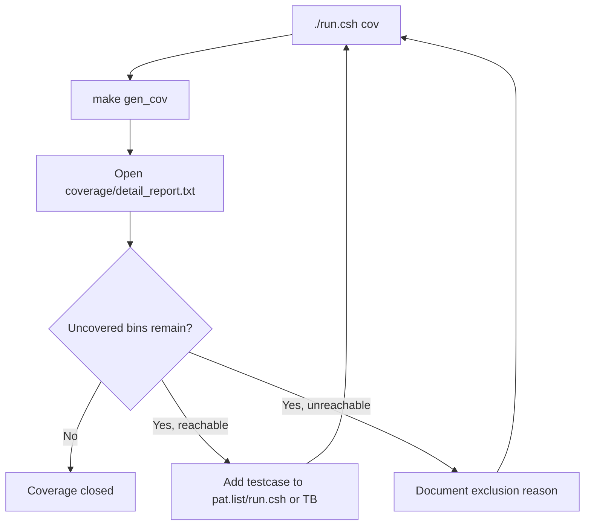

# Coverage Test Plan Specification

## 1. Purpose

Tai lieu nay dinh nghia regression coverage cho SoC RV32I + Huffman + AES-128.
Flow duoc lam theo cung y tuong voi `timer_standard_hv`:

1. chay tung testcase rieng
2. moi testcase sinh mot file `.ucdb`
3. merge tat ca `.ucdb` thanh `IP.ucdb`
4. doc text/HTML report
5. lap them testcase hoac exclusion hop le cho den khi coverage closure dat muc tieu

SoC coverage flow da duoc canh lai theo form `timer_standard_hv`, nhung chi
dung **mot testbench chinh**:

- `tb/tb_rv32_soc_mmio_dma.v` la testbench chinh duy nhat, top module `test_bench`
- testbench chinh setup DUT, clock/reset, loader, checker, task dung chung
- testbench include `` `include "run_test.v" ``
- testcase nam trong `testcase/<TESTNAME>.v`
- `make build`/`make build_cov` copy testcase thanh `sim/run_test.v`
- `run_test.v` goi task chung `run_selected_test()`
- cac testbench cu da duoc chuyen vao `tb/archive/deprecated_20260429/`

Moi testcase cua SoC van can them mapping trong `run.csh` de chon:

- `TB_NAME`: luon la `test_bench` trong clean regression hien tai
- `C_SRC`: chuong trinh RV32I nap vao `instruction.mem`
- `RUN_ARGS`: `+CASE_NAME=... +INPUT_FILE=...`

## 2. Commands

Prerequisite:

```sh
sudo apt-get install -y csh
```

Chay coverage regression:

```sh
cd sim
./run.csh cov
```

Chay regression khong coverage:

```sh
cd sim
./run.csh
```

Tong hop pass/fail sau khi chay:

```sh
cd sim
./report.csh
```

Sinh them HTML coverage sau khi `./run.csh cov`:

```sh
cd sim
make gen_html
```

Mo coverage GUI:

```sh
cd sim
make view_cov
```

Output chinh:

| Path | Meaning |
|---|---|
| `sim/ucdb/*.ucdb` | Coverage database cua tung testcase |
| `sim/IP.ucdb` | Coverage database da merge |
| `sim/coverage/summary_report.txt` | Bao cao tong hop |
| `sim/coverage/detail_report.txt` | Bao cao chi tiet bins/line/branch/toggle |
| `sim/covhtmlreport/` | HTML coverage report neu chay `gen_html` |

## 3. Active Coverage Regression List

Danh sach testcase nam trong:

```text
sim/pat.list
```

Moi dong la mot ten testcase:

```text
dma_compress_aes_input1
```

`run.csh` map ten testcase sang:

| Field | Meaning |
|---|---|
| `TB_NAME` | top module testbench; clean regression hien tai luon dung `test_bench` |
| `C_SRC` | C program de compile thanh `instruction.mem` |
| `RUN_ARGS` | plusargs cho simulation, vi du `+CASE_NAME=... +INPUT_FILE=input1.txt` |

Voi moi testcase, `run.csh` se chay:

```sh
make compile C_SRC=<file.c>
make all_cov TESTNAME=<pat> TB_NAME=<top> RUN_ARGS="+CASE_NAME=<pat> +INPUT_FILE=<input>"
```

sau do merge:

```sh
vcover merge IP.ucdb ucdb/*.ucdb
```

## 4. Testcase Table

Bang testcase duoc chia theo module/chuc nang de biet ro moi testcase dang phuc
vu cover phan nao cua DUT.

### 4.1 CPU / SoC Control

| ID | Function | Testname | Description | Expectation | Testcase | Status | Comment |
|---|---|---|---|---|---|---|---|
| CPU-01 | CPU MMIO load/store | `mmio_regfile_basic` | CPU chay `test_mmio_regfile_basic.c`, ghi `DMA_SRC`, `DMA_DST`, `DMA_LEN`, `DMA_MODE`, `DMA_BLOCK`, ghi/doc 4 thanh ghi IV, doc lai status/mode/block, sau do ghi clear done/error va soft reset. Test khong start DMA, muc tieu la ep CPU -> memory stage -> MMIO bridge -> APB regfile -> CPU readback path. | CPU publish signature `REG1`, error mask bang 0, no DMA start, soft reset pulse xuat hien | `test_mmio_regfile_basic.c` + `mmio_regfile_basic.v` | PASS | Cover CPU memory-return path, APB bridge read/write co ban |
| CPU-02 | CPU MMIO illegal access | `mmio_regfile_negative` | CPU co tinh ghi sai thu tu va sai dia chi: start khi chua config hop le, ghi vao thanh ghi readonly/status, access dia chi APB khong ton tai, ghi mode reserved, ghi block size khong hop le, va dung byte/half store vao MMIO. Checker dem bridge/APB error va dam bao loi duoc tra ve CPU ma khong lam DMA start that. | Sticky error duoc set, bridge/APB error duoc dem, khong co DMA start sai | `test_mmio_regfile_negative.c` + `mmio_regfile_negative.v` | PASS | Cover error propagation tu APB ve CPU |
| CPU-03 | CPU sideband/top hold | `soc_sideband_cov` | Test truoc het chay base MMIO program `mmio_regfile_basic`, sau khi CPU publish signature thi TB bat plusarg `+SIDEBAND_COV` va pulse truc tiep cac tin hieu top-level `cpu_stall_i`, `cpu_if_flush_i`, aux loader/address/data high-bit de hit hold/flush/toggle bins ma software binh thuong khong dung. | Signature `REG1` van pass, top-level hold/flush/aux toggle bins duoc hit | `test_mmio_regfile_basic.c` + `soc_sideband_cov.v` | PASS | Testbench-only coverage hook, khong thay doi software contract |
| CPU-04 | RV32I instruction coverage | `cpu_instruction_cov` | CPU chay chuong trinh stress RV32I, dung C/inline asm de tao chuoi phu thuoc du lieu va hazard: R-type ALU, I-type ALU, load/store byte/half/word, signed/unsigned load, branch taken/not-taken, `lui`, `jalr`. Ket qua tung nhom instruction duoc gom thanh signature trong DMEM de TB doc va so sanh. | Signature `CPUC`, error mask 0, R-type/I-type/memory/branch signatures dung | `test_cpu_instruction_cov.c` + `cpu_instruction_cov.v` | PASS | Tang coverage `id_stage`, `ex_stage`, forwarding va memory path |
| CPU-05 | CPU memory stage corner coverage | `cpu_mem_forward_cov` | CPU chay chuong trinh rieng de ep `mem_stage`: store/load byte tai offset 0/1/2/3, store/load halfword tai offset 0/2, signed/unsigned load, word load/store, va cac misaligned access co chu dich de hit error branches. Sau do ghi signature `CPUH` va checksum vao DMEM. | Signature `CPUH`, error mask 0, mem error output ve 0 sau test, checksum non-zero | `test_cpu_mem_forward_cov.c` + `cpu_mem_forward_cov.v` | PASS | Tang branch/condition/statement coverage cua `u_cpu/u_mem_stage` |
| CPU-06 | CPU forwarding direct mux coverage | `cpu_forward_direct_cov` | Sau base MMIO pass, TB bat `+CPU_FORWARD_DIRECT_COV` va force truc tiep cac tin hieu input cua `u_cpu/u_forwarding`: EX/MEM match rs1/rs2, MEM/WB match rs1/rs2, byte/half/word select, x0 no-match, va priority EX/MEM over MEM/WB. | Base MMIO pass, forwarding mux mix non-zero | `test_mmio_regfile_basic.c` + `cpu_forward_direct_cov.v` | PASS | Dua `u_cpu/u_forwarding` len gan/full code coverage |

### 4.2 DMA Regfile / MMIO Contract

| ID | Function | Testname | Description | Expectation | Testcase | Status | Comment |
|---|---|---|---|---|---|---|---|
| DMA-01 | Mode decode matrix | `mmio_mode_matrix` | CPU lan luot ghi `DMA_MODE` voi `0x1`, `0x5`, `0x9`, `0xd`, `0x2`, `0x0`, `0x3` va gia tri co reserved bits; moi lan doc lai `DMA_STATUS`/mode field de xac nhan decode direction, AES enable, compress-only, whole-file/per-block. Test chi kiem tra contract thanh ghi, khong cho DMA chay data path. | Status bits dung voi tung mode, invalid/reserved path set error, khong start DMA | `test_mmio_mode_matrix.c` + `mmio_mode_matrix.v` | PASS | La testcase chinh cho software contract cua `DMA_MODE` |
| DMA-02 | RX bad length config | `mmio_rx_bad_length` | CPU cau hinh direction RX (`DMA_MODE=0x2`), `SRC=TX_REGION`, `DST=RX_REGION`, nhung `DMA_LEN=4` khong align 16 byte. Sau khi ghi `DMA_CTRL.start`, RX DMA phai di vao expected-error path truoc khi feed AES/RX transport. | RX engine bao error, bytes_done bang 0, `DMA_DEBUG` last error = `0x02` | `test_mmio_rx_bad_length.c` + `mmio_rx_bad_length.v` | PASS | Cover RX DMA expected-error path va `dma_engine_error_w` |
| DMA-03 | TX APB wait-state | `tx_apb_wait_cov` | Chay TX-only software binh thuong voi `input1.txt`, dong thoi TB bat `+TX_APB_WAIT_COV` de force `tx_pready_w=0` mot so chu ky trong pha APB ACCESS cua DMA TX engine. Muc tieu la xem DMA giu address/data/control on dinh va chi tiep tuc khi `PREADY` len lai. | TX-only flow van pass, DMA TX giu state ACCESS den khi `PREADY=1` | `test_mmio_tx_only.c` + `tx_apb_wait_cov.v` | PASS | Coverage hook cho APB wait-state noi bo TX engine |
| DMA-04 | TX APB slave error | `tx_apb_error_cov` | CPU start TX voi config hop le, TB bat `+TX_APB_ERROR_COV` de force `tx_pslverr_w=1` trong mot APB ACCESS den TX IP. DMA TX phai dung clean, ghi error sticky/last-error, khong xem output la valid compressed result. | TX engine bao error, sticky error set, `DMA_DEBUG` last error = `0x03` | `test_mmio_tx_apb_error.c` + `tx_apb_error_cov.v` | PASS | Cover `tx_dma_error_w` va TX APB error branch |
| DMA-05 | RX APB wait/backpressure | `rx_backpressure_cov` | Chay full TX->RX loopback `input1.txt`; trong RX phase, TB bat `+RX_APB_WAIT_COV` de chen `PREADY=0` tren RX APB read va bat `+RX_STREAM_BACKPRESSURE_COV` de tao thoi diem ciphertext valid nhung RX ready low. Checker so sanh plaintext cuoi cung voi source de bao dam khong mat word. | Loopback van pass, RX engine khong mat ciphertext word | `test_mmio_dma.c` + `rx_backpressure_cov.v` | PASS | Cover RX APB wait-state va stream backpressure co ban |
| DMA-06 | DMA bridge/regfile direct defensive coverage | `dma_bridge_direct_cov` | Sau base MMIO pass, TB bat `+DMA_BRIDGE_DIRECT_COV` va force truc tiep bridge, `dma_regfile`, DMA TX/RX vao cac pha wait/error/invalid hiem: APB wait, PSLVERR, busy-write, invalid state, bad block size, misaligned config. | Base MMIO pass, branch/statement cua bridge/regfile/DMA engine tang, khong doi software contract | `test_mmio_regfile_basic.c` + `dma_bridge_direct_cov.v` | PASS | White-box coverage hook cho defensive branches kho tao bang CPU program |

### 4.3 TX Encode / Compress / AES

| ID | Function | Testname | Description | Expectation | Testcase | Status | Comment |
|---|---|---|---|---|---|---|---|
| TX-01 | TX whole-file `COMPRESS_ONLY` | `tx_compress_only_input1` | TB load `input1.txt` vao DMEM source, CPU cau hinh TX-only `DMA_MODE=0xd` whole-file Huffman bypass AES, `SRC=0x2000`, `DST=TX_REGION`, `LEN=input_len`, `BLOCK=32`, roi polling `DMA_STATUS.done`. Sau khi done, TB dump source/TX region, tinh payload ratio/storage ratio va check TX region khong all-zero. | TX done, bytes_done align 16 byte, TX output khong all-zero, saving duong | `test_mmio_tx_only.c` + `tx_compress_only_input1.v` | PASS | Do saving truc tiep khong qua RX |
| TX-02 | TX whole-file `COMPRESS_ONLY` log-like | `tx_compress_only_input4_cov` | Giong TX-01 nhung input la `input4_cov.txt` log-like dai hon. Muc tieu la ep dynamic Huffman doc tan suat toan file, tao codebook toan file, dump output transport va ghi lai saving de so voi cac input text khac. | TX done, output hop le, storage saving duong voi input log da cat nho | `test_mmio_tx_only.c` + `tx_compress_only_input4_cov.v` | PASS | Dung de theo doi kha nang nen log-like input |
| TX-03 | TX block `COMPRESS_AES` | `tx_compress_aes_block_input3` | CPU cau hinh TX-only mode `0x1`, nghia la Huffman theo block 32 byte va AES-CBC enable. CPU ghi IV vao `DMA_IV0..3`, start DMA, TX doc DMEM source, nen tung block, pack transport, AES ma hoa, ghi ciphertext vao TX region; TB chi check TX side, khong chay RX. | Status truoc/sau dung `0x18/0x1a`, ciphertext bytes align 16 byte | `test_mmio_tx_only_aes_block.c` + `tx_compress_aes_block_input3.v` | PASS | Cover compatibility mode block-32B co AES |
| TX-04 | TX block `COMPRESS_ONLY` | `tx_compress_only_block_input3` | CPU cau hinh TX-only mode `0x5`, cung du lieu `input3.txt`, Huffman theo block 32 byte nhung AES bypass. TB check output transport raw/compressed cua block mode, status bits compress-only, va counter `ciphertext_bytes_produced` align theo storage interface. | Status truoc/sau dung `0x58/0x5a`, transport output hop le | `test_mmio_tx_only_compress_block.c` + `tx_compress_only_block_input3.v` | PASS | Cover compatibility mode block-32B bypass AES |
| TX-05 | TX one-symbol whole-file | `tx_compress_only_one_symbol_cov` | TB load file lap lai gan nhu mot symbol (`input_cov_one_symbol.txt`), CPU chay TX-only whole-file bypass AES. Case nay ep frequency counter, symbol list, code-length builder, header formatter va decoder-compatible transport xu ly phan bo ky tu cuc doan/one-symbol. | TX done, output align 16 byte, saving duong | `test_mmio_tx_only.c` + `tx_compress_only_one_symbol_cov.v` | PASS | Cover symbol distribution cuc doan |
| TX-06 | TX 256-symbol sweep stress | `tx_compress_only_ascii_sweep_cov` | TB load `input_cov_ascii_sweep.txt` co nhieu byte-symbol khac nhau, CPU chay TX-only whole-file bypass AES voi alphabet 256 symbol. Case nay stress frequency table, code-length table, canonical generator, header formatter va payload path voi input gan uniform. | TX done, output align 16 byte, source match; storage expansion la expected voi input gan uniform | `test_mmio_tx_only.c` + `tx_compress_only_ascii_sweep_cov.v` | PASS | Sau nang codebook len 256, case nay khong con la expected overflow error |
| TX-07 | TX alnum63 stress | `tx_compress_only_alnum63_cov` | TB load `input_cov_alnum63.txt` gom 62 ky tu alphanumeric cong newline = 63 symbol hop le. CPU chay TX-only whole-file bypass AES de ep frequency counter, symbol list, code-length builder va canonical generator di qua duong nhieu symbol trong alphabet 256. | TX done, output align 16 byte, debug 0, source match | `test_mmio_tx_only.c` + `tx_compress_only_alnum63_cov.v` | PASS | Stress Huffman builder hop le; saving co the am vi header/codebook lon |
| TX-08 | TX short input | `tx_compress_only_short_raw_cov` | TB load input rat ngan (`input_cov_short_raw.txt`, 7 byte), CPU chay TX-only whole-file bypass AES. Case nay ep final partial word, padding/alignment, header overhead lon hon payload, va cac nhanh raw/compressed decision khi input nho hon block danh nghia. | TX done, output hop le | `test_mmio_tx_only.c` + `tx_compress_only_short_raw_cov.v` | PASS | Cover short-input path |
| TX-09 | TX APB IF direct coverage | `tx_if_direct_cov` | Sau khi base MMIO test pass, TB bat `+TX_IF_DIRECT_COV` va force truc tiep APB vao `apb_huffman_tx_if`: doc status/debug khi FIFO empty, ghi invalid block/policy/control, start khi config thieu, soft reset, load 8 word input FIFO, force core not-ready, fill output FIFO bang forced AES words, doc meta/data, va tao simultaneous push/pop/full/error. | Base MMIO test pass, `apb_huffman_tx_if` hit them branch/expression/status/error bins | `test_mmio_regfile_basic.c` + `tx_if_direct_cov.v` | PASS | Coverage hook tap trung vao TX APB wrapper, khong phai software contract moi |
| TX-10 | TX encoder direct coverage | `tx_encoder_direct_cov` | Sau base MMIO pass, TB bat `+TX_ENCODER_DIRECT_COV` va force cac stage encoder/mode-decision/header/payload de cover raw/compressed decision, one-symbol, table entry, start/done/error va defensive branch hiem. | Base MMIO pass, TX encoder branch/statement/toggle bins tang | `test_mmio_regfile_basic.c` + `tx_encoder_direct_cov.v` | PASS | White-box coverage hook cho `dynamic_huffman_encoder` va cac module con |
| TX-11 | TX builder/packer direct coverage | `tx_builder_packer_direct_cov` | Sau base MMIO pass, TB bat `+TX_BUILDER_PACKER_DIRECT_COV` va force Huffman builder, code-length/canonical generator, bit-packer qua one-symbol, multi-symbol, overflow, final partial word va flush paths. | Base MMIO pass, Huffman builder/packer bins tang | `test_mmio_regfile_basic.c` + `tx_builder_packer_direct_cov.v` | PASS | White-box coverage hook cho codebook builder va transport packer |

### 4.4 RX Decode / Decrypt

| ID | Function | Testname | Description | Expectation | Testcase | Status | Comment |
|---|---|---|---|---|---|---|---|
| RX-01 | RX decrypt + Huffman decode normal | `dma_compress_aes_input1` | Full loopback hai pha: CPU start TX `COMPRESS_AES` whole-file de ghi ciphertext vao TX region, sau do CPU cau hinh RX `DMA_MODE=0x2`, `SRC=TX_REGION`, `DST=RX_REGION`, `LEN=tx_bytes_done`. RX DMA doc 128-bit ciphertext, feed AES inverse CBC, depack transport, parse Huffman header/codebook, decode plaintext va ghi DMEM RX region. | RX done, `rx_bytes_done == input_len`, RX output match source | `test_mmio_dma.c` + `dma_compress_aes_input1.v` | PASS | Cover RX normal path voi input dai |
| RX-02 | RX decrypt + Huffman decode small/repeated | `dma_compress_aes_input3` | Giong RX-01 nhung voi `input3.txt` ngan va lap lai cao. Case nay lam RX parser/decoder gap frame nho, symbol count it, payload ngan, final-frame nhanh hon, nhung van di qua AES-CBC decrypt va DMEM writeback nhu path chinh. | RX done, output match source, parser/decoder xu ly frame nho | `test_mmio_dma.c` + `dma_compress_aes_input3.v` | PASS | Cover small-frame behavior |
| RX-06 | RX one-symbol loopback | `dma_compress_aes_one_symbol_cov` | TX tao ciphertext tu input one-symbol, sau do RX decrypt/decode lai. RX phai doc header/codebook dac biet cua phan bo mot symbol, generate plaintext lap lai, va bytes_done phai bang input length sau khi ghi DMEM. | RX output match source | `test_mmio_dma.c` + `dma_compress_aes_one_symbol_cov.v` | PASS | Cover one-symbol/short-frame behavior |
| RX-09 | RX alnum63 loopback | `dma_compress_aes_alnum63_cov` | TX tao ciphertext tu `input_cov_alnum63.txt` gom 63 symbol hop le, sau do RX decrypt/decode lai. Case nay ep RX parser/decoder xu ly codebook lon hon cac input binh thuong va xac nhan path AES-CBC + Huffman van loopback dung. | RX done, `rx_bytes_done == 504`, RX output match source, parser/decoder report `symbol_count=63` | `test_mmio_dma.c` + `dma_compress_aes_alnum63_cov.v` | PASS | Functional coverage case cho alnum63 E2E; saving co the am do header/codebook overhead |
| RX-03 | RX malformed length | `mmio_rx_bad_length` | CPU start RX voi `DMA_LEN` khong chia het cho 16 byte, trong khi RX AES input yeu cau ciphertext block 128-bit. Test xac nhan loi bi chan o RX DMA/config layer, khong feed du lieu sai vao AES inverse/parser. | RX expected error, khong ghi plaintext | `test_mmio_rx_bad_length.c` + `mmio_rx_bad_length.v` | PASS | Error path hien tai cua RX DMA |
| RX-04 | RX stream backpressure | `rx_backpressure_cov` | Chay loopback `input1.txt`; trong RX phase TB tao backpressure tren RX ciphertext/transport path bang cach giu ready low khi valid high va chen APB read wait-state. Sau do checker van compare RX DMEM voi source de chung minh handshake khong drop/duplicate word. | RX khong mat data, loopback van match input | `test_mmio_dma.c` + `rx_backpressure_cov.v` | PASS | Backpressure co ban, chua cover FIFO full sau |
| RX-05 | RX APB IF direct coverage | `rx_if_direct_cov` | Sau base MMIO pass, TB bat direct hook vao `apb_huffman_rx_if`: doc data khi FIFO empty, ghi invalid address/control, force ciphertext pending, force FIFO full, tao simultaneous push/pop, invalid `valid_bytes`, invalid metadata va parser error. Muc tieu la hit defensive branches ma software normal khong tao duoc. | Base MMIO test pass, `apb_huffman_rx_if` hit empty/full/error/wait branches | `test_mmio_regfile_basic.c` + `rx_if_direct_cov.v` | PASS | Coverage hook tap trung vao `apb_huffman_rx_if`, khong phai software contract moi |
| RX-07 | RX parser/decoder direct coverage | `rx_parser_decoder_cov` | Sau base MMIO pass, TB bat `+RX_PARSE_DECODE_COV` de drive truc tiep transport stream vao RX parser/decoder: raw-full 32-byte multi-chunk frame, raw partial frame, one-symbol frame, compressed 1-symbol frame, compressed 2-symbol multi-entry frame, malformed header/payload/code va zero-length chunk. Test khong phu thuoc CPU software; muc tieu la cover state/error bins cua parser va decoder. | Base MMIO test pass, parser/decoder state/error bins tang | `test_mmio_regfile_basic.c` + `rx_parser_decoder_cov.v` | PASS | Coverage hook, khong thay doi software contract |
| RX-08 | RX decoder fallback/error direct coverage | `rx_decoder_direct_cov` | Sau base MMIO pass, TB bat `+RX_DECODER_DIRECT_COV` va force truc tiep cac wire parser->decoder. Test tao long-code len=12 de ep main-table long entry va fallback decode, reuse table voi `symbol_count=0`, sau do ep duplicate entry, missing/early `entry_last`, raw/one-symbol/compressed metadata loi. | Base MMIO test pass, decoder fallback/error bins tang | `test_mmio_regfile_basic.c` + `rx_decoder_direct_cov.v` | PASS | Coverage hook rieng cho `huffman_block_decoder` |
| RX-10 | RX depacker/packer direct coverage | `rx_depacker_packer_direct_cov` | Sau base MMIO pass, TB bat `+RX_DEPACKER_PACKER_DIRECT_COV` de drive malformed transport, invalid valid-bytes, final partial word, FIFO full/empty, byte-packer backpressure va error branches. | Base MMIO pass, depacker/packer bins tang | `test_mmio_regfile_basic.c` + `rx_depacker_packer_direct_cov.v` | PASS | White-box coverage hook cho RX data formatting |
| RX-11 | RX parser/decoder error direct coverage | `rx_parser_decoder_error_direct_cov` | Sau base MMIO pass, TB bat `+RX_PARSE_DECODE_ERROR_DIRECT_COV` de tao invalid header, invalid code length, missing/early entry_last, zero-length va append-dummy paths. | Base MMIO pass, parser/decoder defensive error bins tang | `test_mmio_regfile_basic.c` + `rx_parser_decoder_error_direct_cov.v` | PASS | Bo sung malformed paths khong nen tao bang normal DMA |

### 4.5 SoC End-To-End

| ID | Function | Testname | Description | Expectation | Testcase | Status | Comment |
|---|---|---|---|---|---|---|---|
| SOC-01 | Full TX->RX secure storage | `dma_compress_aes_input1` | TB load `input1.txt` vao DMEM source, CPU tao IV, cau hinh TX whole-file `COMPRESS_AES`, polling done, luu `tx_bytes_done`, sau do cau hinh RX doc ciphertext vua ghi va decode ve RX region. TB dump 3 vung DMEM source/TX/RX, tinh throughput/saving, compare source voi RX output tung byte. | Source DMEM match input file, RX DMEM match source, TX region khong all-zero, 2 DMA starts | `test_mmio_dma.c` + `dma_compress_aes_input1.v` | PASS | Main system regression |
| SOC-02 | Full TX->RX small input | `dma_compress_aes_input3` | Giong SOC-01 nhung input ngan va co nhieu ky tu lap lai. Case nay dung de kiem tra end-to-end khi Huffman whole-file tao codebook nho, ciphertext it block hon, RX parser ket thuc frame som hon, va benchmark van tinh dung saving/throughput. | Loopback pass, saving duong, small-frame path pass | `test_mmio_dma.c` + `dma_compress_aes_input3.v` | PASS | Bo sung variation cho Huffman dynamic whole-file |
| SOC-03 | Full TX->RX alnum63 stress | `dma_compress_aes_alnum63_cov` | Giong SOC-01 nhung input la `input_cov_alnum63.txt`, gom 63 symbol hop le trong alphabet 256. Muc tieu la stress path full TX/RX voi codebook lon hon va data entropy cao hon, khong phai de toi uu saving. | Loopback pass, RX output match source, TX ciphertext non-zero, 2 DMA starts | `test_mmio_dma.c` + `dma_compress_aes_alnum63_cov.v` | PASS | Functional stress case; payload/storage saving am la expected voi input gan uniform |
| SOC-04 | Software-managed storage table | `dma_storage_table_input1_then_input3` | TB load `input1.txt` vao source1 va `input3.txt` vao source2. CPU TX input1, ghi metadata record 0, TX input3, ghi metadata record 1, sau do select `file_id=1` va RX lai input1 tu metadata. | `storage_selected_file_id=1`, `storage_total_records=2`, `storage_dma_start_pulse_count=3`, RX output match input1 | `test_mmio_dma_storage_table.c` + `dma_storage_table_input1_then_input3.v` | PASS | Demo storage-management software; da nam trong clean baseline 34/34 |
| SOC-05 | Raw DUT stress closure | `raw_dut_stress_cov` | Sau base MMIO pass, TB bat nhieu coverage hook cung luc: sideband, TX/RX direct hooks, CPU forwarding, DMA bridge va raw DUT stress sweep. Hook nay ep cac FSM reset transition, debug reduction OR terms, memory-array toggle va defensive state/toggle bins kho tao bang software thuong. | Base MMIO pass, raw DUT `bcesft` tang len tren 90%, khong thay doi functional contract | `test_mmio_regfile_basic.c` + `raw_dut_stress_cov.v` | PASS | Testbench-only coverage closure hook; khong dung lam demo chuc nang |

Disabled candidates in `pat.list`:

| Testcase | Reason |
|---|---|
| `dma_compress_aes_input2_debug` | Current TX reports error on `input2.txt`; keep as debug target before adding back to clean regression |
| `dma_compress_aes_input4_cov_debug` | Current TX reports error `0x05` on log-like `input4_cov.txt`; TX-only still passes |

## 5. Current Baseline Result

Baseline moi nhat da chay ngay 2026-05-10 bang:

```sh
cd sim
./run.csh cov
./report.csh
make drc
```

Ket qua pass/fail va coverage moi nhat:

| Metric | Value |
|---|---:|
| Active testcase count | 34 |
| Passed testcase count | 34 |
| Failed testcase count | 0 |
| Merged UCDB count | 34 |
| Raw overall summary coverage | 92.51% |
| Raw DUT total with toggle (`bcesft`) | 93.52% |
| Raw DUT total without toggle (`bcesf`) | 94.44% |
| Raw DUT statement coverage | 96.33% |
| Raw DUT branch coverage | 94.22% |
| Raw DUT branch+statement (`bs`) | 95.27% |
| Closed DUT Total Coverage By Instance | 95.90% |
| `vcover merge` | PASS, 0 warnings |
| `make drc` | PASS |

Merged UCDB files:

| UCDB |
|---|
| `cpu_forward_direct_cov.ucdb` |
| `cpu_instruction_cov.ucdb` |
| `cpu_mem_forward_cov.ucdb` |
| `dma_bridge_direct_cov.ucdb` |
| `dma_compress_aes_alnum63_cov.ucdb` |
| `dma_compress_aes_input1.ucdb` |
| `dma_compress_aes_input3.ucdb` |
| `dma_compress_aes_one_symbol_cov.ucdb` |
| `dma_storage_table_input1_then_input3.ucdb` |
| `mmio_mode_matrix.ucdb` |
| `mmio_regfile_basic.ucdb` |
| `mmio_regfile_negative.ucdb` |
| `mmio_rx_bad_length.ucdb` |
| `raw_dut_stress_cov.ucdb` |
| `rx_backpressure_cov.ucdb` |
| `rx_decoder_direct_cov.ucdb` |
| `rx_depacker_packer_direct_cov.ucdb` |
| `rx_if_direct_cov.ucdb` |
| `rx_parser_decoder_cov.ucdb` |
| `rx_parser_decoder_error_direct_cov.ucdb` |
| `soc_sideband_cov.ucdb` |
| `tx_apb_error_cov.ucdb` |
| `tx_apb_wait_cov.ucdb` |
| `tx_builder_packer_direct_cov.ucdb` |
| `tx_compress_aes_block_input3.ucdb` |
| `tx_compress_only_ascii_sweep_cov.ucdb` |
| `tx_compress_only_alnum63_cov.ucdb` |
| `tx_compress_only_block_input3.ucdb` |
| `tx_compress_only_input1.ucdb` |
| `tx_compress_only_input4_cov.ucdb` |
| `tx_compress_only_one_symbol_cov.ucdb` |
| `tx_compress_only_short_raw_cov.ucdb` |
| `tx_encoder_direct_cov.ucdb` |
| `tx_if_direct_cov.ucdb` |

Compression result captured from logs:

| Testcase | Input | Mode | Payload ratio | Payload saving | Storage ratio | Storage saving |
|---|---|---|---:|---:|---:|---:|
| `dma_compress_aes_input1` | `input1.txt` | `COMPRESS_AES` | 37.50% | 62.50% | 40.14% | 59.86% |
| `dma_compress_aes_input3` | `input3.txt` | `COMPRESS_AES` | 42.05% | 57.95% | 46.28% | 53.72% |
| `dma_compress_aes_alnum63_cov` | `input_cov_alnum63.txt` | `COMPRESS_AES` | 101.86% | -1.86% | 111.11% | -11.11% |
| `tx_compress_only_input1` | `input1.txt` | `COMPRESS_ONLY + whole_file` | 37.50% | 62.50% | 40.14% | 59.86% |
| `tx_compress_only_input4_cov` | `input4_cov.txt` | `COMPRESS_ONLY + whole_file` | 63.40% | 36.60% | 67.73% | 32.27% |
| `tx_compress_only_alnum63_cov` | `input_cov_alnum63.txt` | `COMPRESS_ONLY + whole_file` | 101.86% | -1.86% | 111.11% | -11.11% |
| `tx_compress_aes_block_input3` | `input3.txt` | `COMPRESS_AES + block_32B` | 29.65% | 70.35% | 33.06% | 66.94% |
| `tx_compress_only_block_input3` | `input3.txt` | `COMPRESS_ONLY + block_32B` | 29.65% | 70.35% | 33.06% | 66.94% |

Mode coverage status:

| Mode | Meaning | Covered by |
|---|---|---|
| `0x1` | TX `COMPRESS_AES`, per-block Huffman | `tx_compress_aes_block_input3`, `mmio_mode_matrix` |
| `0x5` | TX `COMPRESS_ONLY`, per-block Huffman | `tx_compress_only_block_input3`, `mmio_mode_matrix` |
| `0x9` | TX `COMPRESS_AES`, whole-file Huffman | `dma_compress_aes_input1`, `dma_compress_aes_input3`, `dma_compress_aes_alnum63_cov`, `mmio_mode_matrix` |
| `0xd` | TX `COMPRESS_ONLY`, whole-file Huffman | `tx_compress_only_input1`, `tx_compress_only_input4_cov`, `mmio_mode_matrix` |
| `0x2` | RX decrypt + decode direction | RX phase of `dma_compress_aes_input1`, RX phase of `dma_compress_aes_input3`, RX phase of `dma_compress_aes_alnum63_cov`, `mmio_mode_matrix` |
| `0x0` | Invalid/idle direction | `mmio_mode_matrix` |
| `0x3` | Invalid combined TX/RX direction | `mmio_mode_matrix` |
| reserved bits | Illegal mode write path | `mmio_mode_matrix`, `mmio_regfile_negative` |

Module target sau baseline nay:

| Module / Instance | Branch | Condition | Expression | Statement | Comment |
|---|---:|---:|---:|---:|---|
| `u_cpu/u_mem_stage` | 91.22% | 92.85% | 100.00% | 96.40% | Da them `cpu_mem_forward_cov` |
| `u_cpu/u_forwarding` | 100.00% | 100.00% | 100.00% | 100.00% | Da them `cpu_forward_direct_cov` |
| `u_rx_top/u_huffman_block_parser` | 94.11% | 76.59% | 88.88% | 98.54% | Da them raw-full/multi-entry/malformed direct frame; bottleneck con lai la condition/toggle |
| `u_rx_top/u_huffman_block_decoder` | 97.64% | 85.41% | 78.94% | 99.44% | Da tang bang decoder fallback/error direct coverage; bottleneck con lai la expression/toggle |

Baseline nay la regression sach de tiep tuc coverage closure. Neu chay report
truc tiep tren `/test_bench/dut -recursive`, raw total DUT coverage hien tai
la 93.52% khi tinh ca toggle va 94.44% khi bo toggle. Statement rieng la
96.33%, branch rieng la 94.22%, branch+statement la 95.27%, nhung cac so nay
khong phai raw full DUT coverage. Closed coverage la 95.90% trong
`sim/coverage/dut_closed_report.txt`, duoc tao tu `sim/IP_closed.ucdb` sau khi
ap dung `sim/coverage_close.do`.

Closed report exclude toggle coverage, condition/expression/FSM-transition bins
va mot so defensive/rare branch/statement scope cua Huffman/RX parser/decoder.
Day la coverage-closure report, khong phai raw DUT total coverage 93.52%.

Phan con thieu trong raw report hien tap trung vao toggle va mot so
condition/expression cua Huffman parser/decoder, AES wrapper va bus rong cua
TX/RX. FSM state/transition tren raw DUT da dat 100% sau `raw_dut_stress_cov`.
CPU `mem_stage`, `forwarding`, MMIO bridge, DMA regfile va phan lon
branch/statement cua TX/RX da dat muc closure tot.

## 6. Coverage Closure Targets

### 6.1 RTL functional areas that must be covered

| Area | Must cover |
|---|---|
| RV32I CPU | instruction fetch, execute, load/store, branch loop, MMIO store/load, memory return path hold |
| CPU MMIO bridge | setup/access phase, APB read, APB write, wait/hold, `PREADY`, `PSLVERR` propagation |
| DMA regfile | valid writes, status polling, start pulse, done/error clear, IV registers, invalid/reserved accesses |
| DMA TX engine | DMEM reads, partial final word, block loop, TX APB writes, output FIFO drain, bytes counters |
| DMA RX engine | ciphertext reads, 128-bit feed, RX APB polling, `RX_META`, `RX_DATA`, plaintext writes |
| TX Huffman | raw block, compressed block, one-symbol block, multi-symbol codebook, whole-file codebook |
| TX AES-CBC | CBC IV load, first block XOR IV, next block XOR previous ciphertext, output FIFO |
| RX AES-CBC | decrypt block, CBC inverse chain, IV reuse, plaintext transport stream |
| RX Huffman | header parse, raw block, compressed block, one-symbol block, end-of-frame handling |
| BRAM/DMEM | CPU port, DMA port, aux loader/testbench port, input length location, dump regions |

### 6.2 Extra tests needed to close toward 100%

| Missing test class | Why needed |
|---|---|
| Extra DMA invalid config edges | `mmio_regfile_negative`, `mmio_rx_bad_length`, `dma_bridge_direct_cov` da cover phan lon; chi con zero-length/start edge dac biet neu muon raw closure sau hon |
| CPU bridge-level APB wait-state | TX/RX private APB wait-state da cover; neu them APB slave moi thi can test wait-state truc tiep tren `cpu_mmio_to_apb_bridge` |
| RX malformed transport/extreme parser cases | Parser/depacker/decoder error da cover nhieu bang direct hooks; con lai chu yeu la condition/expression cuc doan |
| TX/RX wide-bus toggle | Raw bcesft con bi keo xuong boi cac bus AES/Huffman/DMA rong va memory-array toggle |
| UART loader FPGA wrapper simulation | Chua phai main SoC coverage denominator; can test rieng neu dua UART wrapper vao coverage target FPGA |

## 7. Definition Of 100% Coverage

`100% coverage` phai duoc hieu la **coverage closure co ky luat**, khong phai
ep raw RTL report dat 100% bang cach bo qua loi.

Dieu kien chap nhan:

1. tat ca testcase trong `sim/pat.list` pass
2. `vcover merge` sinh duoc `IP.ucdb`
3. `coverage/summary_report.txt` va `coverage/detail_report.txt` duoc review
4. moi uncovered bin phai co mot trong hai ket qua:
   - them testcase de cover
   - ghi ro la unreachable/deprecated/FPGA-only/debug-only va exclude co ly do

Neu `rtl.f` van include module debug/deprecated/unused, raw coverage rat kho dat
100%. Khi closure that su, can tach coverage target thanh:

- `coverage_soc_main`: chi include active SoC RTL
- `coverage_tx_unit`: chi include active TX module tree
- `coverage_rx_unit`: chi include active RX module tree
- `coverage_fpga_wrapper`: UART/FPGA wrapper rieng

## 8. Current Makefile Flow

Current coverage targets:

| Target | Function |
|---|---|
| `make build_cov` | Compile RTL/TB voi `+cover=bcesft` |
| `make run_cov` | Run one testcase voi `-coverage`, save `<TESTNAME>.ucdb` |
| `make gen_cov` | Merge `ucdb/*.ucdb` va tao text reports |
| `make gen_html` | Tao HTML report tu merged `IP.ucdb` |
| `./run.csh` | Run all patterns in `pat.list` without coverage |
| `./run.csh cov` | Run all patterns in `pat.list` with coverage, then `gen_cov` |
| `./report.csh` | Summarize pass/fail from `log/<pat>.log` |

## 9. Practical Closure Flow



## 10. Important Notes

- `sim/pat.list` la source of truth cho regression coverage hien tai.
- Moi testcase phai co `TESTNAME` rieng de khong ghi de `.ucdb`.
- Khi doi input text hoac C program cho mot testcase, sua mapping trong
  `sim/run.csh`.
- Testbench phai in `[PASS]`/`[FAIL]` ro rang; coverage cao nhung testcase fail
  khong duoc tinh la closure.
