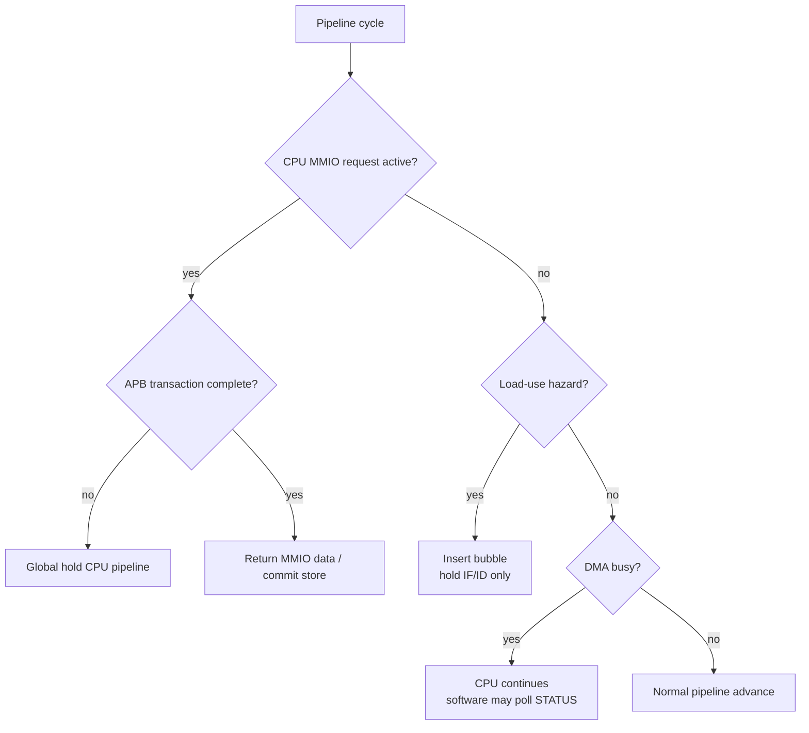

# 04. CPU / DMA Stall Policy Specification

## 1. Mục đích

Tài liệu này chot ro chính sách stall giua:

- `RV32I CPU`
- `DMA`
- `cpu_mmio_to_apb_bridge`
- `DMEM`
- các accelerator `TX` / `RX`

Mục tiêu chính:

- xác định khi nào CPU phải stall;
- xác định khi nào CPU **không** được stall;
- tách biet ro `DMA busy` và `MMIO wait`;
- chot cach xu ly `load-use hazard` khác với `APB wait state`;
- làm có so cho việc refactor pipeline và code `cpu_mmio_to_apb_bridge`.

Verification status hiện tại:

| Case | Coverage/use |
|---|---|
| `mmio_regfile_basic` | normal CPU MMIO read/write return path |
| `mmio_regfile_negative` | MMIO error propagation without false DMA start |
| `soc_sideband_cov` | top-level `cpu_stall_i`, `cpu_if_flush_i`, aux/toggle coverage |
| `cpu_instruction_cov` | branch/load/store instruction behavior while SoC is integrated |
| Full regression | included in `34/34` PASS coverage baseline |

## 2. Nguyên tac tong quat

Hệ thống này sử dụng:

- `CPU` làm control plane
- `DMA` làm data mover
- `TX/RX` làm accelerator
- `DMEM` làm buffer trung gian

Từ đó suy ra nguyên tac quan trong nhất:

> `DMA busy` **không dong nghia** với `CPU stall`.

CPU chỉ nen stall khi chính no dang bị rang buoc bởi một giao dịch mà không the hoàn tất ngay, chu không phải chỉ vi DMA dang chạy.

## 2.1 Stall Decision Flow Chart

## 3. Quy tac stall cap hệ thống

### 3.1 CPU không stall chỉ vi DMA dang chạy

Trong che do bình thường:

- DMA đọc/ghi `DMEM` qua port B
- CPU đọc/ghi `DMEM` qua port A
- DMA điều khiển `TX/RX`
- CPU có thể tiếp tục chạy phần mềm, polling hoặc làm việc khác

Do đó:

- `dma_busy = 1` **không** tự động keo theo `cpu_stall = 1`

## 3.2 CPU stall khi MMIO transaction của chính CPU chưa xong

Nếu CPU dang thuc thì một lenh MMIO toi `cpu_mmio_to_apb_bridge`, và bridge chưa nhận được kết quả APB hợp lệ, CPU phải stall cho toi khi transaction kết thúc.

Các trường hop:

- APB dang o `ACCESS`
- `PREADY = 0`

Lúc đó:

- bridge phải assert `cpu_stall_req_o = 1` trong `ACCESS`
- SoC phải dừng pipeline theo cơ chế `global hold`
- cycle `SETUP` không cần stall nếu bridge da latch request on dinh

## 3.3 Load-use hazard không được xu ly bằng global stall

`load-use hazard` là một trường hop riêng của pipeline data hazard.

Chính sách dung:

- IF và ID dùng lại
- ID/EX được chen `bubble`
- pipeline **không** bị hold toàn cục

Nghĩa là:

- `load-use hazard` phải là `bubble policy`
- `MMIO/APB wait` phải là `hold policy`

Hai cơ chế này không được tron vao cung một tín hiệu điều khiển.

## 4. Các loại stall / hold trong hệ thống

Hệ thống nen tách ro 4 nhom điều khiển:

### 4.1 `load_use_bubble_req`

Dùng cho:

- `lw` / `lh` / `lb` và instruction ke tiep dung ngay kết quả load

Hành vi:

- giữ IF/ID
- chen bubble vao ID/EX
- EX/MEM/MEM/WB vẫn tiếp tục dich chuyen bình thường

### 4.2 `global_hold_req`

Dùng cho:

- MMIO read/write qua APB của CPU dang in-flight
- APB wait state (`PREADY = 0`)
- các tính hướng can dung toàn bộ pipeline một cach an toàn

Hành vi:

- giữ PC
- giữ IF/ID
- giữ ID/EX
- giữ EX/MEM nếu cần
- không chen bubble gia

Nói cách khác:

- state của instruction dang cho kết quả phải được giữ nguyên
- không được để instruction do chạy tiep khi MMIO transaction chưa xong

### 4.3 `load_response_hold_req`

Dùng cho:

- cycle response của synchronous load (`load_pending`)

Hành vi:

- giữ IF/ID/EX
- không issue memory/MMIO request mới trong cycle này
- MEM stage vẫn retire pending load

Cơ chế này khác `global_hold_req` vi no không dong bằng chính MEM stage.

### 4.4 `flush_req`

Dùng cho:

- branch taken
- jump
- reset / trap / redirect nếu sau này bo sung

Hành vi:

- xoa instruction sai hướng
- có ưu tiên cao hơn stall thông thường

## 5. Thứ tự ưu tiên đề xuất

Trong cùng một cycle, ưu tiên điều khiển nen là:

1. `reset`
2. `flush_req`
3. `global_hold_req`
4. `load_response_hold_req`
5. `load_use_bubble_req`
6. normal advance

Lý do:

- redirect sai lượng lenh phải được xử lý trước
- MMIO wait cần giữ nguyên instruction hiện tại, không được chen bubble thay the
- load response cycle can chan instruction dung sau load di qua MEM qua som
- `load-use bubble` chỉ là latency hiding của pipeline bình thường

## 6. Chính sách với DMEM

### 6.1 Tách port ownership

| Cổng | Chủ sở hữu |
|---|---|
| Cổng A | CPU |
| Cổng B | DMA |

### 6.2 DMA busy không khoa DMEM của CPU ở mức phần cứng

Với true dual-port BRAM:

- CPU vẫn có thể tiếp tục truy cap DMEM qua port A
- DMA vẫn truy cap port B

Do đó:

- không có lý do phải stall CPU chỉ vi DMA dang đọc/ghi bộ nhớ

### 6.3 Rang buoc ở mức ung dung / phần mềm

Mac đủ phần cứng cho phep truy cap song song, phần mềm phải tránh race condition:

- CPU không nên đọc/ghi vao source buffer khi DMA dang đọc no
- CPU không nên đọc/ghi vao destination buffer khi DMA dang ghi no

Cơ chế đồng bộ v1:

- CPU poll `dma_busy` / `done_sticky`
- CPU chỉ dung buffer sau khi DMA hoàn tất

## 7. MMIO/APB stall semantics

## 7.1 CPU-side MMIO request

Khi CPU truy cap một địa chỉ MMIO:

- nếu bridge chấp nhận request ngay, no phat APB transaction
- trong lúc transaction chưa xong, `cpu_stall_req_o = 1`

CPU chỉ được tiếp tục khi:

- APB write thanh cổng
- hoặc APB read da có `PRDATA`
- hoặc APB trả `PSLVERR`

## 7.2 Giao dịch write

Với MMIO write:

- CPU không cần stall ngay lúc `SETUP` nếu request đã được bridge latch
- CPU được nhận là xong khi `ACCESS` complete và `PREADY = 1`

## 7.3 Giao dịch read

Với MMIO read:

- CPU bị stall trong `ACCESS`, và có thể lau hơn write nếu có wait state
- chỉ được giai phong khi `PRDATA` da hợp lệ và transaction da complete

## 7.4 DMA busy và CPU polling

CPU có thể polling:

- `dma_regfile.STATUS`

Mới lần polling là một MMIO access riêng:

- trong lúc polling read dang in-flight, CPU stall
- sau khi read xong, CPU tiếp tục chạy

Dieu này vẫn khác hoàn toàn với việc stall ca qua trinh DMA.

## 8. Chính sách cho TX / RX

### 8.1 DMA là ben cho APB wait của TX/RX, không phải CPU

Trong v1:

- `dma_tx_engine` là APB master của `TX`
- `dma_rx_engine` là APB master của `RX`

Nếu `TX` / `RX` có wait state:

- ben bị stall là state machine của DMA engine
- CPU không lien quan trực tiếp

### 8.2 Hau qua kiến trúc

Dieu này giup:

- CPU không bị dung khi `TX/RX` cham
- latency accelerator được “hap thu” bởi DMA
- control plane và data plane tách ro

## 9. Các signal đề xuất

SoC nen có các signal logic tách biet:

| Tên signal | Nguồn | Ý nghĩa |
|---|---|---|
| `load_use_bubble_req` | hazard detect | Chen bubble do load-use |
| `cpu_mmio_stall_req` | MMIO/APB bridge | CPU dang cho MMIO complete |
| `load_response_hold_req` | MEM stage | Hold front pipeline trong cycle trả synchronous load |
| `global_hold_req` | SoC control | Hold pipeline an toàn |
| `flush_req` | branch/jump control | Redirect pipeline |

Ket noi đề xuất:

- `global_hold_req = cpu_mmio_stall_req | external_debug_hold | ...`
- `load_use_bubble_req` giữ riêng, không OR trực tiếp vao `global_hold_req`
- `load_response_hold_req` giữ riêng, chỉ OR vao hold của IF/ID/EX

## 10. Tieu chỉ implementation

Implementation được coi là dung khi:

1. `dma_busy = 1` nhưng CPU vẫn có thể tiếp tục chạy instruction bình thường nếu không dùng MMIO lien quan
2. MMIO read/write APB của CPU stall dung instruction hiện tại trong `ACCESS` cho toi khi `PREADY = 1`
3. `load-use hazard` vẫn chen bubble, không bị bien thanh global hold
4. `load_response_hold_req` không làm dong bằng MEM stage
5. Pipeline không bị lặp instruction hoặc mất instruction khi xuất hien MMIO wait state hoặc cycle response của synchronous load
6. CPU và DMA truy cap DMEM qua 2 port tách biet

## 11. Tính hướng mau

### 11.1 CPU start DMA

1. CPU ghi `dma_regfile.CONTROL.start`
2. Bridge phat APB write
3. Trong lúc APB write in-flight, CPU stall
4. Giao dịch xong, CPU tiếp tục
5. DMA bắt đầu chạy
6. CPU không bị stall chỉ vi `dma_busy=1`

### 11.2 CPU polling DMA status

1. CPU đọc `dma_regfile.STATUS`
2. Bridge phat APB read
3. CPU stall trong lúc cho `PREADY`
4. Kết quả ve, CPU tiếp tục
5. Nếu `done=0`, CPU có thể lặp tiep vong polling

### 11.3 DMA dang cho TX

1. DMA da gửi block vao `TX`
2. `TX` chưa xuất đủ ciphertext nen APB read của DMA bị wait
3. DMA engine tu dung state machine của no
4. CPU vẫn tiếp tục chạy

## 12. Ket luan

Chot chính sách:

- `DMA busy` **không** stall CPU
- `CPU MMIO/APB wait` **có** stall CPU
- `load-use hazard` được xử lý bằng bubble
- `MMIO wait` được xử lý bằng global hold
- `TX/RX` wait state do DMA engine hap thu, không đây nguoc stall ve CPU
