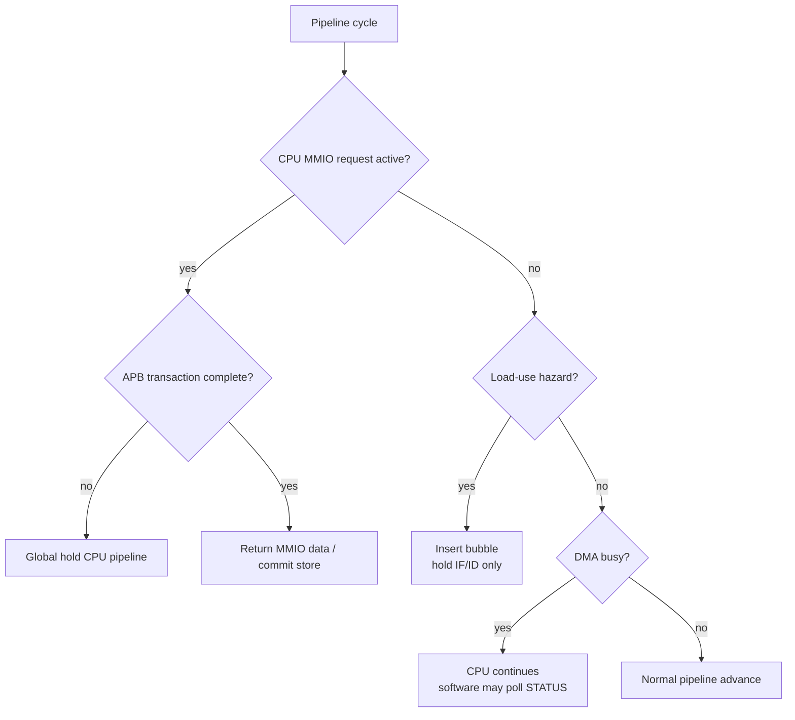

# 04. CPU / DMA Stall Policy Specification

## 1. Muc dich

Tai lieu nay chot ro chinh sach stall giua:

- `RV32I CPU`
- `DMA`
- `cpu_mmio_to_apb_bridge`
- `DMEM`
- cac accelerator `TX` / `RX`

Muc tieu chinh:

- xac dinh khi nao CPU phai stall;
- xac dinh khi nao CPU **khong** duoc stall;
- tach biet ro `DMA busy` va `MMIO wait`;
- chot cach xu ly `load-use hazard` khac voi `APB wait state`;
- lam co so cho viec refactor pipeline va code `cpu_mmio_to_apb_bridge`.

## 2. Nguyen tac tong quat

He thong nay su dung:

- `CPU` lam control plane
- `DMA` lam data mover
- `TX/RX` lam accelerator
- `DMEM` lam buffer trung gian

Tu do suy ra nguyen tac quan trong nhat:

> `DMA busy` **khong dong nghia** voi `CPU stall`.

CPU chi nen stall khi chinh no dang bi rang buoc boi mot giao dich ma khong the hoan tat ngay, chu khong phai chi vi DMA dang chay.

## 2.1 Stall Decision Flow Chart

## 3. Quy tac stall cap he thong

### 3.1 CPU khong stall chi vi DMA dang chay

Trong che do binh thuong:

- DMA doc/ghi `DMEM` qua port B
- CPU doc/ghi `DMEM` qua port A
- DMA dieu khien `TX/RX`
- CPU co the tiep tuc chay phan mem, polling hoac lam viec khac

Do do:

- `dma_busy = 1` **khong** tu dong keo theo `cpu_stall = 1`

## 3.2 CPU stall khi MMIO transaction cua chinh CPU chua xong

Neu CPU dang thuc thi mot lenh MMIO toi `cpu_mmio_to_apb_bridge`, va bridge chua nhan duoc ket qua APB hop le, CPU phai stall cho toi khi transaction ket thuc.

Cac truong hop:

- APB dang o `ACCESS`
- `PREADY = 0`

Luc do:

- bridge phai assert `cpu_stall_req_o = 1` trong `ACCESS`
- SoC phai dung pipeline theo co che `global hold`
- cycle `SETUP` khong can stall neu bridge da latch request on dinh

## 3.3 Load-use hazard khong duoc xu ly bang global stall

`load-use hazard` la mot truong hop rieng cua pipeline data hazard.

Chinh sach dung:

- IF va ID dung lai
- ID/EX duoc chen `bubble`
- pipeline **khong** bi hold toan cuc

Nghia la:

- `load-use hazard` phai la `bubble policy`
- `MMIO/APB wait` phai la `hold policy`

Hai co che nay khong duoc tron vao cung mot tin hieu dieu khien.

## 4. Cac loai stall / hold trong he thong

He thong nen tach ro 4 nhom dieu khien:

### 4.1 `load_use_bubble_req`

Dung cho:

- `lw` / `lh` / `lb` va instruction ke tiep dung ngay ket qua load

Hanh vi:

- giu IF/ID
- chen bubble vao ID/EX
- EX/MEM/MEM/WB van tiep tuc dich chuyen binh thuong

### 4.2 `global_hold_req`

Dung cho:

- MMIO read/write qua APB cua CPU dang in-flight
- APB wait state (`PREADY = 0`)
- cac tinh huong can dung toan bo pipeline mot cach an toan

Hanh vi:

- giu PC
- giu IF/ID
- giu ID/EX
- giu EX/MEM neu can
- khong chen bubble gia

Noi cach khac:

- state cua instruction dang cho ket qua phai duoc giu nguyen
- khong duoc de instruction do chay tiep khi MMIO transaction chua xong

### 4.3 `load_response_hold_req`

Dung cho:

- cycle response cua synchronous load (`load_pending`)

Hanh vi:

- giu IF/ID/EX
- khong issue memory/MMIO request moi trong cycle nay
- MEM stage van retire pending load

Co che nay khac `global_hold_req` vi no khong dong bang chinh MEM stage.

### 4.4 `flush_req`

Dung cho:

- branch taken
- jump
- reset / trap / redirect neu sau nay bo sung

Hanh vi:

- xoa instruction sai huong
- co uu tien cao hon stall thong thuong

## 5. Thu tu uu tien de xuat

Trong cung mot cycle, uu tien dieu khien nen la:

1. `reset`
2. `flush_req`
3. `global_hold_req`
4. `load_response_hold_req`
5. `load_use_bubble_req`
6. normal advance

Ly do:

- redirect sai luong lenh phai duoc xu ly truoc
- MMIO wait can giu nguyen instruction hien tai, khong duoc chen bubble thay the
- load response cycle can chan instruction dung sau load di qua MEM qua som
- `load-use bubble` chi la latency hiding cua pipeline binh thuong

## 6. Chinh sach voi DMEM

### 6.1 Tach port ownership

| Port | Owner |
|---|---|
| Port A | CPU |
| Port B | DMA |

### 6.2 DMA busy khong khoa DMEM cua CPU o muc phan cung

Voi true dual-port BRAM:

- CPU van co the tiep tuc truy cap DMEM qua port A
- DMA van truy cap port B

Do do:

- khong co ly do phai stall CPU chi vi DMA dang doc/ghi bo nho

### 6.3 Rang buoc o muc ung dung / phan mem

Mac du phan cung cho phep truy cap song song, phan mem phai tranh race condition:

- CPU khong nen doc/ghi vao source buffer khi DMA dang doc no
- CPU khong nen doc/ghi vao destination buffer khi DMA dang ghi no

Co che dong bo v1:

- CPU poll `dma_busy` / `done_sticky`
- CPU chi dung buffer sau khi DMA hoan tat

## 7. MMIO/APB stall semantics

## 7.1 CPU-side MMIO request

Khi CPU truy cap mot dia chi MMIO:

- neu bridge chap nhan request ngay, no phat APB transaction
- trong luc transaction chua xong, `cpu_stall_req_o = 1`

CPU chi duoc tiep tuc khi:

- APB write thanh cong
- hoac APB read da co `PRDATA`
- hoac APB tra `PSLVERR`

## 7.2 Giao dich write

Voi MMIO write:

- CPU khong can stall ngay luc `SETUP` neu request da duoc bridge latch
- CPU duoc nhan la xong khi `ACCESS` complete va `PREADY = 1`

## 7.3 Giao dich read

Voi MMIO read:

- CPU bi stall trong `ACCESS`, va co the lau hon write neu co wait state
- chi duoc giai phong khi `PRDATA` da hop le va transaction da complete

## 7.4 DMA busy va CPU polling

CPU co the polling:

- `dma_regfile.STATUS`

Moi lan polling la mot MMIO access rieng:

- trong luc polling read dang in-flight, CPU stall
- sau khi read xong, CPU tiep tuc chay

Dieu nay van khac hoan toan voi viec stall ca qua trinh DMA.

## 8. Chinh sach cho TX / RX

### 8.1 DMA la ben cho APB wait cua TX/RX, khong phai CPU

Trong v1:

- `dma_tx_engine` la APB master cua `TX`
- `dma_rx_engine` la APB master cua `RX`

Neu `TX` / `RX` co wait state:

- ben bi stall la state machine cua DMA engine
- CPU khong lien quan truc tiep

### 8.2 Hau qua kien truc

Dieu nay giup:

- CPU khong bi dung khi `TX/RX` cham
- latency accelerator duoc “hap thu” boi DMA
- control plane va data plane tach ro

## 9. Cac signal de xuat

SoC nen co cac signal logic tach biet:

| Ten signal | Nguon | Y nghia |
|---|---|---|
| `load_use_bubble_req` | hazard detect | Chen bubble do load-use |
| `cpu_mmio_stall_req` | MMIO/APB bridge | CPU dang cho MMIO complete |
| `load_response_hold_req` | MEM stage | Hold front pipeline trong cycle tra synchronous load |
| `global_hold_req` | SoC control | Hold pipeline an toan |
| `flush_req` | branch/jump control | Redirect pipeline |

Ket noi de xuat:

- `global_hold_req = cpu_mmio_stall_req | external_debug_hold | ...`
- `load_use_bubble_req` giu rieng, khong OR truc tiep vao `global_hold_req`
- `load_response_hold_req` giu rieng, chi OR vao hold cua IF/ID/EX

## 10. Tieu chi implementation

Implementation duoc coi la dung khi:

1. `dma_busy = 1` nhung CPU van co the tiep tuc chay instruction binh thuong neu khong dung MMIO lien quan
2. MMIO read/write APB cua CPU stall dung instruction hien tai trong `ACCESS` cho toi khi `PREADY = 1`
3. `load-use hazard` van chen bubble, khong bi bien thanh global hold
4. `load_response_hold_req` khong lam dong bang MEM stage
5. Pipeline khong bi lap instruction hoac mat instruction khi xuat hien MMIO wait state hoac cycle response cua synchronous load
6. CPU va DMA truy cap DMEM qua 2 port tach biet

## 11. Tinh huong mau

### 11.1 CPU start DMA

1. CPU ghi `dma_regfile.CONTROL.start`
2. Bridge phat APB write
3. Trong luc APB write in-flight, CPU stall
4. Giao dich xong, CPU tiep tuc
5. DMA bat dau chay
6. CPU khong bi stall chi vi `dma_busy=1`

### 11.2 CPU polling DMA status

1. CPU doc `dma_regfile.STATUS`
2. Bridge phat APB read
3. CPU stall trong luc cho `PREADY`
4. Ket qua ve, CPU tiep tuc
5. Neu `done=0`, CPU co the lap tiep vong polling

### 11.3 DMA dang cho TX

1. DMA da gui block vao `TX`
2. `TX` chua xuat du ciphertext nen APB read cua DMA bi wait
3. DMA engine tu dung state machine cua no
4. CPU van tiep tuc chay

## 12. Ket luan

Chot chinh sach:

- `DMA busy` **khong** stall CPU
- `CPU MMIO/APB wait` **co** stall CPU
- `load-use hazard` duoc xu ly bang bubble
- `MMIO wait` duoc xu ly bang global hold
- `TX/RX` wait state do DMA engine hap thu, khong day nguoc stall ve CPU
