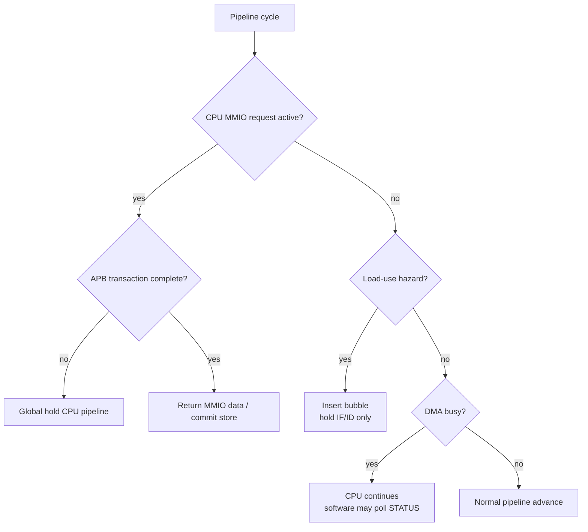

# 04. CPU / DMA Stall Policy Specification

## 1. Purpose

This document outlines the stalling policy:

- `RV32I CPU`
- `DMA`
- `cpu_mmio_to_apb_bridge`
- `DMEM`
- accelerators `TX` / `RX`

Main goals:

- Determine when the CPU must stall;
- determines when the CPU **must** not stall;
- separate risks `DMA busy` and `MMIO wait`;
- How to separate `load-use hazard` from `APB wait state`;
- There is a need to refactor the pipeline and code `cpu_mmio_to_apb_bridge`.

Current verification status:

| Case | Coverage/use |
|---|---|
| `mmio_regfile_basic` | normal CPU MMIO read/write return path |
| `mmio_regfile_negative` | MMIO error propagation without false DMA start |
| `soc_sideband_cov` | top-level `cpu_stall_i`, `cpu_if_flush_i`, aux/toggle coverage |
| `cpu_instruction_cov` | branch/load/store instruction behavior while SoC is integrated |
| Full regression | included in `34/34` PASS coverage baseline |

## 2. General principles

This system uses:

- `CPU` as the control plane
- `DMA` as data mover
- `TX/RX` as accelerator
- `DMEM` as an intermediate buffer

From there, deduce the most important principle:

> `DMA busy` **not synonymous** with `CPU stall`.

The CPU only stalls when it itself is overwhelmed by a transaction that cannot be completed immediately, not just because DMA is running.

## 2.1 Stall Decision Flow Chart

## 3. System Stall Rules

### 3.1 The CPU does not stall only because DMA is running

In normal operation:

- DMA read/write `DMEM` via port B
- CPU reads/writes `DMEM` via port A
- DMA controls `TX/RX`
- The CPU can continue running software, polling or doing other things

Therefore:

- `dma_busy = 1` **does not** automatically imply `cpu_stall = 1`

## 3.2 CPU stall when the CPU's own MMIO transaction has not completed

If the CPU is executing an MMIO command to `cpu_mmio_to_apb_bridge`, and the bridge has not received a valid APB result, the CPU must stall until the transaction ends.

Relevant conditions:

- APB is located at `ACCESS`
- `PREADY = 0`

At that time:

- The bridge must assert `cpu_stall_req_o = 1` in `ACCESS`
- The SoC must stop the pipeline according to mechanism `global hold`
- cycle `SETUP` does not require stall if the bridge has a latch request on the bridge

## 3.3 Load-use hazard cannot be eliminated by global stall

`load-use hazard` is a special case of pipeline data hazard.

Content policy:

- IF and ID are reused
- ID/EX is inserted `bubble`
- The pipeline is **not** globally held

This means:

- `load-use hazard` should be `bubble policy`
- `MMIO/APB wait` should be `hold policy`

These two mechanisms cannot be included in a control signal.

## 4. Types of stall / hold in the system

The system separates 4 control groups:

### 4.1 `load_use_bubble_req`

Used for:

- `lw` / `lh` / `lb` and instructions to continue using the loading results immediately

Behavior:

- keep IF/ID
- insert bubble into ID/EX
- EX/MEM/MEM/WB continues to translate normally

### 4.2 `global_hold_req`

Used for:

- MMIO read/write via in-flight CPU APB
- APB wait state (`PREADY = 0`)
- Features that securely cover the entire pipeline

Behavior:

- keep PC
- keep IF/ID
- keep ID/EX
- hold EX/MEM if needed
- Do not insert bubble price

In other words:

- The state of the instruction that is producing the result must be preserved
- Do not let the instruction run until the MMIO transaction is completed

### 4.3 `load_response_hold_req`

Used for:

- cycle response of synchronous load (`load_pending`)

Behavior:

- keep IF/ID/EX
- No new memory issue/MMIO request in this cycle
- MEM stage is still retired pending load

This mechanism is different from `global_hold_req` because it is not equal to the MEM stage itself.

### 4.4 `flush_req`

Used for:

- branch taken
- jump
- reset / trap / redirect if added later

Behavior:

- delete instructions in the wrong direction
- has higher priority than regular stalls

## 5. Suggested order of priority

In the same cycle, the control priority is:

1. `reset`
2. `flush_req`
3. `global_hold_req`
4. `load_response_hold_req`
5. `load_use_bubble_req`
6. normal advance

Reason:

- Incorrect redirect amount of commands must be processed first
- MMIO wait needs to keep the current instruction intact, not replace the bubble
- The load response cycle can change the instructions used after the load to go through the MEM via the forwarding path
- `load-use bubble` is just latency hiding of the normal pipeline

## 6. Policy with DMEM

### 6.1 Separating port ownership

| Port | Owner |
|---|---|
| Port A | CPU |
| Port B | DMA |

### 6.2 DMA busy does not lock the CPU's DMEM at the hardware level

With true dual-port BRAM:

- The CPU can still continue to access DMEM via port A
- DMA still accesses port B

Therefore:

- There is no reason to stall the CPU just because DMA is reading/writing memory

### 6.3 Ranging at app/software level

Mac has enough hardware to allow parallel access, software must avoid race conditions:

- The CPU should not read/write to the source buffer while DMA is reading it
- The CPU should not read/write to the destination buffer while DMA is writing to it

Synchronization mechanism v1:

- CPU poll `dma_busy` / `done_sticky`
- The CPU only buffers after DMA is complete

## 7. MMIO/APB stall semantics

## 7.1 CPU-side MMIO request

When the CPU accesses an MMIO address:

- If the bridge accepts the request immediately, no APB transaction is initiated
- While the transaction is not completed, `cpu_stall_req_o = 1`

The CPU is only resumed when:

- APB write port into
- or APB read da has `PRDATA`
- or APB pay `PSLVERR`

## 7.2 Write transaction

With MMIO write:

- The CPU does not need to stall at `SETUP` if the request has been bridge latched
- The CPU is considered complete when `ACCESS` is complete and `PREADY = 1` is complete

## 7.3 Transaction read

With MMIO read:

- The CPU is stalled in `ACCESS`, and can wait instead of writing while there is a wait state
- Awarded only when `PRDATA` is valid and the transaction is complete

## 7.4 DMA busy and CPU polling

CPUs can poll:

- `dma_regfile.STATUS`

The new polling time is a separate MMIO access:

- While polling read is in-flight, CPU stall
- After reading is completed, the CPU continues to run

This rule is completely different from stalling through the DMA process.

## 8. Policy for TX/RX

### 8.1 DMA is the signal for APB wait of TX/RX, not CPU

In v1:

- `dma_tx_engine` is the APB master of `TX`
- `dma_rx_engine` is the APB master of `RX`

If `TX` / `RX` has wait state:

- The stalled ben is the state machine of the DMA engine
- CPU is not directly involved

### 8.2 Architecture review

This guide helps:

- CPU is not used when `TX/RX` is disabled
- latency accelerator is "captured" by DMA
- Control plane and data plane separate clear

## 9. Recommended signals

SoC should have separate logic signals:

| Signal name | Source | Meaning |
|---|---|---|
| `load_use_bubble_req` | hazard detect | Chen bubble due to load-use |
| `cpu_mmio_stall_req` | MMIO/APB bridge | CPU is completing MMIO |
| `load_response_hold_req` | MEM stage | Hold the front pipeline during the synchronous load cycle |
| `global_hold_req` | SoC control | Hold pipeline securely |
| `flush_req` | branch/jump control | Redirect pipeline |

Suggested connection:

- `global_hold_req = cpu_mmio_stall_req | external_debug_hold | ...`
- Keep `load_use_bubble_req` separate, do not OR directly into `global_hold_req`
- `load_response_hold_req` is kept separate, just OR into the hold of IF/ID/EX

## 10. Implementation specification

Implementation is considered valid when:

1. `dma_busy = 1` but the CPU can still continue to run instructions normally if the related MMIO is not used.
2. MMIO read/write APB of CPU stall uses current instruction in `ACCESS` until `PREADY = 1`
3. `load-use hazard` still entered the bubble, but did not change the global hold
4. `load_response_hold_req` does not work with MEM stage
5. Pipeline does not repeat instructions or lose instructions when displaying MMIO wait state or cycle response of synchronous load
6. CPU and DMA access DMEM via two separate ports

## 11. Quick direction

### 11.1 CPU start DMA

1. CPU writes `dma_regfile.CONTROL.start`
2. Bridge phat APB write
3. While APB writes in-flight, CPU stalls
4. Transaction completed, CPU continues
5. DMA starts running
6. The CPU is not stalled only because of `dma_busy=1`

### 11.2 CPU polling DMA status

1. CPU reads `dma_regfile.STATUS`
2. Bridge phat APB read
3. CPU stall while giving `PREADY`
4. As a result, the CPU continues
5. If `done=0`, the CPU can continue polling

### 11.3 DMA is available for TX

1. The DMA sends the block to `TX`
2. `TX` has not output enough ciphertext number the DMA APB read is waiting
3. DMA engine uses its state machine
4. The CPU continues to run

## 12. Conclusion

Policy Chot:

- `DMA busy` **does not** stall CPU
- `CPU MMIO/APB wait` **has** CPU stall
- `load-use hazard` is bubble processed
- `MMIO wait` is handled by global hold
- `TX/RX` wait state is received by the DMA engine, this source is not stalled to the CPU
