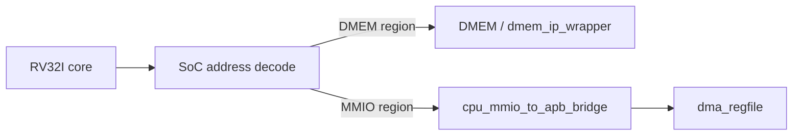

# 05. Module Specification: `cpu_mmio_to_apb_bridge`

## 1. Muc dich

`cpu_mmio_to_apb_bridge` la cau noi giua CPU-side MMIO access va APB peripheral bus.

Module nay dung de:

- nhan mot request MMIO tu phia SoC / CPU memory path;
- chuyen request do thanh APB master transaction;
- cho slave APB tra `PREADY`, `PRDATA`, `PSLVERR`;
- tra ket qua doc/ghi ve phia CPU wrapper;
- tao tin hieu stall/busy trong luc APB transaction dang in-flight.

Module nay **khong** decode noi bo cho nhieu peripheral. No chi xuat **mot APB master channel**. Trong SoC hien tai, channel nay chi noi toi `dma_regfile`.

Neu sau nay muon CPU debug truc tiep TX/RX, can them APB decoder/mux ben ngoai bridge. Do khong phai flow chinh hien tai.

## 2. Vi tri trong he thong

## 3. Luu y ve APB protocol

Giao thuc APB co **2 phase**:

1. `SETUP`
2. `ACCESS`

De thiet ke de hieu hon, `cpu_mmio_to_apb_bridge` duoc khuyen nghi viet bang FSM **3 state**:

1. `IDLE`
2. `SETUP`
3. `ACCESS`

Nghia la:

- `IDLE` la state noi bo cua bridge;
- APB transfer van tuan thu dung 2 phase `SETUP` va `ACCESS`.

## 4. Pham vi hien tai

Implementation hien tai nham toi:

- CPU ghi/doc cac thanh ghi `dma_regfile`
- chi ho tro single outstanding transaction
- chi ho tro truy cap 32-bit canh word (`LW`, `SW`)
- khong ho tro burst
- khong ho tro pipelining giao dich lien tiep trong cung mot transfer

## 5. Cong module de xuat

### 5.1 Clock va reset

| Cong | Huong | Rong | Mo ta |
|---|---|---:|---|
| `clk_i` | in | 1 | Clock he thong |
| `rst_i` | in | 1 | Reset active-high |

### 5.2 CPU-side request/response interface

| Cong | Huong | Rong | Mo ta |
|---|---|---:|---|
| `mmio_req_i` | in | 1 | Yeu cau MMIO hop le |
| `mmio_write_i` | in | 1 | `1`: write, `0`: read |
| `mmio_addr_i` | in | 32 | Dia chi MMIO day du |
| `mmio_wdata_i` | in | 32 | Du lieu write |
| `mmio_wstrb_i` | in | 4 | Byte enable; current implementation yeu cau `4'b1111` cho write |
| `mmio_rdata_o` | out | 32 | Du lieu read tra ve |
| `mmio_done_o` | out | 1 | Pulse 1 cycle khi transfer ket thuc |
| `mmio_error_o` | out | 1 | Pulse 1 cycle khi transfer loi |
| `mmio_busy_o` | out | 1 | Bridge dang ban |
| `cpu_stall_req_o` | out | 1 | Yeu cau stall CPU trong luc APB in-flight |

### 5.3 APB master interface

| Cong | Huong | Rong | Mo ta |
|---|---|---:|---|
| `PSEL_o` | out | 1 | Chon APB bus transaction |
| `PENABLE_o` | out | 1 | Access phase |
| `PWRITE_o` | out | 1 | `1`: write, `0`: read |
| `PADDR_o` | out | 32 | Dia chi APB |
| `PWDATA_o` | out | 32 | Du lieu write |
| `PRDATA_i` | in | 32 | Du lieu read tu slave |
| `PREADY_i` | in | 1 | Slave ready |
| `PSLVERR_i` | in | 1 | Slave error |

## 6. Hanh vi tong quat

### 6.1 Dieu kien chap nhan request

Bridge chi nhan request moi khi:

- dang o state `IDLE`
- `mmio_req_i = 1`
- request la 32-bit aligned:
  - `mmio_addr_i[1:0] == 2'b00`
  - read: `mmio_write_i = 0`
  - write: `mmio_write_i = 1` va `mmio_wstrb_i = 4'b1111`

Neu request khong hop le:

- khong phat APB transaction
- `mmio_done_o = 1` trong 1 cycle
- `mmio_error_o = 1`
- `mmio_rdata_o = 32'b0`

### 6.2 FSM de xuat

#### `IDLE`

- `PSEL_o = 0`
- `PENABLE_o = 0`
- Cho request moi
- Khi chap nhan request:
  - latch `addr`, `write`, `wdata`
  - chuyen sang `SETUP`

#### `SETUP`

- `PSEL_o = 1`
- `PENABLE_o = 0`
- `PADDR_o`, `PWRITE_o`, `PWDATA_o` giu co dinh
- Sau dung 1 cycle, chuyen sang `ACCESS`

#### `ACCESS`

- `PSEL_o = 1`
- `PENABLE_o = 1`
- Giu nguyen `PADDR_o`, `PWRITE_o`, `PWDATA_o`
- Neu `PREADY_i = 0`: tiep tuc o `ACCESS`
- Neu `PREADY_i = 1`:
  - write: complete transfer
  - read: latch `PRDATA_i` vao `mmio_rdata_o`
  - neu `PSLVERR_i = 1`: set `mmio_error_o = 1`
  - phat `mmio_done_o = 1`
  - quay ve `IDLE`

## 7. APB timing policy

Trong `ACCESS`, cac tin hieu sau phai giu on dinh cho den khi `PREADY_i = 1`:

- `PSEL_o`
- `PENABLE_o`
- `PWRITE_o`
- `PADDR_o`
- `PWDATA_o`

Module khong duoc chen them phase nao ngoai `SETUP` va `ACCESS`.

## 8. CPU-visible semantics

| Truong hop | Hanh vi |
|---|---|
| Write thanh cong | `mmio_done_o=1`, `mmio_error_o=0` |
| Read thanh cong | `mmio_done_o=1`, `mmio_error_o=0`, `mmio_rdata_o=PRDATA_i` |
| Slave APB bao loi | `mmio_done_o=1`, `mmio_error_o=1` |
| Dia chi / size local invalid | `mmio_done_o=1`, `mmio_error_o=1`, khong phat APB |
| APB wait state | `cpu_stall_req_o=1` trong `ACCESS`, `mmio_busy_o=1` cho toi khi `PREADY_i=1` |

## 9. Gioi han hien tai

Implementation hien tai chi ho tro:

- `LW` / `SW`
- aligned 32-bit
- mot giao dich tai mot thoi diem

Implementation hien tai **khong** ho tro:

- `LB/LH/LBU/LHU`
- `SB/SH`
- burst APB
- write combining
- back-to-back request acceptance khi transaction cu chua xong

## 10. Tich hop voi core hien tai

Day la diem quan trong nhat cua implementation hien tai:

- bridge latch request trong `SETUP`
- `cpu_stall_req_o` chi can assert trong `ACCESS`
- lop SoC phia tren phai hold dung front pipeline cho toi khi `mmio_done_o = 1`

Ngoai ra, synchronous load path phai co co che rieng de:

- giu instruction dung sau load ra khoi MEM trong cycle response
- route read data theo request da latch (`DMEM` hay `MMIO`)

Neu khong, lenh MMIO read co the doc sai du lieu hoac instruction dung sau MMIO co the bi mat.

## 11. Ghi chu ve decode dia chi

`cpu_mmio_to_apb_bridge` khong can biet base cua tung peripheral cu the.

Implementation hien tai:

- bridge nhan bat ky request nao ma lop SoC da ket luan la `MMIO`
- `PADDR_o` giu nguyen dia chi day du
- `rv32_soc_top` tru base `0x4000_0000` thanh local address cho `dma_regfile`
- khong co CPU-visible APB decoder cho TX/RX trong flow chinh

Neu mo rong sau nay:

- co the them `apb_decoder` ben ngoai bridge
- khi do decoder se dung `PADDR_o` de phat `PSEL_DMA`, `PSEL_TX`, `PSEL_RX`

## 12. Tieu chi implementation

Implementation duoc coi la dat khi:

1. Read/write APB co waveform dung `SETUP -> ACCESS`
2. `PADDR/PWDATA/PWRITE` giu on dinh trong ACCESS cho den khi `PREADY_i=1`
3. Request invalid duoc bat local, khong phat APB
4. Wait state dai nhieu cycle van khong lam mat request
5. `cpu_stall_req_o` chi assert trong `ACCESS`, khong assert som ngay chu ky `SETUP`
6. `mmio_done_o` va `mmio_error_o` la pulse 1 cycle ro rang
