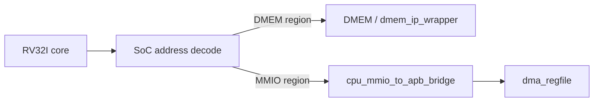

# 05. Module Specification: `cpu_mmio_to_apb_bridge`

## 1. Purpose

`cpu_mmio_to_apb_bridge` is the connection between CPU-side MMIO access and APB peripheral bus.

This module:

- receive an MMIO request from the SoC / CPU memory path;
- converts the request into an APB master transaction;
- receives APB slave return signals `PREADY`, `PRDATA`, `PSLVERR`;
- returns read/write completion to the CPU wrapper;
- generates stall/busy signals while APB transaction is in-flight.

This module **does not** decode multiple peripherals internally. It only exports **one APB master channel**. In the current SoC, this channel only talks to `dma_regfile`.

If you want the CPU to directly debug TX/RX in the future, you can add an APB decoder/mux outside the bridge. That decoder is outside the current main flow.

## 2. Role in the system

## 3. APB protocol notes

The APB protocol has **2 phases**:

1. `SETUP`
2. `ACCESS`

For clarity, it is recommended to write `cpu_mmio_to_apb_bridge` using a **3-state** FSM:

1. `IDLE`
2. `SETUP`
3. `ACCESS`

This means:

- `IDLE` is the bridge's internal state;
- APB transfer still uses 2 phases `SETUP` and `ACCESS`.

## 4. Current scope

Current implementation supports:

- CPU writes/reads `dma_regfile` registers
- Only single outstanding transaction is supported
- Only supports word-based 32-bit access (`LW`, `SW`)
- Does not support bursts
- Pipelining of consecutive transactions within the same transfer is not supported

Current verification status:

| Case | Coverage/use |
|---|---|
| `mmio_regfile_basic` | legal CPU MMIO load/store path |
| `mmio_regfile_negative` | invalid size/address and APB error propagation |
| `dma_bridge_direct_cov` | APB wait-state, PSLVERR, invalid local request branches |
| Full regression | included in `34/34` PASS coverage baseline |

## 5. Recommended module ports

### 5.1 Clock and reset

| Port | Direction | Width | Data format | Description |
|---|---|---:|---|---|
| `clk_i` | in | 1 | Clock level | System clock |
| `rst_i` | in | 1 | Reset level active-high | Reset active-high |

### 5.2 CPU-side request/response interface

| Port | Direction | Width | Data format | Description |
|---|---|---:|---|---|
| `mmio_req_i` | in | 1 | Valid flag (`0/1`) | MMIO request is valid |
| `mmio_write_i` | in | 1 | Control flag (`1=write`, `0=read`) | `1`: write, `0`: read |
| `mmio_addr_i` | in | 32 | Byte address, word-aligned | Requested MMIO byte address |
| `mmio_wdata_i` | in | 32 | Raw write data word | Data write |
| `mmio_wstrb_i` | in | 4 | Byte lane strobes | Bytes enabled; current implementation requires `4'b1111` for write |
| `mmio_rdata_o` | out | 32 | Raw read data word | Data read returned |
| `mmio_done_o` | out | 1 | Pulse flag (`1` in 1 cycle) | Pulse 1 cycle when transfer ends |
| `mmio_error_o` | out | 1 | Pulse flag (`1` in 1 cycle) | Pulse 1 cycle when transfer error |
| `mmio_busy_o` | out | 1 | Busy flag (`0/1`) | Bridge is busy |
| `cpu_stall_req_o` | out | 1 | Stall request flag (`0/1`) | Requests CPU stall while APB transaction is in flight |

### 5.3 APB master interface

| Port | Direction | Width | Data format | Description |
|---|---|---:|---|---|
| `PSEL_o` | out | 1 | APB select flag (`0/1`) | Select APB bus transaction |
| `PENABLE_o` | out | 1 | APB access phase flag | Access phase |
| `PWRITE_o` | out | 1 | APB direction flag (`1=write`, `0=read`) | `1`: write, `0`: read |
| `PADDR_o` | out | 32 | APB byte address | APB address |
| `PWDATA_o` | out | 32 | APB write data word | Data write |
| `PRDATA_i` | in | 32 | APB read data word | Data read from slave |
| `PREADY_i` | in | 1 | APB ready flag (`0/1`) | Slave ready |
| `PSLVERR_i` | in | 1 | APB error flag (`0/1`) | Slave error |

### 5.4 Register and state in bridge

| Register | Bit width | Data format | Function |
|---|---:|---|---|
| `state_r` | 2 | FSM state (`00=IDLE`, `10=ACCESS`) | APB bridge status |
| `req_write_r` | 1 | Control flag (`0/1`) | Latched request direction |
| `req_addr_r` | 32 | Latched byte address | Request address latched in SETUP |
| `req_wdata_r` | 32 | Latched write data word | Write data latched in SETUP |
| `last_req_valid_r` | 1 | Valid flag (`0/1`) | Marks the most recent latched request valid |
| `last_req_write_r` | 1 | Control flag (`0/1`) | Most recent request direction |
| `last_req_addr_r` | 32 | Latched byte address | Address of the most recent request |
| `last_req_wdata_r` | 32 | Latched write data word | Most recent data write |
| `last_req_wstrb_r` | 4 | Byte lane strobes | Strobe of the most recent request |
| `mmio_rdata_o` | 32 | Raw read data word | Data read returns to CPU |
| `mmio_done_o` | 1 | Pulse flag (`1` in 1 cycle) | Transfer completion pulse |
| `mmio_error_o` | 1 | Pulse flag (`1` in 1 cycle) | Transfer error pulse |

## 6. General behavior

### 6.1 Conditions for accepting requests

Bridge only receives new requests when:

- currently in state `IDLE`
- `mmio_req_i = 1`
- request is 32-bit aligned:
  - `mmio_addr_i[1:0] == 2'b00`
  - read: `mmio_write_i = 0`
  - write: `mmio_write_i = 1` and `mmio_wstrb_i = 4'b1111`

If request is invalid:

- Do not generate APB transactions
- `mmio_done_o = 1` in 1 cycle
- `mmio_error_o = 1`
- `mmio_rdata_o = 32'b0`

### 6.2 Recommended FSM

#### `IDLE`

- `PSEL_o = 0`
- `PENABLE_o = 0`
- For new request
- When accepting the request:
  - latch `addr`, `write`, `wdata`
  - Switch to `SETUP`

#### `SETUP`

- `PSEL_o = 1`
- `PENABLE_o = 0`
- `PADDR_o`, `PWRITE_o`, `PWDATA_o` keep fixed
- After using 1 cycle, switch to `ACCESS`

#### `ACCESS`

- `PSEL_o = 1`
- `PENABLE_o = 1`
- Leave `PADDR_o`, `PWRITE_o`, `PWDATA_o` unchanged
- If `PREADY_i = 0`: continue in `ACCESS`
- If `PREADY_i = 1`:
  - write: complete transfer
  - read: latch `PRDATA_i` into `mmio_rdata_o`
  - if `PSLVERR_i = 1`: set `mmio_error_o = 1`
  - phat `mmio_done_o = 1`
  - returns to `IDLE`

## 7. APB timing policy

In `ACCESS`, the following signals must remain on until `PREADY_i = 1`:

- `PSEL_o`
- `PENABLE_o`
- `PWRITE_o`
- `PADDR_o`
- `PWDATA_o`

The module must not insert any additional phases other than `SETUP` and `ACCESS`.

## 8. CPU-visible semantics

| Field hop | Behavior |
|---|---|
| Write gate | `mmio_done_o=1`, `mmio_error_o=0` |
| Read the gate | `mmio_done_o=1`, `mmio_error_o=0`, `mmio_rdata_o=PRDATA_i` |
| Slave APB reported an error | `mmio_done_o=1`, `mmio_error_o=1` |
| Address / size local invalid | `mmio_done_o=1`, `mmio_error_o=1`, no APB output |
| APB wait state | `cpu_stall_req_o=1` in `ACCESS`, `mmio_busy_o=1` gives me `PREADY_i=1` |

## 9. Current limit

Current implementation only supports:

- `LW` / `SW`
- aligned 32-bit
- One transaction at a time

Current implementation **does not** support:

- `LB/LH/LBU/LHU`
- `SB/SH`
- burst APB
- write combining
- back-to-back request acceptance when the old transaction has not been completed

## 10. Integrate with current core

Here is the most important point of the current implementation:

- bridge latch request in `SETUP`
- `cpu_stall_req_o` can only assert in `ACCESS`
- The upper SoC layer must hold the front pipeline until `mmio_done_o = 1`

In addition, the synchronous load path must have its own mechanism to:

- keep the instruction content after loading out of MEM during the response cycle
- route read data according to the latched request (`DMEM` or `MMIO`)

Otherwise, the MMIO read command may read incorrect data or the instruction following the MMIO may be lost.

## 11. Note the address decode

`cpu_mmio_to_apb_bridge` does not need to know the base of each old peripheral.

Current implementation:

- The bridge receives any request and the resulting SoC code is `MMIO`
- `PADDR_o` keeps the same address here
- `rv32_soc_top` tru base `0x4000_0000` represents the local address for `dma_regfile`
- There is no CPU-visible APB decoder for TX/RX in the main flow

If expanded later:

- `apb_decoder` can be added to the bridge
- When decoder will use `PADDR_o` to generate `PSEL_DMA`, `PSEL_TX`, `PSEL_RX`

## 12. Implementation specification

Implementation is considered valid when:

1. Read/write APB has waveform capacity `SETUP -> ACCESS`
2. `PADDR/PWDATA/PWRITE` stays on in ACCESS until `PREADY_i=1`
3. Invalid request is fired locally, no APB is generated
4. Wait state for many cycles without losing the request
5. `cpu_stall_req_o` only asserts in `ACCESS`, does not assert in the `SETUP` cycle
6. `mmio_done_o` and `mmio_error_o` are clear 1-cycle pulses
