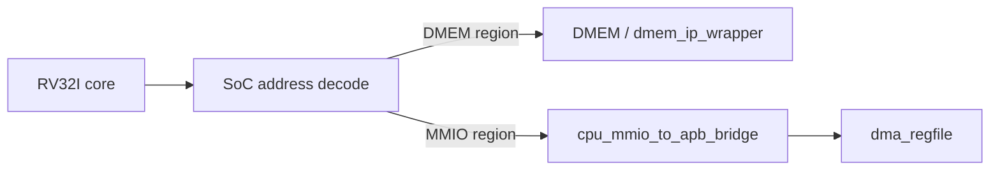

# 05. Module Specification: `cpu_mmio_to_apb_bridge`

## 1. Mục đích

`cpu_mmio_to_apb_bridge` là cau noi giua CPU-side MMIO access và APB peripheral bus.

Module này dung để:

- nhận một request MMIO tu phia SoC / CPU memory path;
- chuyen request do thanh APB master transaction;
- cho slave APB trả `PREADY`, `PRDATA`, `PSLVERR`;
- trả kết quả đọc/ghi ve phia CPU wrapper;
- tạo tín hiệu stall/busy trong lúc APB transaction dang in-flight.

Module này **không** decode nội bộ cho nhieu peripheral. No chỉ xuất **một APB master channel**. Trong SoC hiện tại, channel này chỉ noi toi `dma_regfile`.

Nếu sau này muon CPU debug trực tiếp TX/RX, can thêm APB decoder/mux ben ngoài bridge. Do không phải flow chính hiện tại.

## 2. Vi tri trong hệ thống

## 3. Lưu y ve APB protocol

Giao thuc APB có **2 phase**:

1. `SETUP`
2. `ACCESS`

Để thiết kế để hieu hơn, `cpu_mmio_to_apb_bridge` được khuyến nghị viet bằng FSM **3 state**:

1. `IDLE`
2. `SETUP`
3. `ACCESS`

Nghĩa là:

- `IDLE` là state nội bộ của bridge;
- APB transfer vẫn tuan thu dung 2 phase `SETUP` và `ACCESS`.

## 4. Pham vi hiện tại

Implementation hiện tại nham toi:

- CPU ghi/đọc các thanh ghi `dma_regfile`
- chỉ hỗ trợ single outstanding transaction
- chỉ hỗ trợ truy cap 32-bit căn word (`LW`, `SW`)
- không hỗ trợ burst
- không hỗ trợ pipelining giao dịch lien tiep trong cùng một transfer

Verification status hiện tại:

| Case | Coverage/use |
|---|---|
| `mmio_regfile_basic` | legal CPU MMIO load/store path |
| `mmio_regfile_negative` | invalid size/address and APB error propagation |
| `dma_bridge_direct_cov` | APB wait-state, PSLVERR, invalid local request branches |
| Full regression | included in `34/34` PASS coverage baseline |

## 5. Cổng module đề xuất

### 5.1 Clock và reset

| Cổng | Hướng | Rộng | Định dạng dữ liệu | Mô tả |
|---|---|---:|---|---|
| `clk_i` | in | 1 | Clock level | Clock hệ thống |
| `rst_i` | in | 1 | Reset level active-high | Reset active-high |

### 5.2 CPU-side request/response interface

| Cổng | Hướng | Rộng | Định dạng dữ liệu | Mô tả |
|---|---|---:|---|---|
| `mmio_req_i` | in | 1 | Valid flag (`0/1`) | Yeu cau MMIO hợp lệ |
| `mmio_write_i` | in | 1 | Control flag (`1=write`, `0=read`) | `1`: write, `0`: read |
| `mmio_addr_i` | in | 32 | Byte address, word-aligned | Địa chỉ MMIO đây đủ |
| `mmio_wdata_i` | in | 32 | Raw write data word | Dữ liệu write |
| `mmio_wstrb_i` | in | 4 | Byte lane strobes | Byte enable; current implementation yeu cau `4'b1111` cho write |
| `mmio_rdata_o` | out | 32 | Raw read data word | Dữ liệu read trả ve |
| `mmio_done_o` | out | 1 | Pulse flag (`1` trong 1 cycle) | Pulse 1 cycle khi transfer kết thúc |
| `mmio_error_o` | out | 1 | Pulse flag (`1` trong 1 cycle) | Pulse 1 cycle khi transfer lỗi |
| `mmio_busy_o` | out | 1 | Busy flag (`0/1`) | Bridge dang ban |
| `cpu_stall_req_o` | out | 1 | Stall request flag (`0/1`) | Yeu cau stall CPU trong lúc APB in-flight |

### 5.3 APB master interface

| Cổng | Hướng | Rộng | Định dạng dữ liệu | Mô tả |
|---|---|---:|---|---|
| `PSEL_o` | out | 1 | APB select flag (`0/1`) | Chọn APB bus transaction |
| `PENABLE_o` | out | 1 | APB access phase flag | Truy cập phase |
| `PWRITE_o` | out | 1 | APB direction flag (`1=write`, `0=read`) | `1`: write, `0`: read |
| `PADDR_o` | out | 32 | APB byte address | Địa chỉ APB |
| `PWDATA_o` | out | 32 | APB write data word | Dữ liệu write |
| `PRDATA_i` | in | 32 | APB read data word | Dữ liệu read tu slave |
| `PREADY_i` | in | 1 | APB ready flag (`0/1`) | Slave ready |
| `PSLVERR_i` | in | 1 | APB error flag (`0/1`) | Slave error |

### 5.4 Thanh ghi và state trong bridge

| Thanh ghi | Bit width | Định dạng dữ liệu | Chức năng |
|---|---:|---|---|
| `state_r` | 2 | FSM state (`00=IDLE`, `10=ACCESS`) | Trạng thái APB bridge |
| `req_write_r` | 1 | Control flag (`0/1`) | Latch hướng request dang in-flight |
| `req_addr_r` | 32 | Latched byte address | Địa chỉ request da latch trong SETUP |
| `req_wdata_r` | 32 | Latched write data word | Dữ liệu write da latch trong SETUP |
| `last_req_valid_r` | 1 | Valid flag (`0/1`) | Danh đầu request gần nhất da latch |
| `last_req_write_r` | 1 | Control flag (`0/1`) | Hướng request gần nhất |
| `last_req_addr_r` | 32 | Latched byte address | Địa chỉ request gần nhất |
| `last_req_wdata_r` | 32 | Latched write data word | Dữ liệu write gần nhất |
| `last_req_wstrb_r` | 4 | Byte lane strobes | Strobe của request gần nhất |
| `mmio_rdata_o` | 32 | Raw read data word | Dữ liệu read trả ve CPU |
| `mmio_done_o` | 1 | Pulse flag (`1` trong 1 cycle) | Pulse complete transfer |
| `mmio_error_o` | 1 | Pulse flag (`1` trong 1 cycle) | Pulse error transfer |

## 6. Hành vi tong quat

### 6.1 Điều kiện chấp nhận request

Bridge chỉ nhận request mới khi:

- dang o state `IDLE`
- `mmio_req_i = 1`
- request là 32-bit aligned:
  - `mmio_addr_i[1:0] == 2'b00`
  - read: `mmio_write_i = 0`
  - write: `mmio_write_i = 1` và `mmio_wstrb_i = 4'b1111`

Nếu request không hợp lệ:

- không phat APB transaction
- `mmio_done_o = 1` trong 1 cycle
- `mmio_error_o = 1`
- `mmio_rdata_o = 32'b0`

### 6.2 FSM đề xuất

#### `IDLE`

- `PSEL_o = 0`
- `PENABLE_o = 0`
- Cho request mới
- Khi chấp nhận request:
  - latch `addr`, `write`, `wdata`
  - chuyen sang `SETUP`

#### `SETUP`

- `PSEL_o = 1`
- `PENABLE_o = 0`
- `PADDR_o`, `PWRITE_o`, `PWDATA_o` giữ cố định
- Sau dung 1 cycle, chuyen sang `ACCESS`

#### `ACCESS`

- `PSEL_o = 1`
- `PENABLE_o = 1`
- Giữ nguyên `PADDR_o`, `PWRITE_o`, `PWDATA_o`
- Nếu `PREADY_i = 0`: tiếp tục o `ACCESS`
- Nếu `PREADY_i = 1`:
  - write: complete transfer
  - read: latch `PRDATA_i` vao `mmio_rdata_o`
  - nếu `PSLVERR_i = 1`: set `mmio_error_o = 1`
  - phat `mmio_done_o = 1`
  - quay ve `IDLE`

## 7. APB timing policy

Trong `ACCESS`, các tín hiệu sau phải giữ on dinh cho đến khi `PREADY_i = 1`:

- `PSEL_o`
- `PENABLE_o`
- `PWRITE_o`
- `PADDR_o`
- `PWDATA_o`

Module không được chen thêm phase nào ngoài `SETUP` và `ACCESS`.

## 8. CPU-visible semantics

| Trường hop | Hành vi |
|---|---|
| Write thanh cổng | `mmio_done_o=1`, `mmio_error_o=0` |
| Read thanh cổng | `mmio_done_o=1`, `mmio_error_o=0`, `mmio_rdata_o=PRDATA_i` |
| Slave APB báo lỗi | `mmio_done_o=1`, `mmio_error_o=1` |
| Địa chỉ / size local invalid | `mmio_done_o=1`, `mmio_error_o=1`, không phat APB |
| APB wait state | `cpu_stall_req_o=1` trong `ACCESS`, `mmio_busy_o=1` cho toi khi `PREADY_i=1` |

## 9. Giới hạn hiện tại

Implementation hiện tại chỉ hỗ trợ:

- `LW` / `SW`
- aligned 32-bit
- một giao dịch tai một thời điểm

Implementation hiện tại **không** hỗ trợ:

- `LB/LH/LBU/LHU`
- `SB/SH`
- burst APB
- write combining
- back-to-back request acceptance khi transaction cũ chưa xong

## 10. Tích hợp với core hiện tại

Đây là diem quan trong nhất của implementation hiện tại:

- bridge latch request trong `SETUP`
- `cpu_stall_req_o` chỉ can assert trong `ACCESS`
- lop SoC phia trên phải hold dung front pipeline cho toi khi `mmio_done_o = 1`

Ngoài ra, synchronous load path phải có cơ chế riêng để:

- giữ instruction dung sau load ra khoi MEM trong cycle response
- route read data theo request da latch (`DMEM` hay `MMIO`)

Nếu không, lenh MMIO read có thể đọc sai dữ liệu hoặc instruction dung sau MMIO có thể bị mất.

## 11. Ghi chú ve decode địa chỉ

`cpu_mmio_to_apb_bridge` không cần biet base của từng peripheral cũ the.

Implementation hiện tại:

- bridge nhận bất kỳ request nào ma lop SoC da ket luan là `MMIO`
- `PADDR_o` giữ nguyên địa chỉ đây đủ
- `rv32_soc_top` tru base `0x4000_0000` thanh local address cho `dma_regfile`
- không có CPU-visible APB decoder cho TX/RX trong flow chính

Nếu mở rộng sau này:

- có thể thêm `apb_decoder` ben ngoài bridge
- khi do decoder sẽ dung `PADDR_o` để phat `PSEL_DMA`, `PSEL_TX`, `PSEL_RX`

## 12. Tieu chỉ implementation

Implementation được coi là dat khi:

1. Read/write APB có waveform dung `SETUP -> ACCESS`
2. `PADDR/PWDATA/PWRITE` giữ on dinh trong ACCESS cho đến khi `PREADY_i=1`
3. Request invalid được bat local, không phat APB
4. Wait state dài nhieu cycle vẫn không làm mất request
5. `cpu_stall_req_o` chỉ assert trong `ACCESS`, không assert som ngay chu kỳ `SETUP`
6. `mmio_done_o` và `mmio_error_o` là pulse 1 cycle rõ ràng
