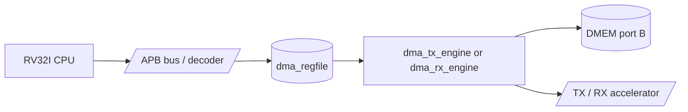

# 06. Module Specification: `dma_regfile`

## 1. Muc dich

`dma_regfile` la APB slave register block dung de CPU cau hinh, khoi dong va theo doi trang thai cua DMA.

Module nay **khong** chuyen du lieu truc tiep. No chi:

- luu thanh ghi cau hinh DMA;
- phat cac pulse dieu khien (`start`, `soft_reset`, `clear_done`, `clear_error`);
- gom cac trang thai tu DMA engine thanh cac thanh ghi de CPU doc;
- giu sticky flags cho `done` va `error`.

Trong kien truc hien tai:

- CPU ghi/doc `dma_regfile` thong qua APB;
- `dma_regfile` noi sang `dma_tx_engine` hoac `dma_rx_engine`;
- DMA engine moi la khoi thuc hien doc/ghi `DMEM` va dieu khien TX/RX.

## 2. Pham vi hien tai

Phien ban hien tai ho tro ca 2 flow:

1. `TX`: DMA doc input tu `DMEM`, day qua `apb_huffman_aes_tx_top`, ghi output ve `DMEM`.
2. `RX`: DMA doc ciphertext/transport stream tu `DMEM`, day vao `apb_huffman_aes_rx_top`, ghi plaintext decoded ve `DMEM`.

`dma_regfile` khong sinh key va khong chon AES CBC/ECB runtime. Module nay expose
`IV0..IV3` de CPU ghi initialization vector cho AES-CBC trong TX/RX path.

Verification status hien tai:

| Case | Coverage/use |
|---|---|
| `mmio_regfile_basic` | legal read/write, IV readback, clear pulse, soft reset |
| `mmio_regfile_negative` | invalid start, readonly write, bad address, reserved bits |
| `mmio_mode_matrix` | all supported mode encodings and invalid mode cases |
| `dma_bridge_direct_cov` | APB wait/error/defensive regfile branches |
| Historical full regression | included in `34/34` PASS coverage baseline before secure-storage API refactor |

## 3. So do khoi



## 4. Cong module

### 4.1 Clock va reset

| Cong | Huong | Rong | Mo ta |
|---|---|---:|---|
| `PCLK` | in | 1 | Clock APB va register block |
| `rst_i` | in | 1 | Reset active-high |

### 4.2 APB slave interface

| Cong | Huong | Rong | Mo ta |
|---|---|---:|---|
| `PSEL` | in | 1 | Chon slave |
| `PENABLE` | in | 1 | APB access phase |
| `PWRITE` | in | 1 | `1`: write, `0`: read |
| `PADDR` | in | 32 | Dia chi thanh ghi |
| `PWDATA` | in | 32 | Du lieu ghi |
| `PRDATA` | out | 32 | Du lieu doc |
| `PREADY` | out | 1 | Mac dinh luon `1` trong implementation hien tai |
| `PSLVERR` | out | 1 | Bao loi truy cap / config khong hop le |

### 4.3 Dau ra cau hinh sang DMA engine

| Cong | Huong | Rong | Mo ta |
|---|---|---:|---|
| `src_addr_o` | out | 32 | Dia chi nguon trong `DMEM` |
| `dst_addr_o` | out | 32 | Dia chi dich trong `DMEM` |
| `len_bytes_o` | out | 32 | Tong so byte can xu ly |
| `direction_o` | out | 2 | `01`: TX, `10`: RX |
| `compress_only_o` | out | 1 | TX only: `1` de bypass AES |
| `whole_file_o` | out | 1 | TX only: `1` de dung whole-file dynamic Huffman |
| `block_size_o` | out | 6 | Kich thuoc block 1..32 byte |
| `iv_o` | out | 128 | CBC IV xuat sang TX/RX, bang `{IV3, IV2, IV1, IV0}` |
| `start_pulse_o` | out | 1 | Pulse 1 cycle de khoi dong DMA |
| `soft_reset_pulse_o` | out | 1 | Pulse reset DMA engine |
| `clear_done_pulse_o` | out | 1 | Pulse xoa sticky done |
| `clear_error_pulse_o` | out | 1 | Pulse xoa sticky error |

### 4.4 Dau vao trang thai tu DMA engine

| Cong | Huong | Rong | Mo ta |
|---|---|---:|---|
| `dma_busy_i` | in | 1 | Engine dang xu ly |
| `dma_done_i` | in | 1 | Pulse ket thuc |
| `dma_error_i` | in | 1 | Pulse loi |
| `bytes_done_i` | in | 32 | Tong so byte da xu ly |
| `ciphertext_bytes_produced_i` | in | 32 | TX output byte count, expose tai `0x24` |
| `last_error_code_i` | in | 8 | Ma loi cuoi cung |
| `engine_state_i` | in | 4 | State debug cua DMA engine |

## 5. Memory map APB

Module nay dung **offset local**. Base address trong he thong SoC duoc chot ben ngoai module, vi du `DMA_APB_BASE = 32'h4000_0000`.

| Offset | Ten | Loai | Mo ta |
|---|---|---|---|
| `0x00` | `CONTROL` | W | Phat cac pulse dieu khien |
| `0x04` | `STATUS` | R | Trang thai tong hop va sticky flags |
| `0x08` | `SRC_ADDR` | R/W | Dia chi nguon |
| `0x0C` | `DST_ADDR` | R/W | Dia chi dich |
| `0x10` | `LEN_BYTES` | R/W | Tong so byte can xu ly |
| `0x14` | `MODE` | R/W | Chon TX/RX va TX policy |
| `0x18` | `BLOCK_CFG` | R/W | Cau hinh chia block |
| `0x1C` | `BYTES_DONE` | R | So byte da xu ly |
| `0x20` | `DEBUG` | R | State va ma loi debug |
| `0x24` | `CIPHERTEXT_BYTES_PRODUCED` | R | So ciphertext byte cua TX gan nhat |
| `0x28` | `IV0` | R/W | CBC IV bits `[31:0]` |
| `0x2C` | `IV1` | R/W | CBC IV bits `[63:32]` |
| `0x30` | `IV2` | R/W | CBC IV bits `[95:64]` |
| `0x34` | `IV3` | R/W | CBC IV bits `[127:96]` |

### 5.1 Register Function Summary

| Register | Function | Used by | Side effect / note |
|---|---|---|---|
| `CONTROL` | Tao pulse start/reset/clear cho DMA | CPU writes, regfile decodes | W1P; reserved bits set `PSLVERR`; `start` chi hop le khi config valid va not busy |
| `STATUS` | Tong hop busy/done/error/cfg/mode | CPU polling | Read-only; dung de quyet dinh khi nao duoc cau hinh tiep |
| `SRC_ADDR` | DMEM source byte address | TX/RX DMA | Can canh 4-byte; TX doc plaintext, RX doc ciphertext |
| `DST_ADDR` | DMEM destination byte address | TX/RX DMA | Can canh 4-byte; TX ghi transport/ciphertext, RX ghi plaintext |
| `LEN_BYTES` | So byte transfer dau vao | TX/RX DMA | TX = plaintext input bytes; RX = ciphertext/transport input bytes |
| `MODE` | Direction va TX policy | Regfile va DMA engines | `0x1` TX AES, `0x5` TX compress-only legacy, `0x9` TX whole-file AES, `0xD` TX whole-file compress-only, `0x2` RX |
| `BLOCK_CFG` | TX block size | `dma_tx_engine` | Hop le `1..32`; RX khong dung |
| `BYTES_DONE` | So byte engine da hoan tat | CPU/testbench | Read-only, cap nhat tu engine dang active |
| `DEBUG` | Engine state va last error code | CPU/testbench | Debug only, khong nen dung lam contract chinh |
| `CIPHERTEXT_BYTES_PRODUCED` | So byte TX output gan nhat | CPU/RX software flow | Dung lam `LEN_BYTES` cho RX sau khi TX xong |
| `IV0..IV3` | AES-CBC IV 128-bit | CPU writes, TX/RX consumes | Khong ghi khi busy; `soft_reset` xoa ve `0` |

### 5.2 `CONTROL`

| Bit | Ten | Loai | Y nghia |
|---:|---|---|---|
| 0 | `start` | W1P | Khoi dong DMA neu config hop le va DMA khong busy |
| 1 | `soft_reset` | W1P | Reset register state lien quan den transfer dang cho / dang chay |
| 2 | `clear_done` | W1P | Xoa `done_sticky` |
| 3 | `clear_error` | W1P | Xoa `error_sticky` |
| 31:4 | reserved | W | Ghi 1 vao bat ky bit nao se tao `PSLVERR` |

Ghi `start=1` chi hop le khi:

- `len_bytes_o != 0`
- `block_size_o` trong khoang `1..32`
- `direction_o` la `01` hoac `10`
- `dma_busy_i = 0`

Neu vi pham cac dieu kien tren, giao dich write van complete voi `PREADY=1` nhung `PSLVERR=1`.

### 5.3 `STATUS`

| Bit | Ten | Y nghia |
|---:|---|---|
| 0 | `busy` | DMA dang chay |
| 1 | `done_sticky` | Transfer gan nhat da ket thuc |
| 2 | `error_sticky` | Transfer gan nhat co loi |
| 3 | `cfg_valid` | Cau hinh toi thieu hop le |
| 5:4 | `direction` | Mirror cua `MODE.direction` |
| 6 | `compress_only` | Mirror cua `MODE.compress_only` |
| 7 | `whole_file` | Mirror cua `MODE.whole_file` |
| 31:8 | reserved | Doc `0` |

### 5.4 `SRC_ADDR`

- Dia chi byte address trong `DMEM`
- Yeu cau canh 4-byte (`[1:0] = 2'b00`)
- Neu CPU ghi dia chi khong canh 4-byte, module co the:
  - van luu gia tri raw;
  - `cfg_valid = 0`;
  - `start` sau do bi tu choi voi `PSLVERR=1`

### 5.5 `DST_ADDR`

- Dia chi byte address dich trong `DMEM`
- Yeu cau canh 4-byte
- Xu ly tuong tu `SRC_ADDR`

### 5.6 `LEN_BYTES`

- Tong so byte can xu ly
- Yeu cau `LEN_BYTES >= 1`
- Khong bat buoc la boi so cua 4
- DMA engine phai tu chia block va xu ly word cuoi co so byte hop le phu hop

### 5.7 `MODE`

| Bit | Ten | Y nghia |
|---:|---|---|
| 1:0 | `direction` | `01`: TX, `10`: RX, gia tri khac la invalid |
| 2 | `compress_only` | `1`: TX bypass AES, `0`: TX di qua AES |
| 3 | `whole_file` | `1`: TX dung dynamic Huffman toan file |
| 31:4 | reserved | Doc `0`, ghi 1 se bao `PSLVERR` |

Quy uoc dung:

- `0x0000_0001`: `COMPRESS_AES` cho TX
- `0x0000_0005`: legacy per-block `COMPRESS_ONLY` cho TX
- `0x0000_000D`: default whole-file `COMPRESS_ONLY` cho TX-only benchmark
- `0x0000_0009`: `COMPRESS_AES` + whole-file dynamic Huffman cho TX
- `0x0000_0002`: RX

Khong co mode bit de chon ECB/CBC. Trong SoC hien tai, `COMPRESS_AES` dung
AES-CBC co dinh voi key hard-wire trong TX/RX path. `COMPRESS_ONLY` bypass AES.

### 5.8 `BLOCK_CFG`

| Bit | Ten | Y nghia |
|---:|---|---|
| 5:0 | `block_size_bytes` | Kich thuoc block 1..32 byte |
| 31:6 | reserved | Doc `0` |

Khuyen nghi mac dinh `block_size_bytes = 32`.

### 5.9 `BYTES_DONE`

- Mirror truc tiep cua `bytes_done_i`
- CPU co the doc de poll tien do

### 5.10 `DEBUG`

| Bit | Ten | Y nghia |
|---:|---|---|
| 3:0 | `engine_state` | State debug tu DMA engine |
| 11:4 | `last_error_code` | Ma loi debug |
| 31:12 | reserved | Doc `0` |

### 5.11 `CIPHERTEXT_BYTES_PRODUCED`

- Mirror truc tiep cua `ciphertext_bytes_produced_i`
- Dung de tach rieng output length cua TX khoi `BYTES_DONE`
- Trong `COMPRESS_ONLY`, day la so byte compressed transport stream
- Trong `COMPRESS_AES`, day la so byte sau AES ghi ve `DMEM`

### 5.12 `IV0..IV3`

Bon thanh ghi nay tao thanh 128-bit CBC IV:

```text
iv_o = {IV3, IV2, IV1, IV0}
```

Semantics:

- CPU ghi IV truoc `CONTROL.start`
- read tra ve gia tri IV hien tai
- write khi `dma_busy_i = 1` bi tu choi voi `PSLVERR = 1`
- reset va `CONTROL.soft_reset` xoa IV ve `0`
- trong loopback AES, RX phai dung cung IV da dung cho TX

`dma_regfile` khong sinh IV ngau nhien. Viec tao IV thuoc ve software/firmware.
Flow secure-storage hien tai dung IV deterministic do
`testcase/secure_storage_fw.h` tao, luu vao metadata, va restore truoc RX de
simulation co ket qua lap lai.

## 6. Hanh vi APB

### 6.1 Read

- `PREADY = 1` voi moi read hop le
- `PRDATA` tra ve gia tri thanh ghi ung voi `PADDR`
- Truy cap offset khong hop le: `PSLVERR = 1`, `PRDATA = 0`

### 6.2 Write

- `PREADY = 1` voi moi write hop le
- Ghi vao offset read-only: `PSLVERR = 1`
- Ghi reserved bits = 1: `PSLVERR = 1`
- Ghi thanh ghi cau hinh khi `dma_busy_i = 1`:
  - implementation hien tai tra `PSLVERR = 1`
  - ngoai le: `CONTROL.soft_reset`, `CONTROL.clear_done`, `CONTROL.clear_error` van hop le

## 7. Sticky flags

- `done_sticky` set khi `dma_done_i = 1`
- `error_sticky` set khi `dma_error_i = 1`
- `soft_reset` xoa ca `done_sticky`, `error_sticky`, `bytes_done` shadow neu co
- `clear_done` chi xoa `done_sticky`
- `clear_error` chi xoa `error_sticky`

## 8. Tieu chi `cfg_valid`

`cfg_valid = 1` khi:

- `src_addr_o[1:0] == 2'b00`
- `dst_addr_o[1:0] == 2'b00`
- `len_bytes_o != 0`
- `block_size_o` nam trong `1..32`
- `direction_o` la `01` hoac `10`

## 9. Mac dinh reset

| Thanh ghi | Gia tri reset |
|---|---|
| `SRC_ADDR` | `0x0000_0000` |
| `DST_ADDR` | `0x0000_0000` |
| `LEN_BYTES` | `0x0000_0000` |
| `MODE.direction` | `2'b00` |
| `BLOCK_CFG.block_size_bytes` | `6'd32` |
| `IV0..IV3` | `0x0000_0000` |
| `done_sticky` | `0` |
| `error_sticky` | `0` |

## 10. Ghi chu tich hop

- `dma_regfile` chi la APB slave control plane
- DMA engine phai la khoi tach rieng
- hien dang ket noi toi ca `dma_tx_engine` va `dma_rx_engine`
- status engine duoc mux theo direction transfer dang active trong `rv32_soc_top`
