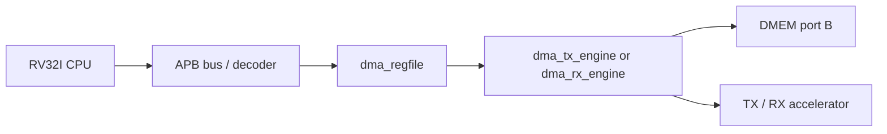

# 06. Module Specification: `dma_regfile`

## 1. Purpose

`dma_regfile` is the APB slave register block used for the CPU to configure, initialize and monitor the status of DMA.

This module **does not** transfer data directly. It only:

- stores DMA configuration registers;
- generates control pulses (`start`, `soft_reset`, `clear_done`, `clear_error`);
- Collects status from the DMA engine into registers for the CPU to read;
- keeps sticky flags for `done` and `error`.

In the current architecture:

- CPU writes/reads `dma_regfile` via APB;
- `dma_regfile` exports configuration to `dma_tx_engine` or `dma_rx_engine`;
- The DMA engine performs `DMEM` read/write and TX/RX control.

## 2. Current scope

The current version supports two flows:

1. `TX`: DMA reads input from `DMEM`, through `apb_huffman_aes_tx_top`, writes output to `DMEM`.
2. `RX`: DMA reads ciphertext/transport stream from `DMEM`, to `apb_huffman_aes_rx_top`, writes decoded plaintext to `DMEM`.

`dma_regfile` does not generate keys and does not select AES CBC/ECB runtime. This module exposes
`IV0..IV3` let the CPU write the initialization vector for AES-CBC in the TX/RX path.

Current verification status:

| Case | Coverage/use |
|---|---|
| `mmio_regfile_basic` | legal read/write, IV readback, clear pulse, soft reset |
| `mmio_regfile_negative` | invalid start, readonly write, bad address, reserved bits |
| `mmio_mode_matrix` | all supported mode encodings and invalid mode cases |
| `dma_bridge_direct_cov` | APB wait/error/defensive regfile branches |
| Full regression | included in `34/34` PASS coverage baseline |

## 3. Block diagram



## 4. Module ports

### 4.1 Clock and reset

| Port | Direction | Width | Data format | Description |
|---|---|---:|---|---|
| `PCLK` | in | 1 | Clock level | Clock APB and register block |
| `rst_i` | in | 1 | Reset level active-high | Reset active-high |

### 4.2 APB slave interface

| Port | Direction | Width | Data format | Description |
|---|---|---:|---|---|
| `PSEL` | in | 1 | APB select flag (`0/1`) | Select slave |
| `PENABLE` | in | 1 | APB access phase flag | APB access phase |
| `PWRITE` | in | 1 | APB direction flag (`1=write`, `0=read`) | `1`: write, `0`: read |
| `PADDR` | in | 32 | Local byte address | Register address |
| `PWDATA` | in | 32 | Raw write data word | Write data |
| `PRDATA` | out | 32 | Raw read data word | Data read |
| `PREADY` | out | 1 | Ready flag (`0/1`) | By default, it is always `1` in the current implementation |
| `PSLVERR` | out | 1 | Error flag (`0/1`) | Error on invalid access/configuration |

### 4.3 Configuration output to DMA engine

| Port | Direction | Width | Data format | Description |
|---|---|---:|---|---|
| `src_addr_o` | out | 32 | Byte address, word-aligned | Source address in `DMEM` |
| `dst_addr_o` | out | 32 | Byte address, word-aligned | Destination address in `DMEM` |
| `len_bytes_o` | out | 32 | Transfer length in bytes | Total number of bytes to process |
| `direction_o` | out | 2 | Mode code (`01=TX`, `10=RX`) | `01`: TX, `10`: RX |
| `compress_only_o` | out | 1 | Policy flag (`0/1`) | TX only: `1` to bypass AES |
| `whole_file_o` | out | 1 | Policy flag (`0/1`) | TX only: `1` to use whole-file dynamic Huffman |
| `block_size_o` | out | 6 | Block size in bytes (`1..32`) | Block size 1..32 bytes |
| `iv_o` | out | 128 | CBC IV word `{IV3,IV2,IV1,IV0}` | CBC IV output to TX/RX |
| `start_pulse_o` | out | 1 | Pulse flag (`1` in 1 cycle) | Pulse 1 cycle to initialize DMA |
| `soft_reset_pulse_o` | out | 1 | Pulse flag (`1` in 1 cycle) | Pulse reset DMA engine |
| `clear_done_pulse_o` | out | 1 | Pulse flag (`1` in 1 cycle) | Pulse clears sticky done |
| `clear_error_pulse_o` | out | 1 | Pulse flag (`1` in 1 cycle) | Pulse clears sticky error |

### 4.4 Status input from DMA engine

| Port | Direction | Width | Data format | Description |
|---|---|---:|---|---|
| `dma_busy_i` | in | 1 | Busy flag (`0/1`) | Engine is busy |
| `dma_done_i` | in | 1 | Pulse flag (`1` in 1 cycle) | Completion pulse |
| `dma_error_i` | in | 1 | Pulse flag (`1` in 1 cycle) | Pulse error |
| `bytes_done_i` | in | 32 | Byte counter | Number of bytes completed |
| `ciphertext_bytes_produced_i` | in | 32 | Byte counter | TX output byte count, exposed at `0x24` |
| `last_error_code_i` | in | 8 | Error code | Last error code |
| `engine_state_i` | in | 4 | Low nibble of FSM state | State debug of DMA engine |

## 5. Memory map APB

This module uses **local offset**. The base address in the SoC system is given outside the module, with `DMA_APB_BASE = 32'h4000_0000`.

| Offset | Name | Type | Description |
|---|---|---|---|
| `0x00` | `CONTROL` | W | Generates control pulses |
| `0x04` | `STATUS` | R | Combined status and sticky flags |
| `0x08` | `SRC_ADDR` | R/W | Source address |
| `0x0C` | `DST_ADDR` | R/W | Destination address |
| `0x10` | `LEN_BYTES` | R/W | Total number of bytes to process |
| `0x14` | `MODE` | R/W | Select TX/RX and TX policy |
| `0x18` | `BLOCK_CFG` | R/W | Block division configuration |
| `0x1C` | `BYTES_DONE` | R | Number of bytes |
| `0x20` | `DEBUG` | R | State and debug error code |
| `0x24` | `CIPHERTEXT_BYTES_PRODUCED` | R | Most recent TX ciphertext byte count |
| `0x28` | `IV0` | R/W | CBC IV bits `[31:0]` |
| `0x2C` | `IV1` | R/W | CBC IV bits `[63:32]` |
| `0x30` | `IV2` | R/W | CBC IV bits `[95:64]` |
| `0x34` | `IV3` | R/W | CBC IV bits `[127:96]` |

### 5.1 Register function summary

| Register | Width | Data format | Function | Used by | Side effect / note |
|---|---:|---|---|---|---|
| `CONTROL` | 32 | W1P control bits | Create pulse start/reset/clear for DMA | CPU writes, regfile decodes | W1P; reserved bits set `PSLVERR`; `start` is only valid when the config is valid and not busy |
| `STATUS` | 32 | Live status bitmap | Combined busy/done/error/cfg/mode | CPU polling | Read-only; used to decide when to configure next |
| `SRC_ADDR` | 32 | Byte address, word-aligned | DMEM source byte address | TX/RX DMA | 4-byte aligned; TX reads plaintext, RX reads ciphertext |
| `DST_ADDR` | 32 | Byte address, word-aligned | DMEM destination byte address | TX/RX DMA | 4-byte aligned; TX writes transport/ciphertext, RX writes plaintext |
| `LEN_BYTES` | 32 | Transfer length in bytes | Number of input transfer bytes | TX/RX DMA | TX = plaintext input bytes; RX = ciphertext/transport input bytes |
| `MODE` | 32 | Mode encoding in low bits | Direction and TX policy | Regfile and DMA engines | `0x1` TX AES, `0x5` TX compress-only legacy, `0x9` TX whole-file AES, `0xD` TX whole-file compress-only, `0x2` RX |
| `BLOCK_CFG` | 6 | Block size in bytes | TX block size | `dma_tx_engine` | Valid `1..32`; RX is not used |
| `BYTES_DONE` | 32 | Byte counter | Number of bytes completed by the engine | CPU/testbench | Read-only, updated from active engine |
| `DEBUG` | 32 | Packed debug fields | Engine state and last error code | CPU/testbench | Debug only, should not be used as the main contract |
| `CIPHERTEXT_BYTES_PRODUCED` | 32 | Byte counter | Number of most recent TX output bytes | CPU/RX software flow | Used as `LEN_BYTES` for RX after TX is completed |
| `IV0..IV3` | 32 each | CBC IV words | AES-CBC IV 128-bit | CPU writes, TX/RX consumes | Do not write while busy; `soft_reset` clears to `0` |

### 5.2 `CONTROL`

| Bit | Name | Type | Data format | Meaning |
|---:|---|---|---|---|
| 0 | `start` | W1P | Pulse request bit | Restart DMA if the configuration is valid and DMA is not busy |
| 1 | `soft_reset` | W1P | Pulse reset bit | Reset register state related to transfer in progress/running |
| 2 | `clear_done` | W1P | Pulse clear bit | Delete `done_sticky` |
| 3 | `clear_error` | W1P | Pulse clear bit | Delete `error_sticky` |
| 31:4 | reserved | W | Reserved bits | Writing a 1 to any bit will create `PSLVERR` |

Register `start=1` is only valid when:

- `len_bytes_o != 0`
- `block_size_o` in compartment `1..32`
- `direction_o` is `01` or `10`
- `dma_busy_i = 0`

If the above conditions are violated, the write transaction will still complete with `PREADY=1` but `PSLVERR=1`.

### 5.3 `STATUS`

| Bit | Name | Data format | Meaning |
|---:|---|---|---|
| 0 | `busy` | Busy flag | DMA is running |
| 1 | `done_sticky` | Sticky flag | Most recent transfer has completed |
| 2 | `error_sticky` | Sticky flag | The most recent transfer had an error |
| 3 | `cfg_valid` | Boolean config valid | My configuration is not valid |
| 5:4 | `direction` | 2-bit mode mirror | Mirror of `MODE.direction` |
| 6 | `compress_only` | Boolean policy mirror | Mirror of `MODE.compress_only` |
| 7 | `whole_file` | Boolean policy mirror | Mirror of `MODE.whole_file` |
| 31:8 | reserved | Reserved read-as-zero | Read `0` |

### 5.4 `SRC_ADDR`

- Address byte address in `DMEM`
- Ask for a 4-byte base (`[1:0] = 2'b00`)
- If the CPU writes a 4-byte unaligned address, the module may:
  - still saves raw value;
  - `cfg_valid = 0`;
  - `start` was then merged with `PSLVERR=1`

### 5.5 `DST_ADDR`

- Address byte address translation in `DMEM`
- Love the 4-byte base
- Change from `SRC_ADDR`

### 5.6 `LEN_BYTES`

- Total number of bytes to process
- Love the question `LEN_BYTES >= 1`
- The value does not have to be a multiple of 4
- The DMA engine must divide the block and extract the last word with a valid number of bytes per hop

### 5.7 `MODE`

| Bit | Name | Data format | Meaning |
|---:|---|---|---|
| 1:0 | `direction` | 2-bit mode code | `01`: TX, `10`: RX, other values are invalid |
| 2 | `compress_only` | Boolean policy bit | `1`: TX bypass AES, `0`: TX bypass AES |
| 3 | `whole_file` | Boolean policy bit | `1`: TX uses dynamic Huffman for the entire file |
| 31:4 | reserved | Reserved read-as-zero | Read `0`, write 1 to include `PSLVERR` |

Rules of use:

- `0x0000_0001`: `COMPRESS_AES` for TX
- `0x0000_0005`: legacy per-block `COMPRESS_ONLY` for TX
- `0x0000_000D`: default whole-file `COMPRESS_ONLY` for TX-only benchmark
- `0x0000_0009`: `COMPRESS_AES` + whole-file dynamic Huffman for TX
- `0x0000_0002`: RX

There is no mode bit to select ECB/CBC. In the current SoC, `COMPRESS_AES` is used
Fixed AES-CBC with hard-wire key in TX/RX path. `COMPRESS_ONLY` bypass AES.

### 5.8 `BLOCK_CFG`

| Bit | Name | Data format | Meaning |
|---:|---|---|---|
| 5:0 | `block_size_bytes` | Unsigned byte count | Block size 1..32 bytes |
| 31:6 | reserved | Reserved read-as-zero | Read `0` |

Recommended default `block_size_bytes = 32`.

### 5.9 `BYTES_DONE`

- Live mirror of `bytes_done_i`
- The CPU can read it to poll the priority

### 5.10 `DEBUG`

| Bit | Name | Data format | Meaning |
|---:|---|---|---|
| 3:0 | `engine_state` | 4-bit low nibble of FSM state | State debug from DMA engine |
| 11:4 | `last_error_code` | 8-bit error code | Ghost debug error |
| 31:12 | reserved | Reserved read-as-zero | Read `0` |

### 5.11 `CIPHERTEXT_BYTES_PRODUCED`

- Live mirror of `ciphertext_bytes_produced_i`
- Use to separate output length of TX from `BYTES_DONE`
- In `COMPRESS_ONLY`, this is the number of bytes compressed transport stream
- In `COMPRESS_AES`, this is the number of bytes after AES registers `DMEM`

### 5.12 `IV0..IV3`

These four registers create the 128-bit CBC IV:

```text
iv_o = {IV3, IV2, IV1, IV0}
```

Semantics:

- CPU registers IV before `CONTROL.start`
- read returns the current IV value
- write when `dma_busy_i = 1` is mixed with `PSLVERR = 1`
- reset and `CONTROL.soft_reset` remove IV to `0`
- In AES loopback, RX must use arc IV which is used for TX

`dma_regfile` does not generate IVs immediately. Creating IV depends on software/host.
The current test uses the deterministic IV created by `testcase/test_mmio_dma.c`
simulation has repeatable results.

### 5.13 Internal registers

| Register | Bit width | Data format | Function |
|---|---:|---|---|
| `done_sticky_r` | 1 | Sticky flag (`0/1`) | Save done status between polls |
| `error_sticky_r` | 1 | Sticky flag (`0/1`) | Save error status between polls |
| `iv0_r` | 32 | CBC IV word low | Word `[31:0]` of IV |
| `iv1_r` | 32 | CBC IV word | Word `[63:32]` of IV |
| `iv2_r` | 32 | CBC IV word | Word `[95:64]` of IV |
| `iv3_r` | 32 | CBC IV word high | Word `[127:96]` of IV |

## 6. APB behavior

### 6.1 Read

- `PREADY = 1` with new valid read
- `PRDATA` returns the same register value as `PADDR`
- Invalid access offset: `PSLVERR = 1`, `PRDATA = 0`

### 6.2 Write

- `PREADY = 1` with new valid write
- Write to read-only offset: `PSLVERR = 1`
- Write reserved bits = 1: `PSLVERR = 1`
- Write configuration register when `dma_busy_i = 1`:
  - Current implementation returns `PSLVERR = 1`
  - Except: `CONTROL.soft_reset`, `CONTROL.clear_done`, `CONTROL.clear_error` are still valid

## 7. Sticky flags

- `done_sticky` set when `dma_done_i = 1`
- `error_sticky` set when `dma_error_i = 1`
- `soft_reset` removes `done_sticky`, `error_sticky`, `bytes_done` shadow if any
- `clear_done` only deletes `done_sticky`
- `clear_error` only deletes `error_sticky`

## 8. Title `cfg_valid`

`cfg_valid = 1` when:

- `src_addr_o[1:0] == 2'b00`
- `dst_addr_o[1:0] == 2'b00`
- `len_bytes_o != 0`
- `block_size_o` is in `1..32`
- `direction_o` is `01` or `10`

## 9. Default reset

| Register | Value reset |
|---|---|
| `SRC_ADDR` | `0x0000_0000` |
| `DST_ADDR` | `0x0000_0000` |
| `LEN_BYTES` | `0x0000_0000` |
| `MODE.direction` | `2'b00` |
| `BLOCK_CFG.block_size_bytes` | `6'd32` |
| `IV0..IV3` | `0x0000_0000` |
| `done_sticky` | `0` |
| `error_sticky` | `0` |

## 10. Integrated notes

- `dma_regfile` is just the APB slave control plane
- The DMA engine must be separate
- Displays the connection status of `dma_tx_engine` and `dma_rx_engine`
- status engine muxed according to direction transfer is active in `rv32_soc_top`
