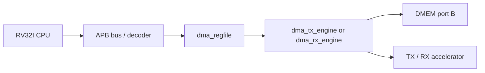

# 06. Module Specification: `dma_regfile`

## 1. Mục đích

`dma_regfile` là APB slave register block dung để CPU cấu hình, khoi dong và theo dõi trạng thái của DMA.

Module này **không** chuyen dữ liệu trực tiếp. No chỉ:

- lưu thanh ghi cấu hình DMA;
- phat các pulse điều khiển (`start`, `soft_reset`, `clear_done`, `clear_error`);
- gom các trạng thái tu DMA engine thanh các thanh ghi để CPU đọc;
- giữ sticky flags cho `done` và `error`.

Trong kiến trúc hiện tại:

- CPU ghi/đọc `dma_regfile` thong qua APB;
- `dma_regfile` noi sang `dma_tx_engine` hoặc `dma_rx_engine`;
- DMA engine mới là khoi thực hiện đọc/ghi `DMEM` và điều khiển TX/RX.

## 2. Pham vi hiện tại

Phien ban hiện tại hỗ trợ ca 2 flow:

1. `TX`: DMA đọc input tu `DMEM`, đây qua `apb_huffman_aes_tx_top`, ghi output ve `DMEM`.
2. `RX`: DMA đọc ciphertext/transport stream tu `DMEM`, đây vao `apb_huffman_aes_rx_top`, ghi plaintext decoded ve `DMEM`.

`dma_regfile` không sinh key và không chọn AES CBC/ECB runtime. Module này expose
`IV0..IV3` để CPU ghi initialization vector cho AES-CBC trong TX/RX path.

Verification status hiện tại:

| Case | Coverage/use |
|---|---|
| `mmio_regfile_basic` | legal read/write, IV readback, clear pulse, soft reset |
| `mmio_regfile_negative` | invalid start, readonly write, bad address, reserved bits |
| `mmio_mode_matrix` | all supported mode encodings and invalid mode cases |
| `dma_bridge_direct_cov` | APB wait/error/defensive regfile branches |
| Full regression | included in `34/34` PASS coverage baseline |

## 3. Sơ đồ khoi



## 4. Cổng module

### 4.1 Clock và reset

| Cổng | Hướng | Rộng | Định dạng dữ liệu | Mô tả |
|---|---|---:|---|---|
| `PCLK` | in | 1 | Clock level | Clock APB và register block |
| `rst_i` | in | 1 | Reset level active-high | Reset active-high |

### 4.2 APB slave interface

| Cổng | Hướng | Rộng | Định dạng dữ liệu | Mô tả |
|---|---|---:|---|---|
| `PSEL` | in | 1 | APB select flag (`0/1`) | Chọn slave |
| `PENABLE` | in | 1 | APB access phase flag | APB access phase |
| `PWRITE` | in | 1 | APB direction flag (`1=write`, `0=read`) | `1`: write, `0`: read |
| `PADDR` | in | 32 | Local byte address | Địa chỉ thanh ghi |
| `PWDATA` | in | 32 | Raw write data word | Dữ liệu ghi |
| `PRDATA` | out | 32 | Raw read data word | Dữ liệu đọc |
| `PREADY` | out | 1 | Ready flag (`0/1`) | Mặc định luon `1` trong implementation hiện tại |
| `PSLVERR` | out | 1 | Error flag (`0/1`) | Báo lỗi truy cap / config không hợp lệ |

### 4.3 Đầu ra cấu hình sang DMA engine

| Cổng | Hướng | Rộng | Định dạng dữ liệu | Mô tả |
|---|---|---:|---|---|
| `src_addr_o` | out | 32 | Byte address, word-aligned | Địa chỉ nguồn trong `DMEM` |
| `dst_addr_o` | out | 32 | Byte address, word-aligned | Địa chỉ đích trong `DMEM` |
| `len_bytes_o` | out | 32 | Transfer length in bytes | Tong số byte cần xử lý |
| `direction_o` | out | 2 | Mode code (`01=TX`, `10=RX`) | `01`: TX, `10`: RX |
| `compress_only_o` | out | 1 | Policy flag (`0/1`) | TX only: `1` để bypass AES |
| `whole_file_o` | out | 1 | Policy flag (`0/1`) | TX only: `1` để dung whole-file dynamic Huffman |
| `block_size_o` | out | 6 | Block size in bytes (`1..32`) | Kích thước block 1..32 byte |
| `iv_o` | out | 128 | CBC IV word `{IV3,IV2,IV1,IV0}` | CBC IV xuất sang TX/RX |
| `start_pulse_o` | out | 1 | Pulse flag (`1` trong 1 cycle) | Pulse 1 cycle để khoi dong DMA |
| `soft_reset_pulse_o` | out | 1 | Pulse flag (`1` trong 1 cycle) | Pulse reset DMA engine |
| `clear_done_pulse_o` | out | 1 | Pulse flag (`1` trong 1 cycle) | Pulse xoa sticky done |
| `clear_error_pulse_o` | out | 1 | Pulse flag (`1` trong 1 cycle) | Pulse xoa sticky error |

### 4.4 Đầu vao trạng thái tu DMA engine

| Cổng | Hướng | Rộng | Định dạng dữ liệu | Mô tả |
|---|---|---:|---|---|
| `dma_busy_i` | in | 1 | Busy flag (`0/1`) | Engine dang xu ly |
| `dma_done_i` | in | 1 | Pulse flag (`1` trong 1 cycle) | Pulse kết thúc |
| `dma_error_i` | in | 1 | Pulse flag (`1` trong 1 cycle) | Pulse lỗi |
| `bytes_done_i` | in | 32 | Byte counter | Tong số byte da xu ly |
| `ciphertext_bytes_produced_i` | in | 32 | Byte counter | TX output byte count, expose tai `0x24` |
| `last_error_code_i` | in | 8 | Error code | Ma lỗi cuối cùng |
| `engine_state_i` | in | 4 | Low nibble of FSM state | State debug của DMA engine |

## 5. Memory map APB

Module này dung **offset local**. Base address trong hệ thống SoC được chot ben ngoài module, vi đủ `DMA_APB_BASE = 32'h4000_0000`.

| Offset | Tên | Loại | Mô tả |
|---|---|---|---|
| `0x00` | `CONTROL` | W | Phat các pulse điều khiển |
| `0x04` | `STATUS` | R | Trạng thái tong hop và sticky flags |
| `0x08` | `SRC_ADDR` | R/W | Địa chỉ nguồn |
| `0x0C` | `DST_ADDR` | R/W | Địa chỉ đích |
| `0x10` | `LEN_BYTES` | R/W | Tong số byte cần xử lý |
| `0x14` | `MODE` | R/W | Chọn TX/RX và TX policy |
| `0x18` | `BLOCK_CFG` | R/W | Cấu hình chia block |
| `0x1C` | `BYTES_DONE` | R | Số byte da xu ly |
| `0x20` | `DEBUG` | R | State và ma lỗi debug |
| `0x24` | `CIPHERTEXT_BYTES_PRODUCED` | R | So ciphertext byte của TX gần nhất |
| `0x28` | `IV0` | R/W | CBC IV bits `[31:0]` |
| `0x2C` | `IV1` | R/W | CBC IV bits `[63:32]` |
| `0x30` | `IV2` | R/W | CBC IV bits `[95:64]` |
| `0x34` | `IV3` | R/W | CBC IV bits `[127:96]` |

### 5.1 Tóm tắt chức năng thanh ghi

| Thanh ghi | Độ rộng | Định dạng dữ liệu | Chức năng | Used by | Side effect / ghi chú |
|---|---:|---|---|---|---|
| `CONTROL` | 32 | W1P control bits | Tạo pulse start/reset/clear cho DMA | CPU writes, regfile decodes | W1P; reserved bits set `PSLVERR`; `start` chỉ hợp lệ khi config valid và not busy |
| `STATUS` | 32 | Live status bitmap | Tong hop busy/done/error/cfg/mode | CPU polling | Read-only; dung để quyet dinh khi nào được cấu hình tiep |
| `SRC_ADDR` | 32 | Byte address, word-aligned | DMEM source byte address | TX/RX DMA | Can căn 4-byte; TX đọc plaintext, RX đọc ciphertext |
| `DST_ADDR` | 32 | Byte address, word-aligned | DMEM destination byte address | TX/RX DMA | Can căn 4-byte; TX ghi transport/ciphertext, RX ghi plaintext |
| `LEN_BYTES` | 32 | Transfer length in bytes | Số byte transfer đầu vao | TX/RX DMA | TX = plaintext input bytes; RX = ciphertext/transport input bytes |
| `MODE` | 32 | Mode encoding in low bits | Hướng và TX policy | Regfile và DMA engines | `0x1` TX AES, `0x5` TX compress-only legacy, `0x9` TX whole-file AES, `0xD` TX whole-file compress-only, `0x2` RX |
| `BLOCK_CFG` | 6 | Block size in bytes | TX block size | `dma_tx_engine` | Hợp lệ `1..32`; RX không dùng |
| `BYTES_DONE` | 32 | Byte counter | Số byte engine da hoàn tất | CPU/testbench | Read-only, cập nhật tu engine dang active |
| `DEBUG` | 32 | Packed debug fields | Engine state và last error code | CPU/testbench | Debug only, không nên dung làm contract chính |
| `CIPHERTEXT_BYTES_PRODUCED` | 32 | Byte counter | Số byte TX output gần nhất | CPU/RX software flow | Dung làm `LEN_BYTES` cho RX sau khi TX xong |
| `IV0..IV3` | 32 each | CBC IV words | AES-CBC IV 128-bit | CPU writes, TX/RX consumes | Không ghi khi busy; `soft_reset` xoa ve `0` |

### 5.2 `CONTROL`

| Bit | Tên | Loại | Định dạng dữ liệu | Ý nghĩa |
|---:|---|---|---|---|
| 0 | `start` | W1P | Pulse request bit | Khoi dong DMA nếu config hợp lệ và DMA không busy |
| 1 | `soft_reset` | W1P | Pulse reset bit | Reset register state lien quan đến transfer dang cho / dang chạy |
| 2 | `clear_done` | W1P | Pulse clear bit | Xoa `done_sticky` |
| 3 | `clear_error` | W1P | Pulse clear bit | Xoa `error_sticky` |
| 31:4 | reserved | W | Reserved bits | Ghi 1 vao bất kỳ bit nào sẽ tạo `PSLVERR` |

Ghi `start=1` chỉ hợp lệ khi:

- `len_bytes_o != 0`
- `block_size_o` trong khoang `1..32`
- `direction_o` là `01` hoặc `10`
- `dma_busy_i = 0`

Nếu vi pham các điều kiện trên, giao dịch write vẫn complete với `PREADY=1` nhưng `PSLVERR=1`.

### 5.3 `STATUS`

| Bit | Tên | Định dạng dữ liệu | Ý nghĩa |
|---:|---|---|---|
| 0 | `busy` | Busy flag | DMA dang chạy |
| 1 | `done_sticky` | Sticky flag | Transfer gần nhất da kết thúc |
| 2 | `error_sticky` | Sticky flag | Transfer gần nhất có lỗi |
| 3 | `cfg_valid` | Boolean config valid | Cấu hình toi thiếu hợp lệ |
| 5:4 | `direction` | 2-bit mode mirror | Mirror của `MODE.direction` |
| 6 | `compress_only` | Boolean policy mirror | Mirror của `MODE.compress_only` |
| 7 | `whole_file` | Boolean policy mirror | Mirror của `MODE.whole_file` |
| 31:8 | reserved | Reserved read-as-zero | Đọc `0` |

### 5.4 `SRC_ADDR`

- Địa chỉ byte address trong `DMEM`
- Yeu cau căn 4-byte (`[1:0] = 2'b00`)
- Nếu CPU ghi địa chỉ không căn 4-byte, module có thể:
  - vẫn lưu giá trị raw;
  - `cfg_valid = 0`;
  - `start` sau đó bị tu choi với `PSLVERR=1`

### 5.5 `DST_ADDR`

- Địa chỉ byte address dich trong `DMEM`
- Yeu cau căn 4-byte
- Xu ly tuong tu `SRC_ADDR`

### 5.6 `LEN_BYTES`

- Tong số byte cần xử lý
- Yeu cau `LEN_BYTES >= 1`
- Không bat buoc là bởi so của 4
- DMA engine phải tu chia block và xu ly word cuối có số byte hợp lệ phụ hop

### 5.7 `MODE`

| Bit | Tên | Định dạng dữ liệu | Ý nghĩa |
|---:|---|---|---|
| 1:0 | `direction` | 2-bit mode code | `01`: TX, `10`: RX, giá trị khác là invalid |
| 2 | `compress_only` | Boolean policy bit | `1`: TX bypass AES, `0`: TX di qua AES |
| 3 | `whole_file` | Boolean policy bit | `1`: TX dung dynamic Huffman toàn file |
| 31:4 | reserved | Reserved read-as-zero | Đọc `0`, ghi 1 sẽ bao `PSLVERR` |

Quy uoc dung:

- `0x0000_0001`: `COMPRESS_AES` cho TX
- `0x0000_0005`: legacy per-block `COMPRESS_ONLY` cho TX
- `0x0000_000D`: default whole-file `COMPRESS_ONLY` cho TX-only benchmark
- `0x0000_0009`: `COMPRESS_AES` + whole-file dynamic Huffman cho TX
- `0x0000_0002`: RX

Không có mode bit để chọn ECB/CBC. Trong SoC hiện tại, `COMPRESS_AES` dung
AES-CBC cố định với key hard-wire trong TX/RX path. `COMPRESS_ONLY` bypass AES.

### 5.8 `BLOCK_CFG`

| Bit | Tên | Định dạng dữ liệu | Ý nghĩa |
|---:|---|---|---|
| 5:0 | `block_size_bytes` | Unsigned byte count | Kích thước block 1..32 byte |
| 31:6 | reserved | Reserved read-as-zero | Đọc `0` |

Khuyến nghị mặc định `block_size_bytes = 32`.

### 5.9 `BYTES_DONE`

- Mirror trực tiếp của `bytes_done_i`
- CPU có thể đọc để poll tiên do

### 5.10 `DEBUG`

| Bit | Tên | Định dạng dữ liệu | Ý nghĩa |
|---:|---|---|---|
| 3:0 | `engine_state` | 4-bit low nibble of FSM state | State debug tu DMA engine |
| 11:4 | `last_error_code` | 8-bit error code | Ma lỗi debug |
| 31:12 | reserved | Reserved read-as-zero | Đọc `0` |

### 5.11 `CIPHERTEXT_BYTES_PRODUCED`

- Mirror trực tiếp của `ciphertext_bytes_produced_i`
- Dung để tách riêng output length của TX khoi `BYTES_DONE`
- Trong `COMPRESS_ONLY`, đây là số byte compressed transport stream
- Trong `COMPRESS_AES`, đây là số byte sau AES ghi ve `DMEM`

### 5.12 `IV0..IV3`

Bon thanh ghi này tạo thanh 128-bit CBC IV:

```text
iv_o = {IV3, IV2, IV1, IV0}
```

Semantics:

- CPU ghi IV trước `CONTROL.start`
- read trả ve giá trị IV hiện tại
- write khi `dma_busy_i = 1` bị tu choi với `PSLVERR = 1`
- reset và `CONTROL.soft_reset` xoa IV ve `0`
- trong loopback AES, RX phải dung cung IV da dùng cho TX

`dma_regfile` không sinh IV ngau nhien. Việc tạo IV thuoc ve software/host.
Test hiện tại dung IV deterministic do `testcase/test_mmio_dma.c` tạo để
simulation có kết quả lặp lại.

### 5.13 Thanh ghi nội bộ

| Thanh ghi | Bit width | Định dạng dữ liệu | Chức năng |
|---|---:|---|---|
| `done_sticky_r` | 1 | Sticky flag (`0/1`) | Lưu trạng thái done giua các lần poll |
| `error_sticky_r` | 1 | Sticky flag (`0/1`) | Lưu trạng thái error giua các lần poll |
| `iv0_r` | 32 | CBC IV word low | Word `[31:0]` của IV |
| `iv1_r` | 32 | CBC IV word | Word `[63:32]` của IV |
| `iv2_r` | 32 | CBC IV word | Word `[95:64]` của IV |
| `iv3_r` | 32 | CBC IV word high | Word `[127:96]` của IV |

## 6. Hành vi APB

### 6.1 Read

- `PREADY = 1` với mới read hợp lệ
- `PRDATA` trả ve giá trị thanh ghi ung với `PADDR`
- Truy cap offset không hợp lệ: `PSLVERR = 1`, `PRDATA = 0`

### 6.2 Write

- `PREADY = 1` với mới write hợp lệ
- Ghi vao offset read-only: `PSLVERR = 1`
- Ghi reserved bits = 1: `PSLVERR = 1`
- Ghi thanh ghi cấu hình khi `dma_busy_i = 1`:
  - implementation hiện tại trả `PSLVERR = 1`
  - ngoài le: `CONTROL.soft_reset`, `CONTROL.clear_done`, `CONTROL.clear_error` vẫn hợp lệ

## 7. Sticky flags

- `done_sticky` set khi `dma_done_i = 1`
- `error_sticky` set khi `dma_error_i = 1`
- `soft_reset` xoa ca `done_sticky`, `error_sticky`, `bytes_done` shadow nếu có
- `clear_done` chỉ xoa `done_sticky`
- `clear_error` chỉ xoa `error_sticky`

## 8. Tieu chỉ `cfg_valid`

`cfg_valid = 1` khi:

- `src_addr_o[1:0] == 2'b00`
- `dst_addr_o[1:0] == 2'b00`
- `len_bytes_o != 0`
- `block_size_o` nằm trong `1..32`
- `direction_o` là `01` hoặc `10`

## 9. Mặc định reset

| Thanh ghi | Giá trị reset |
|---|---|
| `SRC_ADDR` | `0x0000_0000` |
| `DST_ADDR` | `0x0000_0000` |
| `LEN_BYTES` | `0x0000_0000` |
| `MODE.direction` | `2'b00` |
| `BLOCK_CFG.block_size_bytes` | `6'd32` |
| `IV0..IV3` | `0x0000_0000` |
| `done_sticky` | `0` |
| `error_sticky` | `0` |

## 10. Ghi chú tích hợp

- `dma_regfile` chỉ là APB slave control plane
- DMA engine phải là khoi tách riêng
- hien dang ket noi toi ca `dma_tx_engine` và `dma_rx_engine`
- status engine được mux theo direction transfer dang active trong `rv32_soc_top`
