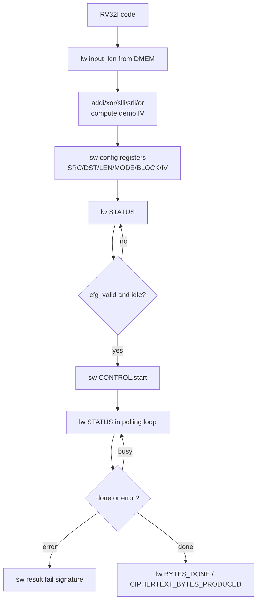

# 08. DMA RV32I Programming and Instruction Specification

## 1. Purpose

This document explains 2 parts:

1. How does CPU `RV32I` configure `DMA` in the current system?
2. Which `RV32I` instructions are actually used to:
   - Read data from `DMEM`
   - write register `DMA MMIO`
   - polling `STATUS`
   - start `TX` and `RX`

This spec is based on:

- Current implementation of `dma_regfile`
- SoC's current memory map
- program `testcase/test_mmio_dma.c`
- disassembly of `testcase/test_mmio_dma.elf`

Regression baseline currently uses a main testbench `test_bench`; testcase
wrapper is selected with `TESTNAME` and plusargs is selected with `RUN_ARGS`.

## 2. Overview of iterative architecture

CPU `RV32I` does not "call DMA" like a software library.

Instead, the CPU controls DMA by:

1. Write the value to the addresses `MMIO`
2. Reread `STATUS`
3. polling me when `DMA` is done

This model is called:

- **memory-mapped I/O**

Tuc is from the CPU's perspective:

- `DMA registers` are just small special memory locations
- `lw` and `sw` are the two most important instructions for communicating with DMA.

## 2.1 RV32I Programming Flow Chart



## 3. Memory map can be simple

### 3.1 Expanding main memory

| Vung | Base | End | Meaning |
|---|---|---|---|
| `DMEM` | `0x0000_0000` | `0x0000_7FFF` | CPU and DMA data |
| `DMA MMIO` | `0x4000_0000` | `0x4000_00FF` | DMA configuration register |

### 3.2 DMA register map

| Offset | Name | Access | Meaning |
|---|---|---|---|
| `0x00` | `CONTROL` | W | bit `start`, `soft_reset`, `clear_done`, `clear_error` |
| `0x04` | `STATUS` | R | `busy`, `done_sticky`, `error_sticky`, `cfg_valid`, `direction` |
| `0x08` | `SRC_ADDR` | R/W | source address in `DMEM` |
| `0x0C` | `DST_ADDR` | R/W | destination address in `DMEM` |
| `0x10` | `LEN_BYTES` | R/W | Number of bytes the engine must save |
| `0x14` | `MODE` | R/W | `0x1 = TX COMPRESS_AES`, `0x5 = TX COMPRESS_ONLY legacy`, `0x9 = TX whole-file COMPRESS_AES`, `0xD = TX whole-file COMPRESS_ONLY`, `0x2 = RX` |
| `0x18` | `BLOCK_CFG` | R/W | block size |
| `0x1C` | `BYTES_DONE` | R | Number of bytes done |
| `0x20` | `DEBUG` | R | engine state and error code |
| `0x24` | `CIPHERTEXT_BYTES_PRODUCED` | R | due to the long ciphertext of TX |
| `0x28` | `IV0` | R/W | CBC IV bits `[31:0]` |
| `0x2C` | `IV1` | R/W | CBC IV bits `[63:32]` |
| `0x30` | `IV2` | R/W | CBC IV bits `[95:64]` |
| `0x34` | `IV3` | R/W | CBC IV bits `[127:96]` |

## 4. How to configure RV32I CPU with DMA

### 4.1 Sequence tong quat

The first time the DMA is run, the CPU executes the following sequence:

1. write `SRC_ADDR`
2. write `DST_ADDR`
3. write `LEN_BYTES`
4. write `MODE`
5. write `BLOCK_CFG`
6. If running AES, write `IV0..IV3`
7. read `STATUS`
8. write `CONTROL.start = 1`
9. polling `STATUS`
10. read `BYTES_DONE`
11. If it is TX, read `CIPHERTEXT_BYTES_PRODUCED`

### 4.2 Sequence TX

CPU wants to run TX:

- `SRC_ADDR = plaintext`
- `DST_ADDR = ciphertext buffer`
- `LEN_BYTES = plaintext length`
- `MODE = 0x1` if you want `COMPRESS_AES`
- `MODE = 0xD` if you want to default to `COMPRESS_ONLY + whole_file`
- `MODE = 0x9` if you want `COMPRESS_AES` + whole-file dynamic Huffman, this is the current main loopback mode
- `IV0..IV3` if using `COMPRESS_AES`

In the current RTL, `COMPRESS_AES` is AES-CBC. The CPU must create/write the IV first
`CONTROL.start`. `testcase/test_mmio_dma.c` is creating a deterministic IV demo with
RV32I instructions have a ban, do not use `mul`.

After TX is completed:

- `BYTES_DONE` = ciphertext bytes
- `CIPHERTEXT_BYTES_PRODUCED` = ciphertext bytes

### 4.3 Sequence RX

CPU wants to run RX:

- `SRC_ADDR = ciphertext buffer`
- `DST_ADDR = plaintext output buffer`
- `LEN_BYTES = ciphertext length`
- `MODE = 0x2`
- `IV0..IV3` must be equal to the IV used when TX encrypt

After RX is done:

- `BYTES_DONE` = plaintext bytes recovered

### 4.4 What is `Polling STATUS`?

`Polling STATUS` means:

- The CPU continuously reads the `DMA_STATUS` register
- After a new read, the CPU checks the important bits
- If DMA is not completed, the CPU repeats the reading

This is the mechanism of **replacing interrupts with software loops**.

In the current system:

- The CPU does not receive an interrupt when DMA is completed
- For CPU usage, you must monitor `STATUS`

CPU usually cares about 3 bits:

- `busy`
- `done_sticky`
- `error_sticky`

Trinh tu use:

1. CPU writes `CONTROL.start = 1`
2. The CPU read `STATUS` to me when replacing `busy = 1`
3. The CPU continues reading `STATUS`
4. CPU used when:
   - `error_sticky = 1`, or
   - `busy = 0` and `done_sticky = 1`

If you only read `STATUS` once, it is not called polling.

If CPU repeats:

```c
while (1) {
    status = DMA_STATUS;
    if (...) break;
}
```

then this is polling.

Actual meaning:

- Don't bother
- to debug
- suitable for the bring-up phase

But the point is:

- CPU is banned from DMA
- The CPU must cycle to read `STATUS`
- Later, polling can be replaced with interrupts

## 5. RV32I instructions are actually used

## 5.1 Boot and enter `main`

The current disassembly begins as follows:

```asm
00000000 <_start>:
   0: 00008137   lui  sp,0x8
   4: f0010113   addi sp,sp,-256
   8: 0040006f   j    c <main>
```

Meaning:

- `lui sp,0x8`
  - high load of `sp`
- `addi sp,sp,-256`
  - create final stack pointer `0x00007f00`
- `j main`
  - Click on `main`

This is the original way to start a `RV32I` standalone program.

## 5.2 Read a word from DMEM

Enough:

```asm
20: 04002f03   lw t5,64(zero)
```

Meaning:

- Read word at address `0x00000040`
- This is `INPUT_LEN_ADDR`

Instructions are used:

- `lw rd, imm(rs1)`

In this system:

- `lw` is used to read:
  - input length
  - DMA status
  - DMA bytes done
  - ciphertext length

## 5.3 Create MMIO DMA address

To write to `DMA_BASE = 0x40000000`, the compiler uses:

```asm
24: 400007b7   lui a5,0x40000
```

Meaning:

- `a5 = 0x40000000`

Since `RV32I` does not have a "load full 32-bit immediate" instruction, you should:

- use `lui`
- If necessary, add the port using `addi`

In this scenario, `0x40000000` is in the lower 12 bits, number only `lui` is needed.

## 5.4 Write DMA register using `sw`

Microenzyme TX:

```asm
28: 40000713   li  a4,1024
2c: 00e7a423   sw  a4,8(a5)
```

Meaning:

- `a5 = DMA_BASE`
- `a4 = 1024 = 0x00000400`
- `sw a4,8(a5)` is written to `DMA_SRC_ADDR`

Next:

```asm
34: 00002737   lui a4,0x2
38: 00e7a623   sw  a4,12(a5)
```

Meaning:

- `a4 = 0x00002000`
- write to `DMA_DST_ADDR`

Next:

```asm
40: 01e7a823   sw t5,16(a5)
```

Meaning:

- write `LEN_BYTES`

Next:

```asm
48: 00100713   li a4,1
4c: 00e7aa23   sw a4,20(a5)
```

Meaning:

- `MODE = 0x1` (`TX COMPRESS_AES`) or `MODE = 0xD` (`TX COMPRESS_ONLY + whole_file`)

Next:

```asm
54: 02000693   li a3,32
58: 00d7ac23   sw a3,24(a5)
```

Meaning:

- `BLOCK_CFG = 32`

Instructions are used:

- `sw rs2, imm(rs1)`

This is the most important instruction to configure DMA.

If you run AES-CBC, the program also registers IV:

```asm
sw value0, 40(base)   # IV0, offset 0x28
sw value1, 44(base)   # IV1, offset 0x2C
sw value2, 48(base)   # IV2, offset 0x30
sw value3, 52(base)   # IV3, offset 0x34
```

IV demo in `test_mmio_dma.c` is created using RV32I instructions such as:

- `xor` for counter/input length
- `slli` and `srli` to create rotate
- `or` to merge the rotate results
- `addi`/`add` to constant port
- `sw` to write IV to MMIO

## 5.5 Read `STATUS` before starting

```asm
5c: 400007b7   lui a5,0x40000
60: 0047af83   lw  t6,4(a5)
```

Meaning:

- read `DMA_STATUS`
- Save to `t6`

In C code, this is:

```c
*status_before = DMA_STATUS;
```

## 5.6 Start DMA

```asm
64: 400007b7   lui a5,0x40000
68: 00e7a023   sw  a4,0(a5)
```

Meaning:

- `a4 = 1`
- write `CONTROL.start = 1`

This is when the DMA really starts running.

## 5.7 Polling `STATUS`

The current polling loop in disassembly is:

```asm
274: 00052683   lw   a3,0(a0)
278: 0016f793   andi a5,a3,1
27c: fc079ee3   bnez a5,258
280: 0046f793   andi a5,a3,4
284: ea0792e3   bnez a5,128
288: fe0302e3   beqz t1,26c
28c: fd5ff06f   j    260
```

Meaning:

- `lw`:
  - read `STATUS`
- `andi a5,a3,1`
  - test bit `busy`
- `bnez`
  - If `busy=1` then ok
- `andi a5,a3,4`
  - test bit `error`
- `beqz`, `j`
  - Repeat polling

Instructions used in polling:

- `lw`
- `andi`
- `bnez`
- `beqz`
- `j`

This is the instruction board I am missing of `RV32I` to perform MMIO polling.

## 5.8 Check and write results to DMEM

At the end of the program, the CPU uses:

- `lw` to read the first word of ciphertext / plaintext output
- `sw` to write `RESULT_WORD(0..15)` to `DMEM`

Enough:

```asm
214: 00f02023   sw a5,0(zero)
218: 01102223   sw a7,4(zero)
...
24c: 03d02c23   sw t4,56(zero)
250: 02802e23   sw s0,60(zero)
```

Meaning:

- The CPU writes the hop result to area `RESULT_BASE_ADDR = 0`
- testbench only needs to read DMEM to know test pass/fail

## 6. Mapping between C and instruction

### 6.1 MMIO Macro in C

In `test_mmio_dma.c`, DMA is used in the following way:

```c
#define DMA_BASE_ADDR 0x40000000u
#define DMA_CONTROL   (*(volatile uint32_t *)(DMA_BASE_ADDR + 0x00u))
#define DMA_STATUS    (*(volatile uint32_t *)(DMA_BASE_ADDR + 0x04u))
#define DMA_SRC_ADDR  (*(volatile uint32_t *)(DMA_BASE_ADDR + 0x08u))
```

The important principles of practice are:

- `volatile`

If the pointer is `volatile`, the compiler can:

- bypass read/write
- reorder instruction
- register cache in register

This rule will completely distort MMIO semantics.

### 6.2 Convert C to assembly

| C statement | Assembly pattern |
|---|---|
| `DMA_SRC_ADDR = x;` | `lui reg, 0x40000` + `sw value, 8(reg)` |
| `DMA_STATUS` | `lui reg, 0x40000` + `lw dst, 4(reg)` |
| `DMA_CONTROL = 1;` | `lui reg, 0x40000` + `sw one, 0(reg)` |
| `if (status & 1)` | `andi tmp, status, 1` + branch |

## 7. How to edit the RV32I program for this repo

## 7.1 Write in C

Best way:

1. Create a new file in `testcase/`
   - en enough `testcase/test_dma_poll.c`
2. Define MMIO macro using `volatile uint32_t *`
3. viet `_start()` and `main()`
4. compile with `make compile C_SRC=test_dma_poll.c`

Template I'm missing:

```c
typedef unsigned int uint32_t;

#define DMA_BASE_ADDR 0x40000000u
#define DMA_CONTROL   (*(volatile uint32_t *)(DMA_BASE_ADDR + 0x00u))
#define DMA_STATUS    (*(volatile uint32_t *)(DMA_BASE_ADDR + 0x04u))

void _start(void) __attribute__((naked, section(".text")));
int main(void) __attribute__((noreturn));

void _start(void) {
    __asm__ volatile(
        "li sp, 0x00007f00\n"
        "j main\n"
    );
}

int main(void) {
    DMA_CONTROL = 1u;
    while (1) {
    }
}
```

## 7.2 Write in pure assembly

If you want to edit `.S` directly, you need:

1. dat `sp`
2. create base `DMA_BASE`
3. content `sw` / `lw`
4. polling using branch

Enough:

```asm
    .section .text
    .globl _start
_start:
    lui sp, 0x8
    addi sp, sp, -256

    lui a5, 0x40000
    li  a4, 1
    sw  a4, 0(a5)

poll:
    lw  a3, 4(a5)
    andi a4, a3, 1
    bnez a4, poll

hang:
    j hang
```

## 7.3 Build and simulate

Procedure used in repo:

```bash
cd /mnt/h/Academic/senior_project/DATN/work/luc/AES_huffman_all6/sim
make compile C_SRC=test_mmio_dma.c
make drc
make all
```

Result of `make compile`:

- build `../testcase/<name>.S`
- build `../testcase/<name>.elf`
- build `../testcase/<name>.bin`
- build `../testcase/<name>.mem`
- Copy `.mem` into `sim/instruction.mem`

Since:

- `instruction.mem` is loaded into `IMEM`
- The CPU boots from this file when simulating

## 8. Current iteration limit

The `RV32I` of the current repo should be considered:

- `RV32I`
- There is no standard runtime
- no libc
- No syscall environment is required
- Should not depend on a large frame stack or runtime compiler

Should use:

- 32-bit integer is available
- pointer MMIO `volatile`
- loop polling does not take time
- startup `_start` collects the port

You should not swear:

- printf
- file I/O
- interrupt runtime software here is enough
- heap / malloc

## 9. Checklist for DMA iteration using RV32I

When writing a new program, check:

1. there is `_start` dat `sp`
2. There is `volatile` for all MMIO registers
3. `SRC_ADDR` and `DST_ADDR` overlap `4-byte`
4. `MODE = 0x1` for `TX COMPRESS_AES`, `MODE = 0xD` for TX whole-file `COMPRESS_ONLY`, `MODE = 0x9` for TX whole-file COMPRESS_AES, `MODE = 0x2` for RX
5. If using AES-CBC, write `IV0..IV3` before `CONTROL.start`
6. `RX LEN_BYTES = CIPHERTEXT_BYTES_PRODUCED`, do not use plaintext length
7. RX must use arc IV with TX
8. polling content on `STATUS`
9. If you need to self-check, write the result to `DMEM` for testbench to read

## 10. Conclusion

To configure DMA in this system, the chat CPU `RV32I` only needs:

- `lui` / `addi` to generate the address
- `lw` to read `STATUS` and results
- `sw` to write DMA register
- `andi` + branch for polling
- `xor`, `slli`, `srli`, `or`, `add/addi` if CPU repair IV demo

Therefore, "using RV32I" in this document means:

- write a program `RV32I`
- Use `lw/sw` on `MMIO`
- Let the CPU control the accelerator via DMA

This is the current SoC model:

- CPU = control plane
- DMA = data mover
- TX/RX = accelerator
