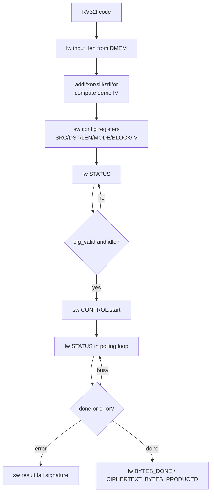

# 08. DMA RISC-V Programming and Instruction Specification

## 1. Mục đích

Tài liệu này giai thich 2 phan:

1. CPU `RV32I` cấu hình `DMA` bằng cách nào trong hệ thống hiện tại
2. Các instruction `RISC-V` nào thực sự được dùng để:
   - đọc dữ liệu tu `DMEM`
   - ghi thanh ghi `DMA MMIO`
   - polling `STATUS`
   - bắt đầu `TX` và `RX`

Spec này dựa trên:

- implementation hiện tại của `dma_regfile`
- memory map hiện tại của SoC
- chương trình `testcase/test_mmio_dma.c`
- disassembly của `testcase/test_mmio_dma.elf`

Regression baseline hiện tại dung một testbench chính `test_bench`; testcase
wrapper được chọn bằng `TESTNAME` và plusargs được chọn bằng `RUN_ARGS`.

## 2. Tong quan kiến trúc lặp trinh

CPU `RV32I` không “goi ham DMA” theo kiểu software library.

Thay vao do, CPU điều khiển DMA bằng cách:

1. ghi giá trị vao các địa chỉ `MMIO`
2. đọc lại `STATUS`
3. polling cho toi khi `DMA` xong

Mo hinh này goi là:

- **memory-mapped I/O**

Tuc là tu góc nhìn của CPU:

- `DMA register` chỉ là các o nhỏ dac biet
- `lw` và `sw` là hai instruction quan trong nhất để giao tiếp với DMA

## 2.1 RV32I Programming Flow Chart



## 3. Memory map can nhỏ

### 3.1 Vung bộ nhớ chính

| Vung | Base | End | Ý nghĩa |
|---|---|---|---|
| `DMEM` | `0x0000_0000` | `0x0000_7FFF` | dữ liệu của CPU và DMA |
| `DMA MMIO` | `0x4000_0000` | `0x4000_00FF` | thanh ghi cấu hình DMA |

### 3.2 DMA register map

| Offset | Tên | Truy cập | Ý nghĩa |
|---|---|---|---|
| `0x00` | `CONTROL` | W | bit `start`, `soft_reset`, `clear_done`, `clear_error` |
| `0x04` | `STATUS` | R | `busy`, `done_sticky`, `error_sticky`, `cfg_valid`, `direction` |
| `0x08` | `SRC_ADDR` | R/W | địa chỉ nguồn trong `DMEM` |
| `0x0C` | `DST_ADDR` | R/W | địa chỉ đích trong `DMEM` |
| `0x10` | `LEN_BYTES` | R/W | số byte engine phải xu ly |
| `0x14` | `MODE` | R/W | `0x1 = TX COMPRESS_AES`, `0x5 = TX COMPRESS_ONLY legacy`, `0x9 = TX whole-file COMPRESS_AES`, `0xD = TX whole-file COMPRESS_ONLY`, `0x2 = RX` |
| `0x18` | `BLOCK_CFG` | R/W | block size |
| `0x1C` | `BYTES_DONE` | R | số byte da xong |
| `0x20` | `DEBUG` | R | engine state và error code |
| `0x24` | `CIPHERTEXT_BYTES_PRODUCED` | R | do dài ciphertext của TX |
| `0x28` | `IV0` | R/W | CBC IV bits `[31:0]` |
| `0x2C` | `IV1` | R/W | CBC IV bits `[63:32]` |
| `0x30` | `IV2` | R/W | CBC IV bits `[95:64]` |
| `0x34` | `IV3` | R/W | CBC IV bits `[127:96]` |

## 4. Cach CPU RV32I cấu hình DMA

### 4.1 Sequence tong quat

Mới lần chạy DMA, CPU thực hiện dung chuoi sau:

1. ghi `SRC_ADDR`
2. ghi `DST_ADDR`
3. ghi `LEN_BYTES`
4. ghi `MODE`
5. ghi `BLOCK_CFG`
6. nếu chạy AES, ghi `IV0..IV3`
7. đọc `STATUS`
8. ghi `CONTROL.start = 1`
9. polling `STATUS`
10. đọc `BYTES_DONE`
11. nếu là TX thì đọc thêm `CIPHERTEXT_BYTES_PRODUCED`

### 4.2 Sequence TX

CPU muon chạy TX:

- `SRC_ADDR = plaintext`
- `DST_ADDR = ciphertext buffer`
- `LEN_BYTES = plaintext length`
- `MODE = 0x1` nếu muon `COMPRESS_AES`
- `MODE = 0xD` nếu muon default `COMPRESS_ONLY + whole_file`
- `MODE = 0x9` nếu muon `COMPRESS_AES` + whole-file dynamic Huffman, đây là mode loopback chính hiện tại
- `IV0..IV3` nếu dung `COMPRESS_AES`

Trong RTL hiện tại, `COMPRESS_AES` là AES-CBC. CPU phải tạo/ghi IV trước
`CONTROL.start`. `testcase/test_mmio_dma.c` dang tạo IV demo deterministic bằng
các instruction RV32I có ban, không dùng `mul`.

Sau khi TX xong:

- `BYTES_DONE` = ciphertext bytes
- `CIPHERTEXT_BYTES_PRODUCED` = ciphertext bytes

### 4.3 Sequence RX

CPU muon chạy RX:

- `SRC_ADDR = ciphertext buffer`
- `DST_ADDR = plaintext output buffer`
- `LEN_BYTES = ciphertext length`
- `MODE = 0x2`
- `IV0..IV3` phải bằng dung IV da dung khi TX encrypt

Sau khi RX xong:

- `BYTES_DONE` = plaintext bytes recovered

### 4.4 `Polling STATUS` là gi

`Polling STATUS` nghĩa là:

- CPU liên tục đọc thanh ghi `DMA_STATUS`
- sau mới lần đọc, CPU tu kiểm trả các bit quan trong
- nếu DMA chưa xong thì CPU lặp lại vong đọc

Đây là cơ chế **thay interrupt bằng vong lặp software**.

Trong hệ thống hiện tại:

- CPU không nhận interrupt khi DMA xong
- vi vay CPU phải tu theo dõi `STATUS`

CPU thuong quan tam 3 bit:

- `busy`
- `done_sticky`
- `error_sticky`

Trinh tu dung:

1. CPU ghi `CONTROL.start = 1`
2. CPU đọc `STATUS` cho toi khi thay `busy = 1`
3. CPU tiếp tục đọc `STATUS`
4. CPU dung khi:
   - `error_sticky = 1`, hoặc
   - `busy = 0` và `done_sticky = 1`

Nếu chỉ đọc `STATUS` một lần duy nhất thì không goi là polling.

Nếu CPU lặp lại:

```c
while (1) {
    status = DMA_STATUS;
    if (...) break;
}
```

thì đây chính là polling.

Ý nghĩa thực tế:

- don gian
- để debug
- hợp với giai đoạn bring-up

Nhưng nhuoc diem là:

- CPU bị ban việc cho DMA
- CPU phải ton cycle để đọc `STATUS`
- về sau có thể thay bằng interrupt để dep hơn

## 5. Các instruction RV32I thực sự được dùng

## 5.1 Boot và vao `main`

Disassembly hiện tại bắt đầu như sau:

```asm
00000000 <_start>:
   0: 00008137   lui  sp,0x8
   4: f0010113   addi sp,sp,-256
   8: 0040006f   j    c <main>
```

Ý nghĩa:

- `lui sp,0x8`
  - nạp phan cao của `sp`
- `addi sp,sp,-256`
  - tạo stack pointer cuối cùng `0x00007f00`
- `j main`
  - nhay vao `main`

Đây là cach dung có ban để bắt đầu một chương trình `RV32I` standalone.

## 5.2 Đọc một word tu DMEM

Vi đủ:

```asm
20: 04002f03   lw t5,64(zero)
```

Ý nghĩa:

- đọc word tai địa chỉ `0x00000040`
- đây là `INPUT_LEN_ADDR`

Instruction được dùng:

- `lw rd, imm(rs1)`

Trong hệ thống này:

- `lw` được dùng để đọc:
  - input length
  - DMA status
  - DMA bytes done
  - ciphertext length

## 5.3 Tạo địa chỉ MMIO DMA

Để ghi vao `DMA_BASE = 0x40000000`, compiler dung:

```asm
24: 400007b7   lui a5,0x40000
```

Ý nghĩa:

- `a5 = 0x40000000`

Vi `RV32I` không có instruction “load full 32-bit immediate” một buoc, nen thuong phải:

- dung `lui`
- nếu cần thì cổng thêm bằng `addi`

Trong vi đủ này, `0x40000000` da tron 12 bit thấp, nen chỉ can `lui`.

## 5.4 Ghi thanh ghi DMA bằng `sw`

Vi đủ TX:

```asm
28: 40000713   li  a4,1024
2c: 00e7a423   sw  a4,8(a5)
```

Ý nghĩa:

- `a5 = DMA_BASE`
- `a4 = 1024 = 0x00000400`
- `sw a4,8(a5)` ghi vao `DMA_SRC_ADDR`

Tiếp theo:

```asm
34: 00002737   lui a4,0x2
38: 00e7a623   sw  a4,12(a5)
```

Ý nghĩa:

- `a4 = 0x00002000`
- ghi vao `DMA_DST_ADDR`

Tiếp theo:

```asm
40: 01e7a823   sw t5,16(a5)
```

Ý nghĩa:

- ghi `LEN_BYTES`

Tiếp theo:

```asm
48: 00100713   li a4,1
4c: 00e7aa23   sw a4,20(a5)
```

Ý nghĩa:

- `MODE = 0x1` (`TX COMPRESS_AES`) hoặc `MODE = 0xD` (`TX COMPRESS_ONLY + whole_file`)

Tiếp theo:

```asm
54: 02000693   li a3,32
58: 00d7ac23   sw a3,24(a5)
```

Ý nghĩa:

- `BLOCK_CFG = 32`

Instruction được dùng:

- `sw rs2, imm(rs1)`

Đây là instruction quan trong nhất để cấu hình DMA.

Nếu chạy AES-CBC, chương trình còn ghi thêm IV:

```asm
sw value0, 40(base)   # IV0, offset 0x28
sw value1, 44(base)   # IV1, offset 0x2C
sw value2, 48(base)   # IV2, offset 0x30
sw value3, 52(base)   # IV3, offset 0x34
```

IV demo trong `test_mmio_dma.c` được tạo bằng các instruction RV32I như:

- `xor` để tron counter/input length
- `slli` và `srli` để tạo rotate
- `or` để ghep kết quả rotate
- `addi`/`add` để cổng constant
- `sw` để ghi IV vao MMIO

## 5.5 Đọc `STATUS` trước khi start

```asm
5c: 400007b7   lui a5,0x40000
60: 0047af83   lw  t6,4(a5)
```

Ý nghĩa:

- đọc `DMA_STATUS`
- lưu vao `t6`

Trong code C, đây là:

```c
*status_before = DMA_STATUS;
```

## 5.6 Bắt đầu DMA

```asm
64: 400007b7   lui a5,0x40000
68: 00e7a023   sw  a4,0(a5)
```

Ý nghĩa:

- `a4 = 1`
- ghi `CONTROL.start = 1`

Đây là lúc DMA thực sự bắt đầu chạy.

## 5.7 Polling `STATUS`

Doan loop polling hiện tại trong disassembly có dang:

```asm
274: 00052683   lw   a3,0(a0)
278: 0016f793   andi a5,a3,1
27c: fc079ee3   bnez a5,258
280: 0046f793   andi a5,a3,4
284: ea0792e3   bnez a5,128
288: fe0302e3   beqz t1,26c
28c: fd5ff06f   j    260
```

Ý nghĩa:

- `lw`:
  - đọc `STATUS`
- `andi a5,a3,1`
  - test bit `busy`
- `bnez`
  - nếu `busy=1` thì nhay
- `andi a5,a3,4`
  - test bit `error`
- `beqz`, `j`
  - lặp lại vong polling

Instruction dùng trong polling:

- `lw`
- `andi`
- `bnez`
- `beqz`
- `j`

Đây là bo instruction toi thiếu của `RV32I` để thực hiện polling MMIO.

## 5.8 Kiểm trả và ghi kết quả ra DMEM

Cuối chương trình, CPU dung:

- `lw` để đọc word đầu của ciphertext / plaintext output
- `sw` để ghi `RESULT_WORD(0..15)` vao `DMEM`

Vi đủ:

```asm
214: 00f02023   sw a5,0(zero)
218: 01102223   sw a7,4(zero)
...
24c: 03d02c23   sw t4,56(zero)
250: 02802e23   sw s0,60(zero)
```

Ý nghĩa:

- CPU ghi kết quả tong hop ve vung `RESULT_BASE_ADDR = 0`
- testbench chỉ cần đọc DMEM để biet test pass/fail

## 6. Mapping giua C và instruction

### 6.1 Macro MMIO trong C

Trong `test_mmio_dma.c`, DMA được dùng theo kiểu:

```c
#define DMA_BASE_ADDR 0x40000000u
#define DMA_CONTROL   (*(volatile uint32_t *)(DMA_BASE_ADDR + 0x00u))
#define DMA_STATUS    (*(volatile uint32_t *)(DMA_BASE_ADDR + 0x04u))
#define DMA_SRC_ADDR  (*(volatile uint32_t *)(DMA_BASE_ADDR + 0x08u))
```

Tu khoa quan trong là:

- `volatile`

Nếu bo `volatile`, compiler có thể:

- bo qua read/write
- reorder instruction
- cache thanh ghi trong register

Dieu này sẽ làm sai hoàn toàn semantics MMIO.

### 6.2 Tu C sang assembly

| C statement | Assembly pattern |
|---|---|
| `DMA_SRC_ADDR = x;` | `lui reg, 0x40000` + `sw value, 8(reg)` |
| `DMA_STATUS` | `lui reg, 0x40000` + `lw dst, 4(reg)` |
| `DMA_CONTROL = 1;` | `lui reg, 0x40000` + `sw one, 0(reg)` |
| `if (status & 1)` | `andi tmp, status, 1` + branch |

## 7. Cach tu viet chương trình RISC-V cho repo này

## 7.1 Viet bằng C

Cach để nhất:

1. tạo file mới trong `testcase/`
   - vi đủ `testcase/test_dma_poll.c`
2. dinh nghia macro MMIO bằng `volatile uint32_t *`
3. viet `_start()` và `main()`
4. compile bằng `make compile C_SRC=test_dma_poll.c`

Template toi thiếu:

```c
typedef unsigned int uint32_t;

#define DMA_BASE_ADDR 0x40000000u
#define DMA_CONTROL   (*(volatile uint32_t *)(DMA_BASE_ADDR + 0x00u))
#define DMA_STATUS    (*(volatile uint32_t *)(DMA_BASE_ADDR + 0x04u))

void _start(void) __attribute__((naked, section(".text")));
int main(void) __attribute__((noreturn));

void _start(void) {
    __asm__ volatile(
        "li sp, 0x00007f00\n"
        "j main\n"
    );
}

int main(void) {
    DMA_CONTROL = 1u;
    while (1) {
    }
}
```

## 7.2 Viet bằng assembly thuần

Nếu muon viet trực tiếp `.S`, cần có:

1. dat `sp`
2. tạo base `DMA_BASE`
3. dung `sw` / `lw`
4. polling bằng branch

Vi đủ:

```asm
    .section .text
    .globl _start
_start:
    lui sp, 0x8
    addi sp, sp, -256

    lui a5, 0x40000
    li  a4, 1
    sw  a4, 0(a5)

poll:
    lw  a3, 4(a5)
    andi a4, a3, 1
    bnez a4, poll

hang:
    j hang
```

## 7.3 Build và simulate

Quy trinh dùng trong repo:

```bash
cd /mnt/h/Academic/senior_project/DATN/work/luc/AES_huffman_all6/sim
make compile C_SRC=test_mmio_dma.c
make drc
make all
```

Kết quả của `make compile`:

- build `../testcase/<name>.S`
- build `../testcase/<name>.elf`
- build `../testcase/<name>.bin`
- build `../testcase/<name>.mem`
- copy `.mem` vao `sim/instruction.mem`

Từ đó:

- `instruction.mem` được nạp vao `IMEM`
- CPU boot tu file này khi simulate

## 8. Giới hạn lặp trinh hiện tại

He `RISC-V` của repo hiện tại nen được xem là:

- `RV32I`
- không có standard runtime
- không có libc
- không có syscall environment đây đủ
- không nên phụ thuộc vao stack frame phuc tap hay compiler runtime lớn

Nên dùng:

- integer 32-bit có ban
- pointer MMIO `volatile`
- loop polling don gian
- startup `_start` thu cổng

Không nên ky vong:

- printf
- file I/O
- interrupt runtime software đây đủ
- heap / malloc

## 9. Checklist lặp trinh DMA bằng RISC-V

Khi viet chương trình mới, can check:

1. có `_start` dat `sp`
2. có `volatile` cho tat ca MMIO register
3. `SRC_ADDR` và `DST_ADDR` canh `4-byte`
4. `MODE = 0x1` cho `TX COMPRESS_AES`, `MODE = 0xD` cho TX whole-file `COMPRESS_ONLY`, `MODE = 0x9` cho TX whole-file COMPRESS_AES, `MODE = 0x2` cho RX
5. nếu dung AES-CBC, ghi `IV0..IV3` trước `CONTROL.start`
6. `RX LEN_BYTES = CIPHERTEXT_BYTES_PRODUCED`, không dùng plaintext length
7. RX phải dung cung IV với TX
8. polling dung trên `STATUS`
9. nếu cần self-check, ghi result ra `DMEM` để testbench đọc

## 10. Ket luan

Để cấu hình DMA trong hệ thống này, CPU `RISC-V` thuc chat chỉ can:

- `lui` / `addi` để tạo địa chỉ
- `lw` để đọc `STATUS` và kết quả
- `sw` để ghi thanh ghi DMA
- `andi` + branch để polling
- `xor`, `slli`, `srli`, `or`, `add/addi` nếu CPU tu tạo IV demo

Do đó, việc “sử dụng RISC-V” trong do an này có thể hieu rất cũ the là:

- viet một chương trình `RV32I`
- dung `lw/sw` trên vung `MMIO`
- để CPU điều khiển accelerator thong qua DMA

Đây là dung mo hinh SoC hiện tại:

- CPU = control plane
- DMA = data mover
- TX/RX = accelerator
