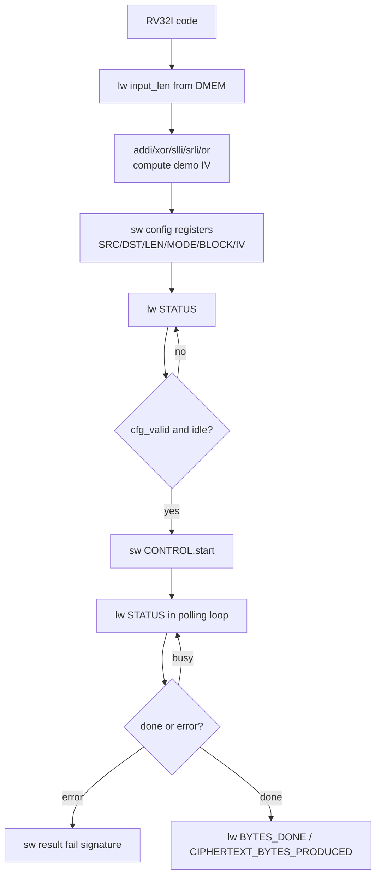

# 08. DMA RISC-V Programming and Instruction Specification

## 1. Muc dich

Tai lieu nay giai thich 2 phan:

1. CPU `RV32I` cau hinh `DMA` bang cach nao trong he thong hien tai
2. Cac instruction `RISC-V` nao thuc su duoc dung de:
   - doc du lieu tu `DMEM`
   - ghi thanh ghi `DMA MMIO`
   - polling `STATUS`
   - bat dau `TX` va `RX`

Spec nay dua tren:

- implementation hien tai cua `dma_regfile`
- memory map hien tai cua SoC
- chuong trinh `testcase/test_mmio_dma.c`
- disassembly cua `testcase/test_mmio_dma.elf`

## 2. Tong quan kien truc lap trinh

CPU `RV32I` khong “goi ham DMA” theo kieu software library.

Thay vao do, CPU dieu khien DMA bang cach:

1. ghi gia tri vao cac dia chi `MMIO`
2. doc lai `STATUS`
3. polling cho toi khi `DMA` xong

Mo hinh nay goi la:

- **memory-mapped I/O**

Tuc la tu goc nhin cua CPU:

- `DMA register` chi la cac o nho dac biet
- `lw` va `sw` la hai instruction quan trong nhat de giao tiep voi DMA

## 2.1 RV32I Programming Flow Chart



## 3. Memory map can nho

### 3.1 Vung bo nho chinh

| Vung | Base | End | Y nghia |
|---|---|---|---|
| `DMEM` | `0x0000_0000` | `0x0000_7FFF` | du lieu cua CPU va DMA |
| `DMA MMIO` | `0x4000_0000` | `0x4000_00FF` | thanh ghi cau hinh DMA |

### 3.2 DMA register map

| Offset | Ten | Access | Y nghia |
|---|---|---|---|
| `0x00` | `CONTROL` | W | bit `start`, `soft_reset`, `clear_done`, `clear_error` |
| `0x04` | `STATUS` | R | `busy`, `done_sticky`, `error_sticky`, `cfg_valid`, `direction` |
| `0x08` | `SRC_ADDR` | R/W | dia chi nguon trong `DMEM` |
| `0x0C` | `DST_ADDR` | R/W | dia chi dich trong `DMEM` |
| `0x10` | `LEN_BYTES` | R/W | so byte engine phai xu ly |
| `0x14` | `MODE` | R/W | `0x1 = TX COMPRESS_AES`, `0x5 = TX COMPRESS_ONLY legacy`, `0x9 = TX whole-file COMPRESS_AES`, `0xD = TX whole-file COMPRESS_ONLY`, `0x2 = RX` |
| `0x18` | `BLOCK_CFG` | R/W | block size |
| `0x1C` | `BYTES_DONE` | R | so byte da xong |
| `0x20` | `DEBUG` | R | engine state va error code |
| `0x24` | `CIPHERTEXT_BYTES_PRODUCED` | R | do dai ciphertext cua TX |
| `0x28` | `IV0` | R/W | CBC IV bits `[31:0]` |
| `0x2C` | `IV1` | R/W | CBC IV bits `[63:32]` |
| `0x30` | `IV2` | R/W | CBC IV bits `[95:64]` |
| `0x34` | `IV3` | R/W | CBC IV bits `[127:96]` |

## 4. Cach CPU RV32I cau hinh DMA

### 4.1 Sequence tong quat

Moi lan chay DMA, CPU thuc hien dung chuoi sau:

1. ghi `SRC_ADDR`
2. ghi `DST_ADDR`
3. ghi `LEN_BYTES`
4. ghi `MODE`
5. ghi `BLOCK_CFG`
6. neu chay AES, ghi `IV0..IV3`
7. doc `STATUS`
8. ghi `CONTROL.start = 1`
9. polling `STATUS`
10. doc `BYTES_DONE`
11. neu la TX thi doc them `CIPHERTEXT_BYTES_PRODUCED`

### 4.2 Sequence TX

CPU muon chay TX:

- `SRC_ADDR = plaintext`
- `DST_ADDR = ciphertext buffer`
- `LEN_BYTES = plaintext length`
- `MODE = 0x1` neu muon `COMPRESS_AES`
- `MODE = 0xD` neu muon default `COMPRESS_ONLY + whole_file`
- `MODE = 0x9` neu muon `COMPRESS_AES` + whole-file dynamic Huffman, day la mode loopback chinh hien tai
- `IV0..IV3` neu dung `COMPRESS_AES`

Trong RTL hien tai, `COMPRESS_AES` la AES-CBC. CPU phai tao/ghi IV truoc
`CONTROL.start`. `testcase/test_mmio_dma.c` dang tao IV demo deterministic bang
cac instruction RV32I co ban, khong dung `mul`.

Sau khi TX xong:

- `BYTES_DONE` = ciphertext bytes
- `CIPHERTEXT_BYTES_PRODUCED` = ciphertext bytes

### 4.3 Sequence RX

CPU muon chay RX:

- `SRC_ADDR = ciphertext buffer`
- `DST_ADDR = plaintext output buffer`
- `LEN_BYTES = ciphertext length`
- `MODE = 0x2`
- `IV0..IV3` phai bang dung IV da dung khi TX encrypt

Sau khi RX xong:

- `BYTES_DONE` = plaintext bytes recovered

### 4.4 `Polling STATUS` la gi

`Polling STATUS` nghia la:

- CPU lien tuc doc thanh ghi `DMA_STATUS`
- sau moi lan doc, CPU tu kiem tra cac bit quan trong
- neu DMA chua xong thi CPU lap lai vong doc

Day la co che **thay interrupt bang vong lap software**.

Trong he thong hien tai:

- CPU khong nhan interrupt khi DMA xong
- vi vay CPU phai tu theo doi `STATUS`

CPU thuong quan tam 3 bit:

- `busy`
- `done_sticky`
- `error_sticky`

Trinh tu dung:

1. CPU ghi `CONTROL.start = 1`
2. CPU doc `STATUS` cho toi khi thay `busy = 1`
3. CPU tiep tuc doc `STATUS`
4. CPU dung khi:
   - `error_sticky = 1`, hoac
   - `busy = 0` va `done_sticky = 1`

Neu chi doc `STATUS` mot lan duy nhat thi khong goi la polling.

Neu CPU lap lai:

```c
while (1) {
    status = DMA_STATUS;
    if (...) break;
}
```

thi day chinh la polling.

Y nghia thuc te:

- don gian
- de debug
- hop voi giai doan bring-up

Nhung nhuoc diem la:

- CPU bi ban viec cho DMA
- CPU phai ton cycle de doc `STATUS`
- ve sau co the thay bang interrupt de dep hon

## 5. Cac instruction RV32I thuc su duoc dung

## 5.1 Boot va vao `main`

Disassembly hien tai bat dau nhu sau:

```asm
00000000 <_start>:
   0: 00008137   lui  sp,0x8
   4: f0010113   addi sp,sp,-256
   8: 0040006f   j    c <main>
```

Y nghia:

- `lui sp,0x8`
  - nap phan cao cua `sp`
- `addi sp,sp,-256`
  - tao stack pointer cuoi cung `0x00007f00`
- `j main`
  - nhay vao `main`

Day la cach dung co ban de bat dau mot chuong trinh `RV32I` standalone.

## 5.2 Doc mot word tu DMEM

Vi du:

```asm
20: 04002f03   lw t5,64(zero)
```

Y nghia:

- doc word tai dia chi `0x00000040`
- day la `INPUT_LEN_ADDR`

Instruction duoc dung:

- `lw rd, imm(rs1)`

Trong he thong nay:

- `lw` duoc dung de doc:
  - input length
  - DMA status
  - DMA bytes done
  - ciphertext length

## 5.3 Tao dia chi MMIO DMA

De ghi vao `DMA_BASE = 0x40000000`, compiler dung:

```asm
24: 400007b7   lui a5,0x40000
```

Y nghia:

- `a5 = 0x40000000`

Vi `RV32I` khong co instruction “load full 32-bit immediate” mot buoc, nen thuong phai:

- dung `lui`
- neu can thi cong them bang `addi`

Trong vi du nay, `0x40000000` da tron 12 bit thap, nen chi can `lui`.

## 5.4 Ghi thanh ghi DMA bang `sw`

Vi du TX:

```asm
28: 40000713   li  a4,1024
2c: 00e7a423   sw  a4,8(a5)
```

Y nghia:

- `a5 = DMA_BASE`
- `a4 = 1024 = 0x00000400`
- `sw a4,8(a5)` ghi vao `DMA_SRC_ADDR`

Tiep theo:

```asm
34: 00002737   lui a4,0x2
38: 00e7a623   sw  a4,12(a5)
```

Y nghia:

- `a4 = 0x00002000`
- ghi vao `DMA_DST_ADDR`

Tiep theo:

```asm
40: 01e7a823   sw t5,16(a5)
```

Y nghia:

- ghi `LEN_BYTES`

Tiep theo:

```asm
48: 00100713   li a4,1
4c: 00e7aa23   sw a4,20(a5)
```

Y nghia:

- `MODE = 0x1` (`TX COMPRESS_AES`) hoac `MODE = 0xD` (`TX COMPRESS_ONLY + whole_file`)

Tiep theo:

```asm
54: 02000693   li a3,32
58: 00d7ac23   sw a3,24(a5)
```

Y nghia:

- `BLOCK_CFG = 32`

Instruction duoc dung:

- `sw rs2, imm(rs1)`

Day la instruction quan trong nhat de cau hinh DMA.

Neu chay AES-CBC, chuong trinh con ghi them IV:

```asm
sw value0, 40(base)   # IV0, offset 0x28
sw value1, 44(base)   # IV1, offset 0x2C
sw value2, 48(base)   # IV2, offset 0x30
sw value3, 52(base)   # IV3, offset 0x34
```

IV demo trong `test_mmio_dma.c` duoc tao bang cac instruction RV32I nhu:

- `xor` de tron counter/input length
- `slli` va `srli` de tao rotate
- `or` de ghep ket qua rotate
- `addi`/`add` de cong constant
- `sw` de ghi IV vao MMIO

## 5.5 Doc `STATUS` truoc khi start

```asm
5c: 400007b7   lui a5,0x40000
60: 0047af83   lw  t6,4(a5)
```

Y nghia:

- doc `DMA_STATUS`
- luu vao `t6`

Trong code C, day la:

```c
*status_before = DMA_STATUS;
```

## 5.6 Bat dau DMA

```asm
64: 400007b7   lui a5,0x40000
68: 00e7a023   sw  a4,0(a5)
```

Y nghia:

- `a4 = 1`
- ghi `CONTROL.start = 1`

Day la luc DMA thuc su bat dau chay.

## 5.7 Polling `STATUS`

Doan loop polling hien tai trong disassembly co dang:

```asm
274: 00052683   lw   a3,0(a0)
278: 0016f793   andi a5,a3,1
27c: fc079ee3   bnez a5,258
280: 0046f793   andi a5,a3,4
284: ea0792e3   bnez a5,128
288: fe0302e3   beqz t1,26c
28c: fd5ff06f   j    260
```

Y nghia:

- `lw`:
  - doc `STATUS`
- `andi a5,a3,1`
  - test bit `busy`
- `bnez`
  - neu `busy=1` thi nhay
- `andi a5,a3,4`
  - test bit `error`
- `beqz`, `j`
  - lap lai vong polling

Instruction dung trong polling:

- `lw`
- `andi`
- `bnez`
- `beqz`
- `j`

Day la bo instruction toi thieu cua `RV32I` de thuc hien polling MMIO.

## 5.8 Kiem tra va ghi ket qua ra DMEM

Cuoi chuong trinh, CPU dung:

- `lw` de doc word dau cua ciphertext / plaintext output
- `sw` de ghi `RESULT_WORD(0..15)` vao `DMEM`

Vi du:

```asm
214: 00f02023   sw a5,0(zero)
218: 01102223   sw a7,4(zero)
...
24c: 03d02c23   sw t4,56(zero)
250: 02802e23   sw s0,60(zero)
```

Y nghia:

- CPU ghi ket qua tong hop ve vung `RESULT_BASE_ADDR = 0`
- testbench chi can doc DMEM de biet test pass/fail

## 6. Mapping giua C va instruction

### 6.1 Macro MMIO trong C

Trong `test_mmio_dma.c`, DMA duoc dung theo kieu:

```c
#define DMA_BASE_ADDR 0x40000000u
#define DMA_CONTROL   (*(volatile uint32_t *)(DMA_BASE_ADDR + 0x00u))
#define DMA_STATUS    (*(volatile uint32_t *)(DMA_BASE_ADDR + 0x04u))
#define DMA_SRC_ADDR  (*(volatile uint32_t *)(DMA_BASE_ADDR + 0x08u))
```

Tu khoa quan trong la:

- `volatile`

Neu bo `volatile`, compiler co the:

- bo qua read/write
- reorder instruction
- cache thanh ghi trong register

Dieu nay se lam sai hoan toan semantics MMIO.

### 6.2 Tu C sang assembly

| C statement | Assembly pattern |
|---|---|
| `DMA_SRC_ADDR = x;` | `lui reg, 0x40000` + `sw value, 8(reg)` |
| `DMA_STATUS` | `lui reg, 0x40000` + `lw dst, 4(reg)` |
| `DMA_CONTROL = 1;` | `lui reg, 0x40000` + `sw one, 0(reg)` |
| `if (status & 1)` | `andi tmp, status, 1` + branch |

## 7. Cach tu viet chuong trinh RISC-V cho repo nay

## 7.1 Viet bang C

Cach de nhat:

1. tao file moi trong `testcase/`
   - vi du `testcase/test_dma_poll.c`
2. dinh nghia macro MMIO bang `volatile uint32_t *`
3. viet `_start()` va `main()`
4. compile bang `make compile C_SRC=test_dma_poll.c`

Template toi thieu:

```c
typedef unsigned int uint32_t;

#define DMA_BASE_ADDR 0x40000000u
#define DMA_CONTROL   (*(volatile uint32_t *)(DMA_BASE_ADDR + 0x00u))
#define DMA_STATUS    (*(volatile uint32_t *)(DMA_BASE_ADDR + 0x04u))

void _start(void) __attribute__((naked, section(".text")));
int main(void) __attribute__((noreturn));

void _start(void) {
    __asm__ volatile(
        "li sp, 0x00007f00\n"
        "j main\n"
    );
}

int main(void) {
    DMA_CONTROL = 1u;
    while (1) {
    }
}
```

## 7.2 Viet bang assembly thuần

Neu muon viet truc tiep `.S`, can co:

1. dat `sp`
2. tao base `DMA_BASE`
3. dung `sw` / `lw`
4. polling bang branch

Vi du:

```asm
    .section .text
    .globl _start
_start:
    lui sp, 0x8
    addi sp, sp, -256

    lui a5, 0x40000
    li  a4, 1
    sw  a4, 0(a5)

poll:
    lw  a3, 4(a5)
    andi a4, a3, 1
    bnez a4, poll

hang:
    j hang
```

## 7.3 Build va simulate

Quy trinh dung trong repo:

```bash
cd /mnt/h/Academic/senior_project/DATN/work/luc/AES_huffman_all6/sim
make compile C_SRC=test_mmio_dma.c
make drc
make all TESTNAME=my_test
```

Ket qua cua `make compile`:

- build `../testcase/<name>.S`
- build `../testcase/<name>.elf`
- build `../testcase/<name>.bin`
- build `../testcase/<name>.mem`
- copy `.mem` vao `sim/instruction.mem`

Tu do:

- `instruction.mem` duoc nap vao `IMEM`
- CPU boot tu file nay khi simulate

## 8. Gioi han lap trinh hien tai

He `RISC-V` cua repo hien tai nen duoc xem la:

- `RV32I`
- khong co standard runtime
- khong co libc
- khong co syscall environment day du
- khong nen phu thuoc vao stack frame phuc tap hay compiler runtime lon

Nen dung:

- integer 32-bit co ban
- pointer MMIO `volatile`
- loop polling don gian
- startup `_start` thu cong

Khong nen ky vong:

- printf
- file I/O
- interrupt runtime software day du
- heap / malloc

## 9. Checklist lap trinh DMA bang RISC-V

Khi viet chuong trinh moi, can check:

1. co `_start` dat `sp`
2. co `volatile` cho tat ca MMIO register
3. `SRC_ADDR` va `DST_ADDR` canh `4-byte`
4. `MODE = 0x1` cho `TX COMPRESS_AES`, `MODE = 0xD` cho TX whole-file `COMPRESS_ONLY`, `MODE = 0x9` cho TX whole-file COMPRESS_AES, `MODE = 0x2` cho RX
5. neu dung AES-CBC, ghi `IV0..IV3` truoc `CONTROL.start`
6. `RX LEN_BYTES = CIPHERTEXT_BYTES_PRODUCED`, khong dung plaintext length
7. RX phai dung cung IV voi TX
8. polling dung tren `STATUS`
9. neu can self-check, ghi result ra `DMEM` de testbench doc

## 10. Ket luan

De cau hinh DMA trong he thong nay, CPU `RISC-V` thuc chat chi can:

- `lui` / `addi` de tao dia chi
- `lw` de doc `STATUS` va ket qua
- `sw` de ghi thanh ghi DMA
- `andi` + branch de polling
- `xor`, `slli`, `srli`, `or`, `add/addi` neu CPU tu tao IV demo

Do do, viec “su dung RISC-V” trong do an nay co the hieu rat cu the la:

- viet mot chuong trinh `RV32I`
- dung `lw/sw` tren vung `MMIO`
- de CPU dieu khien accelerator thong qua DMA

Day la dung mo hinh SoC hien tai:

- CPU = control plane
- DMA = data mover
- TX/RX = accelerator
