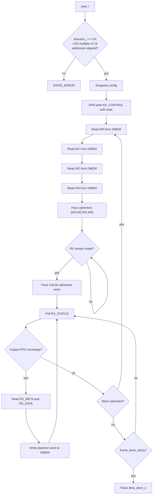

# 13. DMA RX Engine Specification

## 1. Mục đích

`dma_rx_engine` là data-plane engine cho hướng:

```text
DMEM ciphertext -> RX accelerator -> DMEM plaintext
```

Trong SoC hiện tại, engine này:

1. nhận config tu `dma_regfile`
2. chiem `DMEM` Cổng B khi dang chạy
3. đọc ciphertext tu `DMEM` theo từng transport word 128-bit
4. feed ciphertext vao `apb_huffman_aes_rx_top` bằng stream 128-bit
5. poll RX APB status/output FIFO
6. đọc plaintext word 32-bit tu RX
7. ghi plaintext ve `DMEM`

Trạng thái kiểm chứng hiện tại:

| Case | Coverage/use |
|---|---|
| `dma_compress_aes_input1/input3/alnum63` | Normal whole-file RX phase trong TX->RX loopback |
| `mmio_rx_bad_length` | RX rejects ciphertext length không align 16 byte |
| `rx_backpressure_cov` | Stream/FIFO backpressure giua RX top và DMA RX |
| `rx_depacker_packer_direct_cov` | Malformed transport frame propagates RX error |
| `dma_bridge_direct_cov` | Defensive config/error branches của DMA/APB path |
| Full coverage regression | Included in `34/34` PASS baseline |

## 1.1 Flow Chart



## 2. Current RX Input Path

Code hiện tại dung stream input 128-bit, không dùng APB staging ciphertext cũ.

Stream signals:

| Tín hiệu | Hướng | Độ rộng | Định dạng dữ liệu | Ý nghĩa |
|---|---|---:|---|---|
| `rx_ciphertext_word_o` | RX engine -> RX top | 128 | 128-bit transport word `{w3,w2,w1,w0}` | Ciphertext block feed into RX top |
| `rx_ciphertext_word_valid_o` | RX engine -> RX top | 1 | valid flag | valid khi engine dang feed word |
| `rx_ciphertext_word_ready_i` | RX top -> RX engine | 1 | ready flag | RX accept ready |

Legacy APB staging registers `CTXT_W0..W3`, `CTXT_START`, `CTXT_STATUS` are not used by the SoC main flow.

## 3. Accepted Config

`dma_rx_engine` chỉ nhận `start_i` khi:

| Trường | Rule |
|---|---|
| `direction_i` | must be `2'b10` |
| `len_bytes_i` | nonzero and multiple of 16 bytes |
| `src_addr_i` | 4-byte aligned |
| `dst_addr_i` | 4-byte aligned |

`block_size_i` is not used by RX datapath. It is only XORed into an unused-control reduction so lint does not treat the input as floating.

If config is invalid, engine raises `dma_error_o` and sets `last_error_code_o = 8'h02`.

## 4. Interface

### 4.1 Control And Config

| Cổng | Hướng | Độ rộng | Định dạng dữ liệu | Ý nghĩa |
|---|---|---:|---|---|
| `clk_i` | in | 1 | `clk` | System clock |
| `rst_i` | in | 1 | `rst` | Active-high reset |
| `start_i` | in | 1 | pulse | Start pulse |
| `soft_reset_i` | in | 1 | pulse | Reset engine state |
| `clear_done_i` | in | 1 | pulse / control | Currently only consumed for lint-safe control reduction |
| `clear_error_i` | in | 1 | pulse | Clears `last_error_code_o` |
| `src_addr_i` | in | 32 | byte address | DMEM ciphertext source byte address |
| `dst_addr_i` | in | 32 | byte address | DMEM plaintext destination byte address |
| `len_bytes_i` | in | 32 | unsigned byte count | Ciphertext byte count, must be 16-byte aligned |
| `direction_i` | in | 2 | direction code | Must be RX direction `2'b10` |
| `block_size_i` | in | 6 | unsigned byte count | Not functionally used by RX |

### 4.2 DMEM Cổng B Master

| Cổng | Hướng | Độ rộng | Định dạng dữ liệu | Ý nghĩa |
|---|---|---:|---|---|
| `dmem_en_o` | out | 1 | enable flag | Enable DMEM Cổng B |
| `dmem_we_o` | out | 4 | byte write mask | `4'b1111` when writing output word |
| `dmem_addr_o` | out | 32 | byte address | Byte address |
| `dmem_wdata_o` | out | 32 | little-endian word | Plaintext word written to DMEM |
| `dmem_rdata_i` | in | 32 | little-endian word | Ciphertext word read from DMEM |

### 4.3 Private APB Master To RX

| Cổng | Hướng | Độ rộng | Định dạng dữ liệu | Ý nghĩa |
|---|---|---:|---|---|
| `rx_psel_o` | out | 1 | APB select | APB `PSEL` |
| `rx_penable_o` | out | 1 | APB enable | APB `PENABLE` |
| `rx_pwrite_o` | out | 1 | APB direction | APB `PWRITE` |
| `rx_paddr_o` | out | 32 | byte address | APB local address |
| `rx_pwdata_o` | out | 32 | little-endian word | APB write data |
| `rx_prdata_i` | in | 32 | little-endian word | APB read data |
| `rx_pready_i` | in | 1 | handshake | APB ready |
| `rx_pslverr_i` | in | 1 | error flag | APB error |

### 4.4 Trạng thái Outputs

| Cổng | Hướng | Độ rộng | Định dạng dữ liệu | Ý nghĩa |
|---|---|---:|---|---|
| `dma_busy_o` | out | 1 | busy flag | Engine active |
| `dma_done_o` | out | 1 | pulse | One-cycle done pulse |
| `dma_error_o` | out | 1 | pulse | One-cycle error pulse |
| `bytes_done_o` | out | 32 | unsigned byte count | Plaintext bytes produced |
| `last_error_code_o` | out | 8 | error code | Last error code |
| `engine_state_o` | out | 4 | state nibble | Low nibble of FSM state |

## 5. RX APB Thanh ghi Usage

`dma_rx_engine` uses only these RX APB offsets:

| Offset | Thanh ghi | Truy cập | Định dạng dữ liệu | Engine usage |
|---:|---|---|---|---|
| `0x00` | `RX_DATA` | read | little-endian 32-bit word | Read one plaintext output word |
| `0x04` | `RX_META` | read | bitfield | Read valid byte count for output word |
| `0x08` | `RX_STATUS` | read | bitfield | Poll output FIFO, frame done, error |
| `0x0C` | `RX_CONTROL` | write | control pulse bitfield | Write `0x1` to reset RX wrapper at transfer start |

The engine does not use ciphertext APB staging registers in the main SoC path.

## 6. FSM Flow

High-level flow:

1. `STATE_IDLE`: wait for RX start.
2. `STATE_CAPTURE_CFG`: snapshot source, destination, remaining ciphertext bytes; issue RX soft reset.
3. `STATE_READ_W0..W3`: read four 32-bit words from DMEM.
4. `STATE_STREAM_WAIT`: present one 128-bit ciphertext word to RX until accepted.
5. `STATE_POLL_STATUS`: poll RX output status.
6. If output FIFO nonempty, read `RX_META`, then `RX_DATA`, then write one 32-bit word to DMEM.
7. If RX reports frame done and all ciphertext bytes have been consumed, complete.
8. If RX reports frame done early while ciphertext remains, raise length error.
9. If no output is available and ciphertext remains, read and feed the next 128-bit word.

This means current RX supports multi-transport-word frames as long as `LEN_BYTES` is a multiple of 16.

## 7. Completion Contract

The engine completes when:

- RX `STATUS[4] = frame_done_sticky`
- `ctxt_bytes_remaining_r == 0`
- no pending ciphertext stream word remains

Then:

- `dma_done_o` pulses for one cycle
- `bytes_done_o` contains decoded plaintext byte count
- `last_error_code_o` is cleared to `0`

## 8. Error Handling

| Code | Ý nghĩa |
|---:|---|
| `0x00` | No error |
| `0x02` | Bad direction, zero length, unaligned length, or unaligned address |
| `0x03` | RX APB access returned `PSLVERR` |
| `0x04` | RX status reported internal error |
| `0x05` | RX meta valid byte count invalid |
| `0x06` | RX frame done did not match ciphertext length contract |

## 9. AES CBC Ghi chú

`dma_rx_engine` không tu quan ly IV và không tu thực hiện CBC. Engine chỉ feed
ciphertext 128-bit vao `apb_huffman_aes_rx_top`.

CBC được thực hiện trong RX top:

1. capture ciphertext block hiện tại khi accept vao AES decrypt core;
2. decrypt bằng `aes128_cipher_inv_top`;
3. XOR decrypted output với previous ciphertext, hoặc `cbc_iv_i` cho block 0;
4. feed plaintext transport word sau XOR vao `bit_depacker_128`;
5. update previous ciphertext bằng block ciphertext vừa decrypt xong.

Software phải đảm bảo `IV0..IV3` trong `dma_regfile` bằng dung IV da dung khi
TX encrypt. Trong loopback hiện tại, software ghi IV trước TX và giữ nguyên IV
do cho RX.

## 10. Software Implication

For RX, software must set:

```text
SRC_ADDR   = ciphertext buffer
DST_ADDR   = plaintext output buffer
LEN_BYTES  = ciphertext byte count from TX
MODE       = 0x00000002
CONTROL    = start
```

For the main loopback, software should use `CIPHERTEXT_BYTES_PRODUCED` from TX as RX `LEN_BYTES`.
For AES-CBC loopback, software must also keep the same `IV0..IV3` value for RX.

## 11. Trạng thái / thanh ghi nội bộ

| Reg / buffer | Độ rộng | Định dạng dữ liệu | Ý nghĩa |
|---|---:|---|---|
| `state_r` | 5 | FSM state code | Main RX DMA state machine |
| `apb_resume_state_r` | 5 | FSM state code | Resume state after APB wait |
| `apb_write_r` | 1 | bool | APB write direction shadow |
| `apb_addr_r` | 32 | byte address | APB address shadow |
| `apb_wdata_r` | 32 | little-endian word | APB write-data shadow |
| `apb_rdata_r` | 32 | little-endian word | APB read-data shadow |
| `src_ptr_r` | 32 | byte address | Current source pointer |
| `dst_ptr_r` | 32 | byte address | Current destination pointer |
| `ctxt_bytes_remaining_r` | 32 | unsigned byte count | Remaining ciphertext bytes |
| `ctxt_w0_r` | 32 | little-endian word | Ciphertext staging word 0 |
| `ctxt_w1_r` | 32 | little-endian word | Ciphertext staging word 1 |
| `ctxt_w2_r` | 32 | little-endian word | Ciphertext staging word 2 |
| `ctxt_w3_r` | 32 | little-endian word | Ciphertext staging word 3 |
| `meta_r` | 3 | unsigned byte count | Valid-byte meta for output word |
| `output_word_r` | 32 | little-endian word | Plaintext output word shadow |
| `stream_pending_r` | 1 | bool | Stream word pending for RX top |
