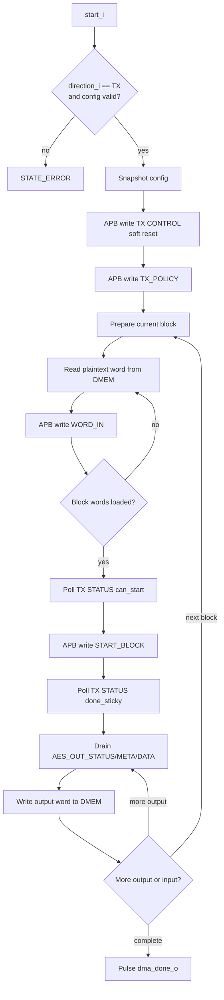

# 11. DMA TX Engine Specification

## 1. Purpose

`dma_tx_engine` is the data-plane engine for direction:

- `DMEM plaintext -> TX accelerator -> DMEM ciphertext`

In the current SoC, this module receives configuration from `dma_regfile`, monitors `DMEM` port B while transfer is running, controls `apb_huffman_aes_tx_top` with private APB master, and writes ciphertext back to `DMEM`.

Current verification status:

| Case | Coverage/use |
|---|---|
| `dma_compress_aes_input1/input3/alnum63` | Normal whole-file `COMPRESS_AES` TX phase in loopback SoC |
| `tx_compress_only_input1/input4_cov` | TX-only `COMPRESS_ONLY` path for direct saving |
| `tx_apb_wait_cov` | Private APB wait-state between DMA TX and TX accelerator |
| `tx_apb_error_cov` | Private APB error path and `last_error_code_o` |
| `dma_bridge_direct_cov` | Defensive config/error branches of DMA/APB path |
| Full coverage regression | Included in `34/34` PASS baseline |

## 1.1 Flow Chart

## 2. Scope of the current code

The version in the current repo is a separate engine for direction `TX`:

1. get `start_i` from `dma_regfile`
2. only issue when `direction_i == 2'b01`
3. receive additional `compress_only_i` from `dma_regfile`
4. validate alignment and block size
5. soft-reset TX wrapper
6. loop `TX_POLICY`
7. Divide transfer into blocks according to `block_size_i`
8. Read plaintext 32-bit word from `DMEM`
9. Write `BLOCK_SIZE`, `WORD_IN`, and `START_BLOCK` to the TX APB slave
10. poll `STATUS` to wait for `can_start` and `done_sticky`
11. drain `AES_OUT_STATUS`, `AES_OUT_META`, `AES_OUT_DATA`
12. Write output 32-bit word to `DMEM`
13. play `dma_done_o` or `dma_error_o`

`bytes_done_o` currently counts the number of output bytes registered in `DMEM`:

- if `compress_only_i = 0`: this is AES output bytes
- if `compress_only_i = 1`: this is compressed transport bytes

## 3. Interface

### 3.1 Control and snapshot config

| Port | Direction | Width | Data format | Meaning |
|---|---|---:|---|---|
| `clk_i` | in | 1 | `clk` | System clock |
| `rst_i` | in | 1 | `rst` | Active-high reset |
| `start_i` | in | 1 | pulse | Pulse starts transferring |
| `soft_reset_i` | in | 1 | pulse | Pulse reset engine state |
| `clear_done_i` | in | 1 | pulse | Pulse clear done/debug state |
| `clear_error_i` | in | 1 | pulse | Pulse clear last error |
| `src_addr_i` | in | 32 | byte address | Byte address plaintext source in `DMEM` |
| `dst_addr_i` | in | 32 | byte address | Byte address ciphertext destination in `DMEM` |
| `len_bytes_i` | in | 32 | unsigned byte count | All plaintext bytes need to be processed |
| `direction_i` | in | 2 | direction code | Must be `2'b01` for this engine to run |
| `compress_only_i` | in | 1 | policy flag | `1`: TX bypass AES, `0`: TX bypass AES |
| `block_size_i` | in | 6 | unsigned byte count | Number of bytes/block, currently allowed code `1..32` |

### 3.2 DMEM port B master

| Port | Direction | Width | Data format | Meaning |
|---|---|---:|---|---|
| `dmem_en_o` | out | 1 | enable flag | Access `DMEM` port B |
| `dmem_we_o` | out | 4 | byte write mask | Byte write enable; `4'b1111` when writing ciphertext |
| `dmem_addr_o` | out | 32 | byte address | Byte address port B |
| `dmem_wdata_o` | out | 32 | little-endian word | Data registers `DMEM` |
| `dmem_rdata_i` | in | 32 | little-endian word | Data read from `DMEM` |

### 3.3 Private APB Master To TX

| Port | Direction | Width | Data format | Meaning |
|---|---|---:|---|---|
| `tx_psel_o` | out | 1 | APB select | APB `PSEL` |
| `tx_penable_o` | out | 1 | APB enable | APB `PENABLE` |
| `tx_pwrite_o` | out | 1 | APB direction | APB `PWRITE` |
| `tx_paddr_o` | out | 32 | byte address | APB `PADDR` |
| `tx_pwdata_o` | out | 32 | little-endian word | APB `PWDATA` |
| `tx_prdata_i` | in | 32 | little-endian word | APB `PRDATA` |
| `tx_pready_i` | in | 1 | handshake | APB `PREADY` |
| `tx_pslverr_i` | in | 1 | error flag | APB `PSLVERR` |

### 3.4 Status outputs

| Port | Direction | Width | Data format | Meaning |
|---|---|---:|---|---|
| `dma_busy_o` | out | 1 | busy flag | Engine is active |
| `dma_done_o` | out | 1 | pulse | Pulse 1 cycle when transfer is complete |
| `dma_error_o` | out | 1 | pulse | Pulse 1 cycle when transfer error |
| `bytes_done_o` | out | 32 | unsigned byte count | Output bytes are written to `DMEM` |
| `last_error_code_o` | out | 8 | error code | Ghost last error |
| `engine_state_o` | out | 4 | state nibble | Low nibble of FSM state |

## 4. Accepted config in current code

`dma_tx_engine` only receives `start_i` if:

- `direction_i == 2'b01`
- `len_bytes_i != 0`
- `block_size_i != 0`
- `block_size_i <= 32`
- `src_addr_i[1:0] == 2'b00`
- `dst_addr_i[1:0] == 2'b00`

If one of the above conditions is false, the engine enters `STATE_ERROR` and sets `last_error_code_o = 8'h02`.

## 5. TX-side APB register usage

`dma_tx_engine` uses the following offsets on `apb_huffman_tx_if`:

| Offset | Register | Access | Data format | Engine usage |
|---|---|---|---|---|
| `0x00` | `START_BLOCK` | write | control pulse bitfield | Register `0x1` for the last block, `0x3` when `continue_frame=1` |
| `0x04` | `BLOCK_SIZE` | write | unsigned byte count | Register the number of bytes of the current block |
| `0x08` | `WORD_IN` | write | little-endian 32-bit word | Load plaintext 32-bit words |
| `0x0C` | `STATUS` | read | bitfield | Poll `error_sticky`, `done_sticky`, `tx_busy`, `can_start` |
| `0x10` | `CONTROL` | write | pulse bits | Write `0x1` to soft reset TX wrapper at start transfer |
| `0x18` | `TX_POLICY` | write | policy bits | Write bit0 = `compress_only_i` |
| `0x20` | `AES_OUT_DATA` | read | little-endian 32-bit word | Lay ciphertext 32-bit word |
| `0x24` | `AES_OUT_META` | read | bitfield | Lay bits `last` and `compress_only` of the head word |
| `0x28` | `AES_OUT_STATUS` | read | bitfield | Poll output FIFO nonempty and AES output error |

`dma_tx_engine` does not use `0x14` (`DEBUG`) or `0x2C` (`AES_OUT_DEBUG`) in the main logic.

## 6. Status bits the engine actually relies on

### 6.1 `TX STATUS` (`0x0C`)

| Bit | Data format | Meaning |
|---:|---|---|
| 3 | 1-bit live flag | `tx_busy` |
| 4 | 1-bit sticky | `done_sticky` |
| 5 | 1-bit sticky | `tx_core_error_sticky` |
| 7 | 1-bit live flag | `can_start` |

The engine does not input `STATUS[1]` or `STATUS[6]` in the main FSM.

### 6.2 `AES_OUT_STATUS` (`0x28`)

| Bit | Data format | Meaning |
|---:|---|---|
| 0 | 1-bit live flag | output FIFO nonempty |
| 9 | 1-bit sticky | `aes_out_error_sticky` |
| 10 | 1-bit policy flag | mirror of `compress_only` |

`AES_OUT_META[0]` is read and latched into `tx_meta_r`, but the current code does not use this bit for completion; The completion of the last block is being fed into the empty-and-idle heuristic below. `AES_OUT_META[1]` is a mirror of `compress_only` for future consumers.

## 7. FSM in the current code

| State | Value | Meaning |
|---|---:|---|
| `STATE_IDLE` | 0 | Wait for `start_i` for TX mode |
| `STATE_CAPTURE_CFG` | 1 | Snapshot config and reset counters |
| `STATE_RESET_TX` | 2 | After APB write `CONTROL=1` |
| `STATE_PREP_BLOCK` | 3 | Select `current_block_bytes` and compare words to load |
| `STATE_LOAD_WORD_CHECK` | 4 | Check to see if all the words of the block have been loaded |
| `STATE_DMEM_READ_ISSUE` | 5 | Issue a command to read a plaintext word from `DMEM` |
| `STATE_DMEM_READ_CAPTURE` | 6 | Latch `dmem_rdata_i`, increment `src_ptr`, write `WORD_IN` |
| `STATE_CHECK_CAN_START` | 7 | Start polling `TX STATUS` |
| `STATE_CHECK_CAN_START_EVAL` | 8 | Wait for `can_start=1`, if error then abort |
| `STATE_WAIT_BLOCK_DONE` | 9 | Poll `TX STATUS` after `START_BLOCK` |
| `STATE_WAIT_BLOCK_DONE_EVAL` | 10 | Wait for `done_sticky=1`, update `bytes_done_o` |
| `STATE_DRAIN_STATUS` | 11 | Poll `AES_OUT_STATUS` |
| `STATE_DRAIN_STATUS_EVAL` | 12 | If FIFO is nonempty, read output; If the last block is empty, enter the final-drain check |
| `STATE_DRAIN_META` | 13 | Read `AES_OUT_META` |
| `STATE_DRAIN_META_EVAL` | 14 | Latch `tx_meta_r` |
| `STATE_DRAIN_DATA` | 15 | Read `AES_OUT_DATA` |
| `STATE_DRAIN_DATA_EVAL` | 16 | Latch output word |
| `STATE_DMEM_WRITE_ISSUE` | 17 | Write ciphertext word to `DMEM`, increase `dst_ptr` |
| `STATE_FINAL_IDLE_CHECK` | 18 | Poll again `TX STATUS` at the tail of transfer |
| `STATE_FINAL_IDLE_EVAL` | 19 | If `tx_busy==0` is on, complete |
| `STATE_APB_SETUP` | 20 | APB setup phase |
| `STATE_APB_ACCESS` | 21 | APB access phase, wait for `PREADY` |
| `STATE_COMPLETE` | 22 | Pulse `dma_done_o` |
| `STATE_ERROR` | 23 | Pulse `dma_error_o` |

## 8. Block handling and `START_BLOCK` policy

Just transferred many blocks:

- `current_block_bytes_r = min(bytes_remaining_r, block_size_i)`
- `words_remaining_r = ceil(current_block_bytes_r / 4)`

After loading enough words for the current block:

- engine waits for `STATUS[7] = can_start`
- If this is not the last block, write `START_BLOCK = 0x0000_0003`
  - bit0 = `start`
  - bit1 = `continue_frame`
- If this is the last block, write `START_BLOCK = 0x0000_0001`

This specification is compatible with APB TX wrapper: `continue_frame_o <= PWDATA[1]`.

## 9. Completion policy in current code

Completion of `dma_tx_engine` is divided into 2 batches:

1. When `TX STATUS[4] = done_sticky`, the engine considers the current block to have been processed by the TX core and updates `bytes_remaining_r`.
2. Engine drain output FIFO; Just write an output word to `DMEM`, `bytes_done_o += 4`.
3. If this is the last block, the engine does not complete immediately. It continues with:
   - drain `AES_OUT_STATUS/META/DATA` for me when the FIFO output is wide
   - poll again `TX STATUS[3] = tx_busy`
   - If `tx_busy == 0` is followed by `64` several times, the new engine enters `STATE_COMPLETE`

This tail-idle heuristic is driven by:

- `FINAL_EMPTY_POLLS_REQUIRED = 64`

The reason is that output ciphertext may be smaller than the result `done_sticky`, especially at the tail of the last frame.

## 10. Ownership of DMEM port B in SoC

In `rv32_soc_top`:

- when `tx_dma_busy_w = 1`, `dma_tx_engine` read `DMEM` port B
- when `rx_dma_busy_w = 1`, port B must be `dma_rx_engine`
- When both DMAs are idle, port B returns to `aux_*`

`dma_regfile` only receives 1 status message in combination, number top status mux according to `dma_active_dir_r`.

## 11. Error codes used by the current code

| Code | Meaning |
|---:|---|
| `0x00` | No error |
| `0x01` | Default/unexpected state path |
| `0x02` | Bad alignment / invalid config |
| `0x03` | APB `PSLVERR` from TX wrapper |
| `0x04` | `TX STATUS[5] = error_sticky` |
| `0x05` | `AES_OUT_STATUS[9] = aes_out_error_sticky` |

## 12. Internal status/registers

| Reg / state | Width | Data format | Meaning |
|---|---:|---|---|
| `state_r` | 5 | FSM state code | Main engine state machine |
| `apb_resume_state_r` | 5 | FSM state code | Return state after APB wait |
| `apb_write_r` | 1 | bool | APB write direction shadow |
| `apb_addr_r` | 32 | byte address | APB address shadow |
| `apb_wdata_r` | 32 | little-endian word | APB write-data shadow |
| `apb_rdata_r` | 32 | little-endian word | APB read-data shadow |
| `src_ptr_r` | 32 | byte address | Current source pointer |
| `dst_ptr_r` | 32 | byte address | Current destination pointer |
| `src_base_r` | 32 | byte address | Base source address |
| `dst_base_r` | 32 | byte address | Base destination address |
| `len_bytes_r` | 32 | unsigned byte count | Total transfer length |
| `bytes_remaining_r` | 32 | unsigned byte count | Remaining bytes to transfer |
| `cfg_block_size_r` | 6 | unsigned byte count | Configured block size |
| `current_block_bytes_r` | 32 | unsigned byte count | Current block payload size |
| `words_remaining_r` | 4 | unsigned word count | Remaining 32-bit input words in block |
| `current_block_continue_r` | 1 | bool | Current block continues the frame |
| `final_drain_r` | 1 | bool | Tail drain policy active |
| `drain_during_block_r` | 1 | bool | Drain output during block processing |
| `whole_file_r` | 1 | bool | Whole-file mode enabled |
| `count_phase_r` | 1 | bool | Whole-file count/build phase |
| `compress_only_r` | 1 | policy flag | Compress-only policy mirror |
| `final_empty_polls_r` | 7 | unsigned poll count | Tail idle poll counter |
| `output_word_r` | 32 | little-endian word | Output ciphertext word shadow |
| `tx_meta_r` | 32 | bitfield | Output metadata shadow |

## 13. Important limitation of the current TX contract

`dma_tx_engine` detects `COMPRESS_AES` and `COMPRESS_ONLY`, but it is not exported yet:

- number transport words write `DMEM`
- final `dst_ptr`
- RX-side policy metadata consume

This means:

- TX-side user policy is available
- but the symmetric loopback for `COMPRESS_ONLY` has not been completed in RX
