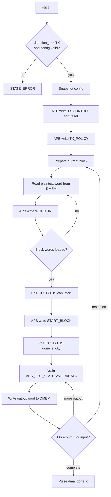

# 11. DMA TX Engine Specification

## 1. Mục đích

`dma_tx_engine` là data-plane engine cho hướng:

- `DMEM plaintext -> TX accelerator -> DMEM ciphertext`

Trong SoC hiện tại, module này nhận config tu `dma_regfile`, chiem `DMEM` port B trong lúc transfer dang chạy, điều khiển `apb_huffman_aes_tx_top` bằng private APB master, và ghi ciphertext tro lại `DMEM`.

Trạng thái kiểm chứng hiện tại:

| Case | Coverage/use |
|---|---|
| `dma_compress_aes_input1/input3/alnum63` | Normal whole-file `COMPRESS_AES` TX phase trong loopback SoC |
| `tx_compress_only_input1/input4_cov` | TX-only `COMPRESS_ONLY` path để do saving trực tiếp |
| `tx_apb_wait_cov` | Private APB wait-state giua DMA TX và TX accelerator |
| `tx_apb_error_cov` | Private APB error path và `last_error_code_o` |
| `dma_bridge_direct_cov` | Defensive config/error branches của DMA/APB path |
| Full coverage regression | Included in `34/34` PASS baseline |

## 1.1 Flow Chart

## 2. Phạm vi of the current code

Phien ban trong repo hiện tại là engine riêng cho direction `TX`:

1. nhận `start_i` tu `dma_regfile`
2. chỉ xu ly khi `direction_i == 2'b01`
3. nhận thêm `compress_only_i` tu `dma_regfile`
4. validate alignment và block size
5. soft-reset TX wrapper
6. lặp trinh `TX_POLICY`
7. chia transfer thanh các block theo `block_size_i`
8. đọc plaintext 32-bit word tu `DMEM`
9. ghi `BLOCK_SIZE`, `WORD_IN`, `START_BLOCK` vao TX APB slave
10. poll `STATUS` để đợi `can_start` và `done_sticky`
11. drain `AES_OUT_STATUS`, `AES_OUT_META`, `AES_OUT_DATA`
12. ghi output 32-bit word ve `DMEM`
13. phat `dma_done_o` hoặc `dma_error_o`

`bytes_done_o` hiện tại đếm số byte output da ghi ve `DMEM`:

- nếu `compress_only_i = 0`: đây là AES output bytes
- nếu `compress_only_i = 1`: đây là compressed transport bytes

## 3. Interface

### 3.1 Control and snapshot config

| Cổng | Hướng | Độ rộng | Định dạng dữ liệu | Ý nghĩa |
|---|---|---:|---|---|
| `clk_i` | in | 1 | `clk` | System clock |
| `rst_i` | in | 1 | `rst` | Active-high reset |
| `start_i` | in | 1 | pulse | Pulse bắt đầu transfer |
| `soft_reset_i` | in | 1 | pulse | Pulse reset engine state |
| `clear_done_i` | in | 1 | pulse | Pulse clear done/debug state |
| `clear_error_i` | in | 1 | pulse | Pulse clear last error |
| `src_addr_i` | in | 32 | byte address | Byte address plaintext source trong `DMEM` |
| `dst_addr_i` | in | 32 | byte address | Byte address ciphertext destination trong `DMEM` |
| `len_bytes_i` | in | 32 | unsigned byte count | Tong plaintext bytes cần xử lý |
| `direction_i` | in | 2 | direction code | Phải là `2'b01` để engine này chạy |
| `compress_only_i` | in | 1 | policy flag | `1`: TX bypass AES, `0`: TX di qua AES |
| `block_size_i` | in | 6 | unsigned byte count | Số byte/block, code hiện tại cho phep `1..32` |

### 3.2 DMEM port B master

| Cổng | Hướng | Độ rộng | Định dạng dữ liệu | Ý nghĩa |
|---|---|---:|---|---|
| `dmem_en_o` | out | 1 | enable flag | Bat truy cap `DMEM` port B |
| `dmem_we_o` | out | 4 | byte write mask | Byte write enable; `4'b1111` khi ghi ciphertext |
| `dmem_addr_o` | out | 32 | byte address | Byte address port B |
| `dmem_wdata_o` | out | 32 | little-endian word | Dữ liệu ghi ve `DMEM` |
| `dmem_rdata_i` | in | 32 | little-endian word | Dữ liệu đọc tu `DMEM` |

### 3.3 Private APB master sang TX

| Cổng | Hướng | Độ rộng | Định dạng dữ liệu | Ý nghĩa |
|---|---|---:|---|---|
| `tx_psel_o` | out | 1 | APB select | APB `PSEL` |
| `tx_penable_o` | out | 1 | APB enable | APB `PENABLE` |
| `tx_pwrite_o` | out | 1 | APB direction | APB `PWRITE` |
| `tx_paddr_o` | out | 32 | byte address | APB `PADDR` |
| `tx_pwdata_o` | out | 32 | little-endian word | APB `PWDATA` |
| `tx_prdata_i` | in | 32 | little-endian word | APB `PRDATA` |
| `tx_pready_i` | in | 1 | handshake | APB `PREADY` |
| `tx_pslverr_i` | in | 1 | error flag | APB `PSLVERR` |

### 3.4 Trạng thái outputs

| Cổng | Hướng | Độ rộng | Định dạng dữ liệu | Ý nghĩa |
|---|---|---:|---|---|
| `dma_busy_o` | out | 1 | busy flag | Engine dang active |
| `dma_done_o` | out | 1 | pulse | Pulse 1 cycle khi transfer xong |
| `dma_error_o` | out | 1 | pulse | Pulse 1 cycle khi transfer lỗi |
| `bytes_done_o` | out | 32 | unsigned byte count | Output bytes da ghi ve `DMEM` |
| `last_error_code_o` | out | 8 | error code | Ma lỗi cuối |
| `engine_state_o` | out | 4 | state nibble | Low nibble của FSM state |

## 4. Accepted config in current code

`dma_tx_engine` chỉ nhận `start_i` nếu:

- `direction_i == 2'b01`
- `len_bytes_i != 0`
- `block_size_i != 0`
- `block_size_i <= 32`
- `src_addr_i[1:0] == 2'b00`
- `dst_addr_i[1:0] == 2'b00`

Nếu sai một trong các điều kiện trên, engine vao `STATE_ERROR` và dat `last_error_code_o = 8'h02`.

## 5. TX-side APB register usage

`dma_tx_engine` dung các offset sau trên `apb_huffman_tx_if`:

| Offset | Thanh ghi | Truy cập | Định dạng dữ liệu | Engine usage |
|---|---|---|---|---|
| `0x00` | `START_BLOCK` | write | control pulse bitfield | Ghi `0x1` cho block cuối, `0x3` khi `continue_frame=1` |
| `0x04` | `BLOCK_SIZE` | write | unsigned byte count | Ghi số byte của block hiện tại |
| `0x08` | `WORD_IN` | write | little-endian 32-bit word | Nạp plaintext 32-bit words |
| `0x0C` | `STATUS` | read | bitfield | Poll `error_sticky`, `done_sticky`, `tx_busy`, `can_start` |
| `0x10` | `CONTROL` | write | pulse bits | Ghi `0x1` để soft reset TX wrapper lúc start transfer |
| `0x18` | `TX_POLICY` | write | policy bits | Ghi bit0 = `compress_only_i` |
| `0x20` | `AES_OUT_DATA` | read | little-endian 32-bit word | Lay ciphertext 32-bit word |
| `0x24` | `AES_OUT_META` | read | bitfield | Lay bit `last` và `compress_only` của head word |
| `0x28` | `AES_OUT_STATUS` | read | bitfield | Poll output FIFO nonempty và AES output error |

`dma_tx_engine` không dùng `0x14` (`DEBUG`) hay `0x2C` (`AES_OUT_DEBUG`) trong logic chính.

## 6. Trạng thái bits the engine actually relies on

### 6.1 `TX STATUS` (`0x0C`)

| Bit | Định dạng dữ liệu | Ý nghĩa |
|---:|---|---|
| 3 | 1-bit live flag | `tx_busy` |
| 4 | 1-bit sticky | `done_sticky` |
| 5 | 1-bit sticky | `tx_core_error_sticky` |
| 7 | 1-bit live flag | `can_start` |

Engine không dua vao `STATUS[1]` hay `STATUS[6]` trong FSM chính.

### 6.2 `AES_OUT_STATUS` (`0x28`)

| Bit | Định dạng dữ liệu | Ý nghĩa |
|---:|---|---|
| 0 | 1-bit live flag | output FIFO nonempty |
| 9 | 1-bit sticky | `aes_out_error_sticky` |
| 10 | 1-bit policy flag | mirror của `compress_only` |

`AES_OUT_META[0]` được đọc và latch vao `tx_meta_r`, nhưng code hiện tại không dùng bit này để chot complete; completion của block cuối dang dua vao heuristic empty-and-idle ben dưới. `AES_OUT_META[1]` là mirror của `compress_only` cho future consumer.

## 7. FSM in the current code

| State | Value | Ý nghĩa |
|---|---:|---|
| `STATE_IDLE` | 0 | Đợi `start_i` cho mode TX |
| `STATE_CAPTURE_CFG` | 1 | Snapshot config và reset counters |
| `STATE_RESET_TX` | 2 | Sau APB write `CONTROL=1` |
| `STATE_PREP_BLOCK` | 3 | Chot `current_block_bytes` và so words can nạp |
| `STATE_LOAD_WORD_CHECK` | 4 | Kiểm trả da nạp het words của block chưa |
| `STATE_DMEM_READ_ISSUE` | 5 | Phat lenh đọc 1 word plaintext tu `DMEM` |
| `STATE_DMEM_READ_CAPTURE` | 6 | Latch `dmem_rdata_i`, tăng `src_ptr`, write `WORD_IN` |
| `STATE_CHECK_CAN_START` | 7 | Bắt đầu poll `TX STATUS` |
| `STATE_CHECK_CAN_START_EVAL` | 8 | Đợi `can_start=1`, nếu lỗi thì abort |
| `STATE_WAIT_BLOCK_DONE` | 9 | Poll `TX STATUS` sau `START_BLOCK` |
| `STATE_WAIT_BLOCK_DONE_EVAL` | 10 | Đợi `done_sticky=1`, cập nhật `bytes_done_o` |
| `STATE_DRAIN_STATUS` | 11 | Poll `AES_OUT_STATUS` |
| `STATE_DRAIN_STATUS_EVAL` | 12 | Nếu FIFO nonempty thì đọc output; nếu block cuối và empty thì vao final-drain check |
| `STATE_DRAIN_META` | 13 | Read `AES_OUT_META` |
| `STATE_DRAIN_META_EVAL` | 14 | Latch `tx_meta_r` |
| `STATE_DRAIN_DATA` | 15 | Read `AES_OUT_DATA` |
| `STATE_DRAIN_DATA_EVAL` | 16 | Latch output word |
| `STATE_DMEM_WRITE_ISSUE` | 17 | Ghi ciphertext word ve `DMEM`, tăng `dst_ptr` |
| `STATE_FINAL_IDLE_CHECK` | 18 | Poll lại `TX STATUS` o tail của transfer |
| `STATE_FINAL_IDLE_EVAL` | 19 | Nếu `tx_busy==0` on dinh thì complete |
| `STATE_APB_SETUP` | 20 | APB setup phase |
| `STATE_APB_ACCESS` | 21 | APB access phase, đợi `PREADY` |
| `STATE_COMPLETE` | 22 | Pulse `dma_done_o` |
| `STATE_ERROR` | 23 | Pulse `dma_error_o` |

## 8. Block handling and `START_BLOCK` policy

Mới transfer được cat thanh nhieu block:

- `current_block_bytes_r = min(bytes_remaining_r, block_size_i)`
- `words_remaining_r = ceil(current_block_bytes_r / 4)`

Sau khi nạp đủ word cho block hiện tại:

- engine đợi `STATUS[7] = can_start`
- nếu đây không phải block cuối, ghi `START_BLOCK = 0x0000_0003`
  - bit0 = `start`
  - bit1 = `continue_frame`
- nếu đây là block cuối, ghi `START_BLOCK = 0x0000_0001`

Dieu này khop với APB TX wrapper: `continue_frame_o <= PWDATA[1]`.

## 9. Completion policy in current code

Completion của `dma_tx_engine` được chia làm 2 lop:

1. Khi `TX STATUS[4] = done_sticky`, engine coi block hiện tại đã được TX core xu ly xong và cập nhật `bytes_remaining_r`.
2. Engine drain output FIFO; mới lần ghi một word output ve `DMEM`, `bytes_done_o += 4`.
3. Nếu đây là block cuối, engine không complete ngay. No tiếp tục:
   - drain `AES_OUT_STATUS/META/DATA` cho toi khi output FIFO rộng
   - poll lại `TX STATUS[3] = tx_busy`
   - nếu `tx_busy == 0` lien tiep `64` lần, engine mới vao `STATE_COMPLETE`

Heuristic tail-idle này được điều khiển bởi:

- `FINAL_EMPTY_POLLS_REQUIRED = 64`

Lý do là output ciphertext có thể ra cham hơn su kien `done_sticky`, dac biet o tail của frame cuối.

## 10. Ownership of DMEM port B in SoC

Trong `rv32_soc_top`:

- khi `tx_dma_busy_w = 1`, `dma_tx_engine` chiem `DMEM` port B
- khi `rx_dma_busy_w = 1`, port B thuoc `dma_rx_engine`
- khi ca hai DMA đều idle, port B trả lại cho `aux_*`

`dma_regfile` chỉ nhận 1 bo status tong hop, nen top dang mux status ve theo `dma_active_dir_r`.

## 11. Error codes used by the current code

| Code | Ý nghĩa |
|---:|---|
| `0x00` | No error |
| `0x01` | Default/unexpected state path |
| `0x02` | Bad alignment / invalid config |
| `0x03` | APB `PSLVERR` tu TX wrapper |
| `0x04` | `TX STATUS[5] = error_sticky` |
| `0x05` | `AES_OUT_STATUS[9] = aes_out_error_sticky` |

## 12. Trạng thái / thanh ghi nội bộ

| Reg / state | Độ rộng | Định dạng dữ liệu | Ý nghĩa |
|---|---:|---|---|
| `state_r` | 5 | FSM state code | Main engine state machine |
| `apb_resume_state_r` | 5 | FSM state code | Return state after APB wait |
| `apb_write_r` | 1 | bool | APB write direction shadow |
| `apb_addr_r` | 32 | byte address | APB address shadow |
| `apb_wdata_r` | 32 | little-endian word | APB write-data shadow |
| `apb_rdata_r` | 32 | little-endian word | APB read-data shadow |
| `src_ptr_r` | 32 | byte address | Current source pointer |
| `dst_ptr_r` | 32 | byte address | Current destination pointer |
| `src_base_r` | 32 | byte address | Base source address |
| `dst_base_r` | 32 | byte address | Base destination address |
| `len_bytes_r` | 32 | unsigned byte count | Total transfer length |
| `bytes_remaining_r` | 32 | unsigned byte count | Remaining bytes to transfer |
| `cfg_block_size_r` | 6 | unsigned byte count | Configured block size |
| `current_block_bytes_r` | 32 | unsigned byte count | Current block payload size |
| `words_remaining_r` | 4 | unsigned word count | Remaining 32-bit input words in block |
| `current_block_continue_r` | 1 | bool | Current block continues the frame |
| `final_drain_r` | 1 | bool | Tail drain policy active |
| `drain_during_block_r` | 1 | bool | Drain output during block processing |
| `whole_file_r` | 1 | bool | Whole-file mode enabled |
| `count_phase_r` | 1 | bool | Whole-file count/build phase |
| `compress_only_r` | 1 | policy flag | Compress-only policy mirror |
| `final_empty_polls_r` | 7 | unsigned poll count | Tail idle poll counter |
| `output_word_r` | 32 | little-endian word | Output ciphertext word shadow |
| `tx_meta_r` | 32 | bitfield | Output metadata shadow |

## 13. Important limitation of the current TX contract

`dma_tx_engine` da phan biet được `COMPRESS_AES` và `COMPRESS_ONLY`, nhưng no vẫn chưa xuất:

- so transport words da ghi ve `DMEM`
- final `dst_ptr`
- RX-side policy metadata consume

Dieu này có nghia:

- TX-side user policy da có
- nhưng loopback đối xứng cho `COMPRESS_ONLY` chưa được hoàn tất o RX
