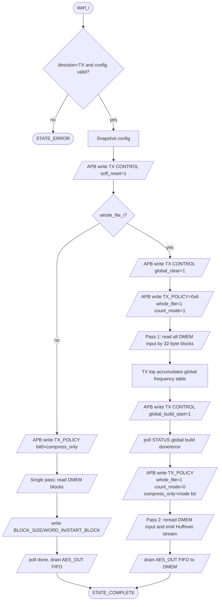

# 11. DMA TX Engine Specification

## 1. Purpose

`dma_tx_engine` is the TX-side data mover:

```text
DMEM plaintext -> apb_huffman_aes_tx_top -> DMEM ciphertext/transport
```

It does not implement Huffman or AES itself. It owns `DMEM` Port B while TX is
busy, acts as a private APB master toward the TX accelerator, and reports
`busy/done/error/bytes_done` back to `dma_regfile`.

Current verification status:

| Case | Coverage/use |
|---|---|
| `dma_compress_aes_input1/input3/alnum63` | Whole-file `COMPRESS_AES` TX phase inside full loopback |
| `tx_compress_only_input1/input4_cov` | Whole-file `COMPRESS_ONLY` TX-only saving benchmark |
| `tx_apb_wait_cov` | Private APB wait-state between TX DMA and TX accelerator |
| `tx_apb_error_cov` | Private APB error path and `last_error_code_o` |
| `dma_bridge_direct_cov` | Defensive DMA/APB/config branches |
| Historical full coverage regression | Included in `34/34` PASS baseline before secure-storage API refactor |

## 1.1 Current TX Flow Chart



## 2. Interface

### 2.1 Control and config

| Port | Dir | Width | Meaning |
|---|---|---:|---|
| `clk_i` | in | 1 | System clock |
| `rst_i` | in | 1 | Active-high reset |
| `start_i` | in | 1 | One-cycle start pulse from `dma_regfile` |
| `soft_reset_i` | in | 1 | Reset this engine state |
| `clear_done_i` | in | 1 | Consumed only in lint-safe reduction |
| `clear_error_i` | in | 1 | Clears `last_error_code_o` |
| `src_addr_i` | in | 32 | Plaintext source byte address in DMEM |
| `dst_addr_i` | in | 32 | Output destination byte address in DMEM |
| `len_bytes_i` | in | 32 | Plaintext input length |
| `direction_i` | in | 2 | Must be `2'b01` |
| `compress_only_i` | in | 1 | `1`: bypass AES, `0`: AES-CBC encrypt |
| `whole_file_i` | in | 1 | `1`: two-pass whole-file Huffman table |
| `block_size_i` | in | 6 | Block chunk size, valid `1..32`, normally `32` |

### 2.2 DMEM Port B master

| Port | Dir | Width | Meaning |
|---|---|---:|---|
| `dmem_en_o` | out | 1 | Asserted for read issue or write issue |
| `dmem_we_o` | out | 4 | `4'b1111` when writing output words |
| `dmem_addr_o` | out | 32 | Read source or write destination byte address |
| `dmem_wdata_o` | out | 32 | Output word written to DMEM |
| `dmem_rdata_i` | in | 32 | Plaintext word read from DMEM |

### 2.3 Private APB master to TX

| Port | Dir | Width | Meaning |
|---|---|---:|---|
| `tx_psel_o` | out | 1 | APB `PSEL` |
| `tx_penable_o` | out | 1 | APB `PENABLE` |
| `tx_pwrite_o` | out | 1 | APB `PWRITE` |
| `tx_paddr_o` | out | 32 | TX local APB address |
| `tx_pwdata_o` | out | 32 | TX APB write data |
| `tx_prdata_i` | in | 32 | TX APB read data |
| `tx_pready_i` | in | 1 | TX APB ready; DMA waits while low |
| `tx_pslverr_i` | in | 1 | TX APB slave error |

### 2.4 Status outputs

| Port | Dir | Width | Meaning |
|---|---|---:|---|
| `dma_busy_o` | out | 1 | Engine state is not `STATE_IDLE` |
| `dma_done_o` | out | 1 | One-cycle completion pulse |
| `dma_error_o` | out | 1 | One-cycle error pulse |
| `bytes_done_o` | out | 32 | Output bytes written to DMEM |
| `last_error_code_o` | out | 8 | Last error code |
| `engine_state_o` | out | 4 | Low nibble of current FSM state |

`engine_state_o` intentionally exposes only `state_r[3:0]`. Some current FSM
states are above `15`, so this field is debug-oriented, not a unique full state
ID.

## 3. Accepted Config

TX starts only when:

- `direction_i == 2'b01`
- `len_bytes_i != 0`
- `block_size_i` is in `1..32`
- `src_addr_i` and `dst_addr_i` are 4-byte aligned

Invalid config raises `dma_error_o` and sets `last_error_code_o = 8'h02`.

## 4. TX APB Register Usage

`dma_tx_engine` uses the following registers in `apb_huffman_tx_if`:

| Offset | Register | Access | Engine usage |
|---:|---|---|---|
| `0x00` | `START_BLOCK` | W | bit0 starts block; bit1 marks `continue_frame` |
| `0x04` | `BLOCK_SIZE` | W | current block byte count |
| `0x08` | `WORD_IN` | W | one 32-bit plaintext word |
| `0x0C` | `STATUS` | R | poll `can_start`, block done, global build status, errors |
| `0x10` | `CONTROL` | W | soft reset, global clear, global build start |
| `0x18` | `TX_POLICY` | W | bit0 `compress_only`, bit1 `whole_file`, bit2 `count_mode` |
| `0x20` | `AES_OUT_DATA` | R | one output word |
| `0x24` | `AES_OUT_META` | R | output metadata; latched for debug |
| `0x28` | `AES_OUT_STATUS` | R | output FIFO nonempty/error status |

The engine does not use `DEBUG` or `AES_OUT_DEBUG` in normal logic.

## 5. TX Status Bits Used By DMA

### 5.1 `STATUS` at `0x0C`

| Bit | Meaning | Engine use |
|---:|---|---|
| `3` | `tx_busy` | final idle check |
| `4` | `done_sticky` | current block/count pass done |
| `5` | `error_sticky` | abort with `ERR_TX_STATUS` |
| `7` | `can_start` | safe to write `START_BLOCK` |
| `8` | `global_table_valid` | whole-file build success indication |
| `10` | `global_build_done` | whole-file build success indication |
| `11` | `global_build_error` | abort with `ERR_TX_GLOBAL_BUILD` |

### 5.2 `AES_OUT_STATUS` at `0x28`

| Bit | Meaning | Engine use |
|---:|---|---|
| `0` | output FIFO nonempty | read `AES_OUT_META/DATA` |
| `9` | AES/output error sticky | abort with `ERR_TX_AES_OUT` |
| `10` | `compress_only` mirror | debug/coverage |
| `11` | `whole_file` mirror | debug/coverage |

## 6. FSM States

Current RTL state values:

| State | Value | Meaning |
|---|---:|---|
| `STATE_IDLE` | 0 | Wait for valid TX start |
| `STATE_CAPTURE_CFG` | 1 | Snapshot config and reset counters |
| `STATE_RESET_TX` | 2 | After TX wrapper soft reset |
| `STATE_PREP_BLOCK` | 3 | Compute current chunk length and write `BLOCK_SIZE` |
| `STATE_LOAD_WORD_CHECK` | 4 | Check whether all words for this block were loaded |
| `STATE_DMEM_READ_ISSUE` | 5 | Issue DMEM read |
| `STATE_DMEM_READ_WAIT` | 6 | Wait one sync DMEM cycle |
| `STATE_DMEM_READ_CAPTURE` | 7 | Capture read word and write TX `WORD_IN` |
| `STATE_CHECK_CAN_START` | 8 | Read TX `STATUS` |
| `STATE_CHECK_CAN_START_EVAL` | 9 | Wait for `can_start` or error |
| `STATE_WAIT_BLOCK_DONE` | 10 | Read TX `STATUS` after `START_BLOCK` |
| `STATE_WAIT_BLOCK_DONE_EVAL` | 11 | Process done/error for current block |
| `STATE_DRAIN_STATUS` | 12 | Read `AES_OUT_STATUS` |
| `STATE_DRAIN_STATUS_EVAL` | 13 | Decide drain/next/final |
| `STATE_DRAIN_META` | 14 | Read `AES_OUT_META` |
| `STATE_DRAIN_META_EVAL` | 15 | Latch output meta |
| `STATE_DRAIN_DATA` | 16 | Read `AES_OUT_DATA` |
| `STATE_DRAIN_DATA_EVAL` | 17 | Latch output word |
| `STATE_DMEM_WRITE_ISSUE` | 18 | Write one output word to DMEM |
| `STATE_FINAL_IDLE_CHECK` | 19 | Poll TX status at tail |
| `STATE_FINAL_IDLE_EVAL` | 20 | Require 64 empty/idle polls before complete |
| `STATE_APB_SETUP` | 21 | Private APB setup phase |
| `STATE_APB_ACCESS` | 22 | Private APB access phase, wait for `PREADY` |
| `STATE_COMPLETE` | 23 | Pulse `dma_done_o` |
| `STATE_ERROR` | 24 | Pulse `dma_error_o` |
| `STATE_GLOBAL_CLEAR` | 25 | Whole-file table clear command complete |
| `STATE_SET_COUNT_POLICY` | 26 | Enter whole-file count pass |
| `STATE_START_GLOBAL_BUILD` | 27 | Write global build start command |
| `STATE_WAIT_GLOBAL_BUILD` | 28 | Read TX status during table build |
| `STATE_WAIT_GLOBAL_BUILD_EVAL` | 29 | Wait for global table valid/build done |
| `STATE_SET_EMIT_POLICY` | 30 | Reset pointers and enter whole-file emit pass |

## 7. Whole-File Mode Contract

When `whole_file_i = 1`, TX DMA reads the source twice:

1. Count pass:
   - write `CONTROL.global_clear = 1` (`0x8`)
   - write `TX_POLICY = 0x6` (`whole_file=1`, `count_mode=1`)
   - feed all input chunks to TX
   - no output is drained in this pass
2. Build pass:
   - write `CONTROL.global_build_start = 1` (`0x10`)
   - poll `STATUS[8]` or `STATUS[10]`
   - abort on `STATUS[11]`
3. Emit pass:
   - write `TX_POLICY = 0x2 | compress_only_i`
   - reset `src_ptr`, `dst_ptr`, `bytes_remaining`, and `bytes_done`
   - feed the same input chunks again
   - drain output FIFO to DMEM

This is why `BLOCK_CFG=32` is still used: it is the chunk size for reading and
feeding the file, not the Huffman codebook scope. The codebook scope is the
whole file.

## 8. Output and Completion Policy

Every output word drained from `AES_OUT_DATA` is written to DMEM with
`dmem_we_o = 4'b1111`, and `bytes_done_o += 4`.

Completion requires:

1. final block emitted,
2. output FIFO empty,
3. TX `tx_busy` low for `FINAL_EMPTY_POLLS_REQUIRED = 64` status polls.

The tail-idle requirement prevents completing before late AES/CBC output words
have reached the output FIFO.

## 9. Error Codes

| Code | Meaning |
|---:|---|
| `0x00` | No error |
| `0x01` | Default/unexpected state path |
| `0x02` | Bad direction, zero length, bad block size, or unaligned address |
| `0x03` | TX APB returned `PSLVERR` |
| `0x04` | TX `STATUS[5]` error sticky |
| `0x05` | `AES_OUT_STATUS[9]` output error sticky |
| `0x06` | Whole-file global Huffman build error |

## 10. Integration Notes

In `rv32_soc_top`:

- TX DMA owns DMEM Port B while `tx_dma_busy_w = 1`.
- RX DMA is disabled in TX-only FPGA builds through `FPGA_TX_ONLY`.
- TX accelerator is disabled in RX-only FPGA builds through `FPGA_RX_ONLY`.
- `dma_regfile.CIPHERTEXT_BYTES_PRODUCED` mirrors `tx_dma_bytes_done_w`, so
  software can feed that value into RX `LEN_BYTES`.

Current limitation:

- `COMPRESS_ONLY` is the TX-only benchmark path. The main RX loopback path is
  still `COMPRESS_AES` with AES-CBC, not a symmetric RX AES-bypass storage flow.
