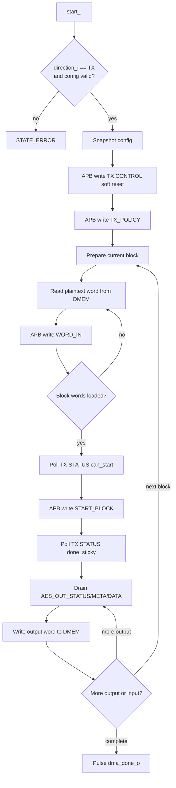

# 11. DMA TX Engine Specification

## 1. Purpose

`dma_tx_engine` la data-plane engine cho huong:

- `DMEM plaintext -> TX accelerator -> DMEM ciphertext`

Trong SoC hien tai, module nay nhan config tu `dma_regfile`, chiem `DMEM` port B trong luc transfer dang chay, dieu khien `apb_huffman_aes_tx_top` bang private APB master, va ghi ciphertext tro lai `DMEM`.

Current verification status:

| Case | Coverage/use |
|---|---|
| `dma_compress_aes_input1/input3/alnum63` | Normal whole-file `COMPRESS_AES` TX phase trong loopback SoC |
| `tx_compress_only_input1/input4_cov` | TX-only `COMPRESS_ONLY` path de do saving truc tiep |
| `tx_apb_wait_cov` | Private APB wait-state giua DMA TX va TX accelerator |
| `tx_apb_error_cov` | Private APB error path va `last_error_code_o` |
| `dma_bridge_direct_cov` | Defensive config/error branches cua DMA/APB path |
| Full coverage regression | Included in `34/34` PASS baseline |

## 1.1 Flow Chart

## 2. Scope of the current code

Phien ban trong repo hien tai la engine rieng cho direction `TX`:

1. nhan `start_i` tu `dma_regfile`
2. chi xu ly khi `direction_i == 2'b01`
3. nhan them `compress_only_i` tu `dma_regfile`
4. validate alignment va block size
5. soft-reset TX wrapper
6. lap trinh `TX_POLICY`
7. chia transfer thanh cac block theo `block_size_i`
8. doc plaintext 32-bit word tu `DMEM`
9. ghi `BLOCK_SIZE`, `WORD_IN`, `START_BLOCK` vao TX APB slave
10. poll `STATUS` de doi `can_start` va `done_sticky`
11. drain `AES_OUT_STATUS`, `AES_OUT_META`, `AES_OUT_DATA`
12. ghi output 32-bit word ve `DMEM`
13. phat `dma_done_o` hoac `dma_error_o`

`bytes_done_o` hien tai dem so byte output da ghi ve `DMEM`:

- neu `compress_only_i = 0`: day la AES output bytes
- neu `compress_only_i = 1`: day la compressed transport bytes

## 3. Interface

### 3.1 Control and snapshot config

| Port | Dir | Width | Meaning |
|---|---|---:|---|
| `clk_i` | in | 1 | System clock |
| `rst_i` | in | 1 | Active-high reset |
| `start_i` | in | 1 | Pulse bat dau transfer |
| `soft_reset_i` | in | 1 | Pulse reset engine state |
| `clear_done_i` | in | 1 | Pulse clear done/debug state |
| `clear_error_i` | in | 1 | Pulse clear last error |
| `src_addr_i` | in | 32 | Byte address plaintext source trong `DMEM` |
| `dst_addr_i` | in | 32 | Byte address ciphertext destination trong `DMEM` |
| `len_bytes_i` | in | 32 | Tong plaintext bytes can xu ly |
| `direction_i` | in | 2 | Phai la `2'b01` de engine nay chay |
| `compress_only_i` | in | 1 | `1`: TX bypass AES, `0`: TX di qua AES |
| `block_size_i` | in | 6 | So byte/block, code hien tai cho phep `1..32` |

### 3.2 DMEM port B master

| Port | Dir | Width | Meaning |
|---|---|---:|---|
| `dmem_en_o` | out | 1 | Bat truy cap `DMEM` port B |
| `dmem_we_o` | out | 4 | Byte write enable; `4'b1111` khi ghi ciphertext |
| `dmem_addr_o` | out | 32 | Byte address port B |
| `dmem_wdata_o` | out | 32 | Du lieu ghi ve `DMEM` |
| `dmem_rdata_i` | in | 32 | Du lieu doc tu `DMEM` |

### 3.3 Private APB master sang TX

| Port | Dir | Width | Meaning |
|---|---|---:|---|
| `tx_psel_o` | out | 1 | APB `PSEL` |
| `tx_penable_o` | out | 1 | APB `PENABLE` |
| `tx_pwrite_o` | out | 1 | APB `PWRITE` |
| `tx_paddr_o` | out | 32 | APB `PADDR` |
| `tx_pwdata_o` | out | 32 | APB `PWDATA` |
| `tx_prdata_i` | in | 32 | APB `PRDATA` |
| `tx_pready_i` | in | 1 | APB `PREADY` |
| `tx_pslverr_i` | in | 1 | APB `PSLVERR` |

### 3.4 Status outputs

| Port | Dir | Width | Meaning |
|---|---|---:|---|
| `dma_busy_o` | out | 1 | Engine dang active |
| `dma_done_o` | out | 1 | Pulse 1 cycle khi transfer xong |
| `dma_error_o` | out | 1 | Pulse 1 cycle khi transfer loi |
| `bytes_done_o` | out | 32 | Output bytes da ghi ve `DMEM` |
| `last_error_code_o` | out | 8 | Ma loi cuoi |
| `engine_state_o` | out | 4 | Low nibble cua FSM state |

## 4. Accepted config in current code

`dma_tx_engine` chi nhan `start_i` neu:

- `direction_i == 2'b01`
- `len_bytes_i != 0`
- `block_size_i != 0`
- `block_size_i <= 32`
- `src_addr_i[1:0] == 2'b00`
- `dst_addr_i[1:0] == 2'b00`

Neu sai mot trong cac dieu kien tren, engine vao `STATE_ERROR` va dat `last_error_code_o = 8'h02`.

## 5. TX-side APB register usage

`dma_tx_engine` dung cac offset sau tren `apb_huffman_tx_if`:

| Offset | Register | Access | Engine usage |
|---|---|---|---|
| `0x00` | `START_BLOCK` | write | Ghi `0x1` cho block cuoi, `0x3` khi `continue_frame=1` |
| `0x04` | `BLOCK_SIZE` | write | Ghi so byte cua block hien tai |
| `0x08` | `WORD_IN` | write | Nap plaintext 32-bit words |
| `0x0C` | `STATUS` | read | Poll `error_sticky`, `done_sticky`, `tx_busy`, `can_start` |
| `0x10` | `CONTROL` | write | Ghi `0x1` de soft reset TX wrapper luc start transfer |
| `0x18` | `TX_POLICY` | write | Ghi bit0 = `compress_only_i` |
| `0x20` | `AES_OUT_DATA` | read | Lay ciphertext 32-bit word |
| `0x24` | `AES_OUT_META` | read | Lay bit `last` va `compress_only` cua head word |
| `0x28` | `AES_OUT_STATUS` | read | Poll output FIFO nonempty va AES output error |

`dma_tx_engine` khong dung `0x14` (`DEBUG`) hay `0x2C` (`AES_OUT_DEBUG`) trong logic chinh.

## 6. Status bits the engine actually relies on

### 6.1 `TX STATUS` (`0x0C`)

Engine dang dung:

- `STATUS[3]`: `tx_busy`
- `STATUS[4]`: `done_sticky`
- `STATUS[5]`: `tx_core_error_sticky`
- `STATUS[7]`: `can_start`

Engine khong dua vao `STATUS[1]` hay `STATUS[6]` trong FSM chinh.

### 6.2 `AES_OUT_STATUS` (`0x28`)

Engine dang dung:

- `STATUS[0]`: output FIFO nonempty
- `STATUS[9]`: `aes_out_error_sticky`
- `STATUS[10]`: mirror cua `compress_only`

`AES_OUT_META[0]` duoc doc va latch vao `tx_meta_r`, nhung code hien tai khong dung bit nay de chot complete; completion cua block cuoi dang dua vao heuristic empty-and-idle ben duoi. `AES_OUT_META[1]` la mirror cua `compress_only` cho future consumer.

## 7. FSM in the current code

| State | Value | Meaning |
|---|---:|---|
| `STATE_IDLE` | 0 | Doi `start_i` cho mode TX |
| `STATE_CAPTURE_CFG` | 1 | Snapshot config va reset counters |
| `STATE_RESET_TX` | 2 | Sau APB write `CONTROL=1` |
| `STATE_PREP_BLOCK` | 3 | Chot `current_block_bytes` va so words can nap |
| `STATE_LOAD_WORD_CHECK` | 4 | Kiem tra da nap het words cua block chua |
| `STATE_DMEM_READ_ISSUE` | 5 | Phat lenh doc 1 word plaintext tu `DMEM` |
| `STATE_DMEM_READ_CAPTURE` | 6 | Latch `dmem_rdata_i`, tang `src_ptr`, write `WORD_IN` |
| `STATE_CHECK_CAN_START` | 7 | Bat dau poll `TX STATUS` |
| `STATE_CHECK_CAN_START_EVAL` | 8 | Doi `can_start=1`, neu loi thi abort |
| `STATE_WAIT_BLOCK_DONE` | 9 | Poll `TX STATUS` sau `START_BLOCK` |
| `STATE_WAIT_BLOCK_DONE_EVAL` | 10 | Doi `done_sticky=1`, cap nhat `bytes_done_o` |
| `STATE_DRAIN_STATUS` | 11 | Poll `AES_OUT_STATUS` |
| `STATE_DRAIN_STATUS_EVAL` | 12 | Neu FIFO nonempty thi doc output; neu block cuoi va empty thi vao final-drain check |
| `STATE_DRAIN_META` | 13 | Read `AES_OUT_META` |
| `STATE_DRAIN_META_EVAL` | 14 | Latch `tx_meta_r` |
| `STATE_DRAIN_DATA` | 15 | Read `AES_OUT_DATA` |
| `STATE_DRAIN_DATA_EVAL` | 16 | Latch output word |
| `STATE_DMEM_WRITE_ISSUE` | 17 | Ghi ciphertext word ve `DMEM`, tang `dst_ptr` |
| `STATE_FINAL_IDLE_CHECK` | 18 | Poll lai `TX STATUS` o tail cua transfer |
| `STATE_FINAL_IDLE_EVAL` | 19 | Neu `tx_busy==0` on dinh thi complete |
| `STATE_APB_SETUP` | 20 | APB setup phase |
| `STATE_APB_ACCESS` | 21 | APB access phase, doi `PREADY` |
| `STATE_COMPLETE` | 22 | Pulse `dma_done_o` |
| `STATE_ERROR` | 23 | Pulse `dma_error_o` |

## 8. Block handling and `START_BLOCK` policy

Moi transfer duoc cat thanh nhieu block:

- `current_block_bytes_r = min(bytes_remaining_r, block_size_i)`
- `words_remaining_r = ceil(current_block_bytes_r / 4)`

Sau khi nap du word cho block hien tai:

- engine doi `STATUS[7] = can_start`
- neu day khong phai block cuoi, ghi `START_BLOCK = 0x0000_0003`
  - bit0 = `start`
  - bit1 = `continue_frame`
- neu day la block cuoi, ghi `START_BLOCK = 0x0000_0001`

Dieu nay khop voi APB TX wrapper: `continue_frame_o <= PWDATA[1]`.

## 9. Completion policy in current code

Completion cua `dma_tx_engine` duoc chia lam 2 lop:

1. Khi `TX STATUS[4] = done_sticky`, engine coi block hien tai da duoc TX core xu ly xong va cap nhat `bytes_remaining_r`.
2. Engine drain output FIFO; moi lan ghi mot word output ve `DMEM`, `bytes_done_o += 4`.
3. Neu day la block cuoi, engine khong complete ngay. No tiep tuc:
   - drain `AES_OUT_STATUS/META/DATA` cho toi khi output FIFO rong
   - poll lai `TX STATUS[3] = tx_busy`
   - neu `tx_busy == 0` lien tiep `64` lan, engine moi vao `STATE_COMPLETE`

Heuristic tail-idle nay duoc dieu khien boi:

- `FINAL_EMPTY_POLLS_REQUIRED = 64`

Ly do la output ciphertext co the ra cham hon su kien `done_sticky`, dac biet o tail cua frame cuoi.

## 10. Ownership of DMEM port B in SoC

Trong `rv32_soc_top`:

- khi `tx_dma_busy_w = 1`, `dma_tx_engine` chiem `DMEM` port B
- khi `rx_dma_busy_w = 1`, port B thuoc `dma_rx_engine`
- khi ca hai DMA deu idle, port B tra lai cho `aux_*`

`dma_regfile` chi nhan 1 bo status tong hop, nen top dang mux status ve theo `dma_active_dir_r`.

## 11. Error codes used by the current code

| Code | Meaning |
|---:|---|
| `0x00` | No error |
| `0x01` | Default/unexpected state path |
| `0x02` | Bad alignment / invalid config |
| `0x03` | APB `PSLVERR` tu TX wrapper |
| `0x04` | `TX STATUS[5] = error_sticky` |
| `0x05` | `AES_OUT_STATUS[9] = aes_out_error_sticky` |

## 12. Important limitation of the current TX contract

`dma_tx_engine` da phan biet duoc `COMPRESS_AES` va `COMPRESS_ONLY`, nhung no van chua xuat:

- so transport words da ghi ve `DMEM`
- final `dst_ptr`
- RX-side policy metadata consume

Dieu nay co nghia:

- TX-side user policy da co
- nhung loopback doi xung cho `COMPRESS_ONLY` chua duoc hoan tat o RX
