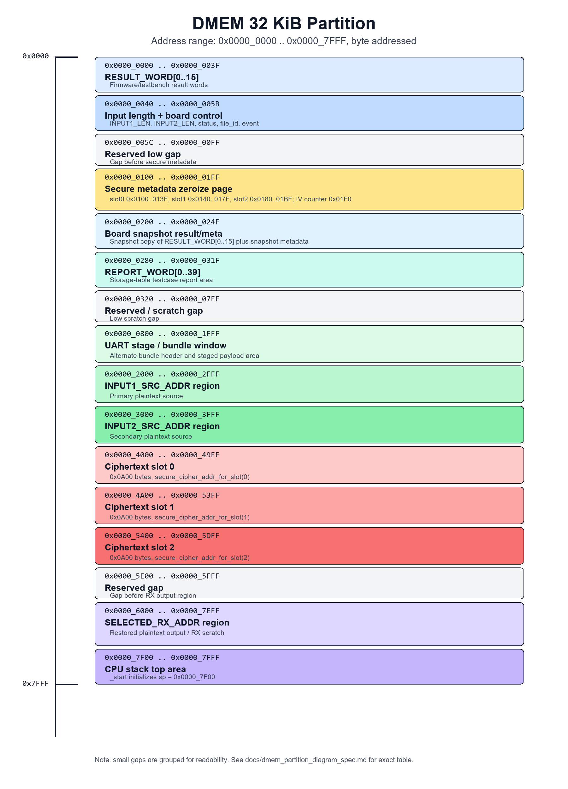
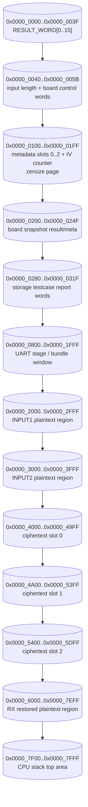

# DMEM Partition Diagram Specification

Status: report-ready DMEM partition view for the current secure-storage
firmware.

## 1. Purpose

Tai lieu nay gom bang va hinh phan vung DMEM 32 KiB hien tai. Muc dich la co
mot hinh ro rang de dua vao bao cao/thuyet trinh khi giai thich firmware,
metadata, DMA source/destination, ciphertext slots, va RX output.

Primary source files:

| Area | Source |
|---|---|
| Firmware constants | `testcase/secure_storage_fw.h` |
| Storage testcase addresses | `testcase/test_mmio_dma_storage_table.c` |
| Board snapshot addresses | `rtl/fpga_button_board_ctrl.v` |
| Memory contract | `docs/memory_map_dma_software_contract.md` |

## 2. DMEM Partition Table

DMEM is byte-addressed and spans `0x0000_0000..0x0000_7FFF` (`32 KiB`).

| Range | Size | Name / owner | Meaning |
|---:|---:|---|---|
| `0x0000_0000..0x0000_003F` | `0x40` | `RESULT_WORD[0..15]` | Firmware result/debug words for testbench or UART readback |
| `0x0000_0040..0x0000_005B` | word fields | Input length + board control | `INPUT1_LEN`, `INPUT2_LEN`, board status, selected `file_id`, event counter |
| `0x0000_005C..0x0000_00FF` | `0xA4` | Reserved low area | Gap before secure metadata |
| `0x0000_0100..0x0000_013F` | `0x40` | metadata slot 0 | Secure-storage metadata record 0 |
| `0x0000_0140..0x0000_017F` | `0x40` | metadata slot 1 | Secure-storage metadata record 1 |
| `0x0000_0180..0x0000_01BF` | `0x40` | metadata slot 2 | Secure-storage metadata record 2 |
| `0x0000_01C0..0x0000_01EF` | `0x30` | Reserved zeroize page | Cleared with metadata page by board zeroize |
| `0x0000_01F0..0x0000_01F3` | `0x04` | `SECURE_IV_COUNTER_ADDR` | Firmware IV/version counter |
| `0x0000_01F4..0x0000_01FF` | `0x0C` | Reserved zeroize page | Cleared with metadata page by board zeroize |
| `0x0000_0200..0x0000_023F` | `0x40` | `BOARD_SNAPSHOT_ADDR` | Optional copy of `RESULT_WORD[0..15]` after snapshot button |
| `0x0000_0240..0x0000_024F` | `0x10` | `BOARD_SNAPSHOT_META` | Snapshot magic, file ID, count, status |
| `0x0000_0250..0x0000_027F` | `0x30` | Reserved low area | Gap before testcase report |
| `0x0000_0280..0x0000_031F` | `0xA0` | `REPORT_BASE_ADDR` | Storage testcase report words `0..39` |
| `0x0000_0320..0x0000_07FF` | `0x4E0` | Reserved / scratch | Low scratch gap |
| `0x0000_0800..0x0000_1FFF` | `0x1800` | UART stage / bundle window | Bundle header and staged payload area |
| `0x0000_2000..0x0000_2FFF` | `0x1000` | `INPUT1_SRC_ADDR` region | Primary plaintext source region |
| `0x0000_3000..0x0000_3FFF` | `0x1000` | `INPUT2_SRC_ADDR` region | Secondary plaintext source region |
| `0x0000_4000..0x0000_49FF` | `0x0A00` | ciphertext slot 0 | Secure write output for metadata slot 0 |
| `0x0000_4A00..0x0000_53FF` | `0x0A00` | ciphertext slot 1 | Secure write output for metadata slot 1 |
| `0x0000_5400..0x0000_5DFF` | `0x0A00` | ciphertext slot 2 | Secure write output for metadata slot 2 |
| `0x0000_5E00..0x0000_5FFF` | `0x0200` | Reserved gap | Gap between ciphertext slots and RX output |
| `0x0000_6000..0x0000_7EFF` | `0x1F00` | `SELECTED_RX_ADDR` region | Restored plaintext destination / RX output scratch |
| `0x0000_7F00..0x0000_7FFF` | `0x0100` | CPU stack top area | `_start` initializes `sp = 0x0000_7F00` |

Notes:

- `secure_cipher_addr_for_slot(slot)` computes
  `0x0000_4000 + slot * 0x0A00`.
- The UART bundle stage window starts at `0x0000_0800`. Legacy fixed-source
  tests still use `0x2000` and `0x3000` as plaintext base addresses.
- Board zeroize clears `0x0000_0100..0x0000_01FF`, covering metadata slots and
  the IV counter.

## 3. DMEM Partition Figure

Use this PNG directly in the report:

Vector version for editing or high-resolution export:

- [assets/dmem_partition_diagram.svg](./assets/dmem_partition_diagram.svg)

The same layout as a Mermaid flowchart:

