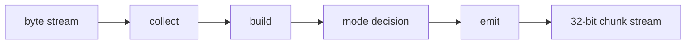

# Dynamic Huffman Encoder Specification

## 1. Purpose

`dynamic_huffman_encoder` is the central block in the TX path. It receives the normalized byte stream from `huffman_aes_tx_top` and processes it through these phases:

- collect
- build
- mode decision
- emit

This module does not care about MMIO, DMA or AES. It only works with blocks
byte input, frequency table, codebook and bitstream output.

Current verification status:

| Case | Coverage/use |
|---|---|
| `tx_compress_only_input1/input4_cov` | Whole-file dynamic Huffman behavior via SoC TX-only |
| `tx_compress_only_alnum63_cov` | Alnum63 stress within 256-symbol byte alphabet |
| `tx_compress_only_ascii_sweep_cov` | Byte-symbol sweep and mode-decision coverage |
| `tx_encoder_direct_cov` | Direct encoder mode/error/FSM branches |
| `tx_builder_packer_direct_cov` | Huffman builder and packer interaction branches |

## 2. In TX Stack Role

`dynamic_huffman_encoder` is located between:

```text
input adapter
-> dynamic_huffman_encoder
-> bit_packer_128
```

It uses these helper modules:

| Module | Role |
|---|---|
| `control_fsm` | Control phase and sticky state |
| `input_collect_unit` | Low byte capture and frequency counting |
| `block_buffer` | Saves the current block of bytes |
| `frequency_counter` | Count symbol frequency |
| `huffman_builder` | Builds the symbol list, code lengths, and canonical codes |
| `mode_decision_logic` | Select `RAW_FULL`, `RAW_PARTIAL`, `COMPRESSED`, `ONE_SYMBOL` |
| `emit_backend` | Emit header and payload bitstream |
| `header_formatter` | Formats the block header |
| `payload_emitter` | Emit raw bytes or Huffman bits |
| `stream_output_interface` | Output bitstream as 32-bit chunks |

## 3. High-Level Flow



## 4. Contract input

Module receives control and byte stream from adapter:

- `start_block` starts an encoder block
- `whole_file_enable`, `whole_file_emit_table`, `whole_file_table_valid` control whole-file flow
- `byte_in[7:0]` and `byte_valid` carry input byte data
- `block_start` and `block_end` mark the beginning/end of the block
- `stream_ready` is the handshake from the packer/consumer later

Conventions:

- A block is a consecutive stream of bytes
- The valid block size in the current TX flow is `1..32`
- `block_start` must match the first byte
- `block_end` must match the last byte

If the input protocol is invalid, the encoder raises the sticky error flag and stops the transfer.

### 4.1 Interface summary

| Port | Direction | Width | Data format | Meaning |
|---|---|---:|---|---|
| `clk` | in | 1 | `clk` | System clock |
| `rst_n` | in | 1 | `rst_n` | Active-low reset |
| `start_block` | in | 1 | pulse | Start one encoder block |
| `whole_file_enable` | in | 1 | policy flag | Enable whole-file flow |
| `whole_file_emit_table` | in | 1 | bool | Emit global codebook table |
| `whole_file_table_valid` | in | 1 | bool | Global table already valid |
| `external_symbol_count` | in | 9 | unsigned symbol count | Number of symbols in whole-file table |
| `external_symbol_read_addr` | out | 9 | unsigned symbol address | Address into external symbol list |
| `external_symbol_read_data` | in | 8 | symbol byte | External symbol value |
| `external_code_len_read_index` | out | 8 | unsigned symbol index | Index for code-length lookup |
| `external_code_len_read_data` | in | 5 | code length | External code length |
| `external_code_read_index` | out | 8 | unsigned symbol index | Index for code lookup |
| `external_code_read_data` | in | 13 | canonical code word | External code bit pattern |
| `byte_in` | in | 8 | symbol byte | Input byte from TX adapter |
| `byte_valid` | in | 1 | valid flag | Input byte is valid |
| `byte_ready` | out | 1 | ready flag | Encoder can accept next byte |
| `block_start` | in | 1 | pulse | First byte of a block |
| `block_end` | in | 1 | pulse | Last byte of a block |
| `stream_ready` | in | 1 | ready flag | Downstream packer ready |
| `stream_data` | out | 32 | little-endian chunk | Output bit chunk |
| `stream_len` | out | 6 | unsigned bit count | Valid bits in chunk |
| `stream_valid` | out | 1 | valid flag | Chunk is valid |
| `stream_last` | out | 1 | bool | Last chunk of frame |
| `busy` | out | 1 | busy flag | Encoder active |
| `done` | out | 1 | pulse | Encoder completed block |
| `error_flag` | out | 1 | error flag | Encoder error |
| `selected_mode_out` | out | 2 | mode code | Mode selected for block |
| `fsm_state` | out | 4 | state code | Control FSM state debug |

## 5. Phase Sequence

### 5.1 Collect

`input_collect_unit`:

- prepare bytes
- Put bytes into `block_buffer`
- increase count frequencies
- update `symbol_count`

### 5.2 Build

`huffman_builder`:

- take symbol active from frequency table
- calculated due to long code
- create canonical code
- Save code length table for emit and for RX rebuild later

### 5.3 Mode Decision

`mode_decision_logic` select one of 4 modes:

| Mode | Meaning |
|---|---|
| `RAW_FULL` | Emit raw 32 bytes is enough |
| `RAW_PARTIAL` | Emit raw block size that |
| `COMPRESSED` | Emit Huffman header + payload |
| `ONE_SYMBOL` | Emit 1 symbol repeated block size |

Selects not only based on bit count but also based on storage size after
Enter `bit_packer_128`.

### 5.4 Emit

`emit_backend` outputs:

- header bits
- payload bits
- valid bits count
- done pulse

`stream_output_interface` converts the 32-bit chunk bitstream to `bit_packer_128`.

## 6. Contract output

| Port | Direction | Width | Data format | Meaning |
|---|---|---:|---|---|
| `stream_data` | out | 32 | little-endian chunk | Output bit chunk |
| `stream_len` | out | 6 | unsigned bit count | Number of valid bits in `stream_data` |
| `stream_valid` | out | 1 | valid flag | Output chunk is valid |
| `stream_last` | out | 1 | bool | Last chunk of frame |
| `stream_ready` | in | 1 | ready flag | Downstream consumer ready |
| `done` | out | 1 | pulse | Encoder completed the block |
| `busy` | out | 1 | busy flag | Encoder is active |
| `error_flag` | out | 1 | error flag | Encoder error |
| `selected_mode_out` | out | 2 | mode code | Selected mode for this block |
| `fsm_state` | out | 4 | state code | Control FSM state debug |

`stream_len` is the number of valid bits in `stream_data`.

## 7. Mode Encoding

| Bits | Mode |
|---:|---|
| `00` | `RAW_FULL` |
| `01` | `RAW_PARTIAL` |
| `10` | `COMPRESSED` |
| `11` | `ONE_SYMBOL` |

## 8. Mode Bitstream Format

### 8.1 `RAW_FULL`

```text
mode[1:0] = 00
payload   = 32 raw bytes
```

### 8.2 `RAW_PARTIAL`

```text
mode[1:0]       = 01
block_size[5:0] = valid byte count
payload         = block_size raw bytes
```

### 8.3 `COMPRESSED`

```text
mode[1:0]        = 10
block_size[5:0]
symbol_count[8:0]
symbol/code_len table
payload Huffman code bits
```

Each table entry is:

```text
symbol[7:0] + code_len[4:0] = 13 bits
```

### 8.4 `ONE_SYMBOL`

```text
mode[1:0]             = 11
block_size[5:0]
one_symbol_value[7:0]
```

## 9. Current Limits

- Maximum block size: `32 byte`
- maximum symbols in a block: depends on block content and normalization rules
- Current active alphabet: full byte alphabet `0x00..0xFF`
- `huffman_symbol_map.vh` is an identity mapping, so every input byte can be a valid symbol
- whole-file mode can emit codebook up to 256 symbols; `symbol_count=0` means reuse table
- TX FPGA demo uses `CODE_WIDTH=13`; if a pathological input needs longer codes, you need to increase `CODE_WIDTH` or add a long-code fallback

## 10. Current Design Notes

`dynamic_huffman_encoder` has been used in:

- `huffman_aes_tx_top`
- whole-file dynamic Huffman flow

It does not perform AES. AES is located on the wrapper above.

## 11. Internal backend status/output

| Signal | Width | Data format | Meaning |
|---|---:|---|---|
| `ctrl_state_w` | 4 | state code | Control FSM state |
| `ctrl_mode_selected_latched_w` | 2 | mode code | Latched mode from control FSM |
| `ctrl_busy_w` | 1 | busy flag | Encoder busy |
| `ctrl_done_w` | 1 | pulse | Encoder done |
| `ctrl_error_flag_w` | 1 | error flag | Encoder error |
| `collect_busy_w` | 1 | busy flag | Input collect unit busy |
| `collect_done_w` | 1 | pulse | Input collect unit done |
| `collect_protocol_error_w` | 1 | error flag | Input protocol error |
| `collect_overflow_error_w` | 1 | error flag | Input overflow error |
| `build_busy_w` | 1 | busy flag | Huffman builder busy |
| `build_done_w` | 1 | pulse | Huffman builder done |
| `build_error_w` | 1 | error flag | Huffman builder error |
| `mode_busy_w` | 1 | busy flag | Mode decision logic busy |
| `mode_done_w` | 1 | pulse | Mode decision logic done |
| `mode_error_w` | 1 | error flag | Mode decision logic error |
| `mode_selected_w` | 2 | mode code | Mode chosen by policy |
| `emit_busy_w` | 1 | busy flag | Emit backend busy |
| `emit_done_w` | 1 | pulse | Emit backend done |
| `emit_error_w` | 1 | error flag | Emit backend error |
| `hb_symbol_read_addr_mux_w` | 9 | unsigned symbol address | Whole-file symbol read address mux |
| `hb_code_len_read_index_mux_w` | 8 | unsigned symbol index | Code-length read index mux |
| `hb_code_read_index_mux_w` | 8 | unsigned symbol index | Code read index mux |
| `raw_total_bits_w` | 16 | unsigned bit count | Raw mode total bits estimate |
| `compressed_header_bits_w` | 16 | unsigned bit count | Compressed header bits estimate |
| `compressed_payload_bits_w` | 16 | unsigned bit count | Compressed payload bits estimate |
| `compressed_total_bits_w` | 16 | unsigned bit count | Compressed total bits estimate |
| `one_symbol_total_bits_w` | 16 | unsigned bit count | One-symbol mode total bits estimate |

## 12. Related specs

- [TX path end-to-end](./tx_path_end_to_end_spec.md)
- [Whole-file Huffman](./14_dynamic_whole_file_huffman_spec.md)
