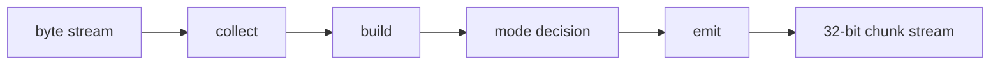

# Dynamic Huffman Encoder Specification

## 1. Purpose

`dynamic_huffman_encoder` la khoi trung tam cua nhanh TX. No nhan byte stream
da duoc chuan hoa tu `huffman_aes_tx_top`, tu minh di qua cac pha:

- collect
- build
- mode decision
- emit

Module nay khong quan tam den MMIO, DMA hay AES. No chi lam viec voi block
byte input, frequency table, codebook va bitstream output.

Current verification status:

| Case | Coverage/use |
|---|---|
| `tx_compress_only_input1/input4_cov` | Whole-file dynamic Huffman behavior qua SoC TX-only |
| `tx_compress_only_alnum63_cov` | Alnum63 stress within 256-symbol byte alphabet |
| `tx_compress_only_ascii_sweep_cov` | Byte-symbol sweep and mode-decision coverage |
| `tx_encoder_direct_cov` | Direct encoder mode/error/FSM branches |
| `tx_builder_packer_direct_cov` | Huffman builder and packer interaction branches |

## 2. Role In TX Stack

`dynamic_huffman_encoder` nam giua:

```text
input adapter
-> dynamic_huffman_encoder
-> bit_packer_128
```

No dung cac helper module:

| Module | Role |
|---|---|
| `control_fsm` | Dieu khien phase va sticky state |
| `input_collect_unit` | Thu thap byte va dem tan suat |
| `block_buffer` | Luu block byte hien tai |
| `frequency_counter` | Dem tan suat symbol |
| `huffman_builder` | Xay symbol list, code length va canonical code |
| `mode_decision_logic` | Chon `RAW_FULL`, `RAW_PARTIAL`, `COMPRESSED`, `ONE_SYMBOL` |
| `emit_backend` | Emit header va payload bitstream |
| `header_formatter` | Dinh dang header block |
| `payload_emitter` | Emit raw bytes hoac Huffman bits |
| `stream_output_interface` | Xuat bitstream thanh chunk 32-bit |

## 3. High-Level Flow



## 4. Input Contract

Module nhan:

- `block_start`
- `block_valid`
- `block_end`
- `byte_in[7:0]`

Quy uoc:

- mot block la mot tap byte lien tiep
- block size hop le trong flow TX hien tai la `1..32`
- `block_start` phai noi voi byte dau tien
- `block_end` phai noi voi byte cuoi cung

Neu input khong hop le, encoder se phat error sticky va dung transfer.

## 5. Phase Sequence

### 5.1 Collect

`input_collect_unit`:

- chuan hoa byte
- dua byte vao `block_buffer`
- tang dem frequency
- cap nhat `symbol_count`

### 5.2 Build

`huffman_builder`:

- lay symbol active tu frequency table
- tinh do dai code
- tao canonical code
- luu code length table cho emit va cho RX rebuild sau nay

### 5.3 Mode Decision

`mode_decision_logic` chon mot trong 4 mode:

| Mode | Meaning |
|---|---|
| `RAW_FULL` | Emit raw 32 byte day du |
| `RAW_PARTIAL` | Emit raw block size that |
| `COMPRESSED` | Emit Huffman header + payload |
| `ONE_SYMBOL` | Emit 1 symbol repeated block size |

Lua chon khong chi dua tren bit count ma con dua tren storage size sau khi
dua vao `bit_packer_128`.

### 5.4 Emit

`emit_backend` phat ra:

- header bits
- payload bits
- valid bits count
- done pulse

`stream_output_interface` chuyen stream bit thanh chunk 32-bit cho `bit_packer_128`.

## 6. Output Contract

Encoder xuat:

- `out_chunk[31:0]`
- `out_chunk_valid`
- `out_chunk_ready`
- `out_chunk_bits[5:0]`
- `done`
- `busy`
- `error`
- `selected_mode[1:0]`

`out_chunk_bits` la so bit hop le trong `out_chunk`.

## 7. Mode Encoding

| Bits | Mode |
|---:|---|
| `00` | `RAW_FULL` |
| `01` | `RAW_PARTIAL` |
| `10` | `COMPRESSED` |
| `11` | `ONE_SYMBOL` |

## 8. Mode Bitstream Format

### 8.1 `RAW_FULL`

```text
mode[1:0] = 00
payload   = 32 raw bytes
```

### 8.2 `RAW_PARTIAL`

```text
mode[1:0]       = 01
block_size[5:0] = valid byte count
payload         = block_size raw bytes
```

### 8.3 `COMPRESSED`

```text
mode[1:0]        = 10
block_size[5:0]
symbol_count[8:0]
symbol/code_len table
payload Huffman code bits
```

Each table entry is:

```text
symbol[7:0] + code_len[4:0] = 13 bits
```

### 8.4 `ONE_SYMBOL`

```text
mode[1:0]             = 11
block_size[5:0]
one_symbol_value[7:0]
```

## 9. Current Limits

- block size toi da: `32 byte`
- so symbol toi da trong 1 block: phu thuoc block va normalize rule
- alphabet active hien tai: full byte alphabet `0x00..0xFF`
- `huffman_symbol_map.vh` dang map identity, nen input byte nao cung la symbol hop le
- whole-file mode co the emit codebook toi da 256 symbol; `symbol_count=0` nghia la reuse table
- TX FPGA demo hien dung `CODE_WIDTH=13`; neu input pathological can code dai hon thi can tang `CODE_WIDTH` hoac them long-code fallback

## 10. Current Design Notes

`dynamic_huffman_encoder` da duoc dung trong:

- `huffman_aes_tx_top`
- whole-file dynamic Huffman flow

No khong tu lam AES. AES nam o wrapper ben tren.

## 11. Related Specs

- [TX path end-to-end](./tx_path_end_to_end_spec.md)
- [Whole-file Huffman](./14_dynamic_whole_file_huffman_spec.md)
